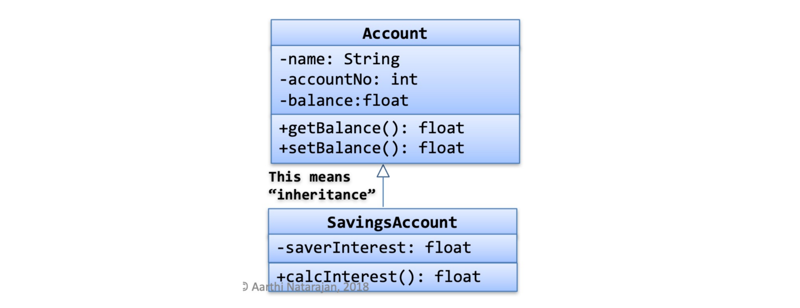

# Design

## Domain Modelling

- Domain Models are used to visually represent important domain concepts and relationships between them.
- Domain Models help clarify and communicate important domain specific concepts and are used during the requirements gathering and designing phase.
- Domain modeling is the activity of expressing related domain concepts into a domain model.
- There are many different modelling frameworks, like: UML, Entity-Relationship, Mind maps, Context maps, Concept diagrams
- Requirements analysis determines external behaviour “What are the features of the system-to-be and who requires these features (actors)”. While domain modelling determines (internal behavior) – “**how elements of system-to-be interact to produce the external behaviour**”.

### UML Diagrams

UML diagrams offer different types. Two main types to focus on includes:

- Object diagram
- Class diagram

Given a problem:

- **nouns** represents possible entitities i.e. classes
- **verbs** represents possible behaviour i.e. methods


#### Classes in UML





#### Association in UML


- 1:1 - A dog belongs to one owner
- 1:M - A professor can teach 0 or more courses
- Associations can model a "has-a" relationship where one class contains another class


#### Attributes vs Classes

When creating a domain model, often we need to decide whether to represent something as an attribute or a conceptual class. **If a concept is not representable by a number or a string, most likely it is a class.**


https://www.visual-paradigm.com/guide/uml-unified-modeling-language/uml-class-diagram-tutorial/

## Design Principles

### Design Smells

- Rigidity - tendency of software to change in simple ways, single changes causes a cascade of changes to other dependent modules.
- Fragility - break in many places with a single change
- Immobility - hard to reuse
- Viscosity - changes are easier to implement through ‘hacks’ over ‘design preserving methods’
- Opacity - non concise code, difficult to understand
- Needless complexity/repetition

### Characteristics of Good Design

- loose coupling - degree of interdependence between components or classes
  - High coupling occurs when one component A depends on the internal workings of another component B and is affected by internal changes to component B
  - Aim for loosely coupled classes - allows components to be used and modified independently of each other
- high cohesion - The degree to which all elements of a component or class or module work together as a functional unit
  - Highly cohesive modules are much easier to maintain and less frequently changed and have higher probability of reusability

#### SOLID Design

- Single responsibility principle: A class should only have a single responsibility.
- Open–closed principle: Software entities should be open for extension, but closed for modification.
- Liskov substitution principle: Objects in a program should be replaceable with instances of their subtypes without altering the correctness of that program.
- Interface segregation principle: Many client-specific interfaces are better than one general-purpose interface.
- Dependency inversion principle: One should "depend upon abstractions, [not] concretions"

### Design Principle - The Principle of Least Knowledge or Law of Demeter

- Classes should know about and interact with as few classes as possible. Reduce the interaction between objects to just a few close “friends”.  Helps us to design “loosely coupled” systems so that changes to one part of the system does not cascade to other parts of the system.
- A method in an object should only invoke methods of:
  - the object itself
  - object passed in as a parameter to the method
  - objects instantiated by a method
  - any component object and not those of objects returned by a method
    - i.e. prevents doing `o.get(name).get(thing).remove(node)`

**Rule 1:** A method `M` in an object `O` can call on any other method within `O` itself

```java
public class M {
    public void methodM() {
    	this.methodN();
    }
    public void methodN() {
    	// do something
    }
}
```

**Rule 2:** A method `M` in an object `O` can call on any methods passed to method the `M`

```java
public class O {
    public void M(Friend f) {
        // Invoking a method on a parameter passed to the method is 
        // legal
        f.N();
    }
}
public class Friend {
    public void N() {
    	// do something
    }
}
```

**Rule 3:** A method `M` can call a method `N` of another object, if that object is instantiated within the method `M`

```java
public class O {
    public void M() {
        Friend f = new Friend();
        // Invoking a method on an object created within the 
        // method is legal 
    	f.N();
	}
}
public class Friend {
    public void N() {
    	// do something
    }
}
```

**Rule 4:** Any method `M` in an object `O` can call on any methods of any type of object that is a direct component of `O` - This	means a method of a class can call methods of classes of its instance variables

```java
public class O {
    public Friend instanceVar = new Friend();
    public void M4() {
        // Any method can access the methods of the friend class 
        F through the instance variable "instanceVar" 
        instanceVar.N();
    }
}

public class Friend {
    public void N() {
    	// do something
    }
}
```

### Design Principle - LSP (Liskov Substitution Principle)

If for each object `o1` of type `S` there is an object `o2` of type `T` such that for all programs `P` defined in terms of `T`, the behavior of `P`is unchanged when `o1` is substituted for `o2` then `S` is a subtype of `T`. **Subtypes must be substitutable for their base types**.

- Delegation - delegate the functionality to another class
- Composition - reuse the behaviour using one or more classes with composition.
- Favour composition/delegation over inheritance, software will be more flexible, easier to maintain and extend

#### Rules for Method Overriding

- Covariance of return types in the overridden method - return type of overridden method should be the same or a subtype of the return type in the super class.

```java
public class Animal {
	public Animat getAnimal() {
		return null
	}
}

public class Cat extends Animal {
	@Override
	public Cal getAnimal() {
		return null
	}
}
```

## Refactoring

Refactor when:

- add a function (swap between adding a function and refactoring)
- fix a bug
- do a code review

**Bad Code Smells**

- duplicated code - same code structure, same expression in two sibling classes
- long method
- large class (when a class is trying to do too much, it often shows up as too many instance variables)
- long parameter list
- divergent change (when one class is commonly change in different ways)
- shortgun survey (make little changes to alot of classes)

**Techniques**

- extract methods closer
- rename variables
- move methods - generally, a method should be on the object whose data it uses
- replace temp with query - remove unncessary local and temporary variables
- replace conditional logic with polymorphism
  - composition - reuse behaviour of other classes
  - delegation: delegate functionality to another class

The idea of encapsulation is to protect information in one part of the application from others - protect data and behaviour, whe you break the behaviour out from a class, you can change the behaviour without the class having to change

Delegation is the act of one object forwarding an operation to another object to be performed on behalf of the first object.

- https://refactoring.guru/refactoring/smells
- https://www.refactoring.com/catalog/

## Design By Contract

At the design time, responsibilities are clearly assigned to different software elements, clearly documented and enforced during the development using unit testing and/or language support.

- clear demarcation of responsibilities helps prevent redundant checks, resulting in simpler code and easier maintenance.
- crashes if the required conditions are not satisfied! May not be suitable for high availability applications.

A contract should address the following three questions:

- **Pre-condition** - what does the contract expect? If the precondition is true, it can avoid handling cases outside of the precondition. For example, expected argument value (mark>=0) and (marks<=100).
  - An implementation or redefinition (method overriding) of an inherited method must comply with the inherited contract for the method. Preconditions may be weakened (relaxed) in a subclass, but it must comply with the inherited contract. An implementation or redefinition may lessen the obligation of the client, but not increase it. 
- **Post-condition** - what does the contract guarantee? Return value(s) is guaranteed, provided the precondition is true. For example: correct return value representing a grade.
  - An implementation or redefinition (method overriding) of an inherited method must comply with the inherited contract for the method. Post-conditions may be strengthened (more restricted) in a subclass, but it must comply with the inherited contract. An implementation or redefinition (overridden method) may increase the benefits it provides to the client, but not decrease it.
- **Invariant** - what does the contract maintain? Some values must satisfy constraints, before and after the execution (say of the method). For example: a value of mark remains between zero and 100
  - constrains the state (i.e. values of certain variables) stored in the object
  - established during construction and constantly maintained between calls to public methods
  - Within a method: code within a method may break invariants as long as the invariants are restored before a public method ends.
  - The invariants of all the parents of a class apply to the class itself. A subclass can access implementation data of the parents, however, must always satisfy the invariants of all the parents

A contract (precondition, post-condition and invariant) should be declarative and must not include implementation details.

**Benefits of DbC**

- no error checking
- prevent redundant validation tasks
- Given the preconditions are satisfied, clients can expect the specified post-conditions.
- Responsibilities are clearly assigned, this helps in locating errors and resulting in easier code maintenance.

```java
/**
 * @param value
 * @returns sqrt
 * @pre value >= 0
 * @post value = sqrt * sqrt
 */
public double squareRoot(double value);

/**
 * @invariant age >= 0
 */
public class Student {}

/**
 * @param amount
 * @pre amount > 0
 * @post balance = old balance + amount
 */
public double deposit(double amount);
```

## Test Design

Every code modification and/or refactoring must be followed by a proper testing, using the predefined test suites.


**Software Testing**

- Space Coverage: The aim should be to consider a possible input space and cover it as much as possible - boundary testing	
  - For multiple input values, consider possible input combinations, prioritise them and consider as many as possible, given the available time and resources. Again, divide possible combinations into homogenous subsets and select representative combinations.
- Code Coverage: determining the number of lines of code that is successfully validated by the test suite
  - Function coverage: how many of the functions defined have been called.
  - Statement coverage: how many of the statements in the program have been executed.
  - Branches coverage: how many of the branches of the control structures (if statements for instance) have been executed.
  - Condition coverage: how many of the boolean sub-expressions have been tested for a true and a false value.
  - Line coverage: how many of lines of source code have been tested.
- Randomness - stress test components by bombarding them with random data
  -  Creates a new random number generator - `Random rand = new Random();`
  - Creates a new random number generator using a single long seed - Every time you run a program with the same seed, you get exactly the same sequence of 'random' numbers. `Random rand = new Random(long seed);`

**Test Template**

- Set up Precondition (i.e. @BeforeEach, etc.)
- Act (call the method)
- Verify Post condition (i.e. @AfterEach, Asserts, etc.)

Parameterized test executes the same test over and over again using different input values and tests output against the corresponding expected results. A data source can be used to retrieve data for input values and expected results.

- The `@Before` annotation can be used if you want to execute some statement such as preconditions before each test case.
- The `@After` annotation can be used if you want to execute some statements after each Test Case for e.g. resetting variables, deleting temporary files, variables, etc.
