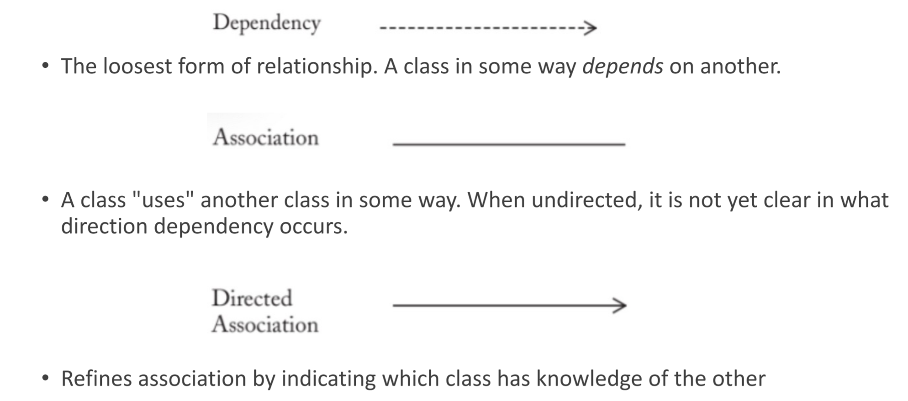
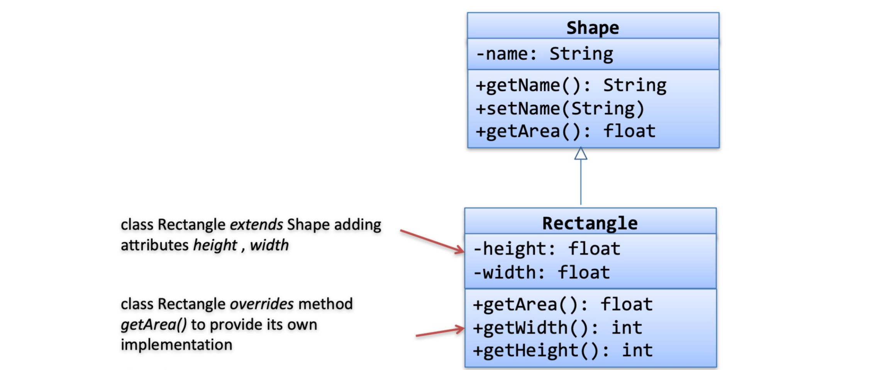

# Domain Modelling

- Domain Models are used to visually represent important domain concepts and relationships between them.
- Domain Models help clarify and communicate important domain specific concepts and are used during the requirements gathering and designing phase.
- Domain modeling is the activity of expressing related domain concepts into a domain model.
- There are many different modelling frameworks, like: UML, Entity-Relationship, Mind maps, Context maps, Concept diagrams
- Requirements analysis determines external behaviour “What are the features of the system-to-be and who requires these features (actors)”. While domain modelling determines (internal behavior) – “**how elements of system-to-be interact to produce the external behaviour**”.

## UML Diagrams

UML diagrams offer different types. Two main types to focus on includes:

- Object diagram
- Class diagram

Given a problem:

- **nouns** represents possible entitities i.e. classes
- **verbs** represents possible behaviour i.e. methods

### Classes in UML

### Association in UML

- 1:1 - A dog belongs to one owner
- 1:M - A professor can teach 0 or more courses
- Associations can model a "has-a" relationship where one class contains another class

### Attributes vs Classes

When creating a domain model, often we need to decide whether to represent something as an attribute or a conceptual class. **If a concept is not representable by a number or a string, most likely it is a class.**

https://www.visual-paradigm.com/guide/uml-unified-modeling-language/uml-class-diagram-tutorial/