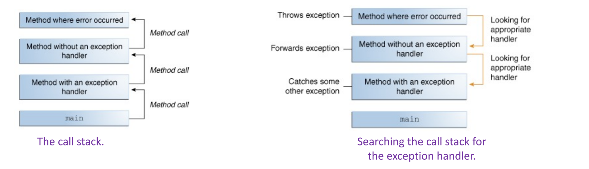
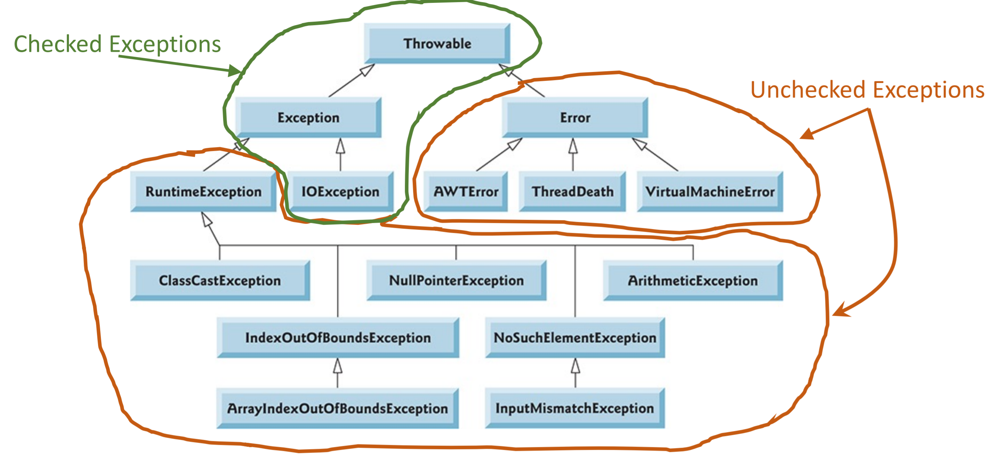
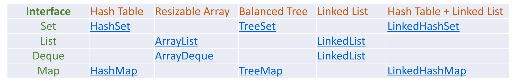

# Java

## Exceptions

- An exception is an event, which occurs during the execution of a program, that disrupts the normal flow of the program's instructions.
- When error occurs, an **exception object is created** and given to the runtime system, this is called `throwing` an exception. The runtime system searches the call stack for a method that contains a block of code that can handle the exception. The exception handler chosen is said to `catch` the exception.



### Exception Types

- Checked exception (`IOException`, `SQLException`, etc.) - something that should be **handle/catched**
- Error (`VirtualMachineError`, `OutOfMemoryError`, etc.)
- Runtime exception (`ArrayIndexOutOfBoundsExceptions`, `ArithmeticException`, etc.)

#### Checked vs Unchecked Exceptions

An exception’s type determines whether it’s checked or unchecked.

- All classes that are **subclasses** of `RuntimeException` (typically caused by defects in your program’s code) or `Error` (typically ‘system’ issues) are unchecked exceptions - do not have to **catch**.
- All classes that inherit from class `Exception` but not directly or indirectly from class `RuntimeException` are considered to be checked exceptions



```java
public void exception() {
    try {
        ...
    } catch(IOExeception e) {
        System.err.println(...);
    } catch(...) {
        ...
    } finally {
        ...
    }
}

public void exception() throws IOException() {
    // no need for try catch since if the exception is raised, the method
    // throws back the IOException up back the call stack
}
```

### User Defined Exceptions

- All exceptions must be a child of `Throwable`.
  - A checked exception need to extend the `Exception` class, but not directly or indirectly from class `RuntimeException`.
  - An unchecked exception (like a runtime exception) need to extend the `RuntimeException` class.

```java
class CustomException extends Exception {
	public CustomException(String message) {
		super(message);
	}
}
...
public void test() {
    try {
        ...
        throw new CustomException("Error") 
        ...
    } catch (CustomException e) {
        ...
    }
}
```

### Exceptions in Inheritance

- Superclass can catch exceptions raised by subclass since it is the base class for all exceptions.

```java
try {
	...
} catch (Exception e) {
    ...
}
```

### Assertions

- An assertion is a statement in the Java that enables you to test your assumptions about your program. Assertions are useful for checking:

  - Preconditions, Post-conditions, and Class Invariants (DbC!)
  - Internal Invariants and Control-Flow Invariants

- You should not use assertions:

  - for argument checking in public methods
  - to do any work that your application requires for correct operation.

- Evaluating assertions should not result in side effects. The following document shows how to use assertions in Java : https://docs.oracle.com/javase/8/docs/technotes/guides/language/assert.html 

- **Important**: for backward compatibility, by default, Java disables assertion validation feature. It needs to be explicitly enabled using the following command line argument:

  ```java
  // -enableassertions flag - command line argument, or 
  // -ea flag - command line argument
  
  // Example
  public void test(int interval) {
  	assert interval > 0;
  }
  ```

## JUnit Testing

- JUnit is a popular unit testing (open source) framework for testing Java programs
- Basic Junit Terminology:
  - Test Case – Java class containing test methods
  - Test Method – a method that executes the test code, annotated with @Test, in a Test Case
  - Asserts - asserts or assert statements check an expected result versus the actual result
  - Test Suites – collection of several Test Cases

```
assertEquals()
assertTrue()
assertFalse()
assertThrows()
assertDoesNotThrow()
```

- https://www.vogella.com/tutorials/JUnit/article.html https://junit.org/junit5/docs/current/user-guide/

## Java Generics

Generics enable types (classes and interfaces) to be parameters when defining classes, interfaces and methods.

Removes casting and offers stronger type checks at compile time. Allows implementations of **generic algorithms**, that work on collections of different types, can be customized, and are type safe. Adds stability to your code by making more of your bugs detectable at compile time.

```java
List<String> = new ArrayList<String>()
```

### Generic Types

A **generic type** is a generic class or interface that is parameterized over types. A generic class is defined with the following format: `class name< T1, T2, ..., Tn > { /* ... */ }`. The most commonly used type parameter names are:

```
E - Element (used extensively by the Java Collections Framework)
K - Key
N - Number
T - Type
V - Value
S,U,V etc. - 2nd, 3rd, 4th types
```

```java
public class Box<T> {
    // T stands for 'Type'
    private T t;
    
    public void set(T t) {
        this.t = t;
    }
    public T get() {
        return t;
    }
}
```

### Multiple Type Paremeters

```java
public interface Pair<K, V> {
	public K getKey();
	public V getValue();
}

public class OrderedPair<K, V> implements Pair<K, V> {
	private K key;
	private V value;
	
	public OrderedPair(K key, V value) {
		...
	}
	...
}

// Examples
Pair<String, Integer> p1 = new OrderedPair<String, Integer>("Even", 8);
Pair<String, String> p2 = new OrderedPair<String, String>("hello", "world");
OrderedPair<String, Integer> p1 = new OrderedPair<>("Even", 8);
OrderedPair<String, String> p2 = new OrderedPair<>("hello", "world");
OrderedPair<String, Box<Integer>> p = new OrderedPair<>("primes", new Box<Integer>(...));
```

### Generic Methods

Methods that introduce their own type parameters

```java
public class Util {
	public static <K, V> boolean compare(Pair<K, V> p1, Pair<K, V> p2) {
        return p1.getKey().equals(...)
    }
}
```

## Java Collections

A collections framework is a unified architecture for representing and manipulating collections. A collection is simply an object that groups multiple elements into a single unit.

All collections frameworks contain the following:

- *Interfaces*: allows collections to be manipulated independently of the details of their representation.
- *Implementations*: concrete implementations of the collection interfaces.
- *Algorithms*: the methods that perform useful computations, such as searching and sorting, on objects that implement collection interfaces.
  - The algorithms are said to be **polymorphic**: that is, the same method can be used on many different implementations of the appropriate collection interface.

A Collection represents a group of objects known as its elements. The Collection interface is used to pass around collections of objects where maximum generality is desired. The Collection interface contains methods that perform basic operations, such as

- int size()
- boolean isEmpty()
- boolean contains(Object element)
- boolean add(E element)
- boolean remove(Object element)
- Iterator iterator()



## Lambda Expression, Pipeline, Aggregate Operations

Lambda expressions can be used to implement an interface with only one abstract method. Such interfaces are called Functional Interfaces.

```java
public interface MyFunctionalInterfaceA {
    public int myCompute(int x, int y);
}

MyFunctionalInterfaceA f1 = (x, y) -> x + y;
System.out.println(f1.myCompute(10, 20))
```

Method References: We can treat an existing method as an instance of a Functional Interface using `::` operator.

- A static method (`ClassName::methName`)
- An instance method of a particular object (`instanceRef::methName`) or (`ClassName::methName`)
- A class constructor reference (`ClassName::new`)

### Functional Interfaces

Functional interfaces, in the package `java.util.function`, provide predefined target types for lambda expressions and method references. Each functional interface has a single abstract method, called the functional method for that functional interface, to which the lambda expression's parameter and return types are matched or adapted. Functional interfaces can provide a target type in multiple contexts, such as assignment context, method invocation, etc.

```java
Predicate<String> p = String::isEmpty

strList.stream().filter(p).collect(Collectors.toList())
// or
strList.stream().filter( e -> e.length() < 6 ).collect(Collectors.toList())

```

There are several basic function shapes, including

- `Function` (unary function from T to R)
- `Consumer` (unary function from T to void)
- `Predicate` (unary function from T to boolean)
- `Supplier` (nilary function to R).

### Pipelines and Streams

A pipeline is a sequence of aggregate operations. In a pipeline, operations are loosely coupled, they only rely on their incoming streams and can be easily rearranged/replaced by other suitable operations.

A pipeline contains the following components:

- A source: This could be a collection, an array, a generator function, or an I/O channel. 
- Zero or more intermediate operations. An intermediate operation, such as filter, produces a new stream.
- A stream is a sequence of elements. The method stream creates a stream from a collection (roster).
- The filter operation returns a new stream that contains elements that match its predicate. 
- A terminal operation, such as forEach, produces a non-stream result, such as a primitive value (like a double value), a collection, or in the case of forEach, no value at all.

```java
roster
	.stream()
	.filter( e -> e.getGender() == Person.Sex.MALE )
	.forEach( e -> System.out.println(e.getName()) );

double average = roster
    .stream()
    .filter(p -> p.getGender() == Person.Sex.MALE)
    .mapToInt(Person::getAge)
    .average()
    .getAsDouble();
```

## Generic Programming

There may be times when you want to restrict the types that can be used as type arguments in a parameterized type. For example, a method that operates on numbers might only want to accept instances of Number or its subclasses.

```java
public class NaturalNumber<T extends Integer> {...}
```

A type parameter can have multiple bounds: `<T extends B1 & B2 & B3> `. A type variable with multiple bounds is a subtype of all the types listed in the bound.

In generic code, the question mark (?), called the wildcard, represents an unknown type. The wildcard can be used in a variety of situations: as the type of a parameter, field, or local variable; sometimes as a return type. The upper bounded wildcard, `<? extends Foo>`, where Foo is any type, matches Foo and any subtype of Foo.

A lower bounded wildcard is expressed using the wildcard character ('?'), following by the super keyword, followed by its lower bound: `< ? super A >`. To write the method that works on lists of `Integer` and the super types of `Integer`, such as `Integer`, `Number`, and `Object`, you would specify `List<? super Integer>`. 

