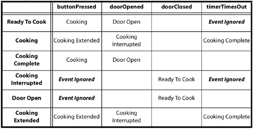
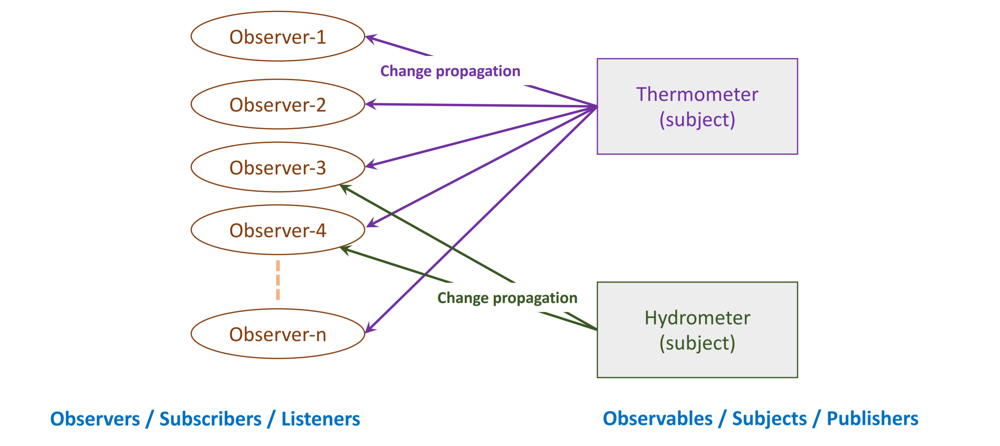
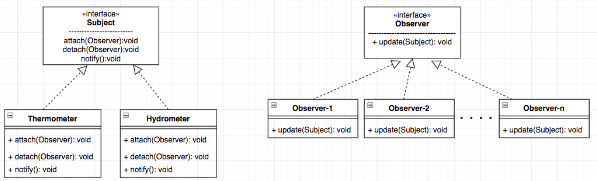

# Behavioural Design Patterns

A design pattern is

- Represents a template for how to solve a problem
- Captures design expertise and enables this knowledge to be transferred and reused
- Provide shared vocabularies, improve communications and eases implementation
- Is not a finished solution, they give you general solutions to design problems

### Strategy Pattern


- Motivation
  - Need a way to adapt the behaviour of an algorithm at runtime
- Intent
  - Define a family of algorithms, encapsulate each one, and make them interchangeable
  - Strategy pattern is a behavioural design pattern that lets the algorithm vary independently from the context class using it
- Advantages
  - Uses composition over inheritance allowing for better decoupling between the strategy and class
- Disadvantages
  - Increases the number of classes in the system
  - Client must be aware of different strategies
- Example:
  - Sorting a list (quicksort, bubble sort, merge-sort) - Encapsulate each sort algorithm into a concrete strategy class. Context class decides at run-time, which sorting behaviour is needed.
  - Search (binary search, DFS, BFS, A*)
  - https://www.youtube.com/watch?v=CPK3sg6YnjI

## State Pattern

- Allows an object to change its behaviour when its internal state changes - change from one state to another in response to some external inputs (transition between states).

  - lists of states
  - initial state
  - conditions for each transition

- A state is a description of the status of a system that is waiting to execute a transition. A transition is a set of actions to be executed when a condition is fulfilled or when an event is received.

  - entry action: performed when entering the state
  - exit action: performed when existing the state

- Representation of state is done through a state transition table

  - inputs can be represented as methods
  - states can be represented as classes

  

- Summary

  - have many different behaviours based on its internal state
  - context gets its behaviour by delegating to the current state object it is composed with
  - encapsulating each state into a class localise any changes made
  - state transitions can be controlled by the state or context class
  - result in greater number of classes
  - https://www.youtube.com/watch?v=rYmVpqiGL14

## Observer Pattern

- used to implement distributed event handling systems
- an object (referred as the subject, observable) maintains a list of its dependents called observers and notifies the observers automatically of any state changes in the subject, usually by calling one of their methods
- defines a one to many dependency between objects so that when one object (subject) changes state, all of its dependents (observers) are notified and updated automatically.
  - define a one to many dependency between objects without making the objects tightly coupled
  - automatically notify/update an open ended number of observers (dependent objects) when the subject changes state
  - be able to dynamically add/remove observers
- Approach:
  - Observer and Subject interfaces defined such that when a subject changes state, all registered observers are notified and updated automatically
  - resposibility of the subject is to maintain a list of observers and to notify them of state changes by calling their `update()` method.
  - observers is to register/unregister themselves on a subject and update their state when notified -> loosely coupled between subject and observer
  - observers can be added and removed independently at runtime
- https://www.youtube.com/watch?v=45TeJEmcqk8





### Passing Data

The Subject needs to pass (change) data while notifying a change to an Observer.

- Push data: Subject passes the changed data to its observers `update(data1, ...)`
- Pull data: Subject passes reference to itself to its observers and the observers need to get (pull) the required data from the subject. `update(this)`

```java
public interface Observer {
    void update();
}

public class Display implements Observer {
    @Override
    void update(Subject obj) {
        ...
    }
}

public interface Subject {
    public void registerObserver(Observer o);
    public void removeObserver(Observer o);
    public void notifyObservers(Observer o);
}

public class Thermometer implements Subject {
    List<Observer> observers = new ArrayList<>();
    
    public void notifyObservers() {
        for (Observer obs: observers) {
            obs.update(this)
        }
    }
}

```

## Iterator Pattern

- Provide a way to access the elements of an aggregate object sequentially without exposing its underlying representation
- Encapsulate the access and traversal of an aggregate in a separate Iterator object.
- Clients request an Iterator object from an aggregate (say by calling `createIterator()`) and use it to access and traverse the aggregate.
- Define an interface for accessing and traversing the elements of an aggregate object (`next()`, `hasNext()`).
- Define classes (Iterator1,...) that implement the Iterator interface.

## Template Pattern

- Define the skeleton of an algorithm in an operation, deferring some steps to subclasses. Template Method lets subclasses redefine certain steps of an algorithm without changing the algorithm's structure
