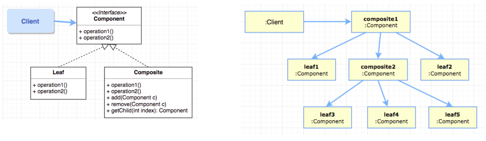
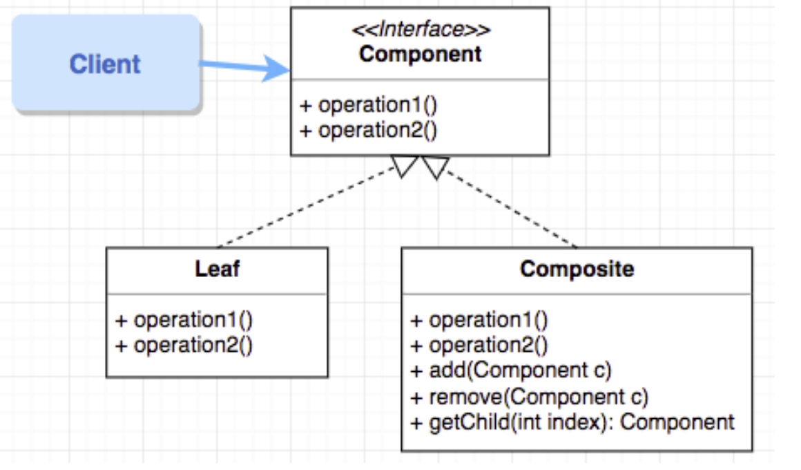
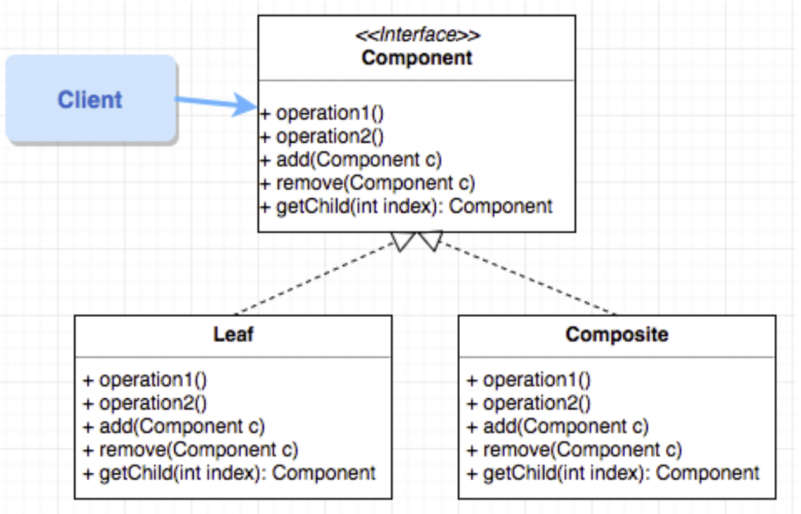
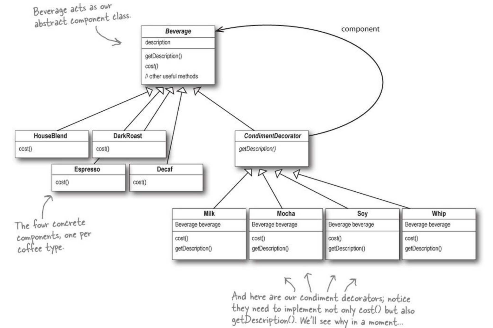

# Structural Design Patterns

## Composite Pattern

- https://www.youtube.com/watch?v=2HUnoKyC9l0
- https://www.youtube.com/watch?v=UsynwPeipb8

A composite is an object designed as a composition of one-or-more similar objects (exhibiting similar functionality).



### Implementation
- Define a unified `Component` interface for both `Leaf` (single / part ) objects and `Composite` (Group / whole) objects.
- A `Composite` stores a collection of children components (either Leaf and/or Composite objects).
- Clients can ignore the differences between compositions of objects and individual objects, this greatly simplifies clients of complex hierarchies and makes them easier to implement, change, test, and reuse
- A `Leaf` object performs operations directly on the object.
- A `Composite` object performs operations on its children, and if required, collects return values and derives the required answers.

```
public class Composit {
    List<Component> children = new ArrayList<>();

    @Override
    public double calculateCost() {
        double answer = this.getCost();
        for (Component c : children) {
        	answer += c.calculateCost();
    	}
    }
}
```

### Design for Type Safety

- only define child-related operations in the Composite class
- useful for static structures where a client does not need to perform child related operations



### Design for Uniformity

- include all child-related operations in the Component interface
- useful for static structures where children types change dynamically (i.e. from `Leaf` to `Composite`) and a client needs to perform child-related operations.



## Decorator Pattern

- Attach additional responsibilities to an object dynamically. Decorators provide a flexible alternative to sub-classing for extending functionality.



