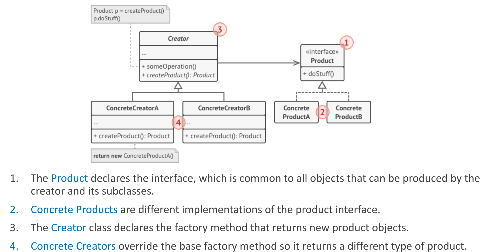
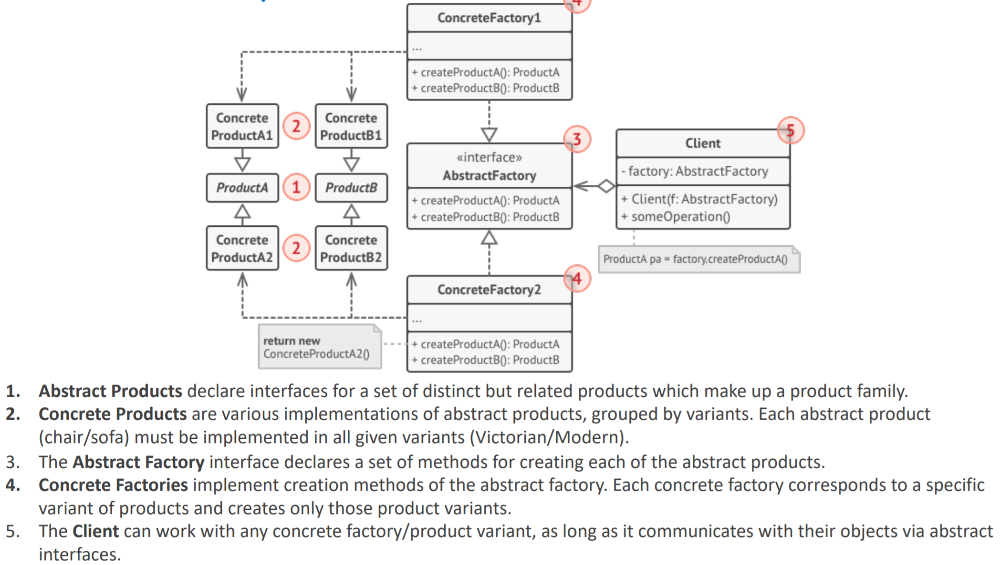
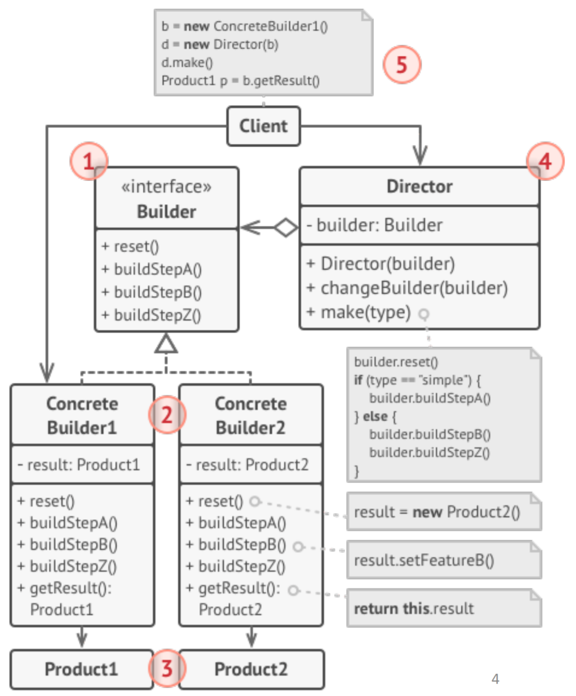

# Creational Pattern

Creational patterns provide various object creation mechanisms, which increase flexibility and reuse of existing code.

## Factory Method

- provides an interface for creating objects in a superclass, but allows subclasses to alter the type of objects that will be created

## Abstract Factory Method

- let users produce families of related objects without specifying their concrete classes

## Singleton Pattern

Singleton is a creational design pattern that lets you ensure that a class has only one instance, while providing a global access point to this instance.

Make the default constructor private, to prevent other objects from using the new operator with the Singleton class. Create a static creation method that acts as a constructor. Under the hood, this method calls the private constructor to create an object and saves it in a static field. All following calls to this method return the cached object.

## Builder Pattern

- construct complex objects step by step. The pattern allows you to produce different types and representations of an object using the same construction code
- The Builder pattern suggests that you extract the object construction code out of its own class and move it to separate objects called builders.
- The Builder pattern lets you construct complex objects step by step.
- The Builder doesn’t allow other objects to access the product while it’s being built.
- **Director**: The director class defines the order in which to execute the building steps, while the builder provides the implementation for those steps

### Structure

- The Builder interface declares product construction steps that are common to all types of builders.
- Concrete Builders provide different implementations of the construction steps. Concrete builders may produce products that don’t follow the common interface.
- Products are resulting objects. Products constructed by different builders don’t have to belong to the same class hierarchy or interface.
- The Director class defines the order in which to call construction steps, so you can create and reuse specific configurations of products.
- The Client must associate one of the builder objects with the director.

