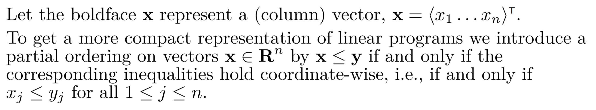
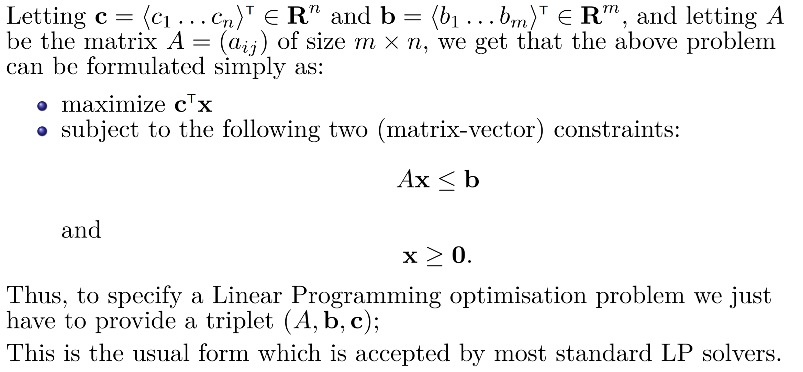
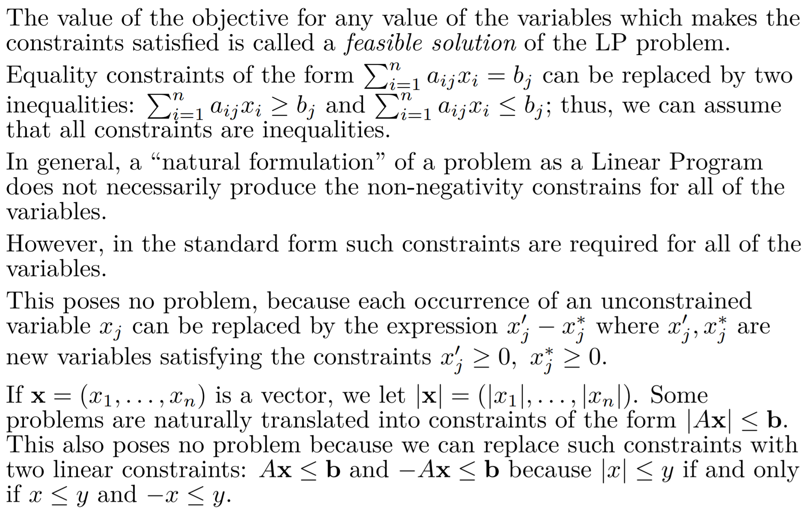

# Linear Programming

**Problem**

You are given a list of food sources $f_1, f_2, . . . , f_n$; for each source $f_i$ you are given:

- its price per gram $p_i$,
- the number of calories $c_i$ per gram, and 
- for each of 13 vitamins $V_1, V_2, . . . , V_{13}$ you are given the content $v(i, j)$ of milligrams of vitamin $V_j$ in one gram of food source $f_i$ .

Your task: to find a combination of quantities of food sources such that: 

- the total number of calories in all of the chosen food is equal to a recommended daily value of 2000 calories; 
- the total intake of each vitamin $V_j$ is at least the recommended daily intake of $w_j$ milligrams for all $1 ≤ j ≤ 13$; 
- the price of all food per day is as low as possible.

To obtain the corresponding constraints let us assume that we take $x_i$ grams of each food source $f_i$ for $1 ≤ i ≤ n$. Then, the total number of calories must satisfy $\sum_{i=1}^{n}x_ic_i = 2000$. For each vitamin $V_j$ the total amount in all food must satisfy $\sum_{i=1}^{n}x_iv(i, j) ≥ w_j (1 ≤ j ≤ 13)$. An implicit assumption is that all the quantities must be non-negative numbers, $x_i ≥ 0, 1 ≤ i ≤ n$. 

Our goal is to minimise the objective function which is the total cost $y = \sum_{i=1}^{n} x_ip_i$. Note that all constraints and the objective function, are linear.

**Problem**

Assume now that you are politician and you want to make certain promises to the electorate which will ensure that your party will win in the forthcoming elections. You can promise that you will build a certain number of bridges, 

- each 3 billion a piece; 
- a certain number of rural airports, 
- each 2 billion a piece, and 
- a certain number of olympic swimming pools each a billion a piece. 

You were told by your wise advisers that 

- each bridge you promise brings you 5% of city votes, 7% of suburban votes and 9% of rural votes; 
- each rural airport you promise brings you no city votes, 2% of suburban votes and 15% of rural votes; 
- each olympic swimming pool promised brings you 12% of city votes, 3% of suburban votes and no rural votes. 

In order to win, you have to get at least 51% of each of the city, suburban and rural votes. You wish to win the election by cleverly making a promise that appears that it will blow as small hole in the budget as possible, i.e., that the total cost of your promises is as low as possible.

We can let the number of bridges to be built be $x_b$, number of airports $x_a$ and the number of swimming pools $x_p$. We now see that the problem amounts to minimising the objective $y = 3x_b + 2x_a + x_p$, while making sure that the following constraints are satisfied: 
$$
00.05x_b + 0.12x_p ≥ 0.51 & \text{(securing majority of city votes)} \\
0.07x_b + 0.02x_a + 0.03x_p ≥ 0.51 & \text{(securing majority of suburban votes)} \\
0.09x_b + 0.15x_a ≥ 0.51 & \text{(securing majority of rural votes)} \\
x_b, x_a, x_p ≥ 0.
$$
In the standard form the *objective* to be maximised is given by $\sum_{j=1}^{n}c_j x_j$, the *constraints* are of the form 

- $\sum_{j=1}^{n} a_{ij}x_j ≤ b_i$, $1 ≤ i ≤ m$; $x_j ≥ 0, 1 ≤ j ≤ n$

