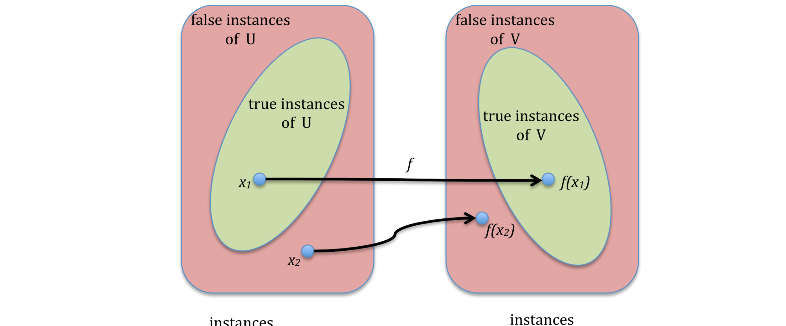
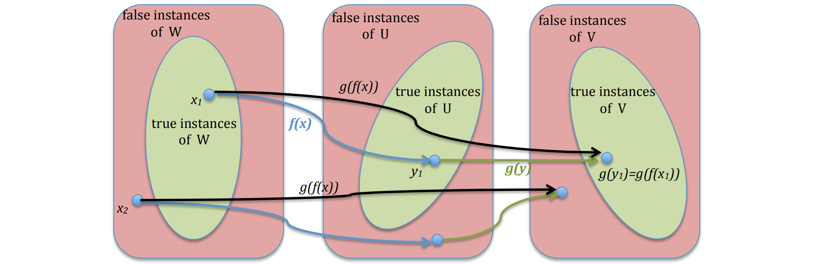

# Intractability

We say that a (sequential) algorithm is *polynomial time* if for every input it terminates in polynomially many steps in the length of the input. This means that there exists a natural number $k$ (independent of the input) so that the algorithm terminates in $T(n) = O(n^k)$ many steps, where $n$ is the size of the input. 

A **decision problem** is a problem with a *YES/NO* answer. Examples are: 

- “Input number n is a prime number.” 
- “Input graph G is connected.” 
- “Input graph G has a cycle containing all vertices of G.” 

## P Problem

We say that a decision problem $A$ is in *polynomial* time if there **exists a polynomial time algorithm** which solves it. Thus, given an input $x$, such an algorithm outputs YES for all $x$ which satisfy $A$ and outputs NO for all $x$ which do not satisfy $A$. We denote this by $A \in \textbf{P}$.

## NP Problem

We say that a decision problem $A(x)$ is in *non-deterministic polynomial time* (i.e. exponential), denoted by $A \in \textbf{NP}$, if there exists a problem $B(x, y)$ such that for every input $x$, $A(x)$ is true just in case there exists $y$ such that $B(x, y)$ is true and such that the truth of $B(x, y)$ can be verified by an algorithm running in polynomial time in the length of $x$ only. We call $y$ a certificate for $x$. 

- i.e problem can only be solved in exponential time but it can be checked if its solved in polynomial time -> sudoku

For example, decision problem “integer x is not prime” is in $\textbf{NP}$ because $A(x)$ is true just in case there exists integer $y$ such that $B(x, y)$ =“$x$ is divisible by $y$” is true. Clearly, the problem “$x$ is divisible by $y$” is decidable by an algorithm which runs in time polynomial in the length of $x$ only. In fact, “integer $x$ is not prime” is actually decidable in (deterministic) polynomial time, but this is a hard theorem to prove.

## Polynomial Reductions

Let $U$ and $V$ be two decision problems. We say that $U$ is polynomially reducible to $V$ if and only if there exists a function $f(x)$ such that:

- $f(x)$ maps instances of $U$ into instances of $V$
- For every instance $x$ of $U$ we have that $U(x)$ is true just in case $f(x)$ is an instance of $V$ such that $V(f(x))$ is true
- $f(x)$ is computable by a polynomial time algorithm.

## Cook's Theorem

**Theorem**: Every $\textbf{NP}$ problem is polynomially reducible to the SAT problem. This means that for every $\textbf{NP}$ decision problem $U(x)$ there exists a polynomial time computable function $f(x)$ such that:

- for every instance $x$ of $U$, $f(x)$ is a propositional formula $Φ(x)$;
- $U(x)$ is true just in case $Φ(x)$ has an evaluation of its propositional variables which makes $Φ(x)$ true.

An $\textbf{NP}$ decision problem $U(x)$ is $\textbf{NP}$-complete if every other $\textbf{NP}$ problem is polynomially reducible to $U(x)$. Thus, Cook’s Theorem says that SAT is $\textbf{NP}$ complete. $\textbf{NP}$ complete problems are in a sense universal: if we had an algorithm that solves one single $\textbf{NP}$ complete problem $U$, then we could use such an algorithm to solve every other $\textbf{NP}$ problem: A solution of an instance $x$ of any other $\textbf{NP}$ problem $V$ could simply be obtained by:

- computing in polynomial time the reduction $f(x)$ of $V$ to $U$
- then running the algorithm that solves $U$ on instance $f(x)$.

So NP complete problems are the hardest NP problems - a polynomial time algorithm for solving an NP complete problem would make every other NP problem also solvable in polynomial time.

## NP Hard

Let $A$ be a problem and assume that we have a ‘black box” device (also called “an oracle”) which for every input $x$ instantaneously computes $A(x)$. 

We consider algorithms which are polynomial time in $A$. This means algorithms which run in polynomial time in the length of the input and which, besides the usual computational steps, can also consult a “black box” for solving problem $A(y)$ for any intermediate output $y$. 

We say that a problem $A$ is *NP hard* if every NP problem is polynomial time in $A$, i.e., if we can solve every NP problem $U$ using a polynomial time algorithm which can also use a black box to solve any instance of $A$. 

Note that we do NOT require that $A$ be an NP problem; we even do not require it to be a decision problem - it can also be an optimisation problem.

It is important to be able to figure out if a problem at hand is NP hard in order to know that one has to abandon trying to come up with a feasible (i.e., polynomial time) solution. If this problem is an optimisation problem, we can try to solve such a problem in an approximate sense by finding a solution which might not be optimal, but it is reasonably close to an optimal solution.

Thus, for a practical problem which appears to be hard, the strategy would be:

- prove that the problem is indeed NP hard, to justify not trying solving the problem exactly; 
- look for an approximation algorithm which provides a feasible sub-optimal solution that it is not too bad.

## Proving NP Completeness

| in P                                                         | NP complete                                                  |
| ------------------------------------------------------------ | ------------------------------------------------------------ |
| Given a graph G and two vertices s and t, is there a path from $s$ to $t$ of length at most $K$? | Given a graph G and two vertices s and t, is there a simple path from $s$ to $t$ of length at least $K$? |
| Given a propositional formula in CNF form such that every clause has at most **two** propositional variables, does the formula have a satisfying assignment? | Given a propositional formula in CNF form such that every clause has at most **three** propositional variables, does the formula have a satisfying assignment? |
| Given a graph $G$, does $G$ have a tour where every **edge** is traversed exactly once? (An Euler tour.) | Given a graph $G$, does $G$ have a tour where **every** vertex is visited exactly once? (A Hamiltonian cycle.) |

Prove NP completeness of another NP problem theorem: Let $U$ be an NP complete problem, and let $V$ be another NP problem. If $U$ is polynomially reducible to $V$ then $V$ is also NP complete. 

Proof: Assume that $g(x)$ is a polynomial reduction of $U$ to $V$ , and let $W$ be any other NP problem. Since $U$ is NP complete, there exists a polynomial reduction $f(x)$ of $W$ to $U$. We claim that $g(f(x))$ is a polynomial reduction of $W$ to $V$.

$g(f(x))$ is a polynomial time reduction of $W$ to $V$ because:

- since $f$ is a reduction of $W$ to $U$, $W(x)$ is true just in case $U(f(x))$ is true;
- since $g$ is a reduction of $U$ to $V$ , $U(f(x))$ is true just in case $V (g(f(x))$ is true.

Thus $W(x)$ is true just in case $V (g(f(x)))$ is true, i.e., $g(f(x))$ is a reduction of $W$ to $V$. Since $f(x)$ is the output of a polynomial time computable function, the length $|f(x)|$ of the output $f(x)$ can be at most a polynomial in $|x|$, i.e., for some polynomial (with positive coefficients) $P$ we have $|f(x)| ≤ P(|x|)$. 

Since $g(y)$ is polynomial time computable as well, there exists a polynomial $Q$ such that for every input $y$ computation of $g(y)$ terminates after at most $Q(|y|)$ many steps. Thus, the computation of $g(f(x))$ terminates in at most $P(|x|)$ many steps (computation of $f(x)$) plus $Q(|f(x)|) ≤ Q(P(|x|))$ many steps (computation of $g(y)$ for $y = f(x)$). 

In total, the computation of $g(f(x))$ terminates in at most $P(|x|) + Q(P(|x|))$ many steps, which is a polynomial bound in $|x|$.
