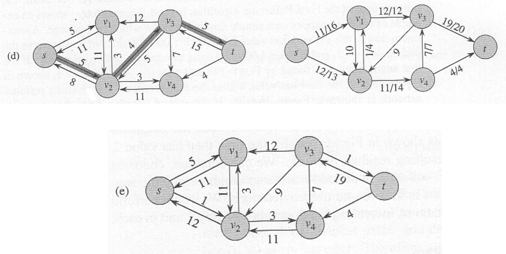

# Maximum Flow

## Flow Networks

A **flow network** $G = (V, E)$ is a directed graph in which each edge $e = (u, v) \in E$ has a positive integer capacity $c(u, v) > 0$. There are two distinguished vertices: a **source** $s$ and a **sink** $t$; no edge leaves the sink and no edge enters the source.

A **flow** in $G$ is a function $f : E \to \mathbb{R}^+$, $f(u, v) \ge 0$, which satisfies

1. **Capacity constraint**: for all edges $e(u, v) \in E$ we require $f(u, v) \le c(u, v)$
2. **Flow conservation**: for all $v \in V - \{ s, t \}$​ we require $\sum_\limits{(u, v) \in E} f(u, v) = \sum_\limits{(v, w) \in E} f(v, w)$​

The **value of the flow** is defined as $|f| = \sum_\limits{v: (s, v) \in E} f(s, v)$​​​​.

**Graph**

- The first number on an edge: the flow through that edge;
- The second number: the capacity of the edge.

### Residual Flow Networks

The **residual flow network** for a flow network with some flow in it is the network with the leftover capacities. 

Each edge of the original network has a leftover capacity for more flow equal to the capacity of the edge minus the flow through the edge. If the flow through an edge is equal to the capacity of the edge, this edge disappears in the residual network.

New "virtual" edges appear in opposite direction of an original edge with some flow in it (unless there were already an edge in the opposite direction). They represent the possibility to reduce the flow through the original edge; thus their capacity is equal to the flow through the original edge (or, if there were already an edge in the opposite direction, the capacity of such an edge is increased for the amount of that flow; see vertices $v_1$ and $v_2$​).

Residual flow networks can be used to increase the total flow through the network by adding an **augmenting path**. An augumenting path is a **path of edges in the residual graph with unused capacity** greater than 0 from the source to sink. The capacity of an augmenting path is the capacity of its "bottleneck" edge, i.e. the capacity of the smallest capacity edge on that path.

We can now recalculate the flow through all edges along the augmenting path by adding the additional flow through the path if the flow through the augmenting path is in the same direction as the original flow, and subtracting if in opposite direction.

## Ford Fulkerson Method

The Ford Fulkerson method is used to find maximal flow in a flow network. We keep **adding flow through new augmenting paths** for as long as it is possible. When there are no more augmenting paths, we have achieved the largest possible flow in the network.

The time complexity of the algorithm is $O(|E|f)$ where $E$ is the number of edges in the graph and $f$ is the maximum flow in the graph. This is because each augmenting path can be found in $O(|E|)$ time and increases the flow by an integer amount of at least 1, with the upper bound of $f$.

## Cuts in Flow Networks

A **cut** in a flow network is any partition of the vertices of the underlying graph into two subsets $S$ and $T$ such that:

- $S \cup T = V$
- $S \cap T = \emptyset$​ (disjoint)
- $s \in S \land t \in T$

The **capacity** $c(S, T)$ of a cut $(S, T)$ is the sum of capacities of all edges leaving $S$ and entering $T$, i.e.

$$
c(S, T) = \sum_{(u, v) \in E} \{ c(u, v) : u \in S \land v \in T \}
$$

Note that the capacities of edges going in the opposite direction, i.e. from $T$ to $S$ do not count.

The **flow through a cut** $f(S, T)$ is the total flow through edges from $S$ to $T$ minus the total flow through edges from $T$ to $S$:

$$
f(S, T) = \sum_{(u, v) \in E} \{ f(u, v) : u \in S \land v \in T \} - \sum_{(u, v) \in E} \{ f(u, v) : u \in T \land v \in S \}
$$

Clearly $f(S, T) \le c(S, T)$ because for every edge $(u, v) \in E$ we assumed $f(u, v) \le c(u, v)$, and $f(u, v) \ge 0$​.

### Minimum Cut

**Theorem**: The maximal amount of flow in a flow network is equal to the capacity of the cut of minimal capacity.

If we find a flow $f$ which equals the capacity of some cut $(S, T)$​, then such flow must be maximal and the capacity of such a cut must be minimal. **TLDR - minimal cut does not add up all flow but rather is a cut where the edges flow = capacity**

## Edmonds-Karp Max Flow Algorithm

The Edmonds-Karp algorithm improves the Ford Fulkerson algorithm in a simple way: uses a BFS and always choose the shortest path from the source $s$ to the sink $t$​, where the "shortest path" means the fewest number of edges, regardless of their capacities (i.e. each edge has the same unit weight). The algorith runs in $O(|V| \times |E|^2)$​

## Networks with Multiple Sources/Sinks

### Bipartite Graphs

A bipartite graph is a graph whose vertices can be split into two subsets, $L$ and $R$ such that every edge $e \in E$ has one end in the set $L$ and the other in the set $R$.

A matching in a graph $G$ is a subset $M$ of all edges $E$ such that each vertex of the graph belongs to at most one of the edges in the matching $M$.

A maximum matching in a bipartite graph $G$​ is a matching containing the largest possible number of edges.

### Super Source/Sink

Flow networks with multiple sources and sinks are reducible to networks with a single source and single sink by adding a “super-sink” and “super-source” and connecting them to all sources and sinks, respectively, by edges of infinite capacities.

## Max Flow With Vertex Capacities

Sometimes not only the edges but also the vertices $v_i$ of the flow graph might have capacities $C(v_i)$, which limit the total throughput of the flow coming to the vertex (and, consequently, also leaving the vertex):

$$
\sum_{e(u, v) \in E} f(u, v) = \sum_{e(v, w) \in E} f(v, w) \le C(v)
$$

Such case is reduced to the case where only edges have capacities by splitting each vertex $v$ with limited capacity $C(v)$ into two vertices $v_{in}$ and $v_{out}$ so that all edges coming into $v$ go into $v_{in}$, all edges leaving $v$ now leave $v_{out}$.

