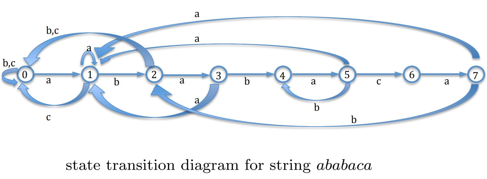
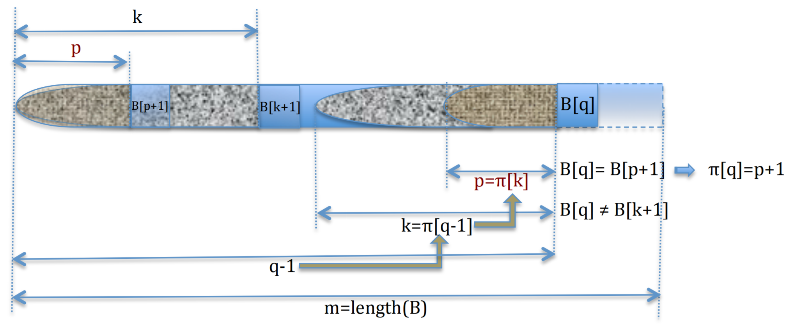

# String Matching Algorithms

Assume that you want to find out if a string $B = b_0 b_1 \dots b_{m - 1}$ appears as a (contiguous) substring of a much longer string $A = a_0 a_1 \dots a_{n - 1}$. The "naive" string matching algorithm does not work well if $B$ is much longer than what can fit in a single register; we need something cleverer.

## Rabin-Karp Algorithm

This algorithm involves computing a hash value for the string $B = b_0b_1b_2...b_{m-1}$ of length $m$.

We assume that the strings $A$ and $B$ are in an alphabet $\mathcal{A}$ with $d$ many symbols in total. Thus, we can identify each string with a sequence of intergers by mapping each symbol $s_i$ into a corresponding integer $i$:

$$
\mathcal{A} = \{ s_0, s_1, s_2, \dots, s_{d - 1} \} \rightarrow \{ 0, 1, 2, \dots, d - 1 \}
$$

For any string $B$ we can now associate an integer whose digits in base $d$ are integers corresponding to each symbol in $B$:

$$
h(B) = h(b_0, b_1, b_2 \dots b_{m-1}) = d^{m - 1} b_0 + d^{m - 2} b_1 + \dots + d \cdot b_{m - 1} + b_{m - 1}
$$

This can be done efficiently using Horner's rule:

$$
h(B) = b_{m - 1} + d(b_{m - 2} + d(b_{m - 3} + d(b_{m - 4} + \dots + d(b_1 + d \cdot b_0))) \dots )
$$

Next, we choose a large prime number $p$ such that $(d + 1)p$ still fits into a single register, and define the hash value of $B$ as $H(B) = h(B) \mod p$.

Recall that $A = a_0 a_1 a_2 a_3 \dots a_s a_{s + 1} \dots a_{s + m - 1} \dots a_{N - 1}$ where $N >> m$. We want to find efficiently all $s$ such that the string of length $m$ of the form $a_s a_{s + 1} \dots a_{s + m - 1}$ and string $b_0 b_1 \dots b_{m - 1}$ are equal.

For each contiguous substring $A_s = a_s a_{s + 1} \dots a_{s + m - 1}$ of string $A$ we also compute its hash value as:

$$
h(A_S) = (d^{m - 1} a_s + d^{m - 2} a_{s + 1} + \dots + d^1 a_{s + m - 2} + a_{s + m - 1}) \mod p
$$

We can now compare the hash values $h(B)$ and $h(A_s)$ and do a symbol by symbol matching only if $h(B) = h(A_s)$.

Clearly, such an algorithm would be faster than the naive symbol-by-symbol comparison only if we can compute the hash values of substrings $A_s$ faster than what it takes to compare strings $B$ and $A_s$ character by character.

This is where recursion comes into play. We do not have compute the hash value $h(A_s + 1)$ of $A_{s + 1} = a_{s + 1} a_{s + 2} \dots a_{s + m}$ from scratch, but we can compute it efficiently from the hash value $h(A_s)$ of $A_s$ as follows.

By multiplying both sides of $h(A_s)$ by $d$ we obtain:

$$
\begin{array}{lcl}
  (d \cdot h(A_s)) \mod p & = & (d^m a_s + d^{m - 1} a_{s + 1} + \dots d \cdot a_{s + m - 1}) \mod p \\
  & = & (d^m a_s + (d^{m - 1} a_{s + 1} + \dots d^2 a_{s + m - 2} + d a_{s + m - 1} + a_{s + m}) \mod p - a_{s + m}) \mod p \\
  & = & (d^m a_s + h(A_{s + 1}) - a_{s + m}) \mod p
\end{array}
$$

Consequently, $h(A_{s + 1}) = (d \cdot h(A_s) - d^m a_s + a_{s + m}) \mod p$.

Note that $(d^m a_s) \mod p = ((d^m \mod p) a_s) \mod p$, and that the value of $d^m \mod p$ can be precomputed and stored. Also, $(-d^m a_s + a_{s + m}) \mod p < p$.

Thus, since $h(A_s) < p$ we obtain $d \cdot h(A_s) + (-d^m a_s + a_{s + m}) \mod p < (d + 1)p$.

Thus, since we chose $p$ such that $(d + 1)p$ fits in a register, all the values and the intermediate results for the above expression also fit in a single register. So for every $s$ except $s = 0$, the value of $h(A_s)$ can be computed in constant time independent of the length of the strings $A$ and $B$.

So, we first compute $h(B)$ and $h(A_0)$ using Horner's rule. Subsequent values of $h(A_s)$ for $s > 0$ are computed in constant time using the above recursion. $h(A_s)$ is compared with $h(B)$ and if they are equal then the strings $A_s$ and $B$ are compared by brute force character by character to see if they are also equal.

Since $p$ was chosen large, the false positivies when $h(A_s) = h(B)$ but $A_s \ne B$ are very unlikely, which makes the algorithm run fast in practice.

```python
function RabinKarp(string s[1..n], string pattern[1..m])
  hpattern := hash(pattern[1..m]);
  for i from 1 to n-m+1
    hs := hash(s[i..i+m-1])
    if hs = hpattern
      if s[i..i+m-1] = pattern[1..m]
        return i
  return not found
```

## String Matching Finite Automata

A string matching finite automaton for a string $S$ with $k$ symbols has $k + 1$ many states $0, 1, \dots, k$ which correspond to the number of characters matched thus far and a transition function $\delta(s, c)$ where $s$ is a state and $c$ is a character read.

We first look at the case when such $\delta(s, c)$ is given by a pre-constructed table. For example, for the string $S = ababaca$, the table defining $\delta(s, c)$ would then be:

| state | a | b | c |   |
| ----- | - | - | - | - |
| 0     | 1 | 0 | 0 | a |
| 1     | 1 | 2 | 0 | b |
| 2     | 3 | 0 | 0 | a |
| 3     | 1 | 4 | 0 | b |
| 4     | 5 | 0 | 0 | a |
| 5     | 1 | 4 | 6 | c |
| 6     | 7 | 0 | 0 | a |
| 7     | 1 | 2 | 0 |   |



To compute $\delta$, or fill in the table we let $B_k$ denote the prefix of the string $B$ consisting of the first $k$ characters of $B$.

If we are at a state $k$ this means that so far we have matched the prefix $B_k$; if we not see an input character $a$, then $\delta(k, a)$ is the largest $m$ such that the prefix $B_m$ of string $B$ is the suffix of the string $B_k a$

Thus, if $a$ happens to be $B[k + 1]$, then $m = k + 1$ and so $\delta(k, a) = k + 1$ and $B_k a = B_{k + 1}$.

###  Knuth-Morris-Pratt Algorithm

```
function ComputePrefixFunction(B):
	m ← length[B]
	let π[1..m] be a new array
	π[1] = 0
	k = 0
	for q = 2 to m do
		while k > 0 and B[k + 1] != B[q]
		k = π[k]
        if B[k + 1] == B[q]
        	k = k + 1
        π[q] = k
	end for
	return π
end function
```

Assume that length of $B$ is $m$ and that we have already found that $π[q − 1] = k$; to compute $π[q]$ we check if $B[q] = B[k + 1]$; if true then $π[q] = k + 1$; if not true then we find $π[k] = p$; if now $B[q] = B[p + 1]$ then $π[q] = p + 1$.



```
function KMPMatcher(A, B)
	n ← length[A]
	m ← length[B]
	π = Compute − Prefix − Function(B)
	q = 0
	for i = 1 to n do
		while q > 0 and B[q + 1] 6= A[i]
		q = π[q]
		if B[q + 1] == A[i]
			q = q + 1
        if q == m
        	print pattern occurs with shift i − m
        	q = π[q]
    end for
end function
```

#### Imperfect Matches

Sometimes we are not interested in finding just the prefect matches, but also in matches that might have a few errors, such as a few insertions, deletions and replacements.

So assume that we have a very long string $A = a_0a_1a_2a_3 . . . . . . a_sa_{s+1} . . . a_{s+m−1} . . . . . . a_{N−1}$, a shorter string $B = b_0b_1b_2 . . . b_{m−1}$ where $m << N$ and an integer $k << m$. We are interested in finding all matches for $B$ in $A$ which allow up to $k$ many errors. 

Idea: split $B$ into $k + 1$ consecutive subsequences of (approximately) equal length. Then any match in $A$ with at most $k$ errors must contain a subsequence which is a perfect match for a subsequence of $B$. Thus, we look for all perfect matches for all of $k + 1$ subsequences of $B$ and for every hit we test by brute force if the remaining parts of $B$ have sufficient number of matches in the appropriate parts of $A$.

