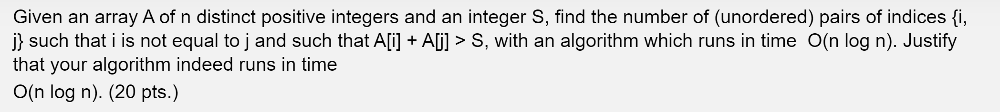

For each element in A, let each element also contain the value index_i which represents their current index position in A. To solve the problem, first use a merge sort to sort A in ascending order where the smallest integer is found at the start of the array. This operation costs O(nlogn). From here, iterate over each integer i in the sorted A. For each iteration, we can use a binary search to find the smallest integer A[j] such that A[j] > S - A[i] and i < j (since we are finding distinct unordered pairs of indices). As such, since we are finding the smallest integer A[j], we know that all elements after j would in fact satisfy A[j] > S - A[i] and the pairs of indices can be found by accessing index_k in each element k >= j (since we determined that all elements after j satisfied the inequality). This operation costs O(n log n) as for each iteration over the n integers, we are performing a binary search each time which costs O(log n). Thus the algorithm runs in O(nlogn) overall.

