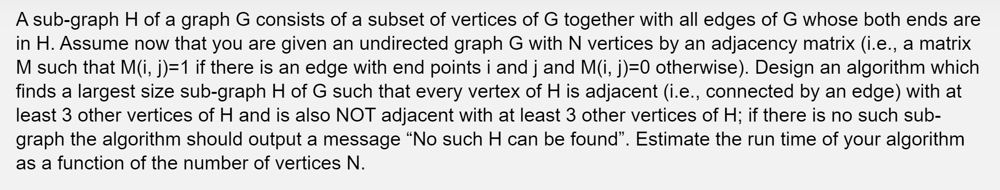

The problem can be solved using the greedy approach. As stated in the question, we are finding the largest size subgraph H where every vertex H is adjacent with at least 3 other vertices of H and is also not adjacent with at least 3 other vertices. Lets create an array V of size N where each element represents a vertex on the graph G. We can use the method relaxation to assume that every vertex of G could be in the subgraph and later on the algorithm, we make the greedy choice in removing the vertex which violates the conditions of the subgraph H. The array V represents the vertices on the subgraph H. For each element (vertex) in the array, it stores the following pair of values:

- the number of vertices that the vertex is adjacent to
- the number of vertices that the vertex is NOT adjacent to

To begin with, populate array V with each vertex that contains the number of vertices that the vertex is adjacent to and NOT adjacent to by checking if the edge exists to that vertex through the adjacency matrix M. Then, after populating array V, remove all vertices whom have either the number of adjacent vertices or not adjacent vertices less than 3 and update the adjacency matrix to reflect this change. These removed vertices can be stored in a new array, lets say W, which is an array of vertices whom cannot be on the subgraph H. From here, it is obvious that although we removed vertices that do not satisfy to be in subgraph H, there may still exists some vertices in V that does not meet the constraints of H, since a vertex in V may be adjacent to a vertex in W (which we removed earlier). Hence, we still need to update the adjacency count for each vertex in array V. For each vertex in V, update the number of vertices that are adjacent and are not adjacent with regards to only considering vertices in N - W by checking the adjacency matrix and updating the values throughout. Then, remove any vertices in V that does not satisfy the condition of the subgraph. We iterate over this operation until we have found that all vertices in V contains atleast 3 adjacent vertices and atleast 3 other vertices that are not adjacent. If there exists no vertices in V after this operation, this means that theres no vertices that can make the subgraph H and thus output "No such H can be found".

The overall time complexity is O(N^2) since we are updating each vertex in array V possibly up to N times to the largest size of the subgraph H.