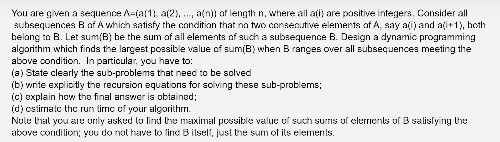

Subproblem: For each i <= n, solve the following subproblem

Find the subsequence of A[1..i] where it gives the largest possible value such that no two consecutive elements of A are in the subsequence and the subsequence ends with A[i].

Recursion: Let opt(i) be the optimal solution where it gives back the largest sum of the optimal subsequence that ends with A[i]. We can define the recurrence relation as follows:

opt(i) = A[i] + max(opt(m): 1 <= m < i - 1)

The base case occurs when opt(1) = A[i]

Obtaining the final solution: To obtain the final solution, first construct an array S[1..n] which stores the computation when solving our n subproblems (i.e. S[i] = opt(i) which is the largest possible value of the subsequence including A[i]). From there, solve the n subproblems, storing the result in S. Now, to obtain the final solution, simply find the highest element in S (i.e. solution = max(opt(i): 1 <= i <= n)) which gives us the largest possible value of sum(B)

Time Complexity: Overall, the time complexity is O(n^2) since there exists n subproblems to solve and for each subproblem, the operation cost is O(n) due to finding max(opt(m): 1 <= m < i - 1)

