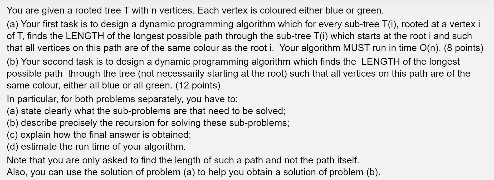

a) Subproblem: For each subtree i <= n, where n is the number of nodes of the tree, we must solve the following subproblem: What is the longest possible path from the subtree which starts at the root i where all vertices in the path are of the same colour to root i.

Recursion and Base Case: Let T(i) denote the subtree where node i is rooted as the root node. Lets define that for every immediate child of node i is given by j_1, j_2, ..., j_m where m is the number of immediate child nodes there exists. Thus we can define the recurrence relation to find the length of the longest path as:

T(i) = 1 + max(T(j_k): 1 <= k <= m and where colour(j_k) = colour(i))

The base case of the recursion occurs when T(s) = 1 where s is the leaf node of the tree.

Obtaining the final solution: We can find the final solution given by the result from T(n) where n is the root node of the subtree. This find the length of the longest possible path through the subtree which starts at root n.

Time Complexity: Overall, the time complexity is O(n) as this algorithm traverses each node in the subtree once.

b) Subproblem: Similar to the subproblem defined in part a, for each subtree i <= n, where n is the number of nodes in the tree, our subproblem can be defined as: What is the length of the longest possible path there exists in the tree not necessarily starting at the root such that all vertices on this path are of the same colour.

Recursion and Base Case: Similar to part a, lets define that for every immediate child of node i is given by j_1, j_2, ..., j_m where m is the number of immediate child nodes there exists. Let I(i) also be the function that finds the length of the longest path in the subtree where the root node i is included. The function can be defined as:

I(i) = 1 + max(I(j_k): 1 <= k <= m and where colour(j_k) = colour(i))

The base case of the recursion occurs when T(s) = 1 where s is the leaf node of the tree.

Let E(i) be the function that finds the length of the longest path in the subtree where the root node i is excluded.

E(i) = max( max(E(j_k), I(j_k)) : 1 <= j_k <= m )

The base case of the recursion occurs when E(s) = 1 where s is the lead node of the subtree.

For this case, we are considering the following cases to determine the longest path:

- where the longest path includes the root node
- where the longest path exists somewhere in the child node subtree.

Obtaining the final solution: We can obtain the final solution by finding max(I(n), E(n)) where n is the root node of the tree.

Time Complexity: Overall, the time complexity of this algorithm is O(n) since the recursion is traversing all nodes only once to find the optimal solution.

