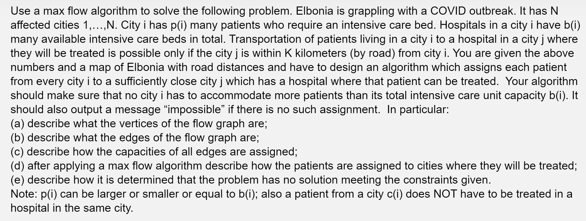

This problem can be represented as a max flow bipartite matching problem. Construct a bipartite network flow graph $G(V,E)$ where:

- the sources are the left hand vertices are represented by each city $i$ which has p(i) patients whom require an intensive care bed for each city 
- the sinks are the right hand vertices are represented by each city $j$ which has b(j) many intensive care beds available.

Let d(i, j) give the road distance between city i and j. For each left hand vertex v_i, connect a directed edge to the right hand vertex v_j where the d(v_i, v_j) <= K and set the maximum capacity to infinity (maximum weight would not affect the max flow algorithm since there exists a bottleneck in the graph when connecting the sinks to the super sink shown below.)

Also, construct a super source S where it connects to every left hand vertices v_i and set the edges to have the capacity p(i) for each city i. The maximum capacity of these edges ensures that each hospital have p(i) patients. Construct a super sink T where it connects to every right hand vertices v_j with maximum capacity of b(j). The capacity on these edges ensures a constraint such that each city j can only take up b(j) many patient.

Now find the max flow in the graph using the Edmonds-Karp algorithm. To find which patients are assigned to cities where they will be treated, look at the occupied edges for each left hand vertex to each right hand vertex to determine the assignment of patients from city i to city j. The flow of each edge from vertex v_i to v_j identifies that patient from city i must travel to city j to be allocated a bed.

The problem has no solution if the maximum flow of the graph does not equal to the sum of all p(i) since this means that there is not enough beds to allocate all patients and thus the algorithm should output "ïmpossible".

The overall time complexity of this algorithm is given by O(2N * (N+N+N^2)^2) = O(N * N^4) = O(N^5) since the Edmonds-Karp algorithm is the most costly operation.

