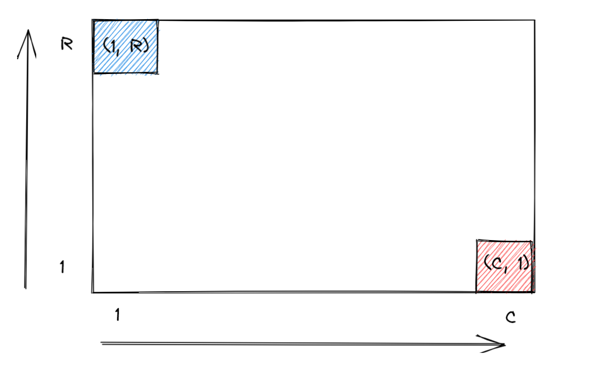

## Assignment 3 - Gabriel Angelo Ting (z5312799)

**2. You are given a 2D map consisting of an $C \times R$ grid of squares; in each square there is a number representing the elevation of the terrain at that square. Find a path going from square $(1, R)$ which is the top left corner of the map to square $(C, 1)$ in the lower right corner which from every square goes only to the square immediately below or to the square immediately to the right so that the number of moves from lower elevation to higher elevation along such a path is as small as possible. (20 pts)**

For this problem, assume that $C$ is the coordinate for columns and $R$​​​​ is the coordinate for rows such that the grid of squares looks like this.

The subproblem we must solve is what is the minimum number of moves from lower elevation to higher elevation starting at $(1, R)$​​ to reach $(i,j)$​​ where $i$​​ and $j$​​ are coordinates on the $C \times R$​​ grid of squares. Let $opt(i,j)$​​ return the optimal solution for the minimum number of moves from lower elevation to higher elevation. 

The base case for the recursion occurs when $opt(1,R) = 0$​​ as it is the initial position with no movement to higher elevation. The other base case occurs when $opt(i,j) = \infty$​​ for all $i$​​ and $j$​​ that lies outside of the grid of squares.

However, when finding a path to reach square $(i,j)$, we need to consider the left and upper square of $(i,j)$ and whether it is from a move starting at a lower elevation to a higher elevation. Let us define a function $E(m,n)$ where $m$ and $n$ represents two coordinates pairs of adjacent squares. If square $m$ moves from a lower elevation to higher elevation to reach square $n$, it returns 1. Otherwise, it returns 0. For each subproblem, we can find the path with the shortest number of moves from lower elevation to higher elevation to reach $(i,j)$ by considering the recurrence relation:
$$
opt(i,j) = \min\{opt(i, j+1) + E((i,j+1),(i,j)), opt(i-1,j) + E((i-1,j))\}
$$
To obtain the final solution, start at square $(C,1)$​ and use the recursion defined above to find the path with the shortest number of moves from lower elevation to higher elevation. We can find the minimum path by creating a $C \times R$​ matrix representing the grid where each cell contains the number of moves from lower elevation to higher elevation to reach square $(i,j)$​. After computing the subproblems, we can find the optimal path by starting at square $(C,1)$​ and then traversing back the path by either moving into the square to the left or above that has the smallest value. Hence, we can find the optimal path by reversing the path found starting at square $(C,1)$​. 

There are $O(C \times R)$ subproblems to evaluate when finding the number of moves from lower elevation to higher elevation to reach $(C, 1)$​. Finding the optimal path sequence to reach $(C,1)$ costs $O(C + R)$​. Thus, the overall time complexity of the algorithm is $O(CR)$.

