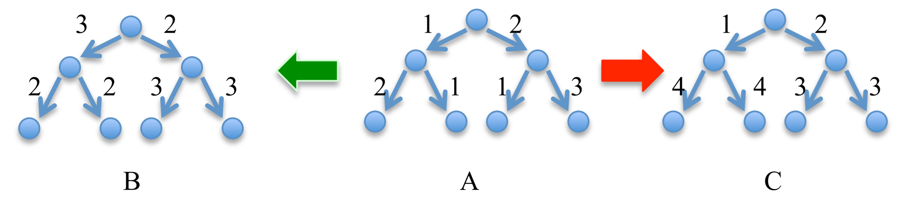
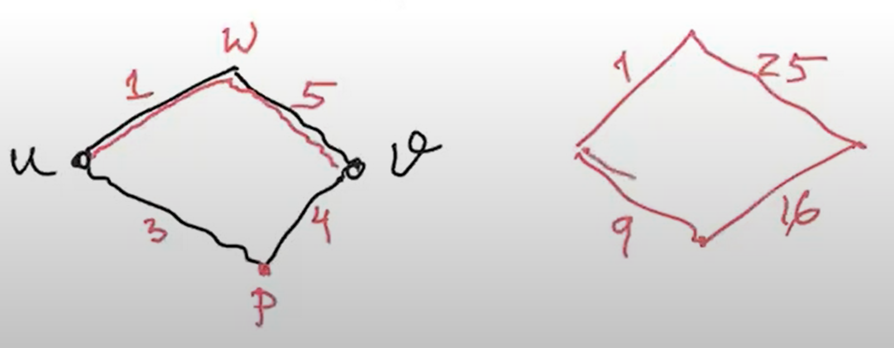
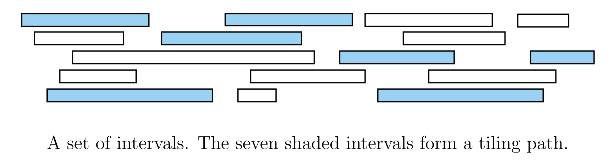
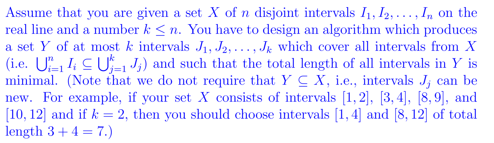
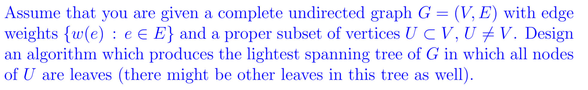

# Questions - Greedy Method

**Proving optimal solution**

Show that any optimal solution can be transformed into the greedy solution with equal number of activities: 

- Find the first place where the chosen activity violates the greedy choice. 
- Show that replacing that activity with the greedy choice produces a non conflicting selection with the same number of activities. 
- Continue in this manner till you “morph” your optimal solution into the greedy solution, thus proving the greedy solution is also optimal.

## Tutorial Problems

1. There are $N$ robbers who have stolen $N$​ items. You would like to distribute the items among the robbers (one item per robber). You know the precise value of each item. Each robber has a particular range of values they would like their item to be worth (too cheap and they will not have made money, too expensive and they will draw a lot of attention). Devise an algorithm that either distributes the items so that each robber is happy or determines that there is no such distribution.

   > For each item, let $v_i$ denote the value of that item. Sort the items by $v_i$​ in increasing order using a merge sort. This operation takes $O(n\log{n})$. To distribute an item to a robber, start considering the first item in the sorted lists of items. Next, choose robbers whom $p_i$​ in their particular range of values. Using the greedy policy, distribute the item to the thief whom has the smallest upper bound. Continue this method in distributing the item such that the item is distributed to the thief with the lowest upper bound value. If all items have been distributed, then all robbers are happy. Otherwise, there exists no such distribution.
   >
   > To prove that the greedy solution is optimal, let there exists another solution $G$​. Consider a thief $i$​ in the solution $G$​ which has the upper bound price value of $H_i$​ and the lower bound value $L_i$​. Also, consider another thief $j$​ with the price range values of $L_j$​ and $H_j$​ as their lower and upper bound respectively. Lets also consider two items $m$​ and $n$​ where $v_m \le v_n$​ but with both $v_m$​ and $v_n$​ are in the price ranges for thief $i$​ and $j$​. Furthermore, consider that for both thief, their upper bound values are $H_i \lt H_j$​. Since we stated that $G$​ is another solution to the item distribution, lets distribute item $n$​ to thief $i$​ and item $m$​ to thief $j$​. Although this satisfies as the solution to the problem, since we stated that both items are in the price ranges for thief $i$​ and $j$​, it violates the greedy policy in distributing an item with the thief of the lowest upper bound value. However, if we instead distribute the items such that item $m$​ is given to thief $i$​ and item $n$​ is given to thief $j$​​, this satisfies the greedy policy since $H_i \lt H_j$​​. Hence, by repeatedly swapping the solution with a different assignment of items in this manner, we would transform it into a greedy solution which proves that this approach is optimal.​

2. (Timing Problem in VLSI chips) Consider a complete binary tree with $n = 2^k$ leaves. Each edge has an associated positive number that we call the length of the edge (see figure below). The distance from the root to a leaf is the sum of the lengths of all edges from the root to the leaf. The root emits a clock signal and the signal propagates along all edges and reaches each leaf in time proportional to the distance from the root to that leaf. Design an algorithm which increases the lengths of some of the edges in the tree in a way that ensures that the signal reaches all the leaves at the same time while the total sum of the lengths of all edges is minimal. (For example, in the picture below if the tree $A$ is transformed into trees $B$ and $C$ all leaves of $B$ and $C$ have a distance of 5 from the root and thus receive the clock signal at the same time, but the sum of the lengths of the edges in $C$ is 17 while sum of the lengths of the edges in $B$​​ is only 15.)

   

   > 

3. Assume that you are given a complete graph $G$​ with weighted edges such that all weights are distinct. We now obtain another complete weighted graph $G'$​ by replacing all weights $w(i, j)$​ of edges $e(i, j)$​ with new weights $w(i, j)^2$​ .

   (a) Assume that $T$​ is the minimal spanning tree of $G$​. Does $T$​ necessarily remain the minimal spanning tree for the new graph $G'$​​ ? 

   > Yes. Since squaring the edges is a monotonic operation, the ordering of the edges when executing the Kruskal's algorithm to find the minimal spanning tree does not change.

   (b) Assume that $p$ is the shortest path from a vertex $u$ to a vertex $v$ in $G$. Does $p$ necessarily remain the shortest path from $u$ to $v$ in the new graph $G'$​ ?

   > No. Example show below:

   

4. Assume that you are given a complete weighted graph $G$​ with $n$​ vertices $v_1, . . . , v_n$​ and with the weights of all edges distinct and positive. Assume that you are also given the minimum spanning tree $T$​ for $G$​. You are now given a new vertex $v_{n+1}$​ and the weights $w(n + 1, j)$​ of all new edges $e(n + 1, j)$​ between the new vertex $v_{n+1}$​ and all old vertices $v_j \in G$​, $1 \le j \le n$​. Design an algorithm which produces a minimum spanning tree $T'$ for the new graph containing the additional vertex $v_{n+1}$ and which runs in time $O(n \log n)$​​​.

   > To obtain the new minimum spanning tree, run Kruskal's algorithm on the old minimum spanning tree and the new $n$ edges connecting to $v_{n+1}$. Since $G$​ is a complete weighted graph, if you run Kruskal's on the new graph it wouldn't run in time $O(n \log n)$.

5. You have $n$ items for sale, numbered from 1 to $n$. Alice is willing to pay $a[i] \gt 0$ dollars for item $i$, and Bob is willing to pay $b[i] \gt 0$ dollars for item $i$. Alice is willing to buy no more than $A$ of your items, and Bob is willing to buy no more than $B$ of your items. Additionally, you must sell each item to either Alice or Bob, but not both, so you may assume that $n \le A+B$. Given $n, A, B, a[1 . . . n]$ and $b[1 . . . n]$, you have to determine the maximum total amount of money you can earn in $O(n \log n)$​ time.

   > Lets construct an array $d$ of size $n$​​. For each $i^{th}$ element of the array, it contains two items:
   >
   > - the item $i$, and
   > - the value $d_i$ which is the difference between $a[i] - b[i]$
   >
   > Using a merge sort operation, we sort the array based on difference between $a[i] - b[i]$ in decreasing order. This would gives us a sorted array where we would be better off selling items in the first few element of the array to Alice and selling the last few items to Bob. This is because $a[i] - b[i]$ indicates that for the $i^{th}$ item:
   >
   > - if the difference is $\gt 0$, we would make more profit for that item from Alice,
   > - if the difference is equal to 0, then either we can sell it to Alice or Bob since both are willing to buy it at the same price, and,
   > - if the difference is $\lt 0$, Bob is willing to buy the item more than Alice.
   >
   > Start iterating for each item in the sorted array. For each $i^{th}$ item, sell it to Alice where:
   >
   > - $d_i \gt 0$, and,
   > - the number of items sold to Alice does not exceed $A$.
   >
   > If either one of these condition fails, it is time to switch to sell the items to Bob. In this case, optimal items to sell to Bob are located at the end of the array. We can terminate the current loop and start looping through the array in reverse, starting at the end. Again, similar to Alice, sell the $i^{th}$ item to Bob until:
   >
   > - $d_i \le 0$ and,
   > - the number of items sold to Bob does not exceed $B$​.
   >
   > If we have the case where $d_i = 0$​ and we have sold all items $\gt 0$​ and $\lt 0$​ to Alice or Bob respectively, we can sell the remaining items $d_i = 0$ to either Alice or Bob until they are no longer willing to purchase any items.

6. Assume that you have an unlimited number of \$2, \$​1, 50c, 20c, 10c and 5c coins to pay for your lunch. Design an algorithm that, given the cost that is a multiple of 5c, makes that amount using a minimal number of coins.

   > Using the greedy approach, we can solve this problem by figuring how many \$2 can go into the cost and then move from  there to $1, 50c, 10c and 5c.

7. Assume that the denominations of your $n + 1$​ coins are $1, c, c^2 , c^3 , . . . , c^n$​ for some integer $c \gt 1$​​. Design a greedy algorithm which, given any amount, makes that amount using a minimal number of coins.

   > Similar to the previous problem, start off with coins of the highest value that can cover the cost and move your way from there.

8. Give an example of a set of denominations containing the single cent coin for which the greedy algorithm does not always produce an optimal solution.

   > Consider the denominations 4c, 3c and 1c and an amount to be paid of 6 cents. The greedy algorithm would first give one 4c coin and would then be forced to give 2 cents using two 1c coins. However, giving two 3c coins is more optimal.

9. Given two sequences of letters $A$ and $B$, find if $B$ is a subsequence of $A$ in the sense that one can delete some letters from $A$ and obtain the sequence $B$.

   > Using the greedy approach, consider each letter in $B$. Then, go through all the letters in $A$. If the $i^{th}$ letter does not match the $j^{th}$ letter in $B$, delete letter $i$ and move on to the next letter in $A$. Otherwise, if $A[i] = B[j]$, then move to the next letter in both $A$ and $B$​ and repeat the process until all letters have been searched.

10. There is a line of 111 stalls, some of which lack a roof and need to be covered with boards. You can use up to 11 boards, each of which may cover any number of consecutive stalls. Cover all the necessary stalls, while covering as few total stalls as possible.

    > First, cover all roofless stalls with a single board that stretches from the first roofless stall to the last roofless stall. Then, repeat the following up to 10 times: 
    >
    > - Find the longest line of consecutive roofed stalls that are covered by a board, and then excise that part of the board, replacing it with two boards. 
    >
    > Stop when there is no stall with a roof that is covered by a board.

11. Let $X$ be a set of $n$ intervals on the real line. A subset of intervals $Y ⊆ X$ is called a tiling path if the intervals in $Y$ cover the intervals in $X$, that is, any real value that is contained in some interval in $X$ is also contained in some interval in $Y$ . The size of a tiling cover is just the number of intervals. Describe and analyse an algorithm to compute the smallest tiling path of $X$ as quickly as possible. Assume that your input consists of two arrays $X_L[1..n]$ and $X_R[1..n]$, representing the left and right endpoints of the intervals in $X$.

    

    > Sort the intervals in increasing order of their left endpoints. Start with the interval with the smallest left endpoint; if there are several intervals with the same such smallest left endpoint choose the one with the largest right endpoint. Then, consider all intervals whose left endpoints are in the last chosen interval, and pick the one with the largest right endpoint. Continue in this manner until an interval with the absolute largest right endpoint is chosen. The algorithm involves sorting the intervals, and then performing by a single pass through all of the intervals. Hence, the algorithm runs in $O(n \log n)$​ time.
    >
    > https://edstem.org/au/courses/5966/discussion/524503

12. Assume that you are given $n$ white and $n$ black dots lying in a random configuration on a straight line, equally spaced. Design a greedy algorithm which connects each black dot with a (different) white dot, so that the total length of wires used to form such connected pairs is minimal. The length of wire used to connect two dots is equal to the straight-line distance between them.

    

    > The correct approach is to go from left to right and connect the leftmost dot with the leftmost dot of the opposite colour and then continue in this way. 

13. Assume you are given $n$ sorted arrays $P_i$ , $1 ≤ i ≤ n$, of different sizes $e_i$​ . You are allowed to merge any two arrays into a single new sorted array and proceed in this manner until only one array is left. Design an algorithm that achieves this task and uses minimal total number of moves of elements of the arrays. Give an informal justification for why your algorithm is optimal.

    > Thus, we take the two shortest arrays and merge them, and continue with the resulting set of arrays in the same manner until there is only one array remaining.

14. A photocopying service with a single large photocopying machine faces the following scheduling problem. Each morning they get a set of jobs from customers. They want to schedule the jobs on their single machine in an order that keeps their customers the happiest. Customer $i$’s job will take $t_i$ time to complete. Given a schedule (i.e., an ordering of the jobs), let $C_i$ denote the finishing time of job $i$. For example, if job $i$ is the first to be done we would have $C_i = t_i$ , and if job $j$ is done right after job $i$, we would have $C_j$ = $C_i +t_j$ . Each customer $i$ also has a given weight $w_i$ which represents his or her importance to the business. The happiness of customer $i$ is expected to be dependent on the finishing time of their job. So the company decides that they want to order the jobs to minimise the weighted sum of the completion times, $\sum_{i=1}^{n} w_iC_i$. Design an efficient algorithm to solve this problem. That is, you are given a set of $n$ jobs with a processing time $t_i$ and a weight $w_i$ for job $i$. You want to order the jobs so as to minimise the weighted sum of the completion times, $\sum_{i=1}^{n} w_iC_i$ .

    > Schedule the jobs in decreasing order of $w_i/t_i$ . This problem is very similar to the Tape Storage problem, which was covered in the lectures.

15. You are running a small manufacturing shop with plenty of workers, but just a single milling machine. You have to produce $n$ items; item $i$ requires $m_i$ machining time first, then $p_i$ polishing time by hand; finally it is packaged by hand and this takes $c_i$​ amount of time. The machine can mill only one item at a time, but your workers can polish and package in parallel as many objects as you wish. You have to determine the order in which the objects should be machined so that the whole production is finished as quickly as possible. Prove that your solution is optimal.

    > Sort the items by $p_i + c_i$ in decreasing order.
    
16. You have a processor that can operate 24 hours a day, every day. People submit requests to run daily jobs on the processor. Each such job comes with a start time and an end time; if a job is accepted, it must run continuously, every day, for the period between its start and end times. (Note that certain jobs can begin before midnight and end after midnight; this makes for a type of situation different from what we saw in the activity selection problem.) Given a list of $n$ such jobs, your goal is to accept as many jobs as possible (regardless of their length), subject to the constraint that the processor can run at most one job at any given point in time. Provide an algorithm to do this with a running time that is polynomial in $n$​. You may assume for simplicity that no two jobs have the same start or end times.

    > 

17. Assume that you got a fabulous job and you wish to repay your student loan as quickly as possible. Unfortunately, the bank Western Road Robbery which gave you the loan has the condition that you must start your monthly repayments by paying off \$1 and then each subsequent month you must pay either double the amount you paid the previous month, the same amount as the previous month or half the amount you paid the previous month. On top of these conditions, your schedule must be such that the last payment is $1. Design an algorithm which, given the size of your loan, produces a payment schedule which minimises the number of months it will take you to repay your loan while satisfying all of the bank’s requirements. If the optimality of your solution is obvious from the algorithm description, you do not have to provide any further correctness proof.

    > 

18. Alice wants to throw a party and is deciding whom to invite. She has $n$ people to choose from, and she has created a list consisting of pairs of people who know each other. She wants to invite as many people as possible, subject to two constraints: at the party, each person should have at least five other people whom they know and at least five other people whom they do not know. Give an efficient algorithm that takes as input the list of $n$ people and the list of all pairs who know each other and outputs a subset of these $n$​ people which satisfies the constraints and which has the largest number of invitees. Argue that your algorithm indeed produces a subset with the largest possible number of invitees.

    >For each person, count the number of people they know and the number of people they do not know, recording this in a table. Now eliminate all people who know fewer than five other people or don’t know fewer than five people among the set of people currently being considered. Then, update the count of known/unknown people for each affected person. Continue in this manner until everyone left satisfies the condition.
    >
    >This strategy is clearly optimal, as we begin with the set of all people, and only eliminate people when they do not satisfy the condition.

19. In Elbonia cities are connected with one way roads and it takes one whole day to travel between any two cities. Thus, if you need to reach a city and there is no direct road, you have to spend a night in a hotel in all intermediate cities. You are given a map of Elbonia with toll charges for all roads and the prices of the cheapest hotels in each city. You have to travel from the capital city $C$ to a resort city $R$. Design an algorithm which produces the cheapest route to get from $C$ to $R$.

    >This problem can be represented as the shortest path problem, with the exception that every city now has an associated weight. To find the shortest path from $C$ to $R$, considering the shortest costs, first split the vertex $v_i$ into two nodes, $v_{in}$ and $v_{out}$. All incoming edges are now incident to $v_{in}$ and all outgoing edges from $v_i$ are incident to $V_{out}$. Connect $v_{in}$ and $v_{out}$ with a weighted edge of the costs of staying in the hotel for city $i$. We can now delete node $v_i$​ from the graph. After splitting each vertex in the graph into two nodes, we can apply Dijkstra's algorithm to find the shortest path from $C$ to $R$.

20. You are given a set $S$ of $n$ overlapping arcs of the unit circle. The arcs can be of different lengths. Find a largest subset $P$ of these arcs such that no two arcs in $P$​ overlap (largest in terms of the total number of arcs, not in terms of the total length of these arcs). Prove that your solution is optimal. *Hint: compare with problem 16.*

    >

21. You are given a set $S$ of $n$​ overlapping arcs of the unit circle. The arcs can be of different lengths. You have to stab these arcs with a minimal number of needles so that every arc is stabbed at least once. In other words, you have to find a set of as few points on the unit circle as possible so that every arc contains at least one point. Prove that your solution is optimal. *Hint: compare with problem 16.*

    >

22. You are given a connected graph with weighted edges. Find a spanning tree such that the largest weight of all of its edges is as small as possible.

    >

23. You need to write a very long paper titled “The Meaning of Life”. You have compiled a sequence of books in the order that you will need them, some of them multiple times. Such a sequence might look something like this:
    $$
    B_1, B_2, B_1, B_3, B_4, B_5, B_2, B_6, B_4, B_1, B_7, . . .
    $$
    Unfortunately, the library only lets you borrow ten books at a time, so every now and then you have to make a trip to the library to exchange books. On each trip you can exchange any number of books. Design an algorithm which decides which books to exchange on each library trip so that the total number of trips which you will have to make to the library is as small as possible.

    >The problem can be solved using the greedy approach. First, borrow the first ten unique books that you will need according to the sequence given. Then, when you need a book which you do not have in the borrowed books, get the next ten unique books next in the sequence. This may involve keeping some books that you are currently borrowing. Continually repeat this step until the sequence of books is finished. This algorithm is clearly optimal as it delays making a trip to the library for as long as possible

24. 

    >

25. 

    >

26. You are given a connected graph with weighted edges with all weights distinct. Prove that such a graph has a unique minimum spanning tree.

    >

27. You have $N$ students with varying skill levels and $N$​ jobs with varying skill requirements. You want to assign a different job to each student, but only if the student meets the job’s skill requirement. Design an algorithm to determine the maximum number of jobs that you can successfully assign.

    >Sort the $N$ students by skill levels in increasing order such that the student with the lowest skill is found in the start of the sorted list. Now, assigne the students with the highest skill requirement that they meet the requirements for and that hasn’t already been assigned.

28. There are $N$​​​ towns situated along a straight line. The location of the $i^{th}$​​​ town is given by the distance of that town from the westernmost town, $d_i$​​​ (so the location of the westernmost town is 0). Police stations are to be built along the line such that the $i^{th}$​​​ town has a police station within $A_i$​​​ kilometers of it. Design an algorithm to determine the minimum number of police stations that would need to be built.

    > 

29. There are $N$ people that you need to guide through a difficult mountain pass. Each person has a speed in days that it will take to guide them through the pass. You will guide people in groups of up to $K$​ people, but you can only move as fast as the slowest person in each group. Design an algorithm to determine the fewest number of days you will need to guide everyone through the pass.

    >Sort the $N$​ people by their speed in decreasing order. Since the group can only move as fast as the slowest person in each group, we can use the greedy approach in where we form groups where people are closest in speed to the slowest person. Groups are better off formed such that the first $K$​ slowest​​ people are in one group, followed by next $K$​​ people and so on. Then we can guide one group at a time through the mountain pass.

30. There are $N$​ courses that you can take. Each course has a minimum required IQ, and will raise your IQ by a certain amount when you take it. Design an algorithm to find the minimum number of courses you will need to take to get an IQ of at least $K.$​

    > Sort the $N$​​ courses by the IQ you will gained in decreasing order. Go through the sorted courses. If for a course that you have the minimum IQ required to complete it, attempt that course first to gain the IQ and remove that course from the array (i.e. by setting a flag that the course has been completed). Once a course has been completed, iterate the sorted courses again and repeat the process until you gave gained an IQ of at least $K$​. If all courses are completed and the overall IQ gained $\lt K$, then there exists no solution. The overall time complexity for this algorithm is $O(N^2)$​.​
