# Lexical Analysis

## Role of the Scanner

Scanner discover the tokens. The scanner operates as a subroutine called by the parser when it needs a new token in the input stream.

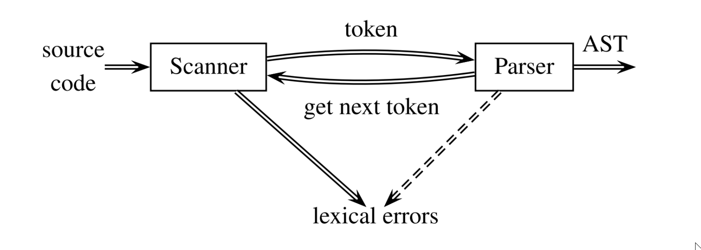

```java
import java.util.*;

public class JavaStringTokenizer {
    public static void main(String argv[]) {
    StringTokenizer s = new StringTokenizer("(02) 9385 4889", "() ", false);
    // "() ": token delimiters
    // false: () not part of tokens
    while (s.hasMoreTokens()) {
        // output:
        // 02
        // 9385
        // 4889
    	System.out.println(s.nextToken());
    }
}
```

## Tokens

The tokens in VC are classified as follows:

- identifiers (e.g., sum, i, j)
- keywords (e.g., int, if or while)
- operators (e.g., “+” or “∗”, “<=”)
- separators (e.g., “{”, ‘}”, “;”)
- literals (integer, real, boolean and string constants)

The lexeme of a token: the character sequence (i.e., the actual text of) forming the token.

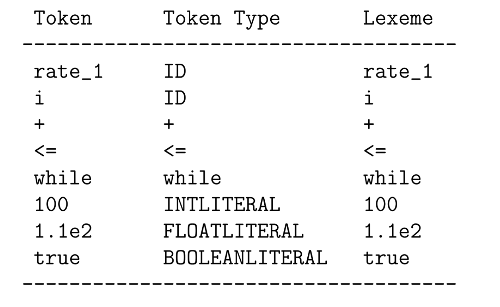

### Token Patterns

Pattern: a rule describing the set of lexemes that can represent a particular token. The pattern is said to match each string in the set.

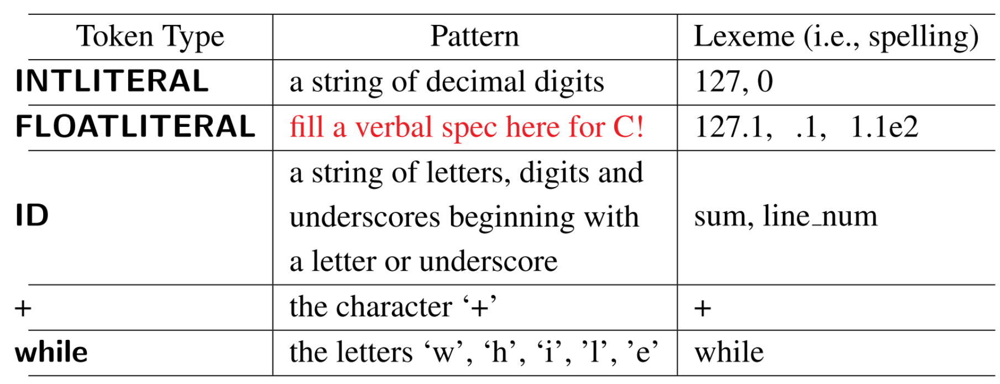

#### Regular Expressions for Integer and Real Numbers in C

```
Integers (intLiteral): `digit (digit)∗` where `digit = 0|1|2|...|9`
Reals (floatLiteral): `digit∗ fraction exponent? | digit+. | digit+.?exponent` where `digit = 0|1|2|...|9`, `fraction = .digit+`, `exponent = (E|e)(+|-)?digit+`
```

## Conversion

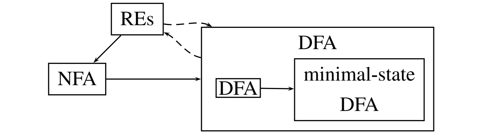

- RE -> Regular Expressions
- NFA -> Nondeterministic Finite Automaton
- DFA -> Deterministic Finite Automaton
- Finite Automata -> Hardware design (minimising states -> minimising cost)

## Regular Expressions

### Alphabet, Strings and Languages

- Alphabet denoted $\sum$: any finite set of symbols
  - The binary alphabet $\{0,1\}$ (for machine languages)
  - The ASCII alphabet (for high-level languages)
- String: a finite sequence of symbols drawn from $\sum$ (alphabet)
  - Length $|s|$ of a string $s$: the number of symbols in $s$
  - $\epsilon$: denotes the empty string ($\abs{\epsilon} = 0$)
- Language: any set of strings over $\sum$ (alphabet); its two special cases:
  - $\empty$: the empty set
  - $\{\epsilon\}$: only consists of an empty string
- Example of Languages:
  - $\sum = \{0,1\}$ - a string is an instruction (i.e. set of MIPS/ARM instructions)
  - $\sum = \text{ASCII Set}$ - a string is a program (i.e. set of Haskell/C/VC programs)
- String Concatenation: If $x$ and $y$ are strings, $xy$ is the string formed by appending $y$ to $x$ (i.e. $x = \text{key}, y = \text{word}, xy = \text{keyword}$)
  - $\epsilon$ is the identity: $\epsilon x = x \epsilon = x$

### Operations on Languages

Lets say we have 2 languages $L$ and $M$:

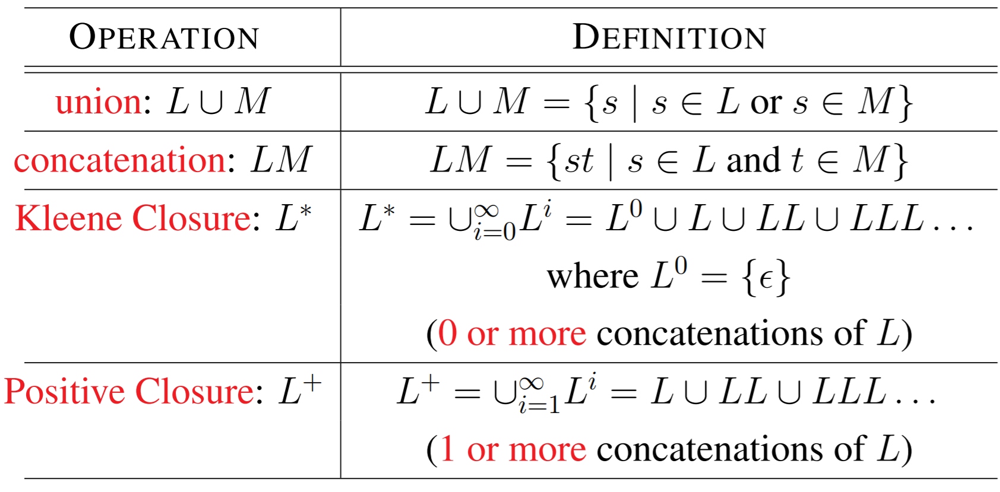

**Examples:** Given $L = \{a,...z,A,...,Z\}, D=\{0,...,0\}$

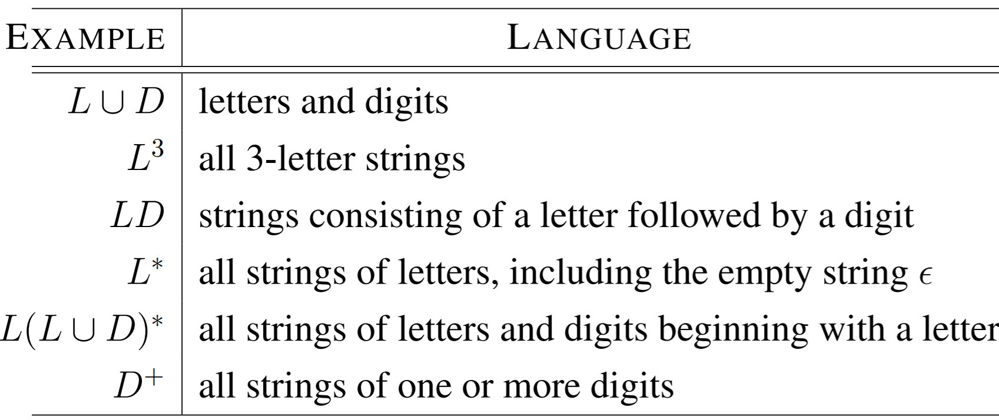

### Regular Expressions (RE) Over Alphabet $\sum$

REs define **regular languages (RL)** or regular sets

- Inductive Base:
  1. $\epsilon$ is a RE, denoting the $RL \{\epsilon\}$
  2. $a \in \sum$ is a RE, denoting the $RL \{a\}$
- Inductive Step: Suppose $r$ and $s$ are REs, denoting the RLs $L(r)$ and $L(s)$. Then
  1. $(r)|(s)$ is a RE, denoting the RL $ L(r) ∪ L(s)$
  2. $(r)(s)$ is a RE, denoting the RL $ L(r)L(s)$
  3. $(r)^∗$ is a RE, denoting the RL $L(r)^∗$
  4. $(r)$ is a RE, denoting the RL $L(r)$
- Precedence:
  - “∗” has the highest precedence
  - “Concatenation” has the second highest precedence
  - “|” has the lowest precedence
- Associativity: — all are left-associative i.e $(a)|((b)∗(c)) ≡ a|b∗c$

**Example**

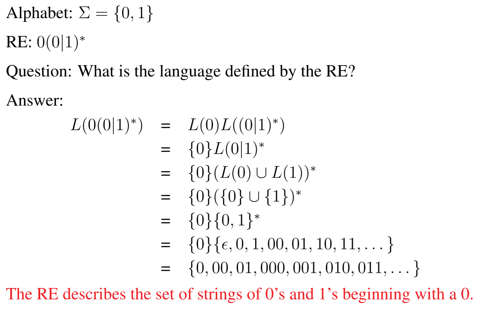

#### Notational Shorthands

- One or more instances: $r^+ = rr^∗$ – denotes the language $(L(r))^+$ and has the same precedence and associativity as $^{*}$
- Zero or one instance: $r? = r|\epsilon$ – denotes the language $L(r) ∪ \{\epsilon\}$ – written as $(r)?$ to indicate grouping (e.g., $(12)?$)
- Character classes: $[A − Za − z ][A − Za − z0 − 9 ]^∗$

## Finite Automata

A finite automaton consists of a 5-tuple: $(\sum, S, T, F, I)$ where

-  $\sum$ is an alphabet
- $S$ is a finite set of states
- $T$ is a state transition function: $T : S × \sum → S$
- $F$ is a finite set of final or accepting states
- $I$ is the start state: $I ∈ S$.

**Transition Graph**

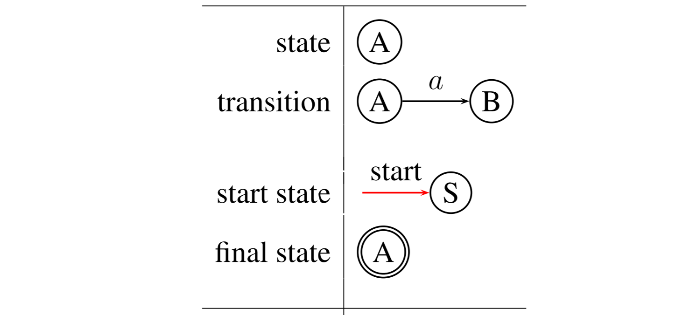

Acceptance: A FA accepts an input string $x$ iff there is some path in the transition graph from the start state to some accepting state such that the edge labels spell out $x$.

**Example**

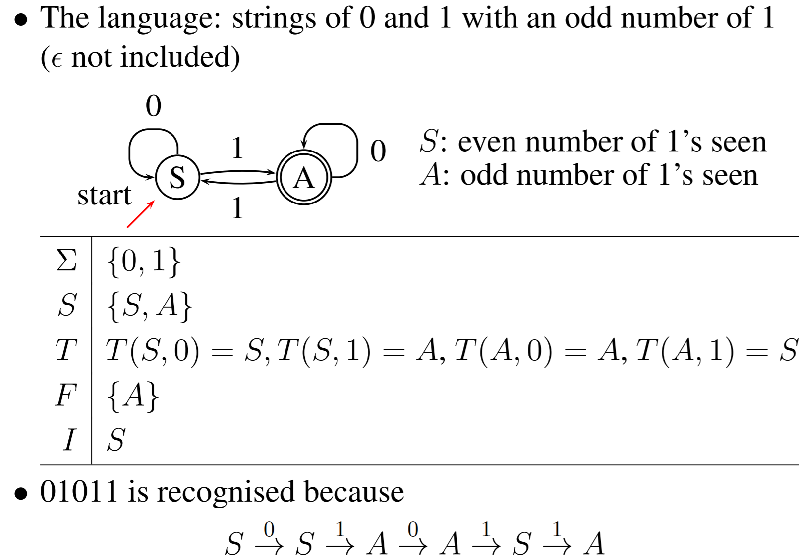

### Deterministic FA (DFA) and Nondeterministic FA (NFA)

A FA is a **DFA** if

- no state has an $\epsilon$-transition, i.e., an transition on input $\epsilon$, and
- for each state $s$ and input symbol $a$, there is at most one edge labeled $a$ leaving $s$

A FA is an **NFA** if it is not a **DFA**:

- Nondeterministic: can make several parallel transitions on a given input
- Acceptance: the existence of some path

## Thompson's Construction of NFA from REs

- Inductive Base:

  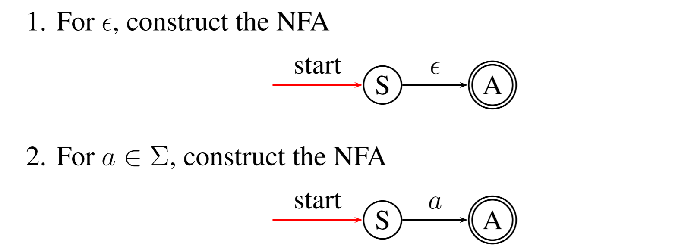

- Inductive step: suppose $N(r)$ and $N(s)$ are NFAs for REs $r$ and $s$. Then

  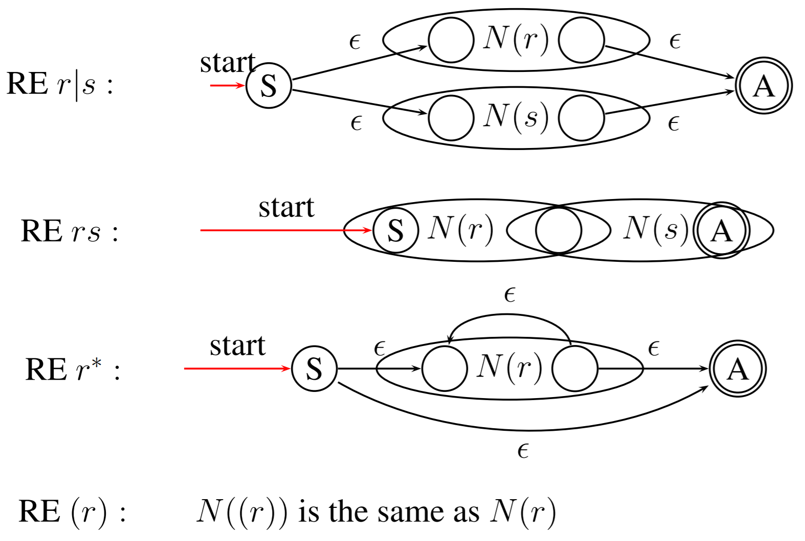

- Example: Regular expression: $(0|10^∗1)^∗10^∗$. NFA:

  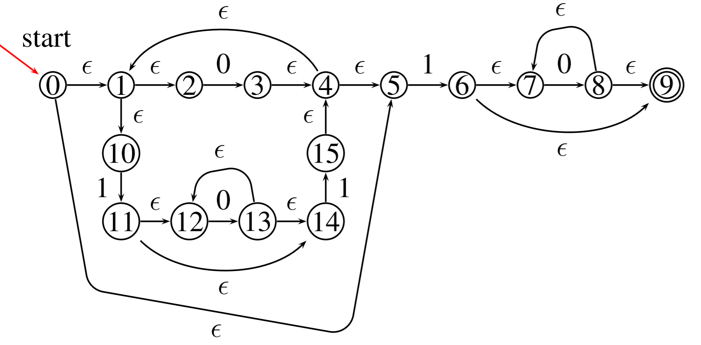

  
