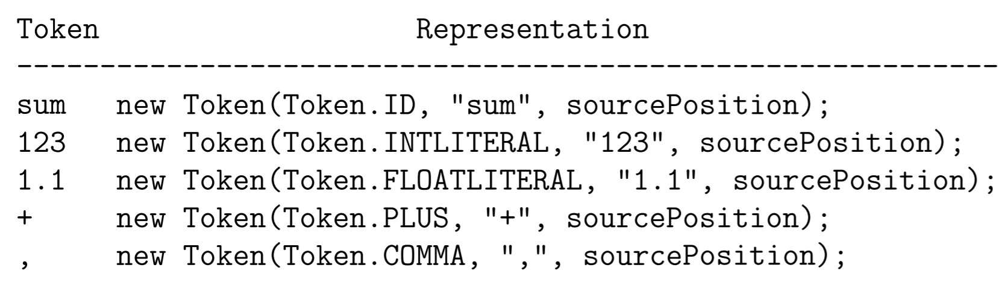

1. What are the tokens of the language? – see Token.java
2. Are keywords reserved? – yes in VC, as in C and Java
3. How to distinguish identifiers and keywords? – see Token.java
3. How to handle the end of file? – return a special Token
3. How to represent the tokens? – see Token.java
3. How to handle whitespace and comments? – throw them away
3. What is the structure of a scanner? – see Scanner.java
3. How to detect and recover from lexical errors?
3. How many characters of lookahead are needed to recognise a token?

## Representing a Token

`sourcePosition` is an instance of the Class `SourcePosition`:

- `charStart`: the beginning column position of the token
- `charFinish`: the ending column position of the token
- `lineStart=lineFinish`: the number of the line where the token is found - token appears only in one line

Every time when the scanner is called to return the next token:

1. `currentChar` is pointing to either the beginning of some whitespace or some comment or a token
2. Scanner always returns the **longest possible match** in the remaining input -> Maximal Munch