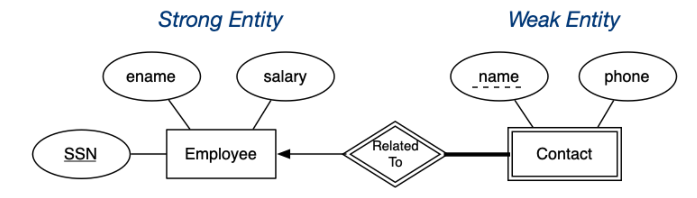
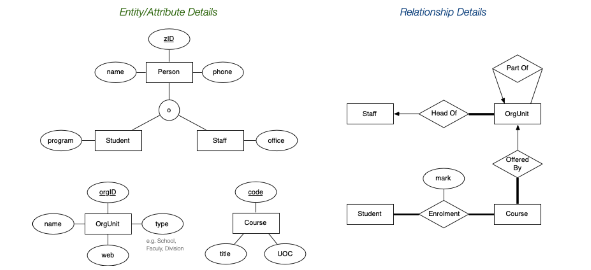

# Data Modelling and ER Data Models

## Data Models

Aims of data modelling:

- describe what **information** is contained in the database (e.g., entities: students, courses, accounts, branches, patients, ...)
- describe **relationships** between data items (e.g., John is enrolled in COMP3311, Tom's account is held at Coogee)
- describe **constraints** on data (e.g., 7-digit IDs, students can enrol in no more than 3 courses per term)

Inputs to data modelling: enterprise to be modelled, user requirements

Outputs from data modelling: (semi) formal description of the database structure

Kinds of data models:

- logical: abstract, conceptual modelling of information, e.g., ER, ODL, UML
- physical: record-based, physical layout of data in storage for implementation, e.g., relational, SQL

Data modelling is a design process - converts requirements into a data model. Design using abstract model; map to physical model:

Most important aspects of a design (data model) focuses on **correctness** (satisfies requirements accurately), **completeness**  (all reqs covered, all assumptions explicit) and **consistency**  (no contradictory statements).

## Entity-Relationship (ER) Model

Collection of inter-related entities - ER has three major modelling constructs:

- attribute: data item describing a property of interest
- entity: collection of attributes describing object of interest
- relationship: association between entities (objects)

### ER Diagrams

ER diagrams are a graphical tool for data modelling. An ER diagram consists of:

- a collection of **entity set** definitions
- a collection of **relationship set** definitions
- **attributes** associated with entity and relationship sets
- connections between entity and relationship sets

#### Entity Sets

An entity set can be viewed as a set of entities with the same set of attributes (extensional) or an abstract description of a class of entities (intensional)

- Key (superkey): any set of attributes whose set of values are distinct over entity set and natural (e.g., name+address+birthday) or artificial (e.g., TFN)
- Candidate key = minimal superkey (no subset is a key)
- Primary key = candidate key chosen by DB designer - used as the identifying mechanism for the entity set

Keys are indicated in ER diagrams by underlining:

#### Relationship Sets

Relationship: an association among several entities. Relationship set: collection of relationships of the same type

- Degree: number of entities involved in the relationship (in ER model, *≥ 2*)

  ​	

- Cardinality: number of entities that a given entity can be associated with via a relationship

  - A binary relationship set *R* between entity sets *A* and *B* may be (assuming  *a ∈ A*,  *b ∈ B*).

    | Relationship       | Cardinality                                                  |
    | ------------------ | ------------------------------------------------------------ |
    | one-to-one (1:1)   | each *a* is associated with at most one *b*; each *b* is associated with at most one *a* |
    | one-to-many (1:m)  | each *a* is associated with zero or more *b*; each *b* is associated with at most one *a* |
    | many-to-one (m:1)  | each *a* is associated with at most one *b*; each *b* is associated with zero or more *a* |
    | many-to-many (m:n) | each *a* is associated with zero or more *b*; each *b* is associated with zero or more *a* |

  

- Participation: whether every entity must be in the relationship. Participation in relationship set *R* by entity set *A* may be:

  - total: every *a ∈ A* participates in *≥1* relationship in *R* (denoted by single lines)

  - partial: only some *a ∈ A* participate in relationships in *R* (denoted by double/thick lines)

    

**Relation Semantics**

In some cases, a relationship needs associated attributes.

#### Weak Entity Sets

Weak entities exist only because of association with strong entities. They have no primary key (or any superkey),
have a subset of attributes that form a discriminator and needs to be considered in conjunction with strong entities. 

The discriminator (or partial key) of a weak entity set is the set of attributes that distinguishes among all the entities of a weak entity set on one particular strong entity. We can can form a primary key by taking a combination of

- the set of values for the discriminator
- the primary key of the associated strong entity

**ER Diagrams**

- weak entities are denoted by double-boxes
- strong/weak entity relationships are denoted by double-diamonds
- discriminators are denoted by dotted underline

#### Subclasses and Inheritance

A subclass of an entity set *A* is a set of entities:

- with all attributes of *A*, plus (usually) it own attributes
- that is involved in all of *A*'s relationships, plus its own

Properties of subclasses:

- If an entity set has multiple subclasses, they may be:

  - disjoint - an entity belongs to at most one subclass
  - overlapping - an entity may belong to several subclasses

  An orthogonal property is the completeness constraint:

  - total - all entities must belong to at least one subclass
  - partial - some entities may belong to no subclass

ER diagrams use the following notation:

- subclass denoted by `ISA` or subset symbol on line
- disjoint/overlapping = the letter `'d'`/`'o'` in a circle
- total/partial completeness = double(thick)/normal line

### ER Diagram Construction

ER model is popular for doing conceptual design as it provides a high-level model relatively easy to understand and a good expressive power to capture many details.

- Basic constructs:  entities,  relationships,  attributes
- Relationship constraints:  total / partial,  n:m / 1:n / 1:1
- Other constructs:  inheritance hierarchies,  weak entities

One commonly used strategy for larger ER diagrams:

- define entity sets separately, showing attributes
- combine entities and relationships on a single diagram (but without showing entity attributes)
- if very large design, may use several linked diagrams

