# Relation Model

## Relational Data Model

Relational data model: a collection of inter-connected relations (or tables) using the relations structuring mechanism. Relations are used to model both entities and relationships.

- Each **relation** (denoted $R,S,T,...$) has:
  - a name  (unique within a given database)
  - a set of attributes  (which can be viewed as column headings)
- Each **attribute** (denoted $A,B,...$ or $a_1,a_2,...$) has:
  - a name  (unique within a given relation)
  - an associated domain  (set of allowed values)
- Consider relation $R$ with attributes $a_1, a_2, ... a_n$ and $D_i$ for the domain:

  - **Relation schema** of $R: R(a_1:D_1, a_2:D_2, ... a_n:D_n)$
  - **Tuple** of $R$ : an element of $D_1 × D_2 × ... × D_n$   (i.e. list of values)
  - **Instance** of $R$ : subset of $D_1 × D_2 × ... × D_n$   (i.e. set of tuples)
  - Note:   tuples: (2,3)  ≠  (3,2)     relation: { (a,b), (c,d) }  =  { (c,d), (a,b) }
- Domains are comprised of atomic values (e.g. integer, string, boolean, date)
- A distinguished value `NULL` belongs to all domains
- A database is a collection of associated relations. Each relation has a key (subset of attributes unique for each tuple)

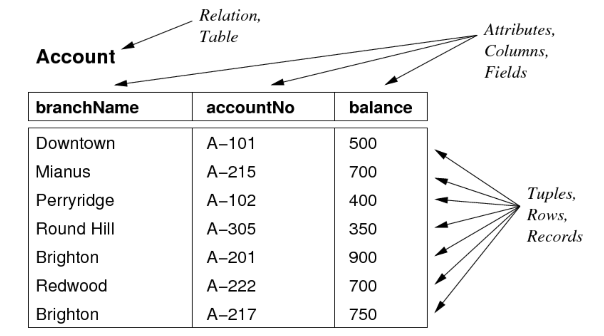

ER Diagram

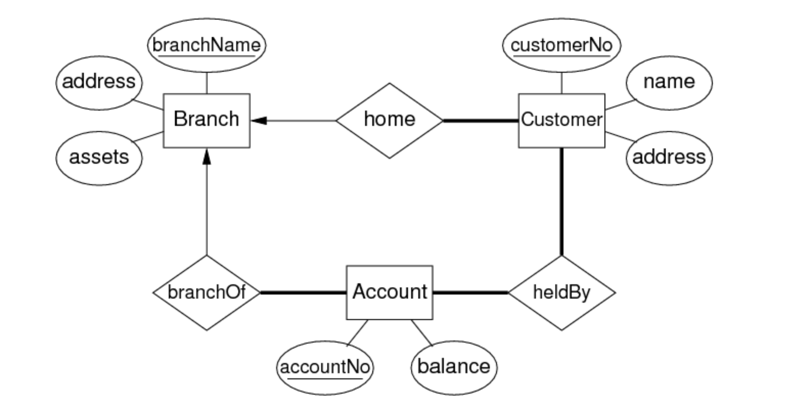

Relational Schema:

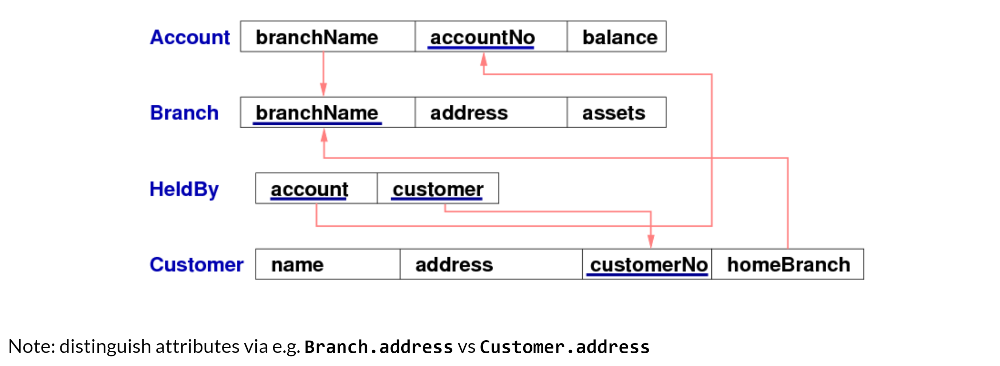

### Integrity Constraints

Constraints are logical statements that do this:

- **domain constraints**: limit the set of values that attributes can take
  - `Employee.age` attribute is typically defined as `integer`
  - better modelled by adding extra constraint `(15<age<66)`
  - Note: `NULL` satisfies all domain constraints  (except (NOT NULL))
- **key constraints**: identify attributes that uniquely identify tuples
  - `Student(id, ...)` is guaranteed unique
  - `Class(...,day,time,location,...)` is unique
- **entity integrity constraints**: require keys to be fully-defined
  - `Class(...,Mon,2pm,Lyre,...)` is well-defined
  - `Class(...,NULL,2pm,Lyre,...)` is not well-defined

### Referential Integrity

**Referential integrity constraints**: require references to other tables to be valid

- describe references between relations (tables)
- are related to notion of a foreign key (FK)

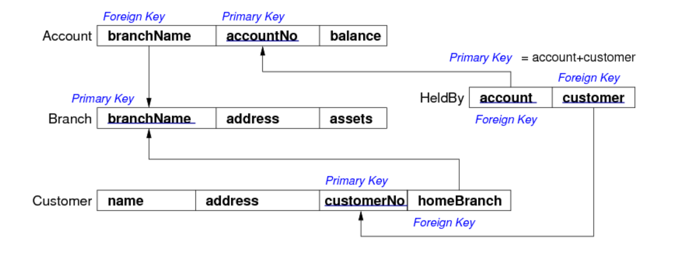

A set of attributes $F$ in relation $R_1$ is a foreign key for $R_2$ if:

- the attributes in $F$ correspond to the primary key of $R_2$
- the value for $F$ in each tuple of $R_1$
  - either occurs as a primary key in $R_2$
  - or is entirely `NULL`

Foreign keys are critical in relational DBs; they provide ...

- the "glue" that links individual relations (tables)
- the way to assemble query answers from multiple tables
- the relational representation of ER relationships

## Relational Databases

A relational database schema is a set of relation schemas ${ R_1,   R_2,  ...  R_n }$ , and a set of integrity constraints.

A relational database instance is a set of relation instances ${ r_1(R_1),   r_2(R_2),  ...  r_n(R_n) }$ where all of the integrity constraints are satisfied. 

One of the important functions of a relational DBMS is to ensure that all data in the database satisfies constraints. Changes to the data fail if they would cause constraint violation.

SQL provides a Data Definition Language (DDL)

```sql
CREATE TABLE TableName (
   attrName_1 domain_1 constraints_1 ,
   attrName_2 domain_2 constraints_2 ,
   ...
   PRIMARY KEY (attr_i, attr_j,...),
   FOREIGN KEY (attr_x, attr_y,...)
               REFERENCES
               OtherTable (attr_m,attr_n,...), ...
);
```

## Mapping ER to Relational Mapping

Correspondences between relational and ER data models:

- attribute(ER) ≅ attribute(Rel), entity(ER) ≅ tuple(Rel)
- entity set(ER) ≅ relation(Rel), relationship(ER) ≅ relation(Rel)

Differences between relational and ER models:

- Rel uses relations to model entities *and* relationships
- Rel has no composite or multi-valued attributes (only atomic)
- Rel has no object-oriented notions (e.g. subclasses, inheritance)

Note that not all aspects of ER cab be represented exactly in a relational schema. Some aspects of relational schemas (e.g. domains) do not appear in ER.

### Entity Mapping

An entity set $E$ with atomic attributes $a_1, a_2, ... a_n$ maps to a relation $R$ with attributes (columns) $a_1, a_2, ... a_n$. Note that the key is preserved in the mapping.

**Strong Entities**

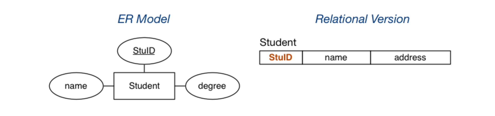

**Weak Entities**

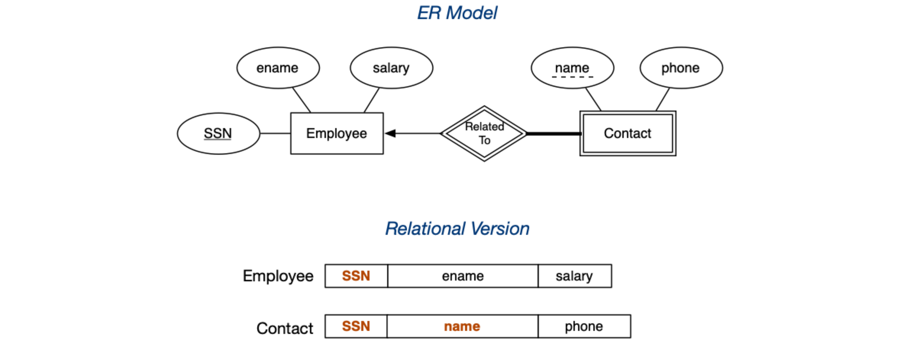

### Mapping N:M Relationships

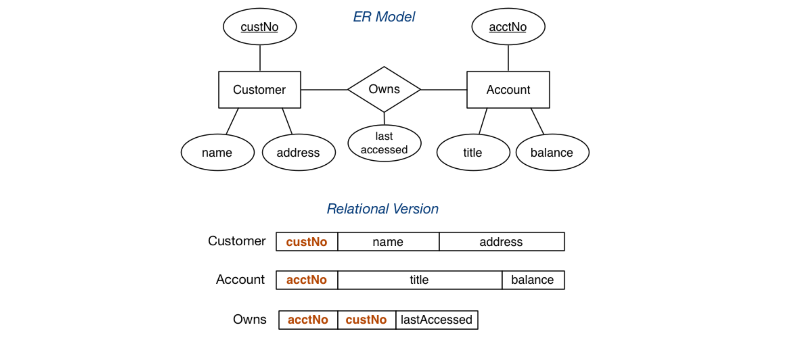

### Mapping 1:N Relationships

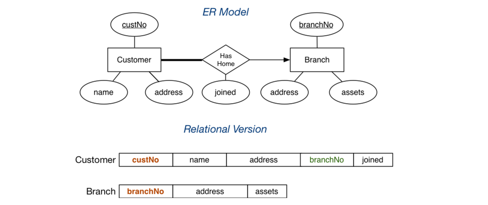

### Mapping 1:1 Relationships

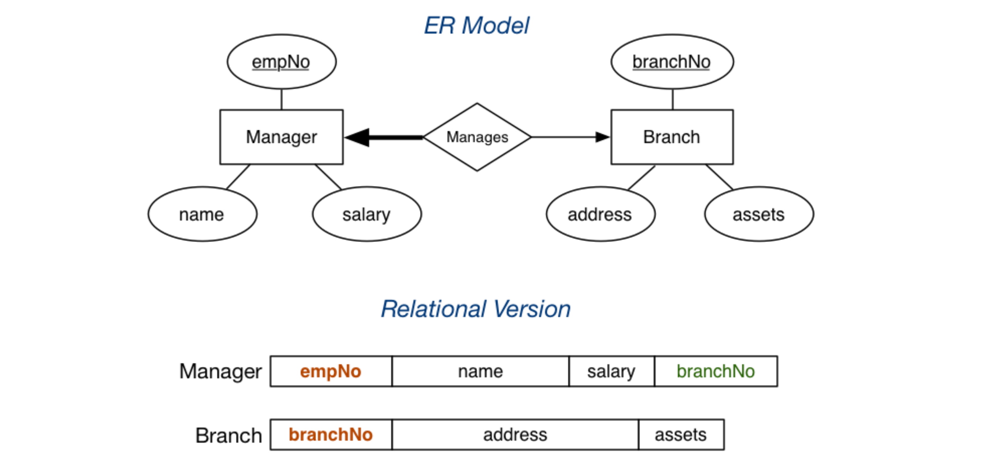

If there is no reason to favour one side of the relationship:

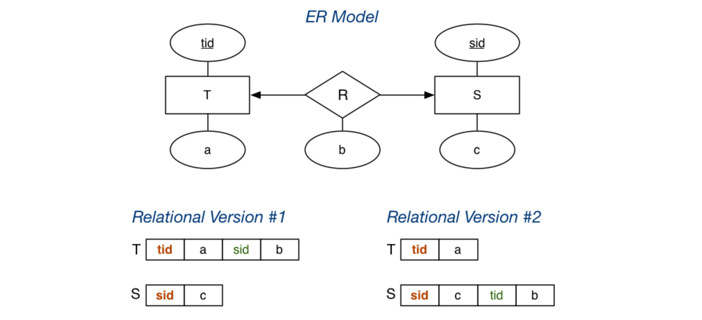

### Mapping n-way Relationships

Relationship mappings above assume binary relationship. If multiple entities are involved:

- n:m generalises naturally to `n:m:p:q` includes the foreign key for each participating entity and any other attributes of the relationship.
- other multiplicities (e.g. 1:n:m) need to be mapped the same as `n:m:p:q` so not quite an accurate mapping of the ER

### Mapping Composite Attributes

Composite attributes are mapped by concatenation or flattening.

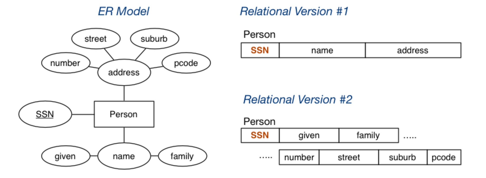

### Mapping Multi-valued Attributes (MVAs)

MVAs are mapped by a new table linking values to their entity.

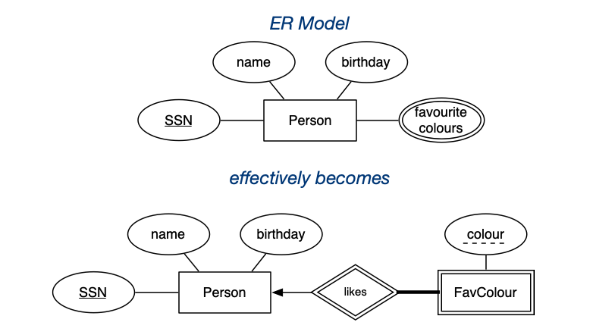

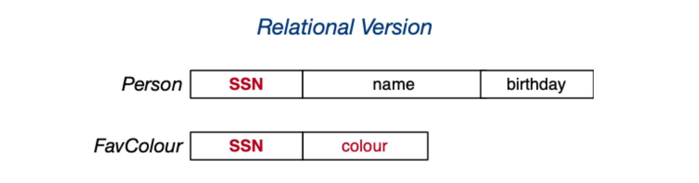

```sql
# the two entities
Person(12345, John, 12-feb-1990, [red,green,blue])
Person(54321, Jane, 25-dec-1990, [green,purple])
# would be represented as
Person(12345, John, 12-feb-1990)
Person(54321, Jane, 25-dec-1990)
FavColour(12345, red)
FavColour(12345, green)
FavColour(12345, blue)
FavColour(54321, green)
FavColour(54321, purple)
```

### Mapping Subclasses

Three different approaches to mapping subclasses to tables:

- ER style: each entity becomes a separate table, containing attributes of subclass + FK to superclass table

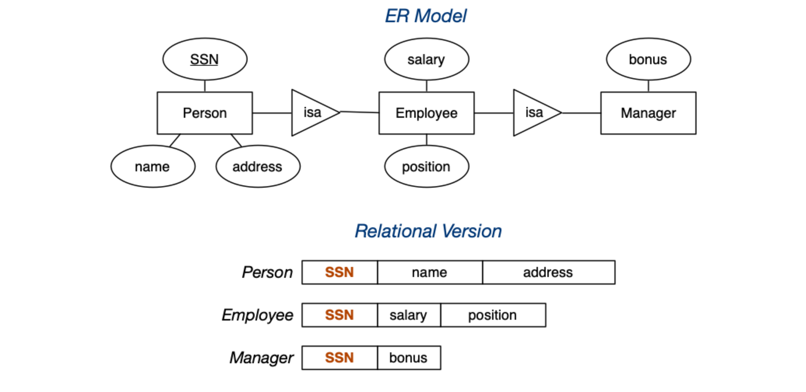

- object-oriented: each entity becomes a separate table, inheriting all attributes from all superclasses

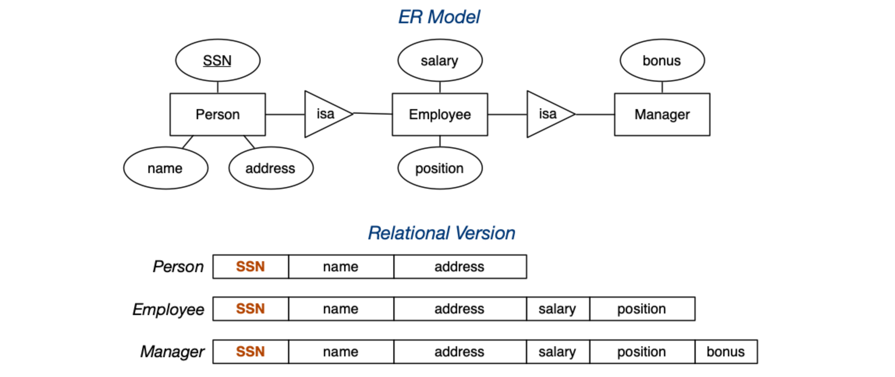

- single table with nulls: whole class hierarchy becomes one table, containing all attributes of all subclasses (null, if unused)

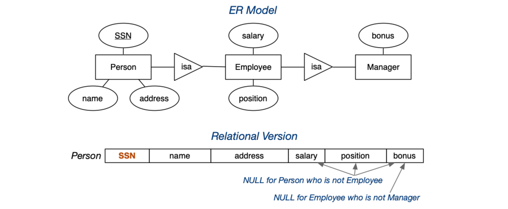
