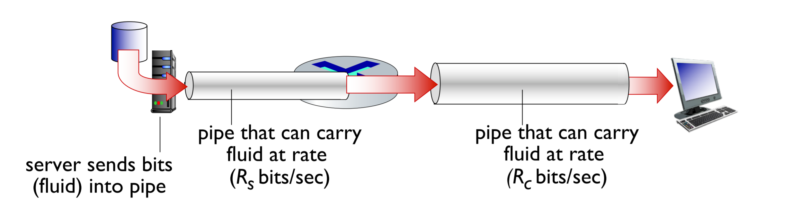

# Introduction to Computer Networks

## The Internet

The internet is a large interconnection of different computer networks and devices. It contains:

- Billions of connected computing devices
  - hosts = end systems, running network apps at Internet’s “edge” 
- **Communication links**
  - fiber, copper, radio, satellite, transmission rate i.e. bandwidth
- **Packet switches**
  - forward packets (chunks of data) i.e. routers, switches
- **Networks** - collection of devices, routers, links i.e. managed by an organization
- **protocols**: control sending, receiving of messages
  - e.g., HTTP (Web), streaming video, Skype, TCP, IP, WiFi, 4G, Ethernet
- **Internet standards**
  - RFC: Request for Comments, IETF: Internet Engineering Task Force

The internet provides **programming interface** to distributed applications

- “hooks” allowing sending/receiving apps to “ connect ” to, use Internet transport service
- provides service options, analogous to postal service

## Protocols

- Protocols define the format, order of messages sent and received among network entities, and actions taken on msg transmission, receipt. (i.e. TCP protocol)

## Network Edges

- Network edge are the hosts (i.e. the client and servers)
- Access networks, physical media: wired, wireless communication links
  - Connecting end systems to edge routers together
  - check transmission rate (bits per second) of access network and if it is shared or dedicated access among users

### Access Networks

**DSL**

Digital Subscriber Line (DSL) uses existing telephone lines connected to a central DSLAM office to transmit data over DSL lines. Data over DSL phone line goes to Internet whilst voice over DSL phone line goes to telephone net. Different data rates for upload and download (ADSL) with rates decreasing the further away you get physically form the DSLAM

- 24-52 Mbps dedicated downstream transmission rate
- 3.5-16 Mbps dedicated upstream transmission rate

Data are transmitted at different frequencies over dedicated lines.

**Cable-based Access**

- HFC: hybrid fiber coax

  - asymmetric: up to 40 Mbps – 1.2 Gbs downstream transmission rate, 30-100 Mbps upstream transmission rate

- Network of cable, fiber attaches homes to ISP router

  - homes *share access network* to cable headend
  - Unlike DSL, which has dedicated access to central office
  - **Fiber to the home/premise/curb** - Fully optical fiber path all the way to the home (or premise or curb) e.g., NBN, Google, Verizon FIOS (~30 Mbps to 1Gbps)

  

**Wireless Access Networks (WAN)**

- Shared wireless access network connects end system to router via base station (i.e. access point)
- **Wireless local area networks (WLANs)** typically within or around building (~100 ft), 802.11b/g/n (WiFi): 11, 54, 450 Mbps transmission rate
- **Wide-area cellular access networks** provided by mobile, cellular network operator (10’s km), 10’s Mbps § 4G cellular networks (5G coming)

**Enterprise Access Networks**

- Networks used by companies, universities, etc. Mix of wired, wireless link technologies, connecting a mix of switches and routers
  - Ethernet: wired access at 100Mbps, 1Gbps, 10Gbps
  - WiFi: wireless access points at 11, 54, 450 Mbps

## Network Core

At the core of networks are a mesh of interconnected routers and switches. There are two forms of switches networks

- **circuit-switching**: used in legacy telephone networks

- **packet-switching**: used in the Internet - hosts break application-layer messages into **packets**
  - forward packets from one router to the next, across links on path from source to destination
  - each packet transmitted at full link capacity

### Circuit Switching

In circuit switching, the end to end resources are allocated to and are **reserved** for the transmission between the source and destination. In circuit switching resources are dedicated and there is no sharing. Circuit switching is not feasable as it:

- Inefficient
  - Dedicated circuit cannot be used or shared in periods of silence
  - Cannot adapt to network dynamics
- Fixed data rate
- Connection state maintenance
  - Requires per communication state to be maintained that is a considerable overhead
  - Not scalable

**Frequency Division Multiplexing (FDM)**

Optical, electromagnetic frequencies divided into (narrow) frequency bands. Each call allocated its own band, can transmit at max rate of that narrow band

**Time Division Multiplexing (TDM)**

Time divided into slots. Each call allocated periodic slot(s), can transmit at maximum rate of (wider) frequency band, but only during its time slot(s)

### Packet Switching

In packet switching, data is sent as chunks of formatted bits (packets). Packets consists of a *header* and *payload*. The header holds instructions for how to handle the packet, and the payload is the data being carried.

Each packet travels independently. No link resources are reserved (i.e. used the entire bandwith unlike circuit switching). Instead, packet switching leverages statistical multiplexing. Statistical multiplexing relies on the assumption that not all flows burst at the same time

#### Statistical Multiplexing

- scenarios where the traffic overloads the capacity with packet switching
  - Transient Overload - overload that lasts only a short time
    - Use a queue to store the overloaded packets into a buffer. Queue buffer absorbs transient bursts 
  - Persistent Overload - constant flow of incoming packets
    - packets will be dropped -> conditional control i.e. throttle

### Internet Structure

- Hosts connect to Internet via access Internet Service Providers (ISPs) - residential, enterprise (company, university, commercial) ISPs
- Access ISPs in turn must be interconnected - so that any two hosts can send packets to each other

  - connecting each access ISP to each other directly doesn’t scale: $O(N^2)$ connections.
  - ISPs connect via Internet Exchange Points (IXPs)
  - Regional networks may connect access ISPs to ISPS
- Content provider networks may run their own network to bring services and content close to end users

## Performance

### Loss and Delay

Delay and loss occur when packets queue in router buffers. This occurs when the packet arrival rate to a link (temporarily) exceeds the output link capacity. There are four sources of packet delay, that form part of the overall formula for the nodal delay.

$$
d_{nodal} = d_{proc} + d_{queue} + d_{trans} + d_{prop}
$$
where

- $d_{proc}$ is the nodal processing
  - Involves checking bit errors, determining output link, typically < ms
- $d_{queue}$ is the queueing delay
  - The time waiting at the output link for transmission
  - $A =$ packet arrival rate ($A$ packets/sec)
  - $L =$ packet length (bits)
  - $R =$ link bandwidth (bits/sec)
  - If $LA/R \simeq 0$ then the average queueing delay is small
  - As $LA/R \to 1$ then the queueing delay becomes large
  - If $LA/R > 1$ then the average queueing delay is infinite
- $d_{trans}$ is the transmission delay
  - $L =$ packet length (bits)
  - $R =$ link bandwidth (bps)
  - Then $d_{trans} = L/R$
- $d_{prop}$ is the propagation delay
  - $D =$ length of physical link
  - $S =$ propagation speed in medium
  - Then $d_{prop} = D/S$

The end to end (E2E) delay between a source and destination is the sum of all $d_{nodal}$ along the path.

### Circuit & Packet Switching E2E Delay

Making the assumption that the network has no packets currently in it ($d_{queue} = 0$), for **circuit switching** we can calculate the end to end delay using a general formula
$$
E2E = t_{setup} + N(d_{prop} + d_{proc}) + d_{trans}
$$

and similarly for **packet switching** we can calculate the end to end delay using a general formula
$$
E2E = t_{setup} + N(d_{proc} + d_{trans} + d_{prop}) + (k - 1)(d_{trans})
$$
where for both

- $t_{setup}$ is the setup time of the network
- $N$ is the number of hops (with $N-1$ intermediate routers)
- $d_{proc}$ is the processing delay
- $d_{prop}$ is the propagation delay
- $d_{trans}$ is the transmission delay
- $k$ is the number of packets to be sent

#### `traceroute`

The program `traceroute` provides delay measurements from a source to a router along a path via the internet towards a destination. For all $i$, `traceroute` will

- Send three packets that will reach router $i$ on path towards destination
- Router $i$ will return packets to sender
- Sender times interval between transmission and reply

#### Packet Loss

The queue preceding the link has a finite capacity. Packets arriving to a full queue will get dropped, and may get retransmitted.

#### Throughput

**Throughput** is the rate that bits get transferred between a sender and received. Between a sender $S$ and receiver $R$ there are various other bottlenecks $B_0, B_1, \dots, B_n$. The end to end throughput between $S$ and $R$ is $\min(S, B_0, B_1, \dots, B_n, R)$. Usually, $S$ or $R$ is the bottleneck.

- instantaneous: rate at given point in time
- average: rate over longer period of time
- bottleneck link: link on end-end path that constrains end-end throughput

