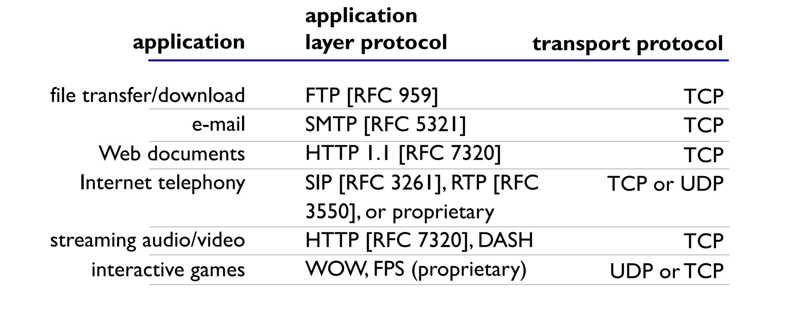

# Application Layer

## Principles of Network Applications

### Client Server Paradigm

**Server**: on host with permanent IP address often in data centres for scaling

**Clients**: contact, communicate with server. May have dynamic IP addresses and do not communicate directly with each other. i.e. HTTP, FTP

### Peer-peer Architecture

- no always-on server
- arbitrary end systems directly communicate
- peers request service from other peers, provide service in return to other peers
  - self scalability – new peers bring new service capacity, as well as new service demands
- peers are intermittently connected and change IP addresses
- complex management i.e.P2P file sharing, blockchain

### Process Communicating

**Process**: program running within a host. Within same host, two processes communicate using inter-process communication (defined by OS) Processes in different hosts communicate by exchanging messages

- client process: process that initiates communication
- server process: process that waits to be contacted
- applications with P2P architectures have client processes & server processes

### Sockets

Sockets allow processes to communicate even if they are on different machines.


To receive messages a process must have an *identifier* which includes both the **IP address** and port numbers associated with the process on the host machine.

### Application Layer Protocol Definition

- types of messages exchanged
  - e.g., request, response
- message syntax
  - what fields in messages & how fields are delineated
- message semantics
  - meaning of information in fields
- rules for when and how processes send and respond to messages
- open protocols
  - defined in RFCs, everyone has access to protocol definition
  - allows for interoperability
  - e.g., HTTP, SMTP, WebRTC
- proprietary protocols: e.g., Skype, Zoom, Teams

### Transport Service Requirements

- data integrity
  - some apps (e.g., file transfer, web transactions) require 100% reliable data transfer
  - other apps (e.g., audio) can tolerate some loss timing
- timing
  - some apps (e.g., Internet telephony, interactive games) require low delay to be “effective”
- throughput
  - some apps (e.g., multimedia) require minimum amount of throughput to be “effective”
  - other apps (“elastic apps”) make use of whatever throughput they get
- security: encryption, data integrity

### Internet Transport Protocol Services

#### TCP Service

- reliable transport between sending and receiving process
- flow control: sender won’t overwhelm receiver
- congestion control: throttle sender when network overloaded
- does not provide: timing, minimum throughput guarantee, security
- connection-oriented: setup required between client and server processes

#### UDP Service

- unreliable data transfer between sending and receiving process
- does not provide: reliability, flow control, congestion control, timing, throughput guarantee, security, or connection setup



#### Securing TCP

- Vanilla TCP and UDP sockets
  - no encryption
  - cleartext passwords sent into socket traverse Internet in cleartext
- Transport Layer Security (TLS)
  - encrypted connections and end point authentication
  - implemented in application layer
  - TLS socket API - clear text sent into socket traverse Internet encrypted

## Web and HTTP

### Uniform Resource Locator (URL)

```
protocol://host-name[:port]/directory-path/resource
```

- `protocol`: http, ftp, https, smtp etc
- `host-name`: DNS name, IP address
- `port`: defaults to protocol’s standard port; e.g. http: 80 https: 443
- `directory-path`: hierarchical, reflecting file system
- `resource`: identifies the desired resource

### Hypertext Transfer Protocol (HTTP)

HTTP is the web’s application layer. It is based on a client/server architecture, uses TCP and is stateless.

- client: browser that requests, receives, (using HTTP protocol) and “displays” Web objects
- server: Web server sends (using HTTP protocol) objects in response to requests

HTTP is all text, which makes the protocol simple to read, although is not the most efficient.

#### HTTP with TCP

- client initiates TCP connection (creates socket) to server, port 80
- server accepts TCP connection from client
- HTTP messages (application-layer protocol messages) exchanged between browser (HTTP client) and Web server (HTTP server)
- TCP connection closed

#### HTTP Request

A HTTP request is made up of a request line and various header lines.

```
GET /index.html HTTP/1.1\r\n
Host: www-net.cs.umass.edu\r\n
User-Agent: Firefox/3.6.10\r\n
Accept: text/html,application/xhtml+xml\r\n 
Accept-Language: en-us,en;q=0.5\r\n 
Accept-Encoding: gzip,deflate\r\n 
Accept-Charset: ISO-8859-1,utf-8;q=0.7\r\n 
Keep-Alive: 115\r\n
Connection: keep-alive\r\n
\r\n
```

`\r\n` are carriage return, line feed character which if it is at the start of line indicates end of header lines

#### HTTP Response

```
HTTP/1.1 200 OK\r\n
Date: Sun, 26 Sep 2010 20:09:20 GMT\r\n 
Server: Apache/2.0.52 (CentOS)\r\n 
Last-Modified: Tue, 30 Oct 2007 17:00:02 GMT\r\n
ETag: "17dc6-a5c-bf716880"\r\n 
Accept-Ranges: bytes\r\n
Content-Length: 2652\r\n
Keep-Alive: timeout=10, max=100\r\n 
Connection: Keep-Alive\r\n
Content-Type: text/html; charset=ISO-8859-1\r\n
\r\n
data data data data data ...
```

A HTTP response is made up of a status line, various header lines and the data requested.

#### HTTP Status Code

- 200 OK - request succeeded, requested object later in this message
- 301 Moved Permanently - requested object moved, new location specified later in this message (in Location: field)
- 400 Bad Request - request msg not understood by server
- 404 Not Found - requested document not found on this serve
- 505 HTTP Version Not Supported

#### User/Server State: Cookies

Web sites and client browser use cookies to maintain some state between transactions. Four components of a cookie includes:

- cookie header line of HTTP response message
- cookie header line in next HTTP request message
- cookie file kept on user’s host, managed by user’s browser
- back-end database at website

Cookies can be used for authorization, shopping carts, recommendations, user session state.

#### Performance of HTTP

- **Page Load Time (PLT)** is an important metric. From click (or typing URL) until user sees page. Key measure of web performance. Improving PLT includes
  - Reduce content size for transfer
    - Smaller images, compression
  - Change HTTP to make better use of available bandwidth
    - Persistent connections and pipelining
  - Change HTTP to avoid repeated transfers of the same content
    - Caching and web-proxies
  - Move content closer to the client
    - CDNs
- Most Web pages have multiple objects i.e HTML file, images, css, scripts. New TCP connection is set up when retrieving those objects. At most one object sent over TCP connection and then the connection is closed. Downloading multiple objects required multiple connections

##### Non-persistent HTTP Response Time

- RTT (**Round-trip Time**): time for a small packet to travel from client to server and back HTTP response time - latency of a network, the time between initiating a network request and receiving a response
  - one RTT to initiate TCP connection (approximate 3-way handshake)
  - one RTT for HTTP request and first few bytes of HTTP response to return
  - file transmission time
  - non-persistent HTTP response time of an object = **2RTT+ file transmission time**

##### HTTP/1.0

- **Non-persistent**: one TCP connection to fetch one web resource
- Fairly poor page load time

##### HTTP/1.1

**Persistent HTTP**

- server **leaves TCP connection open** after sending response. Subsequent HTTP messages between same client/server are sent over the same TCP connection. This allows TCP to learn more accurate RTT estimate and TCP congestion window to increase i.e., leverage previously discovered bandwidth.

**Persistent without pipelining**

- client issues new request only when previous response has been received
- one RTT for each referenced object

**Persistent with pipelining**

- client sends requests as soon as it encounters a referenced object - as little as one RTT for all the referenced objects

### Web Caches (Proxy Servers)

- satisfy client request without involving origin server. User configures browser to point to a Web cache. Browser sends all HTTP requests to cache
  - if object in cache: cache returns object to client
  - else cache requests object from origin server, caches received object, then returns object to client
- Web cache acts as both client and server
  - server for original requesting client
  - client to origin server
- Web caching reduce response time for client request (cache is closer to client), reduce traffic on an institution’ s access link and the internet is dense with caches which enables “poor” content providers to more effectively deliver content.

### Conditional GET

- don’t send object if cache has up-to-date cached version
  - no object transmission delay
  - lower link utilization
- `cache`: specify date of cached copy in HTTP request `If-modified-since`:
- `server`: response contains no object if cached copy is up-to-date: `HTTP/1.0 304 Not Modified`

### Improving HTTP Performance

#### Replication

- Replicate popular Web site across many machines
  - Spreads load on servers
  - Places content closer to clients
  - Helps when content isn’t cacheable
- DNS returns different addresses based on client’s geo-location, server load, etc.

#### CDN

- Caching and replication as a service
- Large-scale distributed storage infrastructure (usually) administered by one entity
- Combination of (pull) caching and (push) replication
  - Pull: Direct result of clients’ requests
  - Push: Expectation of high access rate
- Also do some processing, handle dynamic web pages, transcoding

### HTTPS

- HTTP is insecure as it sends data in plain text. For authentication, password sent using base64
  encoding.
- HTTPS: HTTP over a connection encrypted by Transport Layer Security (TLS). Provides authentication and bidirectional encryption

