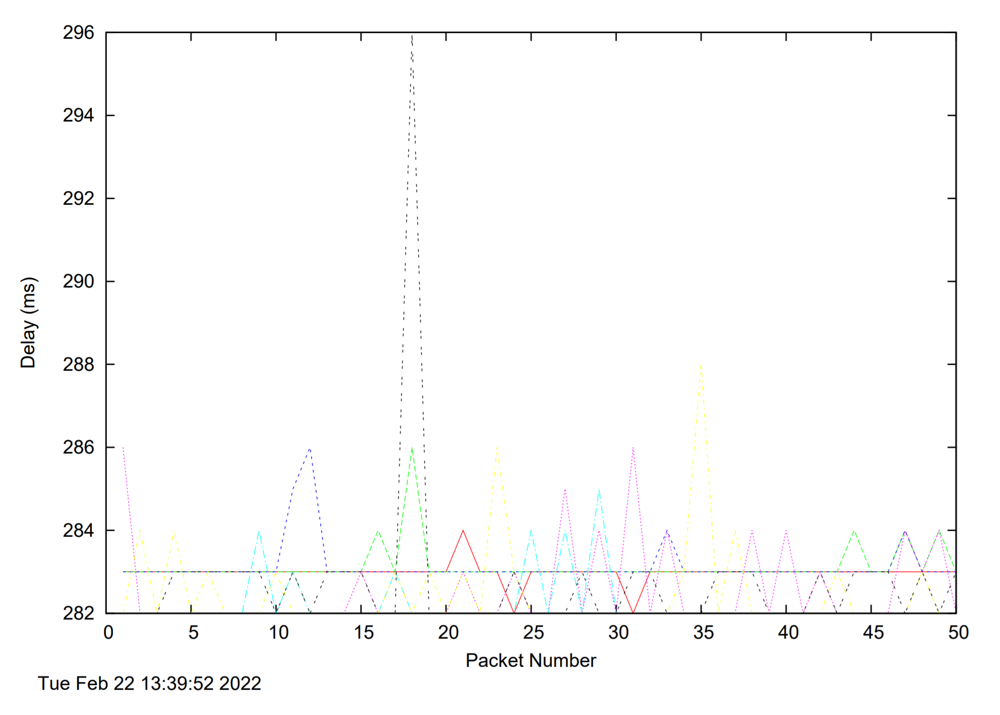

# Lab 1

### Exercise 1: nslookup

1. Which is the IP address of the website www.koala.com.au? In your opinion, what is the reason for having several IP addresses as an output?
   IP Address: `129.94.242.2`. There are several IP address because the website can be hosted on several servers and each server has its own IP address.

2. Find out the name of the IP address 127.0.0.1. What is special about this IP address?
   This IP address is localhost for local computers in the network.

### Exercise 2: Use ping to test host reachability

Are the following hosts reachable from your machine by using ping:

- [www.unsw.edu.au](http://www.unsw.edu.au/) - Yes
- [www.getfittest.com.au](http://www.getfittest.com.au/) - No 
- [www.mit.edu ](http://www.mit.edu/)- Yes
- [www.intel.com.au ](http://www.intel.com.au/)- Yes
- [www.tpg.com.au](http://www.tpg.com.au/) - Yes
- [www.hola.hp ](http://www.hola.hp/)- No
- [www.amazon.com](http://www.amazon.com/) - Yes
- [www.tsinghua.edu.cn ](http://www.tsinghua.edu.cn/)- Yes
- [www.kremlin.ru ](http://www.kremlin.ru/)- No
- 8.8.8.8 - Yes

If you observe that some hosts are not reachable, then can you explain why? Check if the addresses unreachable by the ping command are reachable from the Web browser.

The hosts www.getfittest.com.au and www.hola.hp are unreachable because the domain isn't associated to an active IP address. When inspecting these domains from a web browser, we are unable to access it. However, when using ping on www.kremlin.ru, we are not able to access this host. However, we are able to access it via a web browser. For this host, we are able to access it via the web browser instead. This could mean that ICMP package that ping use to send to the host was dropped somewhere in the network.

### Exercise 3: Use traceroute to understand the network topology

*Note: Include all traceroute outputs in your report.*

1. Run traceroute on your machine to [www.columbia.edu ](http://www.columbia.edu/). How many routers are there between your workstation and [www.columbia.edu ](http://www.columbia.edu/)? How many routers along the path are part of the UNSW network? Between which two routers do packets cross the Pacific Ocean? Hint: compare the round trip times from your machine to the routers using ping.

   ```
   traceroute to www.columbia.edu (128.59.105.24), 30 hops max, 60 byte packets
    1  cserouter1-server.cse.unsw.EDU.AU (129.94.242.251)  0.106 ms  0.083 ms  0.090 ms
    2  129.94.39.17 (129.94.39.17)  1.010 ms  1.041 ms  1.001 ms
    3  ombudnex1-vl-3154.gw.unsw.edu.au (149.171.253.35)  2.292 ms libudnex1-vl-3154.gw.unsw.edu.au (149.171.253.34)  1.659 ms ombudnex1-vl-3154.gw.unsw.edu.au (149.171.253.35)  2.328 ms
    4  libcr1-po-6.gw.unsw.edu.au (149.171.255.201)  1.196 ms ombcr1-po-6.gw.unsw.edu.au (149.171.255.169)  1.429 ms ombcr1-po-5.gw.unsw.edu.au (149.171.255.197)  1.251 ms
    5  unswbr1-te-2-13.gw.unsw.edu.au (149.171.255.105)  1.297 ms unswbr1-te-1-9.gw.unsw.edu.au (149.171.255.101)  1.307 ms unswbr1-te-2-13.gw.unsw.edu.au (149.171.255.105)  1.312 ms
    6  138.44.5.0 (138.44.5.0)  3.829 ms  3.190 ms  3.227 ms
    7  et-1-1-0.pe1.mcqp.nsw.aarnet.net.au (113.197.15.4)  1.903 ms  1.849 ms  1.931 ms
    8  et-0_0_2.bdr1.guam.gum.aarnet.net.au (113.197.14.137)  71.869 ms  71.836 ms  71.808 ms
    9  138.44.228.5 (138.44.228.5)  185.719 ms  185.673 ms  185.690 ms
   10  fourhundredge-0-0-0-2.4079.core2.salt.net.internet2.edu (163.253.1.115)  235.379 ms  235.172 ms  235.934 ms
   11  fourhundredge-0-0-0-0.4079.core2.denv.net.internet2.edu (163.253.1.168)  236.545 ms  236.539 ms fourhundredge-0-0-0-22.4079.core1.salt.net.internet2.edu (163.253.1.30)  237.050 ms
   12  * * *
   13  fourhundredge-0-0-0-0.4079.core1.kans.net.internet2.edu (163.253.1.243)  237.882 ms  234.816 ms *
   14  fourhundredge-0-0-0-3.4079.core2.chic.net.internet2.edu (163.253.1.244)  236.944 ms  235.867 ms  235.866 ms
   15  fourhundredge-0-0-0-3.4079.core2.eqch.net.internet2.edu (163.253.2.19)  237.114 ms  236.141 ms *
   16  fourhundredge-0-0-0-0.4079.core2.clev.net.internet2.edu (163.253.2.16)  237.556 ms  236.633 ms  236.626 ms
   17  buf-9208-I2-CLEV.nysernet.net (199.109.11.33)  237.769 ms  237.700 ms  237.939 ms
   18  syr-55a1-buf-9208.nysernet.net (199.109.7.213)  241.310 ms  241.433 ms  241.389 ms
   19  nyc32-55a1-syr-55a1.nysernet.net (199.109.7.206)  247.007 ms  246.789 ms  246.719 ms
   20  nyc32-9208-nyc32-55a1.nysernet.net (199.109.7.201)  250.039 ms  250.034 ms  246.265 ms
   21  columbia.nyc-9208.nysernet.net (199.109.4.14)  246.283 ms  246.217 ms  246.415 ms
   22  cc-core-1-x-nyser32-gw-1.net.columbia.edu (128.59.255.5)  246.584 ms  246.758 ms  246.739 ms
   23  cc-conc-1-x-cc-core-1.net.columbia.edu (128.59.255.21)  246.691 ms  246.653 ms  246.669 ms
   24  columbiauniversity.org (128.59.105.24)  246.534 ms  246.450 ms  246.495 ms
   ```

   5 routers are part of the unsw network. There are 23 routers from my workstation to the host. Between the routers `et-1-1-0.pe1.mcqp.nsw.aarnet.net.au` and `et-0_0_2.bdr1.guam.gum.aarnet.net.au` is when the packets cross the Pacific Ocean. We can tell as the delay returned from pinging the `et-0_0_2.bdr1.guam.gum.aarnet.net.au` host has substantially increased compared to pinging `et-1-1-0.pe1.mcqp.nsw.aarnet.net.au`.

2. Run traceroute from your machine to the following destinations: (i) [www.ucla.edu ](http://www.ucla.edu/)(ii) [www.u-tokyo.ac.jp ](http://www.u-tokyo.ac.jp/)and (iii) [www.lancaster.ac.uk ](http://www.lancaster.ac.uk/). At which router do the paths from your machine to these three destinations diverge? Find out further details about this router. (HINT: You can find out more about a router by running the Whois command: Whois router-IP-address). Is the number of hops on each path proportional to the physical distance? HINT: You can find out the geographical location of a server using the following tool - http://www.yougetsignal.com/tools/network-location/

   ```
   traceroute to www.ucla.edu (13.226.228.8), 30 hops max, 60 byte packets
    1  cserouter1-server.cse.unsw.EDU.AU (129.94.242.251)  0.085 ms  0.092 ms  0.096 ms
    2  129.94.39.17 (129.94.39.17)  0.933 ms  0.938 ms  0.949 ms
    3  libudnex1-vl-3154.gw.unsw.edu.au (149.171.253.34)  2.417 ms  2.422 ms ombudnex1-vl-3154.gw.unsw.edu.au (149.171.253.35)  9.303 ms
    4  libcr1-po-6.gw.unsw.edu.au (149.171.255.201)  1.228 ms ombcr1-po-5.gw.unsw.edu.au (149.171.255.197)  1.275 ms libcr1-po-6.gw.unsw.edu.au (149.171.255.201)  1.235 ms
    5  unswbr1-te-2-13.gw.unsw.edu.au (149.171.255.105)  1.361 ms  1.392 ms  1.401 ms
    6  138.44.5.0 (138.44.5.0)  2.541 ms  1.771 ms  1.873 ms
    7  et-0-3-0.pe1.alxd.nsw.aarnet.net.au (113.197.15.153)  1.812 ms  1.848 ms  1.784 ms
    8  xe-0-2-4.bdr1.a.sjc.aarnet.net.au (202.158.194.162)  155.965 ms  155.951 ms  155.912 ms
    9  xe-0-0-54-0.a01.snjsca04.us.bb.gin.ntt.net (129.250.192.249)  161.004 ms  161.024 ms  160.975 ms
   10  ae-8.r24.snjsca04.us.bb.gin.ntt.net (129.250.2.49)  157.327 ms *  156.367 ms
   11  ae-3.r25.lsanca07.us.bb.gin.ntt.net (129.250.4.151)  158.821 ms  158.770 ms  158.733 ms
   12  ae-2.r01.lsanca07.us.bb.gin.ntt.net (129.250.4.107)  157.077 ms  157.269 ms  157.253 ms
   13  ae-3.amazon.lsanca07.us.bb.gin.ntt.net (129.250.201.90)  157.370 ms ae-0.amazon.lsanca07.us.bb.gin.ntt.net (128.241.14.146)  156.830 ms ae-2.amazon.lsanca07.us.bb.gin.ntt.net (129.250.201.66)  156.353 ms
   14  * * *
   15  * * *
   16  15.230.186.157 (15.230.186.157)  158.031 ms 15.230.186.151 (15.230.186.151)  157.249 ms 150.222.101.140 (150.222.101
   ```

   ```
   traceroute to www.u-tokyo.ac.jp (210.152.243.234), 30 hops max, 60 byte packets
    1  cserouter1-server.cse.unsw.EDU.AU (129.94.242.251)  0.083 ms  0.077 ms  0.085 ms
    2  129.94.39.17 (129.94.39.17)  0.947 ms  1.014 ms  1.025 ms
    3  ombudnex1-vl-3154.gw.unsw.edu.au (149.171.253.35)  1.687 ms  2.056 ms  2.044 ms
    4  ombcr1-po-6.gw.unsw.edu.au (149.171.255.169)  98.331 ms ombcr1-po-5.gw.unsw.edu.au (149.171.255.197)  98.294 ms libcr1-po-5.gw.unsw.edu.au (149.171.255.165)  1.220 ms
    5  unswbr1-te-2-13.gw.unsw.edu.au (149.171.255.105)  1.309 ms  1.296 ms unswbr1-te-1-9.gw.unsw.edu.au (149.171.255.101)  1.376 ms
    6  138.44.5.0 (138.44.5.0)  1.545 ms  1.429 ms  1.412 ms
    7  et-0-3-0.pe1.bkvl.nsw.aarnet.net.au (113.197.15.147)  1.917 ms  1.875 ms  2.025 ms
    8  ge-4_0_0.bb1.a.pao.aarnet.net.au (202.158.194.177)  155.838 ms  155.826 ms  155.768 ms
    9  paloalto0.iij.net (198.32.176.24)  156.515 ms  156.649 ms  156.596 ms
   10  osk011bb01.IIJ.Net (58.138.84.229)  266.938 ms osk004bb01.IIJ.Net (58.138.88.189)  266.697 ms osk011bb01.IIJ.Net (58.138.84.229)  266.899 ms
   11  osk004ip57.IIJ.Net (58.138.81.74)  286.127 ms osk004ip57.IIJ.Net (58.138.106.162)  286.136 ms osk004ip57.IIJ.Net (58.138.106.198)  279.078 ms
   12  210.130.135.130 (210.130.135.130)  268.292 ms  267.489 ms  282.925 ms
   13  124.83.228.58 (124.83.228.58)  277.609 ms  267.567 ms  278.585 ms
   14  124.83.252.178 (124.83.252.178)  274.574 ms  272.815 ms  287.811 ms
   15  158.205.134.26 (158.205.134.26)  292.660 ms  283.987 ms  282.849 ms
   16  * * *
   17  * * *
   18  * * *
   19  * * *
   20  * * *
   21  * * *
   22  * * *
   23  * * *
   24  * * *
   25  * * *
   26  * * *
   27  * * *
   28  * * *
   29  * * *
   30  * * *
   ```

   ```
   traceroute to www.lancaster.ac.uk (148.88.65.80), 30 hops max, 60 byte packets
    1  cserouter1-server.cse.unsw.EDU.AU (129.94.242.251)  0.083 ms  0.080 ms  0.071 ms
    2  129.94.39.17 (129.94.39.17)  0.904 ms  0.960 ms  0.919 ms
    3  ombudnex1-vl-3154.gw.unsw.edu.au (149.171.253.35)  4.388 ms  4.328 ms libudnex1-vl-3154.gw.unsw.edu.au (149.171.253.34)  1.666 ms
    4  ombcr1-po-5.gw.unsw.edu.au (149.171.255.197)  1.148 ms libcr1-po-5.gw.unsw.edu.au (149.171.255.165)  1.218 ms ombcr1-po-6.gw.unsw.edu.au (149.171.255.169)  1.407 ms
    5  unswbr1-te-1-9.gw.unsw.edu.au (149.171.255.101)  1.307 ms  1.339 ms  1.298 ms
    6  138.44.5.0 (138.44.5.0)  1.534 ms  1.520 ms  1.483 ms
    7  et-2-0-5.bdr1.sing.sin.aarnet.net.au (113.197.15.233)  93.039 ms  92.733 ms  93.028 ms
    8  138.44.226.7 (138.44.226.7)  264.309 ms  264.290 ms  264.260 ms
    9  janet-gw.mx1.lon.uk.geant.net (62.40.124.198)  264.487 ms  264.429 ms  264.368 ms
   10  ae29.londpg-sbr2.ja.net (146.97.33.2)  264.727 ms  264.961 ms  264.924 ms
   11  ae31.erdiss-sbr2.ja.net (146.97.33.22)  268.736 ms  268.742 ms  268.526 ms
   12  ae29.manckh-sbr2.ja.net (146.97.33.42)  270.399 ms  270.452 ms  270.455 ms
   13  ae25.manckh-ban1.ja.net (146.97.35.50)  270.470 ms  270.511 ms  270.514 ms
   14  lancaster-uni.ja.net (146.97.40.178)  286.104 ms  285.728 ms  285.690 ms
   15  * * *
   16  * * *
   17  * * *
   18  * * *
   19  * * *
   20  * * *
   21  * * *
   22  * * *
   23  * * *
   24  * * *
   25  * * *
   26  * * *
   27  * * *
   28  * * *
   29  * * *
   30  * * *
   ```

   

3. Several servers distributed around the world provide a web interface from which you can perform a traceroute to any other host on the Internet. Here are two examples: (i) [http://www.speedtest.com.sg/tr.php ](http://www.speedtest.com.sg/tr.php)and (ii) [https://www.telstra.net/cgi-bin/trace ](https://www.telstra.net/cgi-bin/trace). Run traceroute from both these servers towards your machine and in the reverse direction (i.e.from your machine to these servers - do not include the full URL while doing this, e.g. [www.speedtest.com.sg ](http://www.speedtest.com.sg/)). You may also try other traceroute servers from the list at [www.traceroute.org ](http://www.traceroute.org/). What are the IP addresses of the two servers that you have chosen? Does the reverse path go through the same routers as the forward path? If you observe common routers between the forward and the reverse path, do you also observe the same IP addresses? Why or why not?

IMPORTANT: Feel free to terminate traceroute if you start receiving output with multiple " * * * " responses or if you can confirm that the traceroute messages have reached the destination network.


www.tu-berlin.de_delay

