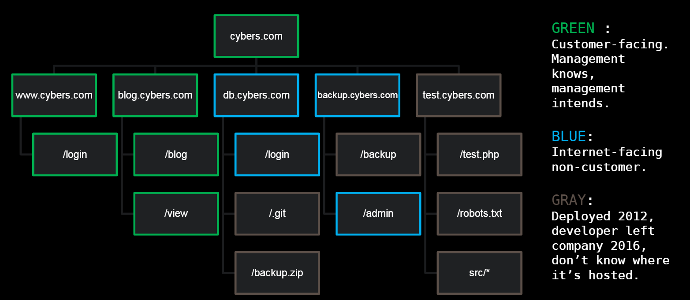

# Reconnaissance

## HTTP

- Web traffic is (mostly) done via HTTP.
  - Resources referred to by URI. A Uniform Resource Identifier (URI) is an identifier of a specific resource
  - Not necessarily remote
  - Not necessarily “web”
- HTML/JS can allow users to send various HTTP requests
- Headers indicate various options to the web server
  - Cookies indicate session state
  - Logout vs real logout

## Web Server

```bash
python3 -m http.server
```

## Same Origin Policy

- An Origin is a resource identified by a URI
- A “page” (what you see) can have multiple origins
  - Resources loaded from elsewhere•
  - iframes
- Restrictions apply:
  - Script from Origin 1 can generally send data to Origin 2 but cannot see the response
  - Script from Origin 1 cannot access data from Origin 2

## Request Automation

```python
import requests

for i in range(0, 5):
    r = requests.get("http://localhost:8000/...")
    print(r.text)
```

## Tools

- Python (requests, http.server)
- Burpsuite, or an equivalent proxy, e.g. OWASP Zap, Fiddler
- Browser’s developer tools
- JavaScript

## Recon

- First step of a good attack methodology in any context, identify:
  - A complete map of the target
  - Any target dependencies
  - Security controls (e.g. AV, WAF)
  - Accidentally enabled functionality (e.g. test pages)
  - Areas of likely weakness
  - Areas of poor maintenance
  - Start thinking about how to attack a target



### DNS Recon

#### Brute Force

- alt dns - https://github.com/infosec-au/altdns

  ```bash
  python3 altdns -i unsw_domain.txt -w words.txt -o output_list.txt
  ```

  - Then pipe output_list.txt through a DNS resolver
  - Consider rate limiting

#### Public Repositories

- https://dnsdumpster.com/

#### Certificates

- View certificates of websites (access in the lock icon next to URL)
- crt.sh
- nslookup

### Web Recon

- Brute Force - dirb
- fingerprints (i.e. Wappalyzer)
- Historical snapshots - wayback machine