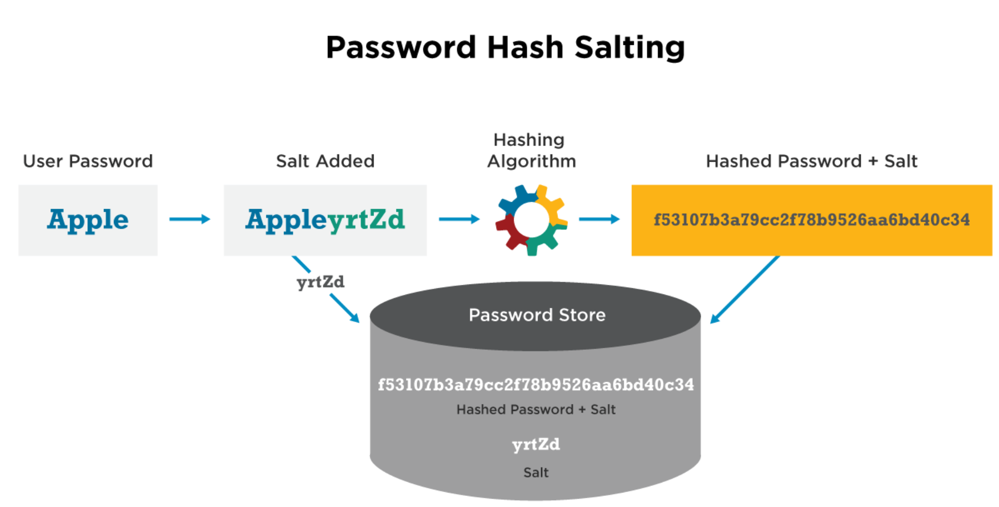

# Authentication & Authorisation

## Identity

- Digital Identity
   - information on an entity used by computer systems to represent an external agent
   - set of attributes related to an entity

### Identity Attacks

- Social Engineering (i.e. phone scams, stalking details online such as LinkedIn email, birth dates)
- Credential Stealing
- Compromised/Weak passwords
- Man in the middle attacks
  - sending text plain password over HTTP network
    - prevent MitM attacks using HTTPS protocol - HTTPS connection encrypts data from both ends however it does not mean that it 100% prevent attacks

### Identity vs Login

- Federated Identity Management (FIdM) ≠ SSO
- SSO is Single Sign On which means you have on login to multiple services
- Federated Identity – One identity to many service (i.e. myGov)

## Authentication
- Authentication → Session Management → Access Control(Authorization)
  - Authentication - Is the user who they claim to be?
  - Session Management - Is it still that user?
  - Access Control - Is the user allowed to access this thing?

### Web Authentication

- default credentials (i.e. Router login credentials)
- Brute Force
  - Attempt logins with common passwords
  - Try known email + password combinations from previous breaches
  - login rate limiting or limit number of attempts
    - CAPTCHA
    - Lockouts (i.e. iPhone Face id Lockout)
  - Proactive Monitoring - continuously searching for signs that indicate a problem is about to happen
    - i.e. identifying if the same account is being accessed from multiple country
  - User Communication
    - communicate between the user and admin/monitoring person to see if they have been accessing their account or not
    - confirm with the user if the account has been accessed by them
  - **Burp Suite Brute Force Login**
    - Intercept on to capture login request then send it to Intruder
    - Intruder allows you to identify the parameter that you want to attack (i.e. attack the password input on a website to brute force login)
    - However, secure websites have rate limiting logins or CAPTCHA to prevent brute force attacks
- Information Disclosure
  - Don't give too much information for error message i.e. "Invalid username or password" rather than "Invalid username"
- Error Handling
  - ensure that error handling/stack traces message do not give too much information on the tech stack (i.e. version of the app, webserver, database, etc.)
- Authentication can be delegated (e.g. SSO, Oauth, JWT, 2FA)

### Good Authentication

- Good password policy

  

- Rate limiting

- Not allowing default usernames/passwords

- Not using weak hashing algorithms

- Multi Factor Authentication

- Application registration/forgot password logic

### Transport Layer Security (TLS)

- MitM attack: forces a victim's browser into communicating with an adversary in plain-text over HTTP, and the adversary proxies the modified content from an HTTPS server
  - Wifi Pineapple Nano - Pen testing device for man-in-the-middle attacks. Used to de-authenticate and spoof a legitimate network, forcing employees to connect to this fake network. Once connected, the attacker can target the local device on the fake network, to exploit it and gain access to its data. This device can be set up as a rogue wireless access point within minutes, ready for attack.

### Hashing and Encryption

- Hash algorithm is based on **one-way function**. It is practically impossible to revert the result back
- Encryption is based on plain text and a **key** and suppose to have a **decryption algorithm**. 

  - Symmetric
  - Asymmetric

#### Password Salt

- A cryptographic **salt** is made up of random bits added to each **password** instance before its **hashing**. **Salts** create unique **passwords** even in the instance of two users choosing the same **passwords**. **Salts** help us mitigate **hash** table attacks by forcing attackers to re-compute them using the **salts** for each user.

  - Password salts prevent attackers from amortizing the cost of a brute force attack across sites

    

#### Initialization Vector

- **Initialization vector** (**IV**) is an input to a cryptographic primitive being used to provide the initial state. The **IV** is typically required to be random or pseudorandom, but sometimes an **IV** only needs to be unpredictable or unique.

  

- **Salt is concatenated to the plaintext before hashing while an initialization vector is used to initialize symmetric encryption before using it to cipher a plaintext.**

#### Hash Functions

- a function that takes an input of any size and gives an output of a fixed size -> SHA1: 160bit output, SHA256: 256bit output, MD5: 128bit output

##### Attacks on Hash Functions

**Rainbow Table**: a database containing common passwords and their hashes

- Bruteforce Attack

  - trying every possible combination of characters against the hashed password
  - time taken is exponential based on password length and characters

- Dictionary Attacks
  
  - Attempting to find the original plaintext by hashing common passwords
  - Compute the hashes for many inputs and store in a database
  - To reverse a given hash, look it up in the database
  - Disadvantages:
    - Large storage size
    - Dictionary will likely only store common passwords or dictionary words (i.e. ineffective for reversing salted hashes)
  
- Rainbow Table Attack
  - https://www.geeksforgeeks.org/understanding-rainbow-table-attack/ 

  - First define a reduction function R - a function with the domain and codomain of the hash function swapped

  - i.e. **maps a hash to a “password”**

    **Generating a Rainbow Table**

    - Start with a password, and then repeatedly apply H and R:

      ​	

    - Repeat for many passwords

    - Store only the first and last values in a database 

    **Using a Rainbow Table**

    - Given a hash to reverse, repeatedly apply R and H
    - For every output of R, check if the output exists in the table
    - If so, reconstruct that chain and the input of that hash will likely exist in that chain

  - Advantages:

    - Less storage than dictionary
    - Can reverse salted hashes

  - Disadvantages:

    - More computationally expensive
    - How to come up with reduction function?

## HTTP vs HTTPs

### HTTP

- Client opens a TCP connection to the server -> bidirectional communication stream
  - requests and responses are sent over this channel -> in PLAINTEXT
    - MitM attacks can read or modify bytes (i.e. router routing the packet, attacker on the client's local network)

### HTTPs

- Transport Layer Security (TLS or knows as Secure Socket Layer (SSL)) implemented on top of TCP
- client and server now have an encrypted communication stream
- During the TLS handshake, the server sends a certificate indicating that it has control of the intended domain. The browser (client) the verifies the certificate

#### Certificate Authorities (CA)

- CA verifies that a server has control of a domain. The CA issues the server a public key certificate and corresponding private key.

- CAs themselves may be signed by another CA, resulting in a “certificate chain” with the root certificate authority at the top
  - If the browser **trusts the root certificate authority** of the certificate and the certificate's signature have been cryptographically correct, then we can **trust the entire chain** of CA.
  - Operating Systems come loaded with a set of trusted root CAs
  
- MitM Attacks - a malicious attacker can sit between client/server as a proxy however, it will not be able to present a certificate signed by a trusted CA.

  

## Session Management

### Cookies

- Cookies carry information about the user, account or activity and helps identify the server details about the user

  - i.e. google.com redirects to google.com.au as cookies store this information
    - a browser comes with preconfigured information -> used in preflight request

- The **SessionID** property is used to uniquely identify a browser with session data on the server

- stores session information

  - **document.cookie**

  

### Attacking Sessions

- Session Creation
  - How are sessions created? Can I fake my own session?
  - Can I attack the PRNG, and generate my own cookie?
  - Can I “fixate” a session?
- Session Handling / Transfer / Usage
  - Can I steal the cookie through XSS (No “HttpOnly” flag?)
  - Can I steal the cookie through redirecting to HTTPS.
  - What information does the site trust the user to provide?
- Session Cleanup
  - What happens when I click “log out”?
  - Under what conditions is a session actually destroyed? What happens then?
  - Do sessions time out correctly?

## Access Control

- Horizontal access control is making sure one user can’t access a different user’s data without permission
  - http://bank.com/statement.php?user_id=12078
- Vertical access control is making sure only administrative users can access administrative content. Attacking vertical access control is commonly known as privilege escalation
  - http://bank.com/admin.php

### Attacking Access Control

- bypass entire - check subdomains i.e. api.example.com, dev.example.com
- robots.txt
- stack traces information

### OAuth

- OAuth is an open standard for access delegation, commonly used as a way for Internet users to grant websites or applications access to their information on other websites but without giving them the passwords
  - can allow company not to worry about storing password and managing security. However, if the provider of the OAuth access is hacked, so too is the web application
- 4 Types of Oauth grants:
  - Authorization Grant
  - Implicit Grant
  - Resource Owner Credentials
  - Client Credentials
- https://oauth.tools/

### Security Assertion Markup Language (SAML) / Single Sign On (SSO)

- XML-based
- exchanging user identity between identity provider and a service provider

