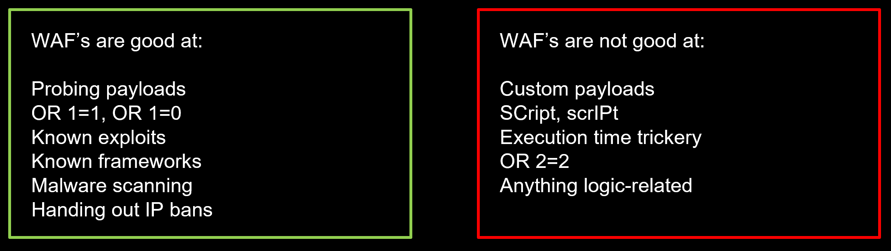

# Server Side Attacks

## SQLi

- `' UNION SELECT TABLE_NAME, TABLE_SCHEMA from information_schema.tables`
- `' UNION SELECT TABLE_NAME, COLUMN_NAME from information_schema.columns`

- `or 1=1`
  - `SELECT * FROM PRODUCTS WHERE PRODUCTNAME=‘x’ OR ‘1’=‘1’;`
- comments
  - `SELECT * FROM USERS WHERE name=‘x’ -- ’ LIMIT 1;`
- Wildcards
  - `SELECT * FROM users LIKE “admi%”;`
  - `SELECT TOP 10 * FROM Article WHERE Content LIKE '%_[^!_%/%a?F%_D)_(F%)_%([)({}%){()}£$&N%_)$*£()$*R"_)][%](%[x])%a][$*"£$-9]_%’ `
- Out of Band
  - when an attacker is unable to use the same channel to launch the attack and gather results because you might only have blind injection or they might have an outbound WAF.
- Subquery
  - Select user,password from users where username=‘injectionpoint’ 
  - `union select (select permissions from users limit 1), “asdf”;`
- SQL Functions
  - CHR(), CAST(), CONCAT(), XPCMDSHELL()
  - How can these be leveraged
    - Bypass WAF/Filters
    - Extract more content
    - Bypass typing constraints
- Fingerprinting
  - Identifying what the DBMS or version
  - `@@Version vs Version() vs sqlite_version()`

### Blind SQLi

- Blind SQLi is when you can’t directly exfiltrate data by selecting it into a column
  - You can make the database do something depending on if a condition is true
  - “Is the first letter of the password ‘a’? If yes, sleep for 5 seconds, otherwise, do nothing”
  - From this exploit primitive, build a binary search tree.
  - Dump data from the DB via error codes / time delays alone

### SQLi in API

- Generally API have little if not no protection against SQLi `http://application/apiv3/Users/?req_id=1' AND '1' LIKE '1`

### Preventing SQLi

- SQL Injection comes from the confusion of code and data. Parameterised queries force the SQL engine to cleanly segregate code and data.
- Don't construct SQL query using string concatenation `c.execute("SELECT * FROM USERS WHERE USERNAME = '" + username + "' AND PASSWORD = '" + password + "'");` Instead, used parameterised queries `c.execute("SELECT * FROM USERS WHERE USERNAME = ? AND PASSWORD = ?", (username, password));`
- Other methods to prevent SQLi:

  - SQL Escaping: Replace control characters in user input with safe substitutes
  - Stored Procedures
  - If nothing else can be used, only allow a whitelist of characters in the user input
- Application Layer
  - Handle your error messages gracefully
  - Filter user input
  - Use parameterised queries where possible
- Database Layer
  - Minimise the privilege level of your database user
  - Prevent arbitrary connections to your database 

## NoSQLi


## Path Traversal

- Don’t trust a path provided by the user, it can lead to local file inclusion. Resolve the final path of the file and ensure it is in a safe directory.

  - Local file inclusion vulnerable

    ```python
    open(userpath, "r")
    ```

  - Prevention

    ```python
    UPLOAD_DIR = "/app/uploads/"
    if os.path.dirname(os.realpath(os.path.join(UPLOAD_DIR, userpath)) != UPLOAD_DIR:
    	# DIRECTORY TRAVERSAL DETECTED!
    	exit()
    ```

## Command Injection

- CMD Injection Vulnerable

  ```python
  os.system("ping " + host)
  ```

- Prevention

  ```pyt
  subprocess.call(["ping", host])
  ```

## Server Side Include

- **Server Side Includes** (SSI) are codes you can add to your HTML document that tell the web **server** to **include** other content with the document being served.


## CSV Injection

Formulas can be used for multiple kinds of malicious payloads, for example:

- Create fake hyperlinks.
- Use Excel DDE (Dynamic Data Exchange) to execute commands (Excel only).


### Remediations

- Application exporting CSV files must sanitise the output! The following characters are known to be dangerous`= + - @`
  - Cells beginning with these characters should have a single quote character (') inserted at the beginning. This forces Excel to interpret the cell as text.
  - Make sure commas are removed from data. Commas can be used to start a new cell, which then evades the single quote remediation above.
  - If a different delimiter other than commas is used, modify the remediation accordingly.

## Insecure Direct Object Reference(IDOR)

- vulnerability that arises when an application uses user-supplied input to access objects directly - because the access controls of a specific functionality or an object are not defined properly in an application.
  - Read access/Data Exfiltration
  - Editing records
  - Privilege escalation 
  - Account takeover

## External XML Entities Attack (XXE)

- XML can use external entities. Like files, or system commands.

  - `<!ENTITY xxe SYSTEM "file:///etc/passwd" >]>`

- Parser often has the ability to read any file on the server. We can exploit this by asking the parser to include a local file, This is a form of LFI (Local File Inclusion)

  

### XXE Variants

```xml
<!ENTITY xxe SYSTEM "file:///etc/passwd" >]><foo>&xxe;</foo>
<!ENTITY xxe SYSTEM "file:///c:/boot.ini" >]><foo>&xxe;</foo>
<!ENTITY xxe SYSTEM "http://www.attacker.com/text.txt" >]><foo>&xxe;</foo>
<!ENTITY xxe SYSTEM "expect://id" >]> (rare)
```

### XXE Code Execution

- PHP has a module called `expect` that lets you run a command as if it was a file by using the expect protocol. **If installed** you can thus use XXE to get code execution 

  

## Server Side Request Forgery (SSRF)

- Tricking web application to make request to internal system behalf of attacker. Typically works on URL based input by users. E.g. Image import function from URL.
  - Possible to use other URLs, e.g. **file://, phar://, gopher://, data://**and **dict://**
- You can:
  - Enumerate internal/external services.
  - Exfiltrate data.
  - Abuse API calls.
  - Invoke Cloud Services APIs.

### Uniform Resource Identifier (URI)

- Used to specify a resource


### Remediations

- Whitelisting domains.
- Disable access to internal domains – Firewall/Network policies.
- Network level restrictions.
- Be aware that URL parsing is hard and could easily bypassed. So, never use it as the only defense.
- Block access to cloud metadata services (eg: 169.254.169.254 for AWS)

## Web Application Firewall

- protect web applications by filtering and monitoring HTTP traffic between a web application and the Internet. It typically protects web applications from attacks such as cross-site forgery, cross-site-scripting (XSS), file inclusion, and SQL injection.



## Stateless Session Management

- Tokens instead of cookies used for access control.
- Only works after successful authentication.
- Non-centralised access control checks.
- Very common among micro service architecture.
- Great to have common backend for web and mobile apps


### Logout


### Protecting JWT Tokens

- Always use HTTPS for JWT tokens.
- Reject JWT token with algorithms set to ‘None’.
- Ensure validation of signature is done properly.
- Ensure the token has low lifetime and not stored for long in memory.
- Always store refresh tokens in cookie jar secure with httpOnly flag.

## Insecure Deserialisation

- vulnerability in which an untrusted or unknown data is used to either inflict a denial of service attack (DoS attack), execute code, bypass authentication or further abuse the logic behind an application. (i.e. deserialisation of a insecure Java object)

### Remediations

- Never trust user input data during deserialisation.
- Logging deserialisation failures. Monitoring deserialisation, alert if application try to deserialise constantly.
- Programming languages offer a native capability for serialising objects which can be prone to deserialising attack.
- Use pure data format like JSON or XML.
- Integrate checksums or digital signatures to ensure trusted sources.
