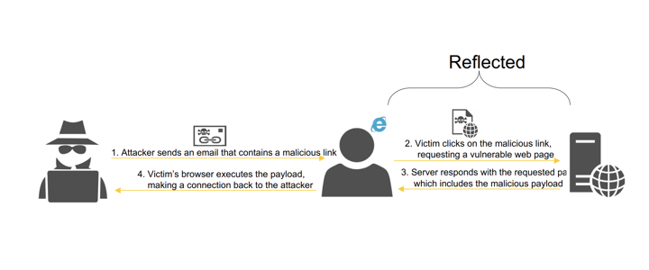

# Client-Side Attacks

- cookies and storage (local and session) manipulation
- Browser protection is minimal
  - Same Origin Policy
  - Same-site restrictions

## Origin and Site

### Origin

Two URIs are part of the same origin, if they have the same **scheme, host and port**.


- Same Origin
  - `foo.example.org` and `foo.example.org/mypage`
- Cross Origin
  - `foo.github.io` and `bar.github.io`
  - `bar.example.org` and `example.org`

#### Cross Origin

All cross-origin calls must return with Access-Control-* headers:

- Access-Control-Allow-Origin: List of origins allowed
- Access-Control-Allow-Methods: List of methods allowed
- Access-Control-Allow-Headers: List of non-standard headers
- Access-Control-Max-Age: Value in secs to cache preflight req

#### CORS Headers

Browsers send request with OPTIONS method set to receive CORS headers from backend.

### Site

A domain formed by the most specific public suffix, along with the domain label immediately preceding it, if any.


#### Same Site vs Cross Site


### Cross Origin and Same Site

- All cross-site requests are necessarily cross-origin.
- Not all cross-origin requests are cross-site.


### Client-Side Impacts

- Cookies follows same-site rules not same-origin.
- Security attributes are aligned to same-site rules.

**Security Attributes**

- HttpOnly - allow/deny JS accessing cookie
- Secure - set/send cookie through TLS (https)
- SameSite - send/block cookie to cross-site

**SameSite attribute values**

- Strict - Most defensive option 
  - `b.com` -> `a.com` (No cookie for a.com sent) 
- Lax - Most flexible option 
  - `b.com` -> `a.com` (Cookie sent if it is a GET request, not a JS request and is a top level navigation - a hyperlink) 
- None - Cookies sent all the time

While SameSite provides protection it cannot fully prevent attacks like CSRF.

- Subdomain takeover
- XSS vulnerability in subdomain (cross-origin, but samesite)
- HTML injection attacks in subdomain (cross-origin, but samesite)

## Cross-Site Request Forgery (CSRF)

- Aim: Trick victim to perform an operation on webapp to benefit attacker.
- Pre-conditions for successful attack:
  - Relevant Action: eg. change user email address
  - Session Data: Logged in with cookie/auth/token
  - Predictable parameters: No special code or token


### Mitigations

- Adding synchronizer token for mitigation:

  - unpredictable with high entropy for every request

  - tied to user session

  - strictly validated

    ```
    POST /email/change HTTP/1.1
    Host: vulnerable-website.com
    Content-Type: application/x-www-form-urlencoded
    Content-Length: 30
    Cookie: session=bwyeEnu5bcDH34w43553nYns6Sj
    
    csrf=Wyb362SHUIshd63b23Dh8e4dehed&D&email=normal_user@allgood.net
    ```

- Double Submit cookie for mitigation:

  - unpredictable with high entropy token

  - tied to user session cookie

  - no need to store csrf token server-side.

    ```
    POST /email/change HTTP/1.1
    Host: vulnerable-website.com
    Content-Type: application/x-www-form-urlencoded
    Content-Length: 30
    Cookie: session=bwyeEnu5bcDH34w&csrf=Wyb362SHUIshd63b23Dh8e4dehed&D
    
    csrf=Wyb362SHUIshd63b23Dh8e4dehed&D&email=normal_user@allgood.net
    ```

- Encrypted csrf token for mitigation:

  - unpredictable with high entropy with encryption

  - encrypt with private key and decrypt with public key.

  - very useful for micro-service architecture.

    ```
    POST /email/change HTTP/1.1
    Host: vulnerable-website.com
    Content-Type: application/x-www-form-urlencoded
    Content-Length: 30
    Cookie: session=bwyeEnu5bcDH34w
    
    csrf=encrypt(Wyb362SHUIshd63b23Dh8e4dehed&D)&email=normal_user@allgood.net
    ```

- CSRF token in header for mitigation:

  - unpredictable with high entropy token

  - tied to user session

  - useful for APIs and microservice architecture.

    ```
    POST /email/change HTTP/1.1
    Host: vulnerable-website.com
    Content-Type: application/x-www-form-urlencoded
    Content-Length: 30
    Csrf-Token: Wyb362SHUIshd63b23Dh8e4dehed&D
    Cookie: session=bwyeEnu5bcDH34w
    
    email=normal_user@allgood.net
    ```

- SameSite

  - Protect against CSRF if it is cross-site and cross-origin and *SameSite* is set to “strict” or “lax”
  - If the attacker is same-site and cross-origin, SameSite settings would not help.

## Clickjacking

- Clickjacking: trick user into click hidden content. **CSS** used to manipulate layers and **iframes** used to create hidden content

### Frame Busting

- technique used by websites and web applications to prevent their web pages from being displayed within a frame
- Frame busters are JS. Behaviours of these script include:
  - enforce current app window as top window
  - make all frames visible
  - prevent clicking on invisible frames
  - intercept and flag potential attacks to users
- Frame busting techniques are browser and platform dependent. Browser security settings could disable JS
- Frame buster can be neutralised using *allow-script* or *allow-forms*

### X-Frame-Options

- prevents framing of your site as iframe in another website
- header provides control over the use of iframes
  - X-Frame-Options: deny
  - X-Frame-Options: sameorigin
  - X-Frame-Options: allow-from `normal-website.com` (allow-from is deprecated in favour of CSP)

## HTML Injection

- Aim: Trick victim to perform an operation on webapp to benefit attacker (injection does not include JS).

- Pre-conditions for successful attack:

  - Application accepting HTML input
  - Any user input reflected or stored without validation

- Applicable for HTML only websites, JS heavily restricted

  

### Mitigations

- Validate user input and ensure that there is no HTML or encoded HTML values being passed
- Use allow list of acceptable values for user input

## JSONP (JSON with Padding)

- provides work-around for same origin policy problem
  - run JS code inside HTML with <script> tag
  - script can reference URL with no JS extension
  - padded JSON response is surrounded by JS function

```javascript
function accntResults(json){
  console.log(json);
}
$.ajax({
  url: "http://remotehost.co/api/transactions/jsonp",
  dataType: "jsonp",
  jsonCallback: "accntResults"
});


http://remotehost.co/api/transactions/jsonp?callback=accntResults
```

## XSS

Injection of malicious client-side code into user’s browser. XSS could lead to

- compromise of session tokens
- defacement of website
- bypass CSRF protection

Untrusted inputs:

- Users
- External Sources (API calls, 3rd party systems)
- Any input that could be influenced by user (cookie, web storage, HTTP header values)
- Database
- Internal Sources
- Config files that could potentially influenced by user or other systems


### Reflected XSS




### Stored XSS


### DOM-Based XSS


### Mitigations

- Validation - Blacklisting, Whitelisting
- Sanitisation is the process of removal of unsafe HTML tags and attributes - script, iframe, onerror, onload
- Encoding is the process of converting user input to a safe string - URL Encoding, HTML Encoding

#### HTML Sanitisation

- Always use well-accepted HTML sanitisation library. Some of the libraries include*:*
  - HtmlSanitizer for .Net
  - OWASP Java HTML Sanitizer for Java
  - DOMPurify for Javascript
  - Angular & React has built-in sanitisers

#### HTML Attributes

- Untrusted data into typical values like **width, name, value**, can rely on attribute encoding. 
- Complex attributes like **href**, **src**, **style** and any **event handlers** should be sanitise. 
- Any characters other than alphanumeric should be escaped. 
- Always use quotes for attributes values.

#### Javascript Values

- Untrusted data should **never** end up in JavaScript execution context (e.g. eval).
- Untrusted data can only be placed inside a quoted ‘data value’ after proper escaping.
- Any characters other than alphanumeric should be escaped.

#### HTML Style Property

- Untrusted data should never land in CSS style data.
- Untrusted data should always be escaped before placed in property value.
- Any characters other than alphanumeric should be escaped.

#### URL Paremeter Values

- When inserting untrusted data into URL ensure strict validation to prevent unexpected protocols for example: `javascript:`, `data:`
- Any characters other than alphanumeric should be escaped by URL encoding.
- Always use quotes for attributes values

#### DOM Based Defence

- Avoid using *innerHTML* and instead use innerText or textContent*
- Avoid passing untrusted data into following methods:
  - element.innerHTML = "...";
  - element.outerHTML = "...";
  - document.write(...);
  - document.writeln(...);

## Control Security Policy (CSP)

https://developer.mozilla.org/en-US/docs/Web/HTTP/CSP

- Enforce loading of resources (scripts, images etc.) from trusted locations.
- Effective against XSS, Clickjacking etc.
- Options to deliver CSP:

  - HTTP header
  - `<meta>` HTTP element
  - CSP report only for monitoring
- Simple policy with good security requires:
  - all resources are hosted in same domain
  - no inline or eval for scripts and style resources

**CSP Nonce**

- arbitrary number, base64 encoded that be used just once and added to script tag attributes


### CSP against XSS

- No inline code allowed

  ```javascript
  <script>
      var foo = “623”
  </script>
  ```

- Inline code enabled by specifying SHA2 hash

  `Content-Security-Policy: script-src ‘sha256-hWEXbex0cd37bsd3bspvnrDseE53=’;`

- Move inline JavaScript to separate file

  ```
  <script src=”app.js”></script>
  ```

- Following constructs gets blocked by CSP `<button id="button1" onclick="doSomething()">`. Replace this with `document.getElementById(“button1”).addEventListener(‘click’, doSomething);`

- Protect all scripts with SHA2 hash or Nonce. Always re-generate nonce for every page load

- Add input validation for any user inputs. Add validation and encoding for data coming from backend

### CSP against Clickjacking

- protect your page from being framed by other sites.
- prevent all framing of your content: `Content-Security-Policy: frame-ancestors ‘none’;`
- allow framing from site itself: `Content-Security-Policy: frame-ancestors ‘self’;`
- allow framing from trusted domain: `Content-Security-Policy: frame-ancestors trusted.com;`

## Self-XSS

- Injection of malicious client-side code into victims browser
- Only occurs on user’s own account and cannot be used on victim

**<u>Privilege Escalation</u>**

- Inject XSS to your own account (i.e. name fields). Could possible affect other users if they view your profile.

**<u>CSRF</u>**

- Convince victim to visit malicious website. Malicious site makes POST request exploiting CSRF. POST request sets username to malicious payload.

**<u>XSS Jacking</u>**

Conditions

- Victim needs be logged on the vulnerable website
- Vulnerable site should be frameable
- Victim should use copy + paste functionality (clipboard)


## Breaking CSP

### Header Injection

- Invalid characters in CSP - drop the whole CSP header!


- new directive `script-src-elem` allows control of script blocks. `script-src-elem`specifies valid sources for JavaScript elements, but not inline script event handlers like `onclick`


### JSONP Problem

- Allowlist an origin/path hosting a JSONP endpoint.
- JS execution is allowed. Depends on JSONP endpoint.
- CDN typically have loads exposed JSONP endpoints.


### Mitigations

- strict nonce-based policy -> scripts without nonce will not be executed (i.e. XSS)
- •strict nonce-based policy with `strict-dynamic` -> propagated to all the scripts loaded by that root script
