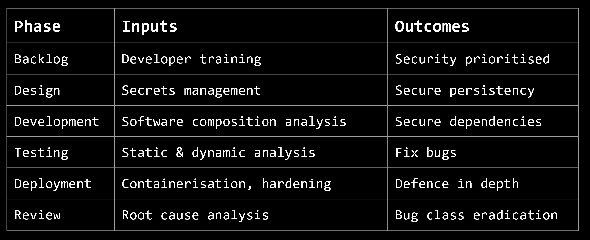
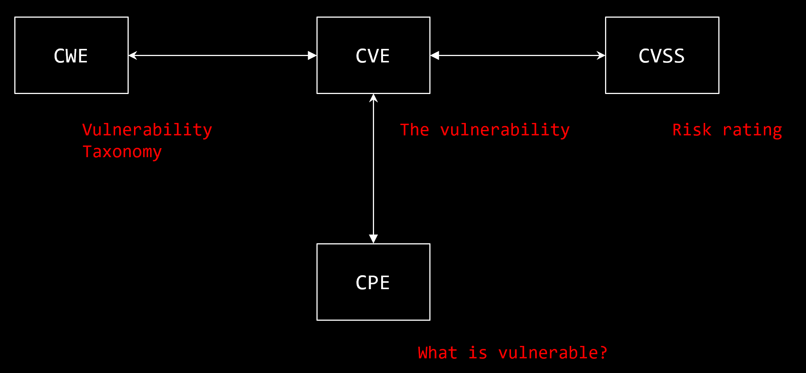
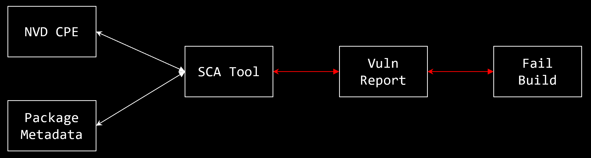
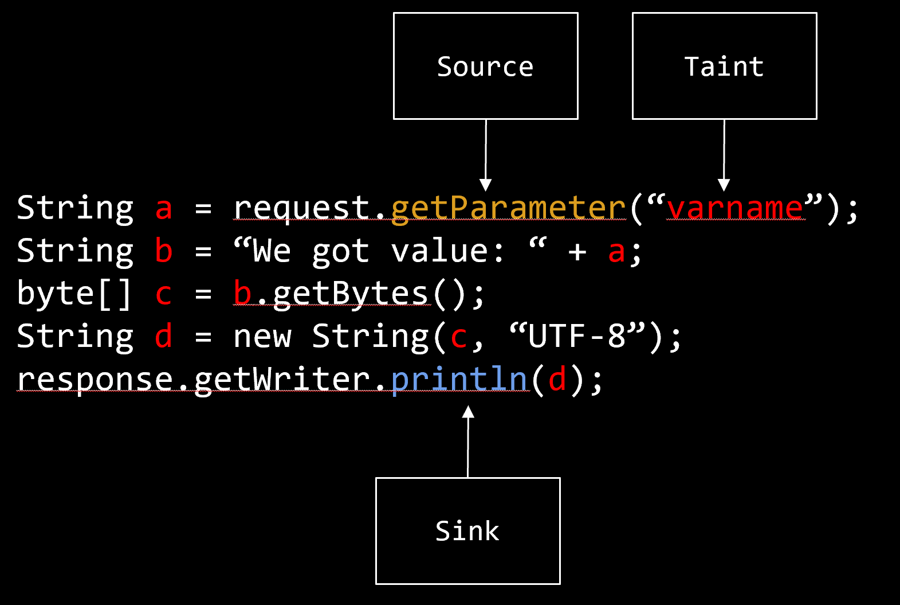
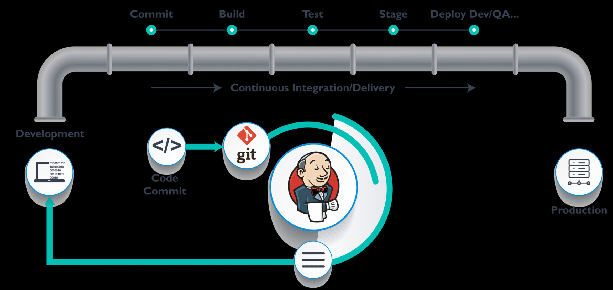

# DevSecOps

**DevSecOps**

- Integrating security in the devsec ops process
- security is not an afterthought but instead security is integrated in all stages of the devops pipeline -> everyone is responsible for security of the product
- primary goal is to minimise malicious attacks and defend cyber security threats
- able to identify security vulnerabilities early in the development stage

## Development Methodologies

- Waterfall Method: has been traditionally developed as a sequential project, visualised as a waterfall, with the output of each phase becoming the input to the next
  - Pros: Clear scheduling, Task dependency, Accurate planning
    - i.e. in an agile project without clear dependencies between features, it can cause problems as features may rely on other features -> organisation conflict -> waterfall development can provide a clear sequence of tasks 
  - Cons:
    - Inflexibility for changing requirements while a project is being executed
    - Schedule blowout if one phase holds up the subsequent phases
    - Integration of different parts of the software occurs at the very end of the process -> **security testing occurs in the final (testing) stage in development**
      - If a vulnerability is found, have to go back to the requirements stage to patch up the vulnerability
- Agile have the same stages as waterfall but in a much tighter loop -> group agile into sprints and iterate over quickly
  - Individuals and interactions over processes and tools
  - Working software over comprehensive documentation
  - Customer collaboration over contract negotiation
  - Responding to change over following a plan

## Agile Cycle

- Train developers -> make good design decisions -> analyse the code -> analyse the dependency tree -> analyse running binary with dynamic analysis

**Developer Training**

- teach developers directly in code vulnerabilities and how to fix them i.e Secure Code Warrior is a tool to allow to setup training programs about vulnerabilities and the solution
- teach developers how to be hackers - offensive security to adopt a different mindset when developing software i.e. HackTheBox to allow developers to threat model their code

**Secrets Management**

- looking at the design phase i.e. how to store credentials of the database, API
  - program will always have in memory the credentials to connect to services
- Solution: Password vaults - store secrets in a secure such a way that multiple systems and applications can read the password value and does not allow an attacker to exfiltrate strings.

**OVAL & NIST NVD - Open Vulnerability and Assessment Language (OVAL) and NIST National Vulnerability Database (NVD)**

- an international, information security, community standard to promote open and publicly available security content, and to standardize the transfer of this information across the entire spectrum of security tools and services.
- Common Vulnerability Enumeration (CVE) - **tracks publicly disclosed vulnerabilities** - standardised way to present vulnerabilities and giving it a common identifier/label
- Common Weakness Enumeration (CWE) - list of software and hardware weakness types. It serves as a common language, a measuring stick for security tools, and as a baseline for weakness identification, mitigation, and prevention efforts
- Common Vulnerability Scoring System (CVSS) - assessing the severity of computer system security vulnerabilities, allowing responders to prioritize responses and resources according to threat
- Common Platform Enumeration (CPE) - standardized method of describing and identifying classes of applications, operating systems, and hardware devices present among an enterprise's computing assets
- e.g. https://nvd.nist.gov/vuln/detail/CVE-2014-0003

**Software Composition Analysis (SCA)**

- SCA inspects metadata of software packages, walk through the dependency tree of all of the third party dependencies it has and compare it to a database (the NVD) and pull the CPE data (common platform enumeration data - tells which versions of which components are vulnerable to vulnerabilities) and match the two up (CPE data and metadata of software package)
- NVD CPE identifies known vulnerable versions
- Package metadata identifies version used
- SCA tool attempts to match the two and identify known vulns and **catch zero day vulnerabilities in the dependency tree**
- If SCA is integrated in the infrastructure, this can fail builds with vulnerable packages -> with a CI job, can send alerts

**Source Code Analysis**

- automated testing of source code for the purpose of debugging a computer program or application before it is distributed or sold
- In static analysis, debugging is done by examining the code without actually executing the program. This can reveal errors at an early stage in program development, often eliminating the need for multiple revisions later. i.e. grep analysis on source code
- After static analysis has been done, dynamic analysis is performed in an effort to uncover more subtle defects or vulnerabilities. Dynamic analysis consists of real-time program testing.

**Static Application Security Testing**

- analyse source code to find security vulnerabilities
- **Pros**

  - Find and fix vulns early
  - Identify vulns in configuration & conditions
  - Open source tools available
  - Potential  for bug class eradication
- **Cons**
  - Massive false positives
  - Manual triage & exploitation
  - Commercial deployments (costs)
  - Complexity of tweaking rules

**Dynamic Application Security Testing**

- black-box security testing in which tests are performed by attacking an application from the outside
- **Pros**
  - Scanning of live targets
  - Language independent
  - Cloud based deployment
  - Less false positives than SAST
- **Cons**
  - Data corruption
  - Cannot read config files
  - Cannot understand complex dynamic client/server
  - Relies on configuration to map attack surface

**Virtualisation vs Containerisation**

- Virtualisation
  - Hypervisor: VMWare, KVM (ring 0), Parallels etc. -> kernel security to protect Guest OS from each other
  - Slow performance - separate kernel per guest - stack and overhead - Guest OS virtual memory complexities
  - Doesn't scale well
- Containerisation
  - Packages dependencies and runtime information -> allows for native execution on Host OS
  - "Containers don't contain" - vulnerability
    - RunC: "low level" container runtime used by "high level" container runtimes such as Docker - used to spawn and run containers (parent process)
    - procfs (mounted to /proc): virtual Linux file system that presents info about processes - interface to system data that the kernel exposes as a filesystem.
      - /proc/self/exe - symlink to executable file the process is running
      - /proc/self/fd - directory containing the file descriptors open by the process
    - Attackers can trick runC into executing itself by asking it to run /proc/self/exe (symlink to runC binary on host)
    - If they have root access in the container, they can use /proc/[runc-pid]/exe as a reference to the runC binary (owned by root) on the host and overwrite it
    - Next time runC is executed -> attacker will achieve code execution on the host
    - Since runC is normally run as root (e.g. by the Docker daemon), the attacker will gain root access on the host
  - docker-bench-security - audits host running Docker
    - Make sure Docker socket not mounted
  - Since Docker containers is immutable, correct way to patch Docker container is to destroy, recreate and reinstall the update version -> DevSecOps people to manage SCA inside containerised payloads

**Continuous integration / delivery / deployment**

- Continuous delivery vs continuous deployment - "deploy to production" stage manual rather than automatic
  - platform to run builds of software and various automated tests and deployments
- CI/CD automated checks from development to production - automate DevSecOps

- DevSecOps Agile cycle can be mapped to the CI/CD pipeline -> can be used to automate DevSecOps
  - i.e. all checks in the agile cycle can be checked in the CI/CD pipeline and the from there conditional events can be triggered:
    - push to staging enviroment/production
    - fail build
    - generate reports

## Readings

Static Analysis - [Find-sec-bugs](https://find-sec-bugs.github.io/)

- SpotBugs plugin for security audits of Java web applications
- Bug patterns (with references to OWASP Top 10 and CWE)
- Uses WASC threat classification

[Tracking vulnerable JARs](https://www.slideshare.net/davidjorm/tracking-vulnerable-jars )

- Java applicationss rely on a large number of libraries (dependencies), and bundles its own dependencies - statically compiled and not dynamically linked
- Maven for compiled JARs as dependencies
  - Aspect Security 2012 study showed that 29.8 million (26%) of library downloads contained known flaws
  - App developers should instead:
    - Provide tailored security policies that can be leveraged by the Java Security Manager to ensure limited impact of any exposure
    - Enforce scans of dependencies against a known vulnerability DB (map dependencies to CVEs)
    - Internalise and self manage Maven repositories to ensure absolute control of dependencies
- JBoss products are bundled with all dependent JARs, rather than using a dependency management system
  - Collate and recursively unpack all released/engineering product builds to generate a complete manifest database cataloging the JARs used by each build, and match this db against a db of known vulnerable JARs. Perform a check against the db at build time.
  - Requires jboss-manifest (JAR manifest generator which recursively unpacks projects distribued as zip files to generate a text and SQL-based manifest of their packaged JARs), victims db (db of known vulnerable JARs identified by sha-512 fingerprints and linked to CVE IDs) and enforce-victims rule (detect known-vulnerable JARs at build time based on the victi.ms database)
  - Jar file within archives include info about file itself, contents of META-INF/MANIFEST.MF, the signer information in META-INF/*.DSA/RSA, Checksum -> save to manifest DB, matching record to the product build containing this JAR
  - Checks both metadata (artifact name and version) and JAR file hashes
    - Metadata optional so some not recorded (false negative) or forgot to be changed (false positive)
    - Hashes (no false positives), but JARs could be modified (false negative)

Source Code Analysis - [OWASP dependency check](https://owasp.org/www-project-dependency-check/)

- Dependency-Check is a SCA tool which attempts to detect publicly disclosed vulnerabilities contained within a project's dependencies by determining if there is a CPE identifier for a given dependency
- Using components with known vulnerabilities in OWASP Top 10
- The Unfortunate Reality of Insecure Libraries - Contrast Security
  - INVENTORY: gather information about your current library situation
  - ANALYSE: check the project and the source for yourself
  - CONTROL: restrict the use of unapproved libraries
  - MONITOR: keep libraries up to date

Dynamic Application Security Testing - [OWASP ZAP](https://owasp.org/www-project-zap/)

- Zed Attack Proxy (ZAP): world's most popular free web security tool, acts as a an-in-the-middle proxy
- Assessments (no exploit) vs testing (find through exploits)
- Security testing usually based on type of vulnerability being tested or type of testing being done, i.e.
  - Vulnerability assessment - system scanned and analysed for security issues
  - Penetration testing - system undergoes analysis and attack from simulated malicious attackers
    - Fewer false positives, but time consuming
    - Explore, attack, report
    - Goal: search for vulnerabilities so they can be addressed. Can also verify system not vulnerable to a known defect, or if these have been be addressed to be fixed, verify system no longer vulnerable to that defect.
  - Runtime testing - system undergoes analysis and security testing from an end-user
  - Code review - system code undergoes a detailed review and analysis looking specifically for security vulnerabilities
- Risk assessment separate process - not a test but rather the analysis of the perceived security of different risks, and any mitigation steps for those risks

CI/CD - [Jenkins](https://www.jenkins.io/)

- The leading open source automation server which provides hundreds of plugins to support building, deploying and automating any project (flexible)
- Continuous integration and delivery
- Security advisories to publicly inform users about security issues in Jenkins and Jenkins plugins
- The Jenkins project is a CVE Numbers Authority, submitting CVE metadata simultaneously with the publication of security advisories, allowing automated security tools using CVE information to identify vulnerable installations
- Fixing security issues
  - Prefer simple and obviously correct fix to a larger overhaul/redesign
    - Safer to postpone larger changes until after the security issue has been addressed since security fixes undergo only limited manual testing before publishing
  - Security updates should only contain security fixes and no other changes - only released branches / configurations
    - Jenkins (core) weekly releases only security-related. LTS releases deliver regular bug fixes and improvements and security fixes in the same releases.
    - This rarely results in problems since bug fixes and improvements are well-tested before being backported into LTS.

[Docker-bench-security](https://github.com/docker/docker-bench-security)

- Script that checks for dozens of common best-practices around deploying Docker containers in production

## SDLC

- Planning/Discovery
  - Market research
  - Voice of Customer/Prospect/Partner
  - Define the problem space
  - Competitive Analysis
  - Prioritise opportunities
  - Typical stakeholders: Product, Sales, Support
- Requirements/Ideation
  - Acceptance criteria. What is necessary to solve the problem? i.e “User can register an account”
  - Digging into the details, define the capabilities that the system must provide to solve a problem/opportunity
  - Typical Stakeholders: Product, Development, Design, etc
- Design
  - Take all the requirements, plan the product
  - How can we best solve this problem? Compare approaches
  - Decide technical approach
  - Business rules, UI Design
  - Decomposition into executable steps, tickets
  - Typical Stakeholders: Product, Development, Design, etc
- Development
  - Sprint execution and build out the solution!
  - Code reviews
  - UI Design implemented
  - API contracts realised
  - Typical Stakeholders: Development, Design, Product
- Testing
  - QA/QE testing
  - “Alpha”/”Beta” customer acceptance testing
  - A/B rollout testing. Evaluate impact on subset of customers before broad GA
  - AppSec review, Performance testing, Internal stakeholder demonstrations
  - Typical Stakeholders: Security, Product, Development, Customers (?)
- Deployment
  - Release to integration/staging/production
  - Data Migrations
  - Blue/Green deployment of microservices
  - Monitoring/observability
  - Rollbacks, reverts, disaster recovery
  - CI/CD
  - Typical Stakeholders: Development, Operations
- Maintenance
  - Monitoring & alerting
  - Scaling & Capacity planning
  - Defect fixes
  - Deprecation/Sunset of old systems & features
  - Typical Stakeholders: Development, Operations, Support

**Defects**

- Most common sources of production defects:
  - Insufficiently tested logic errors
  - The integration of components
  - Inconsistent expectations (i.e input validation inconsistently enforced)
- The percentage of integration defects grows combinatorially relative to the size of the system **AND** the size of the team.
- Functional defects naturally improve over time as customers stumble on them. Security defects do not.
- A common software security model is "boundary validation" vs "defence in depth"/zero-trust, i.e. "I trust that user input is sanitised so contextual encoding is unnecessary" or "I trust that the database is using prepared statements so I don't need to do input validation"

**DevOps**

- Systems becoming more sophisticated/complex to debug. Optimise around “flow” to achieve shorter development cycles and reduce blockers
- Reduce waste by validating changes with customers faster
- Teams own the entire development, deployment and operational support of their changes.

**DevSecOps**

- Facilitate secure software development by making it an intrinsic part of ALL stages of the SDLC, as a shared responsibility
- Security engineers partner with teams to help them deliver software securely
- Reduce waste by validating changes with security faster
- **All stages governed by customer/product, DevSecOps engineers, security (all stakeholders)**
- Engineers have the most context -> easier to debug complicated systems
- Reduce waste by validating changes with security faster
- AppSec can't just be the responsibility of a centralised team, but should permeate our team culture, how we build software.
- Understand the business, then balance risk and impact of vulnerabilities - e.g. customers hosting own JavaScript is fine on AWS, but less for Facebook
- Norms and standardisation (adoption of patterns, building blocks, tried and tested approaches) can make it easier for teams to spot gaps in their own compliance

# 
