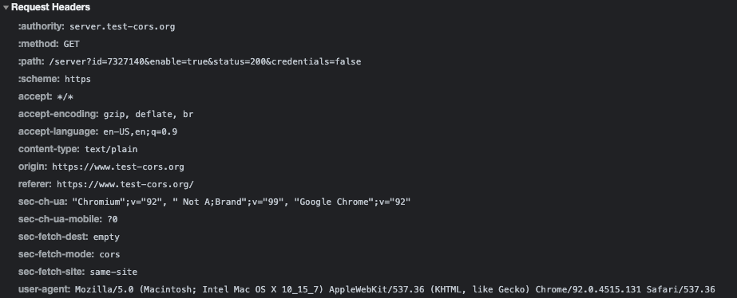

## CORS Testing

This section details Cross-Origin Resource Sharing (CORS) using `https://www.test-cors.org/` as the testing platform. QuoccaBank should be familiar with how CORS operates and the results of these test scenarios outlined below should help the organisation to analyse how to ensure proper handling of CORS.

### Content-Type: application/json; charset=utf-8

*1. [**JS**] Set content type as “application/json; charset=utf-8”. Send GET request to server.*

#### Is prefight request sent? Capture the request & response.

When sending a CORS request with `content-type` set as `application/json`, a pre-flight request **was** sent. 


The request and response of the pre-flight request are shown below.

*Request Headers:*


*Response Headers*:


#### Is there any CORS error in browser? If so, capture it.

The browser console displayed the following CORS error below. The error was caused by having the `content-type` field as part of the pre-flight response.


### Content-Type: text/plain

*2 & 3. [**JS**] Set content type as “text/plain”. Send requests to server using GET, POST, OPTIONS, DELETE, PUT methods..*

#### Is prefight request sent? Capture the request & response. Is there any CORS error in browser? If so, capture it.

For both GET and POST requests, when the `content-type` was set to `text/plain`, a pre-flight request was **NOT** sent, and there were NO CORS errors thrown.

##### GET




##### POST


For requests with `content-type: text/plain`, and methods set as OPTIONS, DELETE and PUT, a pre-flight request was sent and each resulted in a CORS Error.

##### OPTIONS


##### DELETE


##### PUT


### Simple Requests Headers set by JavaScript

*4. [**Research**] What are the headers that can be set by JS and not trigger a pre-flight for GET request. Please explain, why the decision was made to allow a select set of content type for GET simple requests?*

Requests that do not trigger a CORS pre-flight are referred to as 'simple requests'. It is noted that these 'simple requests' can only use GET, POST, or HEAD as their methods. Headers specified under the 'CORS-safelisted request headers' can be manually set by JavaScript which does not trigger a pre-flight request. These headers include  `Accept`, `Accept-Language`, `Content-Language`, and `Content-Type` with the values of `Content-Type` restricted to `application/x-www-form-urlencoded`, `multipart/form-data`, and `text/plain`. Further requirements of 'simple requests' are that it must not contain a `ReadableStream` object in the request.

The decision to have a selected set of values for the `Content-Type` header is that it ensures the payload is considered to be safe to expose to the client scripts. This means that only safelisted response headers are made available to web pages.

More details for simple requests can be found here:

- [MDN Web Docs - CORS](https://developer.mozilla.org/en-US/docs/Web/HTTP/CORS)
- [MDN Web Docs - CORS-safelisted request-header](https://developer.mozilla.org/en-US/docs/Glossary/CORS-safelisted_request_header)
- [Fetch Spec - CORS-safelisted request-header](https://fetch.spec.whatwg.org/#cors-safelisted-request-header)

### Wildcard in Access-Control-Allow-Origin

*5. [**Research**] Is wildcard character (***) allowed in Access-Control-Allow-Origin response header? If so, under what conditions would wildcard not be allowed as value of “Access-Control-Allow-Origin” header?*

Wildcard parameters (*) for the `Access-Control-Allow-Origin` header are allowed except for when the `Access-Control-Allow-Credentials` header is set to `true`. This header would be used when the server is accepting cookies that are being sent from the client. Furthermore, wildcards **cannot** be used within any other values such as the `Access-Control-Allow-Origin: https://*.example.com`.

### HTML Form

*6. [**HTML5**] Insert your own HTML form. Should contain at least 1 field. Ensure form uses POST method and sends request to server endpoint. Do not use JavaScript. Please see picture below.*

Inject the following HTML code below via 'Inspect Element' and edit the DOM to create a form that sends a POST request to the server endpoint once the it is submitted.


```html
<form action="https://server.test-cors.org/server?id=8179348&enable=true&status=200&credentials=false" method="POST">
    <input type="text" id="test" name="test" placeholder="test" />
    <input type="submit"/>
</form>
```

#### Does this trigger pre-flight request? If so, capture it.

The pre-flight request was not triggered.


#### Does the server respond with any “Access-Control-***” headers? If so, capture it. If not, please explain why?

The server responds with the `Access-Control-Allow-Origin` header as shown below.


### Understanding CORS and Cookies

*7. [**JS**] Set content type as “text/plain”. Add a dummy cookie (“my-dummy-cookie”) in cookie jar of browser for domain server.test-cors.org. Send an explicit credentialed GET request to server.*

1. *Does this invoke a pre-flighted request? If so, please capture request & response.*

2. *Does the first request from browser to server contain the “my-dummy-cookie”? if so, please capture request & response.*

3. *Is there any “Access-Control-Allow-Credentials” header in server response? If so, please capture request & response.*

4. *What happens in the browser if server responds with “Access-Control-Allow-Credentials: false”?*

   


Initially, when sending a GET request with `Content-Type: text/plain`, and **without** the `with credentials` and `allow credentials`, there were:

- **NO** preflight request
- It did NOT contain the `my-dummy-cookie`
- There was no `Access-Control-Allow-Credentials` header in the server response.


*Request:*


*Response:*


However, if we **send an explicit credentialed GET request to the server**, it:

- does not invoke a pre-flight response
- contains the `my-dummy-cookie`
- contains the `Access-Control-Allow-Credentials` header in the server response.


*Request:*


*Response:*


If the server responds with `Access-Control-Allow-Credentials: false`, it means that the request has been blocked by the CORS policy and throws the following errors.


Thus, cookies are only sent if the browser sends a request with `credentials` set to true, and as well as the server included `Access-Control-Allow-Credentials: true` in the response header.

### Response Redirection

*8. [**JS**] Optional - Set content-type as “application/json; charset=utf-8”. Send a GET request to server. Allow the pre-flight response to reach the browser. When the browser makes GET request, modify the response from the server to 301 redirect to https://google.com/*

#### How does the browser behave? Please capture, request/response

Editing the pre-flight response to have the HTTP code of `301 Moved Permanently` with redirect set to `google.com` throws a CORS error as it does not pass the access control check as a redirect is not allowed for a pre-flight request.


*Request:*


*Response:*


