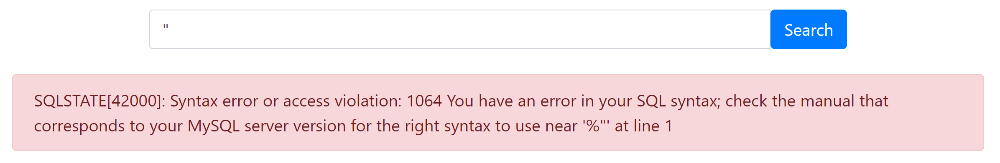

# Vulnerabilities

## P1 CRITICAL - SQL Injection in Payment Portal behind WAF

**Asset Domain:** payportal-v2.quoccabank.com via ctfproxy2.quoccabank.com

**Severity Classification:** P1 - Critical

### Vulnerability Details

There exists an SQL injection vulnerability in the `period` parameter sent to the payment portal backend, identical to the vulnerability in `pay-portal.quoccabank.com`. 

### Proof of Concept / Steps to Reproduce

The first (and last) line of defence against SQLi here is the WAF provided by `ctfproxy2`. By probing the parameter with inputs, we discover that the double dash comment characters `--` and ` or ` (or surrounded with whitespace) trigger the HackShield WAF. 

1. Identify what SQL database is `payportal-v2` is using. This can be determined by inputting `"` as `payportal-v2` reveals information about the SQL server through error messages.

   

2. By probing the parameter with inputs, we discover that some characters such as the double dash comment characters `--` and ` or ` (or surrounded with whitespace) trigger the HackShield WAF.

   

3. To bypass this blacklist matching, we simply replace our space characters with an inline comment - e.g. `1"/**/or/**/`. 

4. As a proof of concept, we leak all entries in the `payportal` table with a modified `1" or "1" = "1";` payload to reveal sensitive information from the database

   ```sql
   1"/**/or/**/"1"="1";
   ```

   ```
   https://ctfproxy2.quoccabank.com/api/payportal-v2/?period=1%22%2F**%2For%2F**%2F%221%22%3D%221%22%3B
   ```
   

### Impact

The SQLi vulnerability enables the execution of a subset of SQL. An attacker may exfiltrate records in the local database which can contain sensitive data, pivot to connected DB systems, or escalate to RCE depending on the backend environment and database configuration (unlikely here due to a lack of write privileges). The ability of an attacker to exfiltrate information from a system's database can lead to serious implications for QuoccaBank and its users. Sensitive information such as emails, passwords, or the company's confidential data might be stored in the database. If information were to be leaked, the repercussions would entail a severe loss of reputation from being a bank focused on 'cyber-security'. 

### Remediation

Construct SQL queries using parameters and prepared statements provided in the appropriate backend framework rather than string concatenation. This allows the SQL engine to distinctively identify between code and data. Furthermore, it is recommended to ensure error messages are not displayed to the user. This makes it difficult for an attacker to formulate what the SQL query could be. Another remediation is to encode sensitive information in the database, such as passwords. User input should also be validated. The [OWASP Cheatsheet](https://cheatsheetseries.owasp.org/cheatsheets/SQL_Injection_Prevention_Cheat_Sheet.html) can provide further guidance to have better security measures in place.

