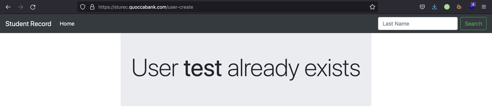
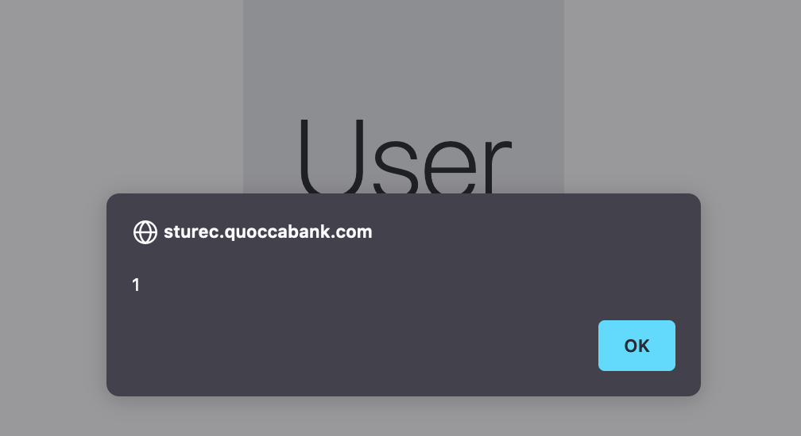
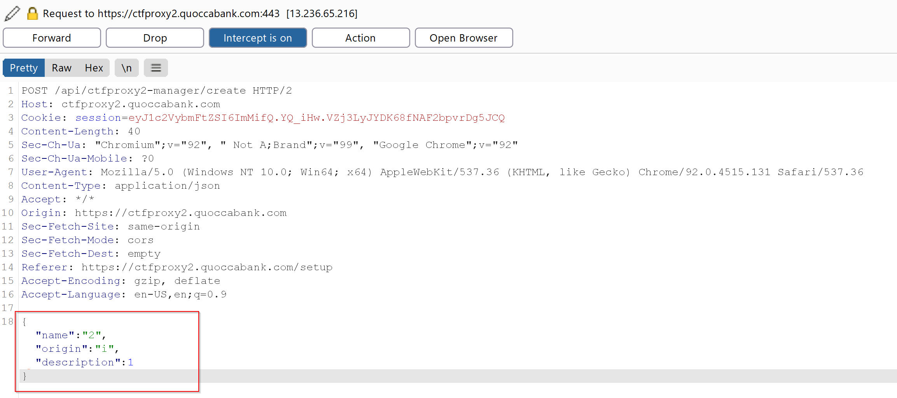

## P4 LOW - Reflected XSS in sturec.quoccabank.com

**Asset Domain:** sturec.quoccabank.com

**Severity Classification:** P4 - Low Risk

### Vulnerability Details

Reflected XSS (cross-site scripting) can be found in the last name field when creating a duplicate student. 

### Proof of Concept / Steps to Reproduce

When creating a student entry with the email address of an existing student, a page similar to below will appear, with the format `User {lastName} already exists`. Although the last name field usually gets HTML encoded when rendered on the home or index page, it seems like it is simply reflected in this case, where having the last name of `<b>test</b>` displays the following page. 



As a proof of concept, it can be seen that arbitrary code execution can occur by using JSONP to bypass the CSP restriction for external scripts, where the following payload for the last name successfully displays the alert.

```html
<script src=/students.jsonp?callback=alert(1);></script>
```



### Impact

As demonstrated in the proof of concept above, this vulnerability enables XSS. However, the only way to get this code execution would be to try and create a duplicate student with a specific payload for the last name field. Although this is relatively harmless on its own, an attacker may be able to chain this with CSRF (client-side request forgery) to manually submit the same form for another user, causing them to be redirected to the compromised page.

### Remediation

Similar to the other sturec.quoccabank.com vulnerabilities, the general recommendation here would be to remove the use of JSONP so the CSP blocks user scripts as expected. Furthermore, the last name field value should be HTML-encoded as well, before being displayed to the user. 

## P4 LOW - Verbose Error Messages for deploying API

**Asset Domain:** ctfproxy2.quoccabank.com

**Severity Classification:** P4 - Low Risk

### Vulnerability Details

Verbose error messages are shown in `/setup` when tampering with the payload of deploying an API.

### Proof of Concept / Steps to Reproduce

1. By modifying the body of the request when creating an API, error messages are sent back through a cookie which details information on what is required by the backend from the JSON sent.

   

   

2. For proof of concept, further tampering of the body such as adding a new field gives us the required fields that the backend service only accepts.

   

### Impact

This vulnerability can be chained together with other exploits (such as **P2 HIGH - Incorrect Access Control for flagprinter-v2**) which can lead to more severe vulnerabilities being exposed. This vulnerability however merely acts as another form of recon for an attacker to learn more about the web application. However, verbose error messages such as these display too much information such as hidden parameters used in the request body.

### Remediation

Use custom and non-specific error messages rather than error messages from a stack trace. Error messages should not reveal too much on the technical specifications of the web application such as the parameters used or the backend service.