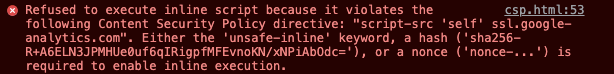
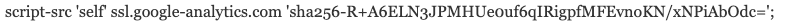
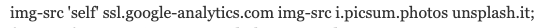
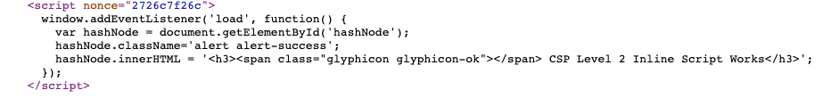
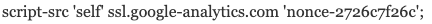
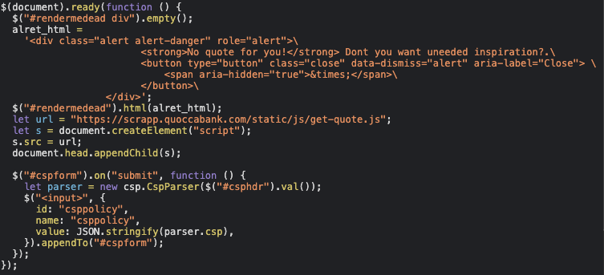
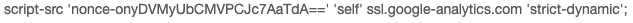

## P5 Acceptable - Lack of Security Headers (Content-Security-Policy) for Inline JavaScript Execution (hash)

**Asset Domain:** csp.quoccabank.com

**Severity Classification:** P5 - Acceptable

### Vulnerability Details

Content Security Policy (CSP) is an additional layer of security within a web application that enforces the loading of resources (scripts, images, etc.) from trusted locations. In `csp.quoccabank.com`, QuoccaBank is utilising a CSP policy to load a variety of resources as part of the page's content. However, the inline JavaScript is not loaded since the hashed value of the script tag is not whitelisted in the CSP header.

### Proof of Concept / Steps to Reproduce

1. By inspecting the chrome dev tool, we notice this error.

    

2. Update the CSP header to include the same hash as the one included in the resource (found in the error message) as this will ensure that CSP will correctly load any resources with that hash.

### Impact

Although this method is cumbersome to maintain (as every minor change in the code would require the hash value to be regenerated), understanding CSP whitelisting using Hash values is useful in understanding the basics of CSP inline script whitelisting. The vulnerability is classified as a P5 - Acceptable as it is a misconfiguration on behalf of the server.

### Remediation

Training developers properly in understanding how CSP headers works will dramatically increase the security of the application and allow trusted resources to load correctly. If maintaining inline JavaScript proves cumbersome to whitelists in the CSP header through a hash, it is recommended for developers to adopt using `nonce` instead.

## P5 Acceptable - Lack of Security Headers (Content-Security-Policy) for Image source inclusion

**Asset Domain:** csp.quoccabank.com

**Severity Classification:** P5 - Acceptable

### Vulnerability Details

Misconfigurations of CSP headers do not contain a whitelist for the image resource and as a result, it is not loaded on the website. 

### Proof of Concept / Steps to Reproduce

1. By updating the CSP header to include the two domains `i.picsum.photos` and `unsplash.it`, the image would be allowed to load.
	

### Impact

Not understanding how CSP works would cause inexperienced developers to panic when trying to figure out why their image does not correctly load, and as a result, would fall back to using insecure CSP headers.

### Remediation

Similar to the remediations mentioned in **P5 Acceptable - Lack of Security Headers (Content-Security-Policy) for Inline JavaScript Execution (hash)**, training developers properly in understanding CSP headers will dramatically increase the security of the application.

## P5 Acceptable - Lack of Security Headers (Content-Security-Policy) for Inline JavaScript execution

**Asset Domain:** csp.quoccabank.com

**Severity Classification:** P5 - Acceptable

### Vulnerability Details

Due to a misconfiguration of the CSP header, the inline JavaScript is not loaded since the `nonce` value associated with the script tag is not whitelisted as a trusted resource.

### Proof of Concept / Steps to Reproduce

1. By inspecting the page source, the inline script that we are trying to run is this

2. By updating the CSP header to include the same `nonce` like the one included in the target script tag, the script as a result is whitelisted by CSP to be allowed to run.

  

### Impact

Understanding CSP whitelisting using Nonce values is very useful in improving the security of a web app as well as minimise errors that the developer faces. Misconfigurations of CSP headers such as scripts may cause important JavaScript to not load on the website, affecting the functionality of some features. Unlike other methods of whitelisting inline script tags seen with **P5 Acceptable - Lack of Security Headers (Content-Security-Policy) for Inline JavaScript Execution (hash)**, using `nonce` makes resources easier to maintain if the web application is expanded further to include more resources.

### Remediation

Similar to the remediations mentioned in **P5 Acceptable - Lack of Security Headers (Content-Security-Policy) for Inline JavaScript Execution (hash)**, training developers properly in understanding how CSP headers works will dramatically increase the security of the application. Using `nonce` values ensures that a specific resource on the page is trusted by the CSP header and is correctly loaded.

## P5 Acceptable - Lack of Security Headers (Content-Security-Policy) for Trust chaining

**Asset Domain:** csp.quoccabank.com

**Severity Classification:** P5 - Acceptable

### Vulnerability Details

Trusted scripts send requests to an external non-whitelisted domain. If the CSP header contains 'strict-dynamic', then it would trust all domains which are included in all trusted scripts.

### Proof of Concept / Steps to Reproduce

By inspecting the page source, it can be seen that the trusted script `quote-loaded.js` executes a script tag directed to an external domain `scrapp.quoccabank.com` 

By updating the CSP header to include 'strict-dynamic', the domain `scrapp.quoccabank` will also be whitelisted.

### Impact

By creating a trust chain within all inline scripts, it can introduce new attack surfaces into the web application. If an attacker can take over any one of those trusted external resources, this can lead to a compromise in the website.

### Remediation

Use strict-dynamic with caution, or just whitelist individual domains instead of automatically trusting all dependencies.

