## SameSite Impact

According to the [MDN Web Docs](https://developer.mozilla.org/en-US/docs/Web/HTTP/Headers/Set-Cookie/SameSite), the `SameSite` attribute of a cookie sets whether the cookie can be shared strictly by the same domain of the page (known as a first-party cookie) or by a website with a different domain (known as a third-party cookie). The possible `SameSite` values are defined below:

- `Strict`: Cookies can only be sent in if it is a same-site request (i.e. has been requested by the same domain) and cannot be sent if it is a cross-site request
- `Lax`: Cookies can be sent if it is a same-site request. It can also be sent if a user navigates to the origin site by top level navigation (i.e. clicking on a hyperlink). This means that other cross-site requests such as sending a JavaScript GET request or loading images are strictly denied.
- `None`: Cookies can be sent in a same-site and cross-site request.

NOTE: When testing the `SameSite` attribute values, `None` cookies must require the `Secure` attribute to be enabled since the browser rejects the cookie when it is not marked by `Secure`.

### Cross-Site Request

It is especially important for QuoccaBank to have a thorough understanding of ensuring that the attribute values of cookies are set in the appropriate context. Without security measures in place, sensitive information can be leaked through mishandling cookie configurations. This section details the possible implications of sending cookies over with the different usage of the `SameSite` attribute values over a cross-site request both in a top level navigation (HTML) and JavaScript GET request manner. For testing purposes, ` https://jub0bs.github.io/samesitedemo-attacker-foiled` will be used to see if it can send cookies to `https://samesitedemo.jub0bs.com/readcookie` using a cross-site request.

#### HTML Navigation Testing

*1. [**HTML5**] In a new browser tab navigate to https://jub0bs.github.io/samesitedemo-attacker-foiled . Click on the link on that page.*

The website `https://jub0bs.github.io/samesitedemo-attacker-foiled` has a navigation link to `https://samesitedemo.jub0bs.com/readcookie` embedded in the HTML page. This allows us to test different usage of the `SameSite` attribute, making a top level navigation cross-site request in an attempt to retrieve the cookie. For all tests, ensure that a cookie exists and is stored on `samesitedemo.jub0bs.com` with the respective `SameSite` attribute.

**Testing with 'Strict' Cookies**

*1.1. Is “StrictCookie” sent to server when navigating to https://samesitedemo.jub0bs.com/readcookie? If so, please capture request/response.*

When navigating to `https://samesitedemo.jub0bs.com/readcookie` from `https://jub0bs.github.io/samesitedemo-attacker-foiled` in a top level navigation manner, the cookie is not sent over to the sever. The `Strict` cookies can only be sent over to the sever if it is a same-site request.

**Testing with 'Lax' Cookies**

*1.2. Change, “SameSite” attribute to “Lax” and navigate to https://samesitedemo.jub0bs.com/readcookie. Is “StrictCookie” sent to server? If so, please capture request/response.*

`Lax` cookies can be sent over if the user navigates to the origin site in a top level navigation manner. Hence, the cookie is sent over when navigating to `https://samesitedemo.jub0bs.com/readcookie` from `https://jub0bs.github.io/samesitedemo-attacker-foiled`. The request and response headers with the cookie are captured below.

*Request:*

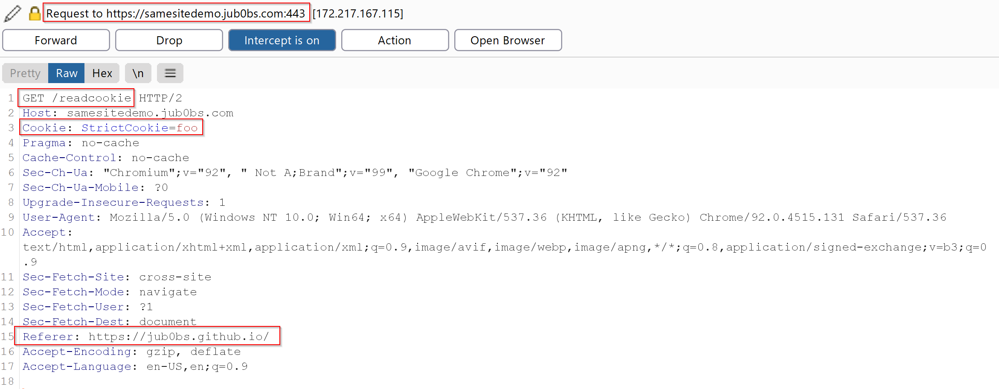

*Response:*

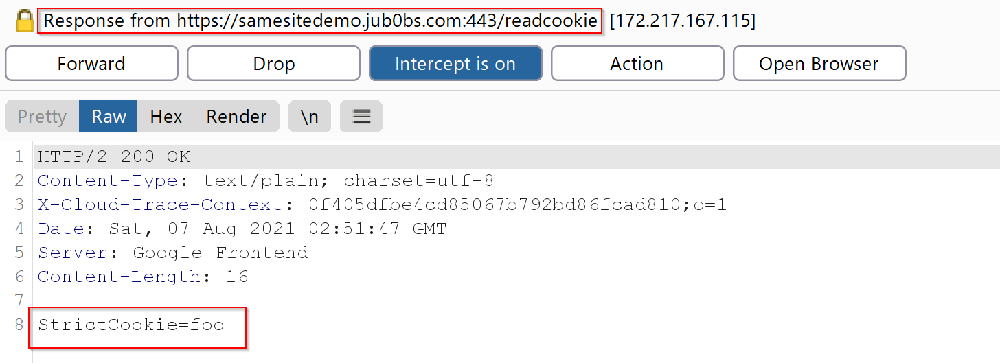

**Testing with 'None' Cookies**

*1.3. Change, “SameSite” attribute to “None” and navigate to https://samesitedemo.jub0bs.com/readcookie. Is “StrictCookie” sent to server? If so, please capture request/response.*

`None` cookies can be sent in a cross-site request. Note that on certain browsers (i.e. Google Chrome), cookies with `SameSite=None` must also require the `Secure` attribute. Otherwise, the browser may reject the cookie. However, other browsers may not require this condition at all. The request and response captured shows that the cookie is being appended in the cross-site request.

*Request:*

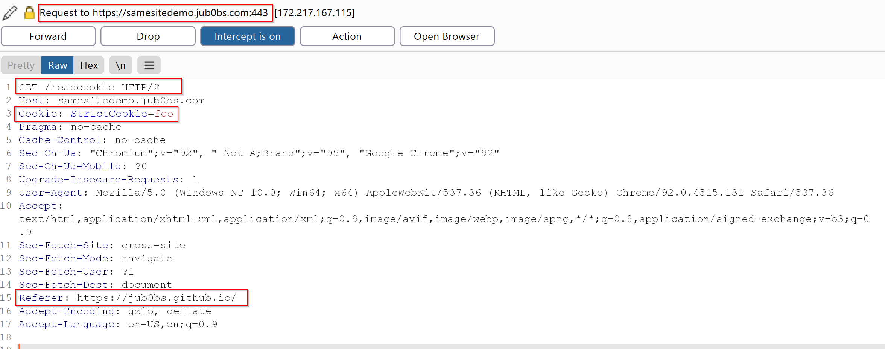

*Response:*

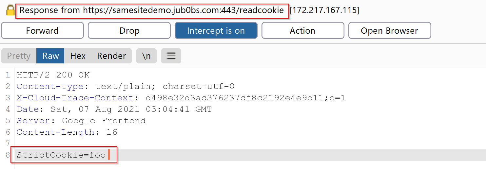

#### JavaScript GET Request Testing

*2. [**JS**] Repeat question 1 but instead of navigating to https://samesitedemo.jub0bs.com/readcookie make a JS GET request to https://samesitedemo.jub0bs.com/readcookie from https://jub0bs.github.io/samesitedemo-attacker-foiled.*

This section will test whether a JavaScript GET request from `https://jub0bs.github.io/samesitedemo-attacker-foiled` to `https://samesitedemo.jub0bs.com/readcookie` can retrieve the cookie. Since the demo sites have not implemented CORS headers, it is required to modify the response headers to include `Access-Control-Allow-Origin: *`. This can be achieved by using Burp Suite. JavaScript requests can be made through the browser console. The following payload is used to send a JavaScript GET request to the server. Ensure that a cookie exists on the website and is set with the correct `SameSite` attribute values.

```javascript
var createCORSRequest = function(method, url) {
  var xhr = new XMLHttpRequest();
  if ("withCredentials" in xhr) {
    // Most browsers.
    xhr.open(method, url, true);
  } else if (typeof XDomainRequest != "undefined") {
    // IE8 & IE9
    xhr = new XDomainRequest();
    xhr.open(method, url);
  } else {
    // CORS not supported.
    xhr = null;
  }
  return xhr;
};

var url = 'https://samesitedemo.jub0bs.com/readcookie';
var method = 'GET';
var xhr = createCORSRequest(method, url);

xhr.onload = function(res) {
  console.log("Request was successful")
};

xhr.onerror = function() {
  console.log("Unsuccessful request")
};

xhr.send();
```

**Testing with 'Strict' Cookies**

*2.1. Is “StrictCookie” sent to server when sending GET request to https://samesitedemo.jub0bs.com/readcookie? If so, please capture request/response.*

Since the JavaScript GET request is a cross-site request, 'StrictCookie' cannot be sent over to the server.

**Testing with 'Lax' Cookies**

*2.2. Change, “SameSite” attribute to “Lax” and send GET request to https://samesitedemo.jub0bs.com/readcookie. Is “StrictCookie” sent to server? If so, please capture request/response.*

`Lax` cookies can only be sent over a cross-site request if it is only a top level navigation. Thus, a JavaScript GET request cannot send 'StrictCookie' to the server.

**Testing with 'None' Cookies**

*2.3. Change, “SameSite” attribute to “None” and send GET request to https://samesitedemo.jub0bs.com/readcookie. Is “StrictCookie” sent to server? If so, please capture request/response.*

As mentioned previously, certain browser strictly prohibits cookies when `SameSite=None` with no `Secure` attribute set. The browser will reject those cookies and thus, no cookie is sent in the request.

**Testing with 'Secure' and 'None' Cookies**

*2.4. Set “Secure” attribute and “SameSite” set to “None” and send GET request to https://samesitedemo.jub0bs.com/readcookie. Is “StrictCookie” sent to server? If so, please capture request/response.*

'StrictCookie' was not sent when making the request from `https://jub0bs.github.io/samesitedemo-attacker-foiled` to `https://samesitedemo.jub0bs.com/readcookie`.

### Same-Site Request

*3. [**HTML5 & JS**]Repeat question 1 & 2, however instead of to https://jub0bs.github.io/samesitedemo-attacker-foiled use https://samesitedemo-attacker.jub0bs.com. Notice, https://samesitedemo-attacker.jub0bs.com is now SameSite as https://samesitedemo.jub0bs.com/readcookie*

This section covers testing same-site requests to retrieve cookies from a server. For testing purposes, the website `https://samesitedemo-attacker.jub0bs.com ` will be sending requests to `https://samesitedemo.jub0bs.com/readcookie` with a different `SameSite` value for each test case. Note that the domains of the two websites have the same domain and thus are the same site.

#### HTML Navigation Testing

*3.1. [**HTML5**] In a new browser tab navigate to https://samesitedemo.jub0bs.com/readcookie. Click on the link on that page.*

Similar to the **Cross Site HTML Navigation Testing**, `https://samesitedemo-attacker.jub0bs.com` has a top level navigation link to `https://samesitedemo.jub0bs.com/readcookie` embedded in the HTML page to be able to perform a same-site request to the server.

**Testing with 'Strict' Cookies**

*3.1.1. Is “StrictCookie” sent to server when navigating to https://samesitedemo.jub0bs.com/readcookie? If so, please capture request/response.*

Since`Strict` cookies can only send cookies if it is a same-site request, the 'StrictCookie' cookie from `https://samesitedemo.jub0bs.com/readcookie` is attached when `https://samesitedemo-attacker.jub0bs.com` is making the request. The request and response are captured below.

*Request:*

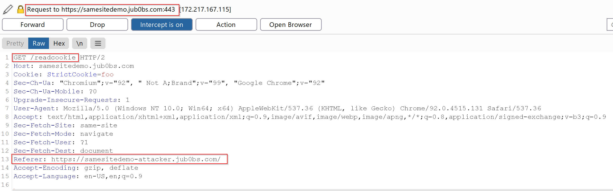

*Response:*

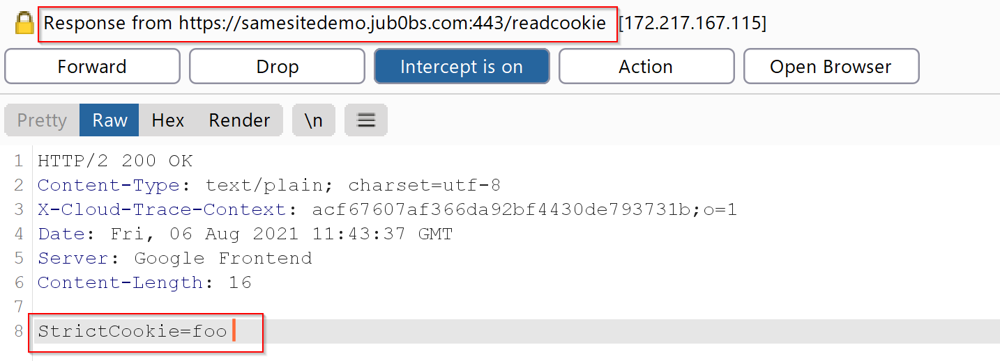

**Testing with 'Lax' Cookies**

*3.1.2. Change, “SameSite” attribute to “Lax” and navigate to https://samesitedemo.jub0bs.com/readcookie. Is “StrictCookie” sent to server? If so, please capture request/response.*

Since the request made is of the same site, cookies from `https://samesitedemo.jub0bs.com/readcookie` can be sent over from the request made by `https://samesitedemo-attacker.jub0bs.com`

*Request:*

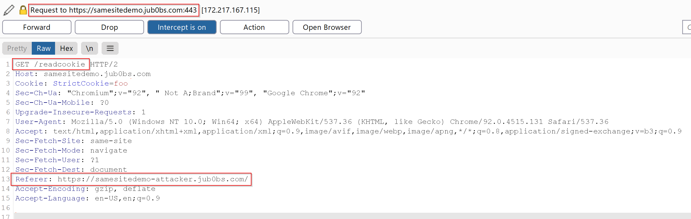

*Response:*

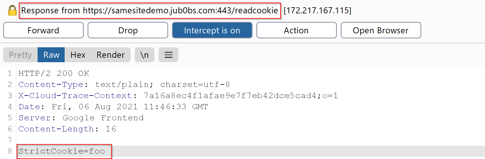

**Testing with 'None' Cookies**

*3.1.3. Change, “SameSite” attribute to “None” and navigate to https://samesitedemo.jub0bs.com/readcookie. Is “StrictCookie” sent to server? If so, please capture request/response.*

Some browsers will reject when cookies that have set `SameSite=None` with no `Secure` attribute. However, if the `Secure` attribute is enabled and if a browser does not have this restriction, the 'StrictCookie' cookie is sent to the server.

*Request:*

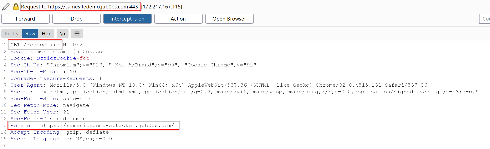

*Response:*

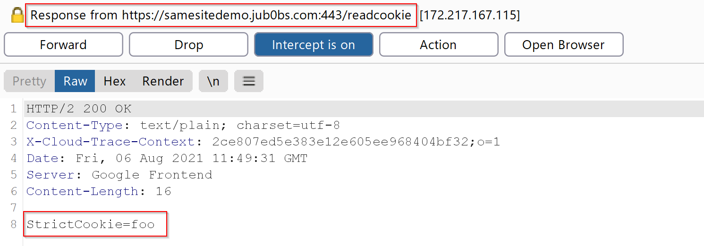

#### JavaScript GET Request Testing

*3.2. [**JS**] Repeat question 1 but instead of navigating to https://samesitedemo.jub0bs.com/readcookie make a JS GET request to https://samesitedemo.jub0bs.com/readcookie from https://samesitedemo-attacker.jub0bs.com.*

This section covers if `https://samesitedemo-attacker.jub0bs.com` can send a cookie over when making a JavaScript GET request to `https://samesitedemo.jub0bs.com/readcookie`. Similar to the **Cross Site JavaScript GET Request Testing**, modify the response headers to include `Access-Control-Allow-Origin: *` and use the payload defined earlier in the browser console to send a JavaScript GET request to the server.

**Testing with 'Strict' Cookies**

*3.2.1. Is “StrictCookie”sent to server when sending GET request to https://samesitedemo.jub0bs.com/readcookie? If so, please capture request/response.*

Even if it is SameSite, it appears that it does not send the cookie over the server.

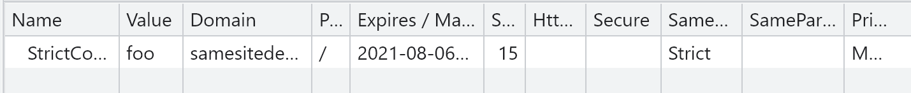

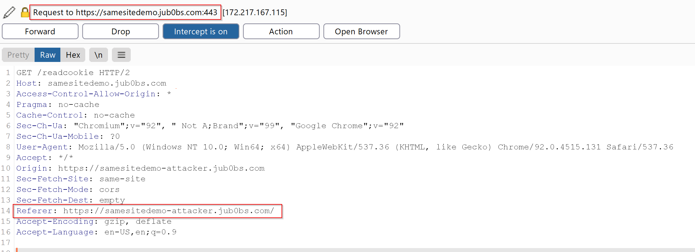

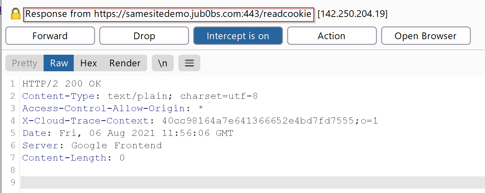

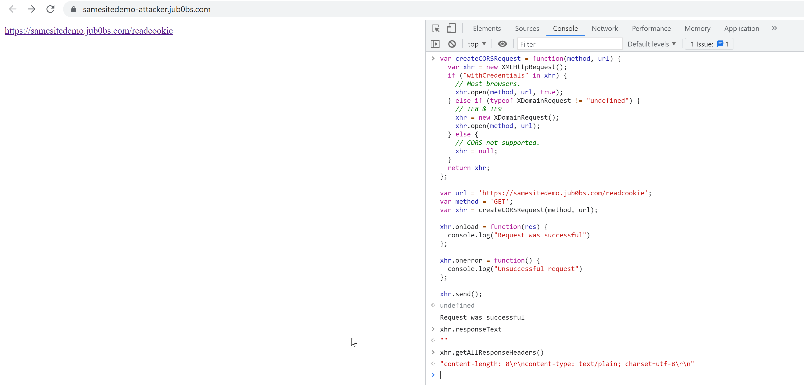

**Testing with 'Lax' Cookies**
*3.2.2. Change, “SameSite” attribute to “Lax” and send GET request to https://samesitedemo.jub0bs.com/readcookie. Is “StrictCookie” sent to server? If so, please capture request/response.*

`Lax` cookies are not being sent even if it is SameSite.

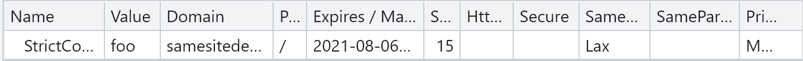

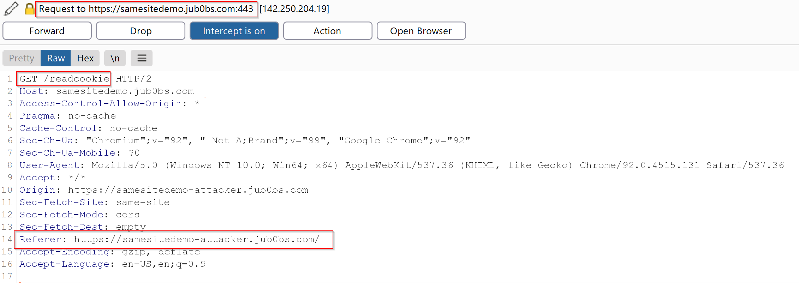

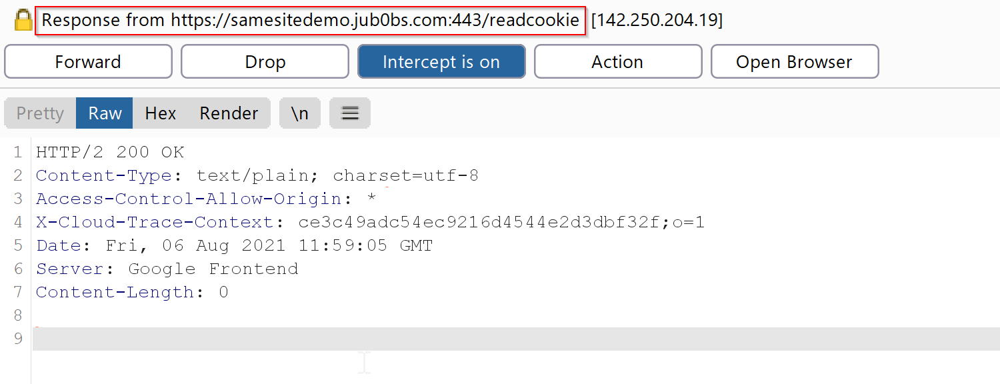

**Testing with 'None' Cookies**
*3.2.3. Change, “SameSite” attribute to “None” and send GET request to https://samesitedemo.jub0bs.com/readcookie. Is “StrictCookie” sent to server? If so, please capture request/response.*

As mentioned previously, certain browser rejects cookies when `SameSite=None` with no `Secure` attribute. Hence, we are not able to send the cookie over to the server. In other instances where browsers do not reject cookies without the `Secure` attribute enabled (i.e. Mozilla Firefox), the 'StrictCookie' cookie is still not sent to `https://samesitedemo.jub0bs.com/readcookie` from `https://samesitedemo-attacker.jub0bs.com`.

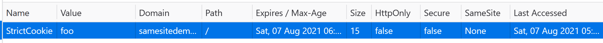

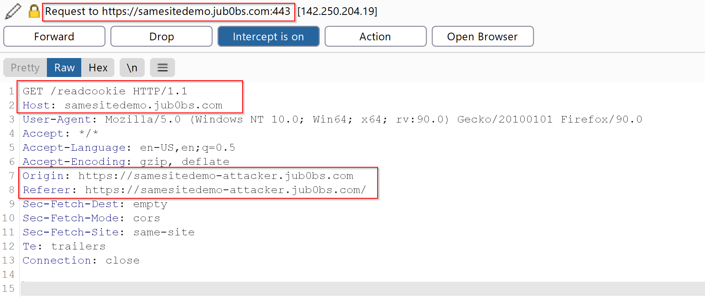

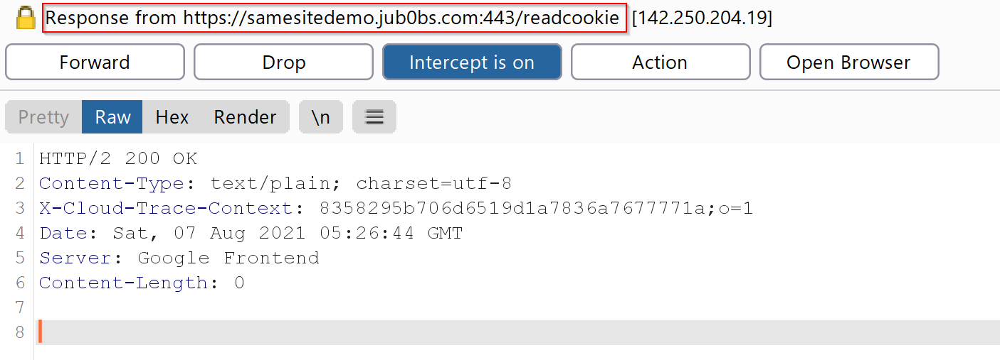

**Testing with 'Secure' and 'None' Cookies**
*3.2.4. Set “Secure” attribute and “SameSite” set to “None” and send GET request to https://samesitedemo.jub0bs.com/readcookie. Is “StrictCookie” sent to server? If so, please capture request/response.*
No cookie is sent when making the request.

### Sending Cookie with a Different Domain

*4. [**Research**] Optional - Does adding new cookie with value of “domain” attribute to “.jub0bs.com” have any impact to behaviour with respect to question 3? If so, please explain.*

The `Domain` attribute of a cookie specifies which host the cookie will be sent to. Creating a cookie named `WeirdCookie` (shown below) with the `Domain=.jub0bs.com` means that the cookie will be used for every domain as to the leading period in front of `.jub0bs.com` signifies a wildcard for all subdomains under that origin.

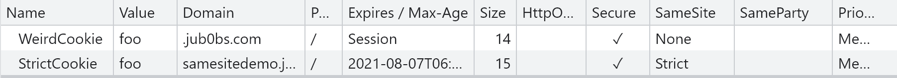

This is proven as to when accessing `https://samesitedemo.jub0bs.com` via a top level navigation from `https://samesitedemo-attacker.jub0bs.com`, both `WeirdCookie` and `StrictCookie` were sent in the request headers.

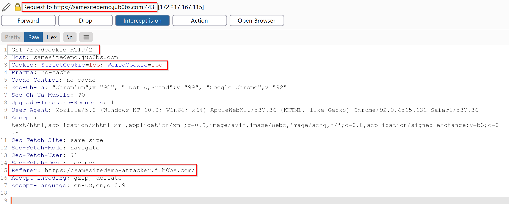

It is important to mention that `https://samesitedemo.jub0bs.com` appears to only show the `StrictCookie` regardless of any other cookies that were sent, such as `WeirdCookie`.

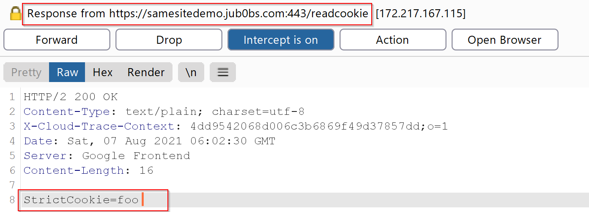

Further research indicates that the `WeirdCookie` can be sent and retrieved from other subdomains of `jub0bs.com`. If `Domain=.jub0bs.com`, it specifies that all subdomains can access the cookie. For example, `https://samesitedemo-attacker.jub0bs.com/` has access to the `WeirdCookie` cookie shown below.

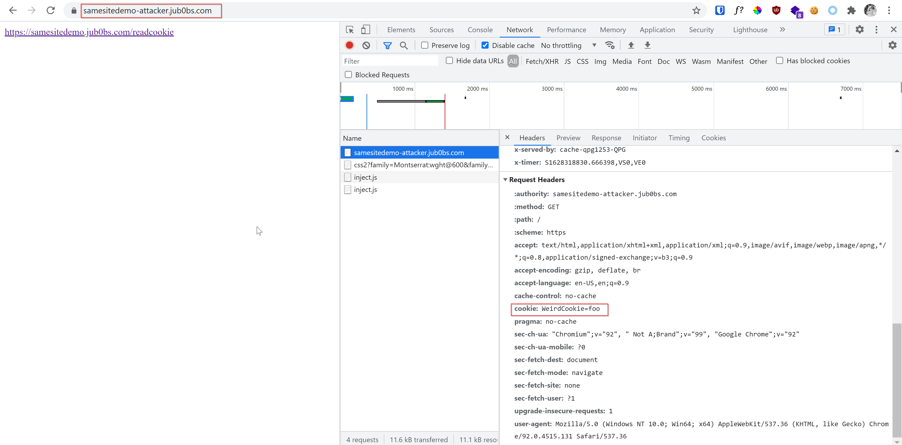

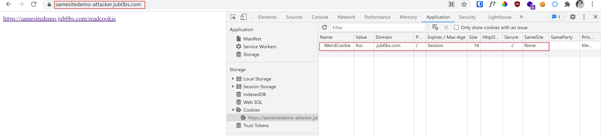

From this testing scenario, QuoccaBank should ensure that if sensitive information is stored in a cookie, the `Domain` attribute is set to the correct value and not utilise a wildcard such as `.quoccabank.com`. This is to ensure that no sensitive information in cookies can be sent over from a different subdomain. Without this protective measure in specifying the `Domain` attribute for a cookie, an attacker can exfiltrate any cookies with `Domain=.quoccabank.com` from other QuoccaBank's owned sites and tamper or modify their values.

